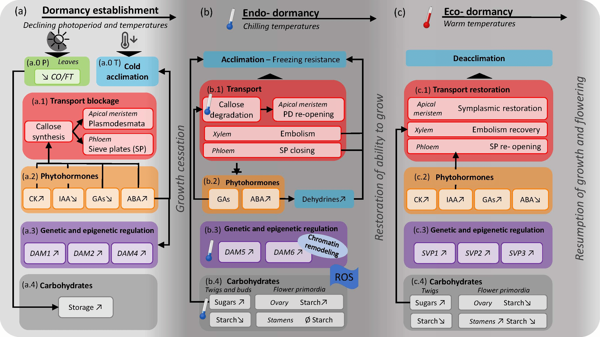
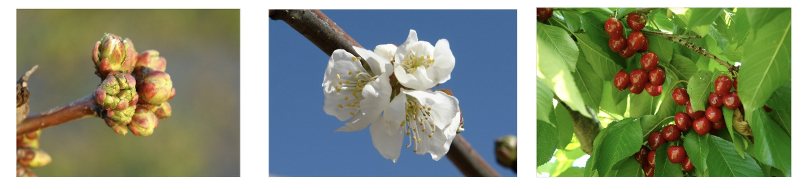

```{r setup, include=FALSE, message  = FALSE, warning = F}
knitr::opts_chunk$set(echo = TRUE,  message = FALSE,  warning = FALSE,  tidy = TRUE)
library(chillR)
library(tidyverse)
library(dplyr)
library(tidyr)
library(knitr)
library(pander)
library(kableExtra)
library(ggplot2)
library(tibble)
library(lubridate)
library(reshape2)
library(downlit)
library(xml2)
library(stats)
```

<style>
    body { background-color:  #F0FFFF; }
    pre, pre:not([class]) { background-color: #d7f4f4; }
</style>


<br>

***This document records my notes and progress in the course titled "Tree Phenology Analysis with R."***

<br>


## Chapter 3: Tree Dormancy


### <span style="color:#71797E">3.1</span>&nbsp; Introduction to dormancy

<div style="height: 18px;"></div>

- Fruit trees go into dormant state to survive unfavorable conditions in winter

- Dormancy phases: 
    - **Dormancy establishment** (controlled by environmental signals&mdash; Day length/photoperiod, Temperature)
    - **Endo-dormancy** (controlled by plants' endogenous factors&mdash; their abilities to grow even in unfavorable conditions; a period of rest and then regrow/ endo-dormancy is overcome once the trees have experienced a certain level of chill but they don't immediately resume growth)
    - **Eco-dormancy** (trees are acclimated&mdash; no morphological changes, but not deeply dormant; (warm) temp is the main environmental driver)
    - **Growth resumption** (first apparent morphological changes occur in end of winter or earliest spring depending on species and cultivars&mdash; trees quickly un-acclimatized to grow and become sensitive to freezing temperature before buds burst? Warm temp promotes growth)
    
\n

- Physiological processes that regulate dormancy
    - **Transport at both whole-plant and cellular level:** The transport of water and solutes stop during dormancy both at the whole plant and cellular levels within the meristems.
    - **Phytohormone dynamics:** Plant hormones are short and long distance signalling compounds acting in a very low concentrations. Myoregulators for plants growth and development, as well as mediate responses to biotic and abiotic stressors. 
    - **Genetic and epigenetic regulation:** A group of genes related to dormancy&mdash; regulation of bad dormancy.
    - **Dynamics of nonstructural carbohydrates:** Non-structural carbohydrates have three main functions&dash; energy esterase?, transport and supply, and osmotic regulation and signaling (these varies within and between seasons).
    
<br>

### <span style="color:#71797E">3.2</span>&nbsp; Dormancy physiology

<div style="height: 18px;"></div>



Reference: [*A Conceptual Framework for Winter Dormancy in Deciduous Trees (Fadón et al., 2020)*](https://www.mdpi.com/2073-4395/10/2/241)

<br>

### <span style="color:#71797E">3.3</span>&nbsp; Experimental and statistical determination of the chilling and forcing periods

<div style="height: 18px;"></div>

- High chill accumulation during endodormancy advances flowering dates, but similarly cool temperatures during ecodormancy may cause flowering delays. 

- Endo- and eco- dormancy occur under the same phenological stage, but the temperatures have the opposite effect on flowering according to the dormancy phase. 

- Endo- Vs. Eco- dormancy phase differentiation: 
    - **Empirically** (See if there is growth after chilling period&mdash; whether the chill period is overcome to allow forcing period)
    - **Statistically** (Long phenological data sets and temperature records&mdash; estimate the date of chilling fulfillment based on the long series of phenological observations, flowering dates and relating them with previous temperature records)
    
\n

- `chillR` package to perform PLS analysis with phenology data and temperature, which gives two outputs:
    - **Model coefficients** which indicate the strength and the sense of the influence 
    - **Variable important in the projections (VIP)**, which points out the significant importance of the model coefficient values&mdash; values from 0.8 are considered significant??
   
<br>

### <span style="color:#71797E">3.4</span>&nbsp; Phenology record and BBCH scale

<div style="height: 18px;"></div>

- **Phenology** is the study of periodic events in **biological life cycles** (e.g. seasonal changes in trees) and how these are influenced **by seasonal and interannual variations** in climate.

- Application of phenology in agriculture:
    - Select suitable crops and varieties (to organize the cropping schedules, organize the crop rotation)
    - Forecasts of plant development and harvest dates (e.g. to evaluate the risk of frost damage)
    - Timing of the agricultural practices&mdash; irrigation, fertilization, crop protection, etc. 
    
\n

- Trees go through many developmental stages over the course of the year, and these are usually referred to by a two-digit code. <span style="color:grey">*(Read more [here.](https://www.openagrar.de/servlets/MCRFileNodeServlet/openagrar_derivate_00010428/BBCH-Skala_en.pdf))*</span>

  - Principal growth stages&mdash; describe time spans (0-9)
  - Secondary growth stages&mdash; precise steps in plant development (0-9)
      

<br>

### <span style="color:#71797E">3.5</span>&nbsp; Exercises on tree dormancy

<div style="height: 18px;"></div>

***1. Put yourself in the place of a breeder who wants to calculate the temperature requirements of a newly released cultivar. Which method will you use to calculate the chilling and forcing periods? Please justify your answer.***

As a breeder, I will use the empirical method rather than the statistical method to calculate the chilling and forcing periods in this particular case, for two reasons:

- It requires little statistical expertise, as many breeders may not have in-depth statistical expertise, and hiring an expert could incur extra costs.

- The statistical method relies on long phenological data sets and temperature records. Since this cultivar is newly released, such longitudinal data sets and records may not be available for statistical computation.

Anyway, after I looked up the definition of plant breeder, they are scientists, so statistics may not be a problem. In that case, start with empirical first and then combine with statistical method as more data accumulates. 😁


<br>

***2. Which are the advantages (2) of the BBCH scale compared with earlier scales?***

- Covers the whole development of the plant, rather than development of only the flower buds as in the traditional scale

- Provides a general frame for all the species, while the traditional scale is species specific
  
<br>

***3. Classify the following phenological stages of sweet cherry according to the BBCH scale:***



From left to right:

- BBCH stage 54 (Inflorescence enclosed by light green scales)

- BBCH stage 65 (Full flowering: at least 50% of flowers open, first petals falling)

- BBCH stage 89 (Fruit ripe for harvesting for immediate consumption&mdash; fruit have typical taste and firmness)
    - <span style="color:grey">*I chose stage 89, rather than the fruit-picking stage 87, due to the cherries' uniform and rich red color. However, further assessment of their firmness, taste, and aroma is required to accurately confirm the stage.*</span>

<br>

## Chapter 4: Climate change and impact projection

### <span style="color:#71797E">4.1</span>&nbsp; The drivers of climate change

<div style="height: 18px;"></div>

In this lecture, I learned about how the climate changes occurs, as well as the main and long-term drivers of climate change. I also learned about the impact of greenhouse gases on recent global warming&mdash; particularly CO~2~, CH~4~ and N~2~O in the atmosphere.

<br>

### <span style="color:#71797E">4.2</span>&nbsp; What we’ve already seen

<div style="height: 18px;"></div>

This lecture taught me about the alarming increase in global temperatures in recent decades due to human activities, and how even a slight rise in temperature can cause significant shifts in the Earth's land areas. The lecture also discussed these trends on a global scale, as well as specifically in Germany. Additionally, there was a brief discussion on precipitation trends in Germany.

<br>

### <span style="color:#71797E">4.3</span>&nbsp; Future scenarios

<div style="height: 18px;"></div>

I learned a lot about future climate projections and the process to make those projections (RCP, GCM, downscaling, etc) in this lecture. I also learned about the importance of impact models&mdash; even after we achieved perfect climate projections, there is a need for multiple impact models, as there will still be uncertainty about the biological responses and how we should describe them. There was also a nice discussion on how the changes in the ocean circulation and other tipping points can drive climate change. The lecture also emphasized the importance of being concerned about the future and taking action now to ensure future generations can experience the same world we live in.

<br>

### <span style="color:#71797E">4.4</span>&nbsp; Impact projection approaches

<div style="height: 18px;"></div>

I learned about different models in making predictions for the future. The lecture compares between the four climate project models, and discussed in details the advantages and the disadvantages of each. There is also a nice instruction on how we should build a model in the beginning&mdash; we may not want to go into detail for each aspect, but try to cover all aspects in a broader sense. 

<br>

### <span style="color:#71797E">4.5</span>&nbsp; Exercises on climate change

<div style="height: 18px;"></div>


***1. List the main drivers of climate change at the decade to century scale, and briefly explain the mechanism through which the currently most important driver affects our climate.***

<br>

***2. Explain briefly what is special about temperature dynamics of recent decades, and why we have good reasons to be concerned.***


<br>

***3. What does the abbreviation 'RCP' stand for, how are RCPs defined, and what is their role in projecting future climates?***


<br>

***4. Briefly describe the 4 climate impact projection methods described in the fourth video.***

<br>

## Chapter 5: Winter chill projections

### <span style="color:#71797E">5.1</span>&nbsp; Winter chill projections

#### <span style="color:#71797E">5.1.1</span>&nbsp; Winter chill in Oman

<div style="height: 18px;"></div>

- To calculate nutrient budgets for the oases in the Sultanate of Oman, by measuring the yields of the various fruit trees there

- But, many of the trees in the oasis system did not produce fruits in the years of analysis

- A hypothesis for that was "the lack of chilling," due to most of the trees in these high-altitude oases were not the typical species of the Arabian Peninsula, but temperate trees

- So, from focusing on nutrient budget to chilling hours

- Chilling Hours model&mdash; this model can’t really be trusted, especially in a warm location
    - Placed temperature loggers in three oases at different levels of elevation, which allowed studying chill accumulation along an elevation gradient (can't collect meaningful data for a reasonable period of time )
    - So, obtain data from an official long-term weather station is located in the vicinity, near the top of the valley, roughly 1000 m above the lowest oasis&mdash; data not representative of all the locations along the elevation gradient
    - So, use the records from the oases to define transfer functions that allowed deriving oasis temperatures from long-term data
    - Set the transfer functions up (using PLS&mdash; not a good idea?) to directly calculate hourly temperatures in the oases from the daily records of the official station at Saiq
    - Regression between temperature at Saiq and temperature in three oases to calculate winter chill dynamics over the entire time span covered by the official weather station (Hourly data were needed to calculate the number of Chilling Hours)
    
\n

- Weather generators to add future climate scenarios
    - *Weather generators are tools that can produce random draws of plausible weather, based on observed weather for a particular location.*
    - Fed the LARS-WG weather generator with the data (we had) for the highest-elevation oasis and told it to generate plausible weather for a number of years
        - Request the generator to produce the highest-elevation oasis and told it to generate plausible weather for a number of years
        - Result: Chill prospects for 1°C and 2°C warming scenarios

\n

<br>

#### <span style="color:#71797E">5.1.2</span>&nbsp; Chill model sensitivity

<div style="height: 18px;"></div>

- In projecting climate change impacts on winter chill in the Central Valley, one of the world’s most productive regions for temperate fruit trees, **the choice of chill model matters a lot**

- Created a bunch of temperature scenarios for multiple locations and calculated how chill accumulation was likely to change in the future, according to multiple chill models
    - Looked at what changes the various models predicted for the same locations and the same future scenarios
    - The chill projection results varied considerably across the four models&mdash; **strong indication that not all models can be right**
    - Based on the literature, as well as on another study [(Luedeling et al., 2009d)](https://www.sciencedirect.com/science/article/pii/S0168192309001580), Dynamic Model was concluded to be the most reliable one&mdash; used mostly in this course
          - But, the Dynamic model is too complicated (cumbersome, error-prone and boring)
          
<br>

#### <span style="color:#71797E">5.1.3</span>&nbsp; Winter chill in California

<div style="height: 18px;"></div>

- To produce a winter chill projection for California's fruit and nut growing region&mdash; the Central Valley
    - Multiple scenarios (20 or so) for records of all 100+ weather stations in California (automate processing steps)
    
\n

- Result: produce projections for all stations, which consisted of chill accumulation over 100 plausible winter seasons per scenario, generated with a weather generator

- Summarize the data by defining a metric called ‘Safe Winter Chill’. 
    - This is the 10th percentile of the chill distribution, i.e. the amount of chill that is exceeded in 90% of all years, derived from the ‘replicates’ of annual temperature dynamics produced by the weather generator 
    - Economically, it may be feasible to grow a tree cultivar that requires this much chill. 
    
\n

- Source: [(Luedeling et al.,2009d)](https://journals.plos.org/plosone/article?id=10.1371/journal.pone.0006166)
    
<br>

#### <span style="color:#71797E">5.1.4</span>&nbsp; Winter chill ratios

<div style="height: 18px;"></div>

- To produce a chill projection for the whole planet, using data from the Global Summary of the Day database

- Processed data for about 5000 globally distributed weather stations, for which multiple chill metrics were calculated

- To compare chill models, the ratio between various chill metrics was calculated for each weather station in the data set.
    -  Had these ratios been largely constant all over the planet (e.g. one Chill Portion always corresponds to 10 Chilling Hours), we would have been fairly safe using any of the chill models.
    - Unfortunately, this wasn’t the case, with enormous variation in chill metric ratios around the world.
    
\n

- Source: [(Luedeling & Brown, 2011a)](https://link.springer.com/article/10.1007/s00484-010-0352-y)

<br>

#### <span style="color:#71797E">5.1.5</span>&nbsp; A global pojection of future winter chill

<div style="height: 18px;"></div>

- Produce a global projection of the likely impacts of climate change on winter chill

- Projected decline in winter chill&mdash; it seems unlikely that growers will remain able to grow the tree cultivars they currently rely on with such dramatic chill losses

- Source: [(Luedeling et al., 2011b)](https://journals.plos.org/plosone/article?id=10.1371/journal.pone.0020155)

<br>

#### <span style="color:#71797E">5.1.6</span>&nbsp; Winter chill in Germany

<div style="height: 18px;"></div>

- Germany is not highlighted as particularly vulnerable to chill losses.

- The reason for this lack of major changes is that current winter temperatures in Germany are right in the middle of what appears to be the most effective temperature range for chill accumulation.

- Source: [(Luedeling et al., 2009a)](https://link.springer.com/article/10.1007/s10341-009-0085-4)

<br>

#### <span style="color:#71797E">5.1.7</span>&nbsp; Winter chill in Tunisia

<div style="height: 18px;"></div>

- Models: SRES, GCMs, RCPs
    - The so-called SRES emissions scenarios (named after the IPCC Special Report on Emissions Scenarios), usually focusing on the three most commonly used scenarios B2, A1B and A2
    - ‘General Circulation Models’ (GCMs; many people also use an alternative long form: ‘Global Climate Models’)
    - ‘Representative Concentration Pathways’ (RCPs) to replace the SRES scenarios
    
\n

- No way of deciding which of these models, if any, is right&mdash; should produce *ensemble* forecasts, i.e. project changes using outputs from all the available models (that are considered credible)

- Produce chill distribution at a particular point in time using a weather generator that is accessed by `chillR`. 
    - This weather generator is calibrated with observed weather data and provided with an estimate of how various climate metrics differed from the long-term average climate in 1975, 2000 and 2015.
    - With this information, we can generate a large number of artificial yearly weather records that might have occurred at these points in time.
    
\n

- The weather generator was also used to produce future scenarios. 
    - In the case of Pistachios in Tunisia, the tool is calibrated with observed data, but the scenarios that were added were not derived from the historic record, but extracted from the AFRICLIM database.
    
<br>

#### <span style="color:#71797E">5.1.8</span>&nbsp; Winter chill in Chile

<div style="height: 18px;"></div>

- A tool that could quickly access single-location data for weather stations anywhere on the planet: ClimateWizard

<br>

#### <span style="color:#71797E">5.1.9</span>&nbsp; Chill projection for Patagonia

<div style="height: 18px;"></div>

- Looked into the climatic suitability for fruit and nut trees near agriculture’s southern frontier - in Patagonia, in southern Argentina [(del Barrio et al., 2020)](https://rmets.onlinelibrary.wiley.com/doi/pdf/10.1002/joc.6649).

- Used the weather station records to calibrate weather generator and downloaded climate projections from the ClimateWizard database. 
    - to make past and future temperature scenarios for all stations
    - to compute winter chill and a few other agroclimatic metrics
    
<br>

#### <span style="color:#71797E">5.1.10</span>&nbsp; Chill model comparison

<div style="height: 18px;"></div>

- Used climate change analysis framework to compare chill models [(Fernandez et al., 2020b)](https://www.sciencedirect.com/science/article/pii/S1161030120301106)

- Model choice matters!

<br>


#### <span style="color:#71797E">5.1.11</span>&nbsp; Chill projection for all of Tunisia

<div style="height: 18px;"></div>

- Mapped chill accumulation across Tunisia, based on the previous framework
    - Applied the analysis framework developed to each of the 20 weather station locations across Tunisia and neighboring countries
    - Interpolated results to produce chill maps that track chill availability in Tunisia over the past few decades

\n

- How to interpolate the site-specific results into a map that covers the whole country
    - Take the site-specific predictions of Safe Winter Chill and interpolate a surface through them (using the Kriging technique)
    - Repeat the same for the elevations of the locations
    - Then, fitted a linear model to relate chill accumulation to elevation
    - Calculate the difference between the elevation model derived from the weather station elevations and the true elevations of each location of the country, using a Digital Elevation Model (DEM)
    - Considering that this difference is not yet accounted for by the chill surface that was derived by interpolating chill data for the weather stations, we used the elevation~chill relationship we determined to correct chill predictions.
    - Will only work in places with a linear relationship between elevation and chill availability
    
<br>

#### <span style="color:#71797E">5.1.12</span>&nbsp; Revisiting chill accumulation in Oman

<div style="height: 18px;"></div>

- Adding some new ideas on how to convert daily into hourly temperatures in a place like the oases of Oman we were interested in, we produced updated assessments of past winter chill and forecasts of future chill for the oases of Al Jabal Al Akhdar. [(Buerkert et al., 2020)](https://link.springer.com/article/10.1007/s10584-020-02862-8)

<br>

### <span style="color:#71797E">5.2</span>&nbsp; Exercises on past chill projections

<div style="height: 18px;"></div>

***1. Sketch out three data access and processing challenges that had to be overcome in order to produce chill projections with state-of-the-art methodology.***

- Not all models are credible (Chilling Hours model- to quantify chill- can't really be trusted, especially in warm locations)

  - Complicated model- the Dynamic model-  I could only calculate Chill Portions (the unit of this model) with a decades-old Excel sheet 


- The need to automate the process to create multiple climate scenarios for large number of weather stations and to handle large data output of simulation scenarios.
    - Challenge in data transfer when replacing old scenarios (SRES) with the new (RCPs) 


- Scarcity of source to find appropriate information/ data on future climates that can easily be used for the purposes of chill modeling. For example, 
    - Data (e.g. temperature records) available may not be representative of all locations of interest (use transfer functions to derive temperatures of specific locations from long-term data )
    - The need for hourly records
    - 


- For some reason, most future climate projections were mostly disseminated as spatial grids covering various extents. The dataset I typically worked with included 20 GCMs. To make matters worse, I typically wanted to project gradual changes over time by including multiple years in an analysis, e.g. the 2020s, the 2050s and the 2080s. You can probably see where this is headed. When we multiply all these numbers, we realize that we need 4320 grids. The disk space required to store these data (in uncompressed form) is more than 700 GB. This is not impossible to find, but processing this amount of data is cumbersome and time-consuming. Still, I actually managed to set up a data processing structure for this and download all the data to an external hard drive.Soon after I had set up this structure, the IPCC came up with a new report that introduced the ‘Representative Concentration Pathways’ (RCPs) to replace the SRES scenarios. For a few years, it was still ok to work with the old scenarios, but eventually it got harder and harder to get such studies through the peer-review process. The scenarios simply weren’t up to date any more. However, I was not excited by the prospect of downloading another massive dataset and starting all over again… What made this particularly difficult for me was that I was based in Kenya then, with fairly poor data transfer rates.

- It turned out that in the meantime, some climate scientists had produced a future climate database specifically for Africa - AFRICLIM (Platts et al., 2015), which contained exactly what we needed. Since this database didn’t include the whole planet, it was much easier to download and store, and processing the data was much less cumbersome. So I added functions to chillR to implement procedures to sample from the AFRICLIM grids and produce ensembles of climate scenarios. I also started putting together a framework to automatically produce the kind of plots that are shown below. 


- AFRICLIM solved the future climate data problem for locations in Africa. However, this dataset fell short of what was needed in order to add climate change projection capability to chillR. First, it was unsatisfying that this dataset only covered Africa. Second, users who are only interested in data for a single location, which is what chillR is designed for, shouldn’t have to download a large dataset, before they can run analyses. What was needed was a tool that could quickly access single-location data for weather stations anywhere on the planet.
One of my early sources of climate information was a tool called ‘ClimateWizard’, put together by my friend and collaborator Evan Girvetz, who now works for the International Centre for Tropical Agriculture (CIAT) in Nairobi. This tool initially only made gridded data available, but already for the California study cited above (Luedeling et al., 2009d) (Link), Evan had written a script to quickly extract information for single locations, which is really all that’s needed for single-site studies. Eventually, at CIAT, he made this function available to a wider audience through an application programming interface (API), to allow accessing outputs from 15 climate models for state-of-the-art RCP scenarios.

- Interpolating site-specific results into a map that covers the whole country (current procedure needs improvement- will only work in places with a linear relationship between elevation and chill availability. This seems a fairly reasonable assumption in Tunisia, but it would not work in many cooler locations, such as Germany.)

- I also didn’t have proper data on projected future climates then, and the process that converted daily to hourly temperatures was quite a bit less than ideal.With our climate change analysis framework, we could finally do it. Adding some new ideas on how to convert daily into hourly temperatures in a place like the oases of Oman we were interested in

After a decade of foraging in other parts of the world, let’s come back to Oman. I’d long been a bit dissatisfied with the initial work we did there. Note that the first analysis was my first study on chill accumulation. At the time, I did not know about the hazards involved in model choice.  (you’ll learn about these ideas later in this module), we produced updated assessments of past winter chill and forecasts of future chill for the oases of Al Jabal Al Akhdar. The results appeared once again in Climatic Change
<br>

***2. Outline, in your understanding, the basic steps that are necessary to make such projections.***

<br>


## Chapter 6: Manual chill analysis

### <span style="color:#71797E">6.1</span>&nbsp; Computing Chilling Hours from hourly temperature data

<div style="height: 18px;"></div>

- Need hourly temperature data to compute Chilling Hours

- `chillR` offers a few neat tools to make pretty good approximations of hourly temperature data from daily records

<br>

#### *Display the `Winters_hours_gaps` dataset in `chillR` using `kable`* {.unnumbered}


```{r 6.1.1}

# Display the Winters_hours_gaps dataset in chillR using kable
kable(Winters_hours_gaps[1:10,]) %>%
  kable_styling("striped", position = "left", font_size = 10)

```

<br>

#### *Remove column `Temp_gaps` and create a new dataset (`hourtemps`)* {.unnumbered}

```{r 6.1.2}

# Remove column Temp_gaps and create a new dataset (hourtemps)
hourtemps <- Winters_hours_gaps[,
                                c("Year",
                                  "Month",
                                  "Day",
                                  "Hour",
                                  "Temp")]

kable(hourtemps[1:10,]) %>%
  kable_styling("striped", position = "left", font_size = 10)

```

<br>

#### *Display only the third row with all columns* {.unnumbered}

```{r 6.1.3}

# Display only the third row with all columns
hourtemps[3, ]

```

<br>

#### *Display the `Temp` column of the third row only* {.unnumbered}

```{r 6.1.4}

# Display the temp column of the third row only
hourtemps[3, "Temp"]

```

<br>

#### *Display the first five rows of `Temp` column* {.unnumbered}

```{r 6.1.5}

# Display the first five rows of Temp column
hourtemps$Temp[1:5]

```

<br>

#### *Display the first five rows and all columns of `hourtemps` dataset* {.unnumbered}

```{r 6.1.6}
# Display the first five rows and all columns of hourtemps dataset
hourtemps[1:5, ]

```

<br>

#### *Check for temperatures that fall within `Chilling Hours` range* {.unnumbered}

<div style="height: 18px;"></div>

- Every hour with temperatures above (and including) 0°C and below (and including) 7.2°C is considered a Chilling Hour.

- Check for every hour whether temperatures fall in this range, using simple comparison commands (`<`, `<=`, `==`, `=>` and `>`) in R

<br>

#####  *Using simple comparison commands* {.unnumbered}


```{r 6.1.7.1}

# Use == command
1 == 2
1 == 1

# Test > command
c(1, 2, 3) > 2

# Use >= command
a <- 1
b <- 2
c <- 3
c(a, b, c) >= 2

# Use & command
c(a, b, c) >= 2 & c(a, b, c) <3

```

<br>

##### *Check for `Chilling Hours`* {.unnumbered}

```{r 6.1.7.2}

# Assign new column Chiling_Hour 
hourtemps[,"Chilling_Hour"] <-
  hourtemps$Temp >= 0 & hourtemps$Temp <= 7.2

# Check if the temperatures fall within Chilling_Hour for row 13 to 20
hourtemps[13:20, ]

# Find total chilling hour for a particular period by defining rows (3-4 March 2008)
sum(hourtemps$Chilling_Hour[13:20])

# Use `which` function to set the dates for total chilling hours calculation
Start_Date <- which(hourtemps$Year == 2008 &
                      hourtemps$Month == 10 &
                      hourtemps$Day == 1 &
                      hourtemps$Hour == 12)

End_Date <- which(hourtemps$Year == 2008 &
                    hourtemps$Month == 10 &
                    hourtemps$Day == 31 &
                    hourtemps$Hour == 12)

sum(hourtemps$Chilling_Hour[Start_Date:End_Date])

# So in October of 2008, Winters experienced 28 Chilling Hours.

```

<br>

### <span style="color:#71797E">6.2</span>&nbsp; Our first chill function

<div style="height: 18px;"></div>

- A function consists of a name, some arguments that are passed to the function, and some code that should be executed.

- We can define is as `OurFunctionName <- function(argument1, argument2, ...) {ourCode}`.

- What’s returned is either the last object that’s mentioned in the function code or some content specified by the `return()` function.

```{r 6.2}

# Example function for Chilling_Hour calculation
# Function that adds Chilling_Hour column to dataframe
CH <- function(hourtemps)
{
  hourtemps[, "Chilling_Hour"] <-
    hourtemps$Temp >= 0 & hourtemps$Temp <= 7.2
  return(hourtemps)
}

# Check chilling hour `yes or no` for rows 13-20
CH(hourtemps)[13:20, ]

# Create more complex functions, e.g. to calculate the number of Chilling Hours
# between two dates, which we can specify in the YEARMODA format 
# (i.e. year, month and day, combined in one number).
sum_CH <- function(hourtemps,
                   Start_YEARMODA,
                   End_YEARMODA)
{
  Start_Year <- trunc(Start_YEARMODA / 10000) # "trunc" removes all decimals
  Start_Month <-
    trunc((Start_YEARMODA - Start_Year*10000) / 100)
  Start_Day <- 
    Start_YEARMODA - Start_Year * 10000 - Start_Month * 100
  Start_Hour <- 12 # This could also be flexible, but let's skip this for now
  End_Year <- trunc(End_YEARMODA / 10000)
  End_Month <- trunc((End_YEARMODA - End_Year * 10000) / 100)
  End_Day <- End_YEARMODA - End_Year * 10000 - End_Month * 100
  End_Hour <- 12 # This could also be flexible, but let's skip this for now

  Start_Date <- which(hourtemps$Year == Start_Year &
                        hourtemps$Month == Start_Month &
                        hourtemps$Day == Start_Day &
                        hourtemps$Hour == Start_Hour)
  End_Date <- which(hourtemps$Year == End_Year &
                    hourtemps$Month == End_Month &
                    hourtemps$Day == End_Day &
                    hourtemps$Hour == End_Hour)

  Chill_hours <- CH(hourtemps)
  
  return(sum(Chill_hours$Chilling_Hour[Start_Date:End_Date]))

}

# Check the total chilling hours from March 1 to October 11, 2008
# Note that the dataset only goes from 3rd March to 11th November 2008, 
# so use of any dates outside that range will generate an error message. 
sum_CH(hourtemps, 20080401, 20081011)

```

<br>

### <span style="color:#71797E">6.3</span>&nbsp; Exercise on basic chill modeling

<div style="height: 18px;"></div>

***1. Write a basic function that calculates warm hours (>25°C)***

```{r 6.3.1}

## Check for warm hours above 25 degree C in Winters_hours_gaps dataset
# Create a dataset without temperature gaps
W_data <- Winters_hours_gaps[,
                             c("Year",
                               "Month",
                               "Day",
                               "Hour",
                               "Temp")]

# Write function that calculates warm hours above 25 degree C
WH <- function(W_data)
{
  W_data[, "Warm_Hour"] <-
    W_data$Temp > 25
  return(W_data)
}

# Show the the first 4 rows
WH(W_data)[1:4, ]

# Calculate total warm hours for the dataset
WH_sum <- WH(W_data)
sum(WH_sum$Warm_Hour)

```

<br>

***2. Apply this function to the Winters_hours_gaps dataset***

```{r 6.3.2}

# Apply the function to original Winters_hours_gaps dataset
kable(WH(Winters_hours_gaps[961:970, ]), row.names = FALSE) %>%
  kable_styling("striped", position = "left", font_size = 10)

```

<br>

***3. Extend this function, so that it can take start and end dates as inputs and sums up warm hours between these dates***

```{r 6.3.3}

sum_WH <- function(W_data,
                   Start_YEARMODA,
                   End_YEARMODA)
  
  # See in-class script for setting year, month and date with substr 
{
  Start_Year <- trunc(Start_YEARMODA / 10000)
  Start_Month <- trunc((Start_YEARMODA - Start_Year * 10000) / 100)
  Start_Day <- trunc((Start_YEARMODA - Start_Year *10000) - 
                         Start_Month * 100)
  Start_Hour <- 12
  
  End_Year <- trunc(End_YEARMODA / 10000)
  End_Month <- trunc((End_YEARMODA - Start_Year * 10000) / 100)
  End_Day <- trunc((End_YEARMODA - Start_Year *10000) - 
                         End_Month * 100)
  End_Hour <- 12
  
  Start_Date <- which(W_data$Year == Start_Year &
                        W_data$Month == Start_Month &
                        W_data$Day == Start_Day &
                        W_data$Hour == Start_Hour)
  
  End_Date <- which(W_data$Year == End_Year &
                        W_data$Month == End_Month &
                        W_data$Day == End_Day &
                        W_data$Hour == End_Hour)
  
  Warm_Hours <- WH(W_data)
  
  return(sum(Warm_Hours$Warm_Hour[Start_Date:End_Date]))
  
}

# Total warm hours for the whole period of dataset 
sum_WH(W_data, 20080303, 20081110)

```

<br>

## Chapter 7: Chill models

### <span style="color:#71797E">7.1</span>&nbsp; Chill models in `chillR`

#### *`Chilling_Hours()` function* {.unnumbered}

<div style="height: 18px;"></div>

- Chilling Hours are great for an entry-level tutorial on chill modeling, but they’re not a particularly credible metric, so I suggest you forget them right away.    

\n

```{r 7.1.1}

# Chilling_Hours() function in chillR to calculate chilling hours
Chilling_Hours

# Apply Chilling_Hours() function to Winters_hours_gap dataset
Chilling_Hours(Winters_hours_gaps$Temp)[1:100]
```

<br>

#### *The Utah model* {.unnumbered}

<div style="height: 18px;"></div>

- `step_model()` function allows you to define your own model, based on temperature thresholds and weights. 

- To implement various variations of the Utah Model that have been developed for different locations

```{r 7.1.2}

Utah_Model

Utah_Model(Winters_hours_gaps$Temp)[1:100]

# Create a data.frame for temperatures with weights
df <- data.frame(
  lower  = c(-1000, 1, 2, 3, 4, 5,    6),
  upper  = c(    1, 2, 3, 4, 5, 6, 1000),
  weight = c(    0, 1, 2, 3, 2, 1,    0))

kable(df) %>%
  kable_styling("striped", position = "left", font_size = 10)

# Use custom() function to implement a chill model based on df
custom <- function(x) step_model(x, df)

custom(Winters_hours_gaps$Temp)[1:100]


```

<br>

#### *The dynamic model* {.unnumbered} 

<div style="height: 18px;"></div>

```{r 7.1.3}

Dynamic_Model

Dynamic_Model(Winters_hours_gaps$Temp)[1:100]

```

<br>

#### *`make_JDay()` and `tempResponse` functions* {.unnumbered}

<div style="height: 18px;"></div>

- Add the Julian dates (counts the days of the year) to the dataset 

- The `chilling()` function implements the Chilling Hours, Utah and Dynamic Models, and it also calculates Growing Degree Days (GDH); use `tempResponse` function otherwise

```{r 7.1.4}

# Use chilling() function
output <- chilling(make_JDay(Winters_hours_gaps),
                   Start_JDay = 90,
                   End_JDay = 100)

kable(output) %>%
  kable_styling("striped", 
                position = "left",
                font_size = 10)

# Use tempResponse function
output <- tempResponse(make_JDay(Winters_hours_gaps),
                       Start_JDay = 90,
                       End_JDay = 100,
                       models = list(Chill_Portions = Dynamic_Model,
                                     GDH = GDH))

kable(output) %>%
  kable_styling("striped",
                position = "left",
                font_size = 10)

```

<br>

### <span style="color:#71797E">7.2</span>&nbsp; Exercise on chill models

<div style="height: 18px;"></div>

***1. Run the `chilling()` function on the `Winters_hours_gap` dataset***

```{r 7.2.1}

# Check JDay for start and end of dataset period
dates <- data.frame(Year = c(2008, 2008),
                    Month = c(3, 11),
                    Day = c(3, 11))

kable(make_JDay(dates)) %>%
  kable_styling("striped",
                position = "left",
                font_size = 10)

# Apply chilling() function on Winters_hours_gap dataset
c_output <- chilling(make_JDay(Winters_hours_gaps),
                     Start_JDay = 63,
                     End_JDay = 316)

kable(c_output) %>%
  kable_styling("striped",
                position = "left",
                font_size = 10)

```

<br>

***2. Create your own temperature-weighting chill model using the `step_model()` function***

```{r 7.2.2}

t_data <- data.frame(
  lower  = c(-1000, 2, 8, 12, 15, 18, 20, 25),
  upper  = c(2, 8, 12, 15, 18, 20, 25, 1000),
  weight = c(0, 0.5, 1, 2, 0.5, -0.5, -1, -2)
)

kable(t_data) %>%
  kable_styling("striped", position = "left", font_size = 10)

custom <- function(x) step_model(x, t_data)

```

<br>

***3. Run this model on the `Winters_hours_gaps` dataset using the `tempResponse()` function.***

```{r 7.2.3}

t_output <- tempResponse(make_JDay(Winters_hours_gaps),
                         Start_JDay = 63,
                         End_JDay = 316,
                         models = list (Cumulative_Temp = custom,
                                        Chilling_Hours = Chilling_Hours,
                                        Chill_Portions = Dynamic_Model,
                                        Utah_Model = Utah_Model,
                                        GDH = GDH))

kable(t_output) %>%
  kable_styling("striped", position = "left", font_size = 10)

# Here we see a big difference between the outputs of various models, 
# due to the different parameters chosen? 

```

<br>

## Chapter 8: Making hourly temperatures

### <span style="color:#71797E">8.1</span>&nbsp; Generating hourly temperatures

<div style="height: 18px;"></div>

- Most sources only provide daily data, usually including minimum and maximum temperature of the day, from which we can’t directly calculate Chilling Hours.

- The rate of temperature increase in the morning is not the same as the rate of decrease in the evening. Besides, in particular the time of the lowest daily temperature varies considerably throughout the year (unless you’re close to the equator), and it would be good to consider this.
    - 'Triangular' daily temperature pattern, achieved by interpolating linearly for hours between daily minimum temperature recorded at a certain time of day, and the maximum temperature at another time, is not realistic. 

<br>

#### <span style="color:#71797E">8.1.1</span>&nbsp; Idealized daily temperature curves

<div style="height: 18px;"></div>

- [(Linvill, 1990)](https://journals.ashs.org/hortsci/view/journals/hortsci/25/1/article-p14.xml) described the daily temperature curve using a combination of two mathematical equations: a sine curve to describe daytime warming, and a logarithmic decay function for nighttime cooling.

- The transition points between the two parts were determined by sunrise and sunset, and the duration of the parts was related to daylength.

- One aspect that made Linvill’s equations hard to use across different locations was the dependency on sunrise and sunset times.

- Fortunately, at least for locations without major topographic features, sunrise and sunset times can be calculated based on what we know about the geometry of our solar system.

- Use `daylength` function to produce daily temperature curves.

- January 1st ist JDay 1, and December 31st either JDay 365 (in normal years) or JDay 366 (in leap years).


```{r 8.1.1}

# Make plots of the sunrise time, sunset time and daylength 
# at Klein-Altendorf (Latitude: 50.4°N) over the course of the year
Days <- daylength(latitude = 50.4, JDay = 1:365)
Days_df <- 
  data.frame(
    JDay = 1:365,
    Sunrise = Days$Sunrise,
    Sunset = Days$Sunset,
    Daylength = Days$Daylength
  )

# Use pivot_longer from tidyr to convert the data.frame, 
# so that the three time series (Sunrise, Sunset and Daylength) 
# were stacked on top of each other.
Days_df <- pivot_longer(Days_df, cols = c(Sunrise:Daylength))

ggplot(Days_df, aes(JDay, value)) +
  geom_line(lwd = 1.5) +
  facet_grid(cols = vars(name)) +
  ylab("Time of Day / Daylength (Hours)") +
  theme_bw(base_size = 20)

```

<br>

##### *Calculate hourly temperatures* {.unnumbered} 

<div style="height: 18px;"></div>

- `stack_hourly_temps()` function takes as input a dataset of daily minimum and maximum temperatures
    - Columns: `Tmin`, `Tmax`, `Year`, `Month`, `Day`
    - Need the latitude of the place of interest
    - Can also output the sunrise and sunset times
    

```{r 8.1.1a}

# Use KA_weather dataset to demonstrate stack_hourly_temps() function
kable(chillR:: KA_weather[1:10, ]) %>%
  kable_styling("striped", position = "left", font_size = 10)

## Adrian's codes 
# i recommend getting the prior day as well - because it will affect 
# the idealized curve pattern 
KA_weather_subset <- 
  KA_weather %>% 
  filter(Year == 1998) %>% 
  filter(Month == 1) %>% 
  filter(Day == 4
         | Day == 5
         | Day == 6
         )

sh_data <- stack_hourly_temps(KA_weather_subset, latitude = 50.4)

# stack_hourly_temps produces a list with 2 elements - the data and 
# a quality control table - select the hourtemps element to get the actual data
sh_data <- sh_data[["hourtemps"]]

# filter by day if you want to
kable(sh_data %>% filter(Day == 5)) %>%
  kable_styling("striped", position = "left", font_size = 10)
  

```

<br>

Here, I will try to recreate the line graph shown in the coursebook.

```{r 8.1.1b}

# Here I select from day 1 to 6 because the graph in the coursebook starts from
# day 2. I found the graph lies flat if I started from day 2, so need to select
# one day before and one day after to show the direction of the graph better
KA_weather_subset <- 
  KA_weather %>% 
  filter(Year == 1998) %>% 
  filter(Month == 1) %>% 
  filter(Day == 1
         | Day == 2
         | Day == 3
         | Day == 4
         | Day == 5
         | Day == 6
  )

sh_data <- stack_hourly_temps(KA_weather_subset, latitude = 50.4)

sh_data <- sh_data[["hourtemps"]]

# Choose from day 1 to 5 to show x-axis from day 2 to 5
sh_data_plot <- sh_data %>%
  filter(Day >= 1 & Day <= 5) %>%
  mutate(DateTime = ymd_h(paste(Year, Month, Day, Hour, sep = "-")))

# Plot the data with DateTime on the x-axis for continuous plotting and use
# POSIXct to extend the curve a bit before day 2 and beyond day 5 like the graph
# in the coursebook 
ggplot(sh_data_plot, aes(x = DateTime, y = Temp)) +
  geom_line(lwd = 1.5) +
  scale_x_datetime(limits = c(as.POSIXct("1998-01-01 20:00:00"), 
                              as.POSIXct("1998-01-05 07:00:00"))) +
  labs(x = "Date", y = "Temperature (°C)") +
  theme_bw(base_size = 10) 


```

<br>

#### <span style="color:#71797E">8.1.2</span>&nbsp; Empirical daily temperature curves

<div style="height: 18px;"></div>

- There are some locations where idealized daily temperature curves don’t work, e.g., rugged topography&mdash; trees maybe shaded for part of the day.

- Also the temperature curve in an orchard, which may feature its own microclimate, with shaded and sunny spots, with dew-covered grass or bare ground etc., may not closely resemble the curve drawn up by [Linvill (1990)](https://journals.ashs.org/hortsci/view/journals/hortsci/25/1/article-p14.xml)

- Addressing the issue with [(Buerkert et al., 2020)](https://link.springer.com/article/10.1007/s10584-020-02862-8)
    - Obtain a dataset of hourly temperature data for the location interest (at least a full year, ideally multiple years)
    - Then, use `Empirical_daily_temperature_curve()`  function to determine the typical pattern of hourly temperatures at this location&mdash; done separately for each month of the year (could be continuous?)
    - Then, apply the obtained set of coefficients to a daily dataset from the same location to get a reasonable hourly temperature record. Use `Empirical_hourly_temperatures` function which requires as inputs a set of hourly coefficients, and a daily temperature record (which includes `Tmin` and `Tmax` columns).
    
    
```{r 8.1.2}

empi_curve <- Empirical_daily_temperature_curve(Winters_hours_gaps)

# Show results in a table 
kable(empi_curve[1:48, ]) %>%
  kable_styling("striped", position = "left", font_size = 10)

# Show results in a figure
ggplot(data = empi_curve[1:96, ],
       aes(Hour, Prediction_coefficient)) +
  geom_line(lwd = 1.3,
            col = "red") +
  facet_grid(rows = vars(Month)) +
  xlab("Hour of the day") +
  ylab("Prediction coefficient") + # hourly coefficients needed as inputs for step 3
  theme_bw(base_size = 20)


```

<br>

##### *`make_all_day_table` function* {.unnumbered}

<div style="height: 18px;"></div>

- Fill gaps in daily or hourly temperature records

- Summarize hourly records into daily minimum and maximum temperatures


```{r 8.1.2a}

# Summarize hourly records into daily minimum and maximum temperatures
coeffs <- Empirical_daily_temperature_curve(Winters_hours_gaps)
Winters_daily <- 
  make_all_day_table(Winters_hours_gaps, input_timestep = "hour")
Winters_hours <- Empirical_hourly_temperatures(Winters_daily, coeffs)

# Simplify data a bit to make it easier to use
# require(reshape2)
Winters_hours <- Winters_hours[, c("Year", "Month", "Day", "Hour", "Temp")]
colnames(Winters_hours)[ncol(Winters_hours)] <- "Temp_empirical"
Winters_ideal <-
  stack_hourly_temps(Winters_daily, latitude = 38.5)$hourtemps
Winters_ideal <- Winters_ideal[, c("Year", "Month", "Day", "Hour", "Temp")]
colnames(Winters_ideal)[ncol(Winters_ideal)] <- "Temp_ideal"

# Make triangular dataset to understand how it works
Winters_triangle <- Winters_daily
Winters_triangle[, "Hour"] <- 0
Winters_triangle$Hour[nrow(Winters_triangle)] <- 23
Winters_triangle[, "Temp"] <- 0
Winters_triangle <-
  make_all_day_table(Winters_triangle, timestep = "hour")
colnames(Winters_triangle)[ncol(Winters_triangle)] <-
  "Temp_triangular"

# with the following loop, we fill in the daily Tmin and Tmax values for every
# hour of the dataset
for (i in 2:nrow(Winters_triangle))
{
  if (is.na(Winters_triangle$Tmin[i]))
    Winters_triangle$Tmin[i] <- Winters_triangle$Tmin[i - 1]
  if (is.na(Winters_triangle$Tmax[i]))
    Winters_triangle$Tmax[i] <- Winters_triangle$Tmax[i - 1]
}
Winters_triangle$Temp_triangular <- NA

# now we assign the daily Tmin value to the 6th hour of every day
Winters_triangle$Temp_triangular[which(Winters_triangle$Hour == 6)] <-
  Winters_triangle$Tmin[which(Winters_triangle$Hour == 6)]

# we also assign the daily Tmax value to the 18th hour of every day
Winters_triangle$Temp_triangular[which(Winters_triangle$Hour == 18)] <-
  Winters_triangle$Tmax[which(Winters_triangle$Hour == 18)]

# in the following step, we use the chillR function "interpolate_gaps"
# to fill in all the gaps in the hourly record with straight lines
Winters_triangle$Temp_triangular <-
  interpolate_gaps(Winters_triangle$Temp_triangular)$interp
Winters_triangle <-
  Winters_triangle[, c("Year", "Month", "Day", "Hour", "Temp_triangular")]

# Now, merge all these into data.frames to display them easily
Winters_temps <-
  merge(Winters_hours_gaps,
        Winters_hours,
        by = c("Year", "Month", "Day", "Hour"))
Winters_temps <-
  merge(Winters_temps,
        Winters_triangle,
        by = c("Year", "Month", "Day", "Hour"))
Winters_temps <-
  merge(Winters_temps,
        Winters_ideal,
        by = c("Year", "Month", "Day", "Hour"))

# Now we have a dataset with the observed temperatures and the three 
# approximations (triangular, idealized curve and empirical curve). 
# To plot this effectively, let’s convert the Year, Month, Day and Hour columns 
# into R’s date format (using ISOdate) and reorganize the data.frame a bit.
Winters_temps[, "DATE"] <-
  ISOdate(Winters_temps$Year,
          Winters_temps$Month,
          Winters_temps$Day,
          Winters_temps$Hour)


Winters_temps_to_plot <-
  Winters_temps[, c("DATE",
                    "Temp",
                    "Temp_empirical",
                    "Temp_triangular",
                    "Temp_ideal")]
Winters_temps_to_plot <- Winters_temps_to_plot[100:200, ]
Winters_temps_to_plot <- pivot_longer(Winters_temps_to_plot, cols=Temp:Temp_ideal)
colnames(Winters_temps_to_plot) <- c("DATE", "Method", "Temperature")


ggplot(data = Winters_temps_to_plot, aes(DATE, Temperature, colour = Method)) +
  geom_line(lwd = 1.3) + ylab("Temperature (°C)") + xlab("Date")

# This plots shows that the triangular curve is quite far off the mark. 
# Temp_empirical and Temp_ideal look pretty similar and are hard to distinguish.

# Use the `Root Mean Square Error` function-- useful for quantifying the 
# correspondence between predicted and observed values-- to compare these curves
# a bit more thoroughly by computing

# here's the RMSE for the triangular method:
RMSEP(Winters_temps$Temp_triangular, Winters_temps$Temp)

# here's the RMSE for the idealized-curve method:
RMSEP(Winters_temps$Temp_ideal, Winters_temps$Temp)

# and here's the RMSE for the empirical-curve method:
RMSEP(Winters_temps$Temp_empirical, Winters_temps$Temp)

# RMSE of 4.7 for the triangular method, an RMSE of 1.63 for the 
# idealized-curve method, and an RMSE of 1.41 for the empirical-curve method.
# Since this metric should be low, we see that calibrating the prediction 
# function with observed hourly data brought some advantages, in particular 
# when compared with the triangular method.

```

<br>

### <span style="color:#71797E">8.2</span>&nbsp; Exercise on hourly temperatures

<div style="height: 18px;"></div>

***1. Choose a location of interest, find out its latitude and produce plots of daily sunrise, sunset and daylength.***

My location of interest is M&ouml;ssigen, an orchard town in Baden-W&uuml;rttemberg, which is a state that ranks highest among regions for cultivation of top fruits, according to the [report](https://www.destatis.de/EN/Themes/Economic-Sectors-Enterprises/Agriculture-Forestry-Fisheries/Fruit-Vegetables-Horticulture/Tables/2-2-area-of-tree-fruits-laender.html) by Statistisches Bundesmat. The GPS coordinates of M&ouml;ssigen are 48.40567° N latitude, and 9.05419° E longitude, as stated in [database.earth](https://database.earth/countries/germany/regions/baden-wurttemberg/cities/mossingen).

```{r 8.2.1}

# Compute daylength
MS_days <- daylength(latitude = 48.4, JDay = 1:365)
MS_days_df <- 
  data.frame(
    JDay = 1:365,
    Sunrise = MS_days$Sunrise,
    Sunset = MS_days$Sunset,
    Daylength = MS_days$Daylength
  )

# Convert data.frame for ggplot
MS_days_df <- pivot_longer(MS_days_df, cols = c(Sunrise:Daylength))

ggplot(MS_days_df, aes(JDay, value)) +
  geom_line(lwd = 1.5) +
  facet_grid(cols = vars(name)) +
  ylab("Time of Day / Daylength (Hours)") +
  theme_bw(base_size = 20)

```

<br>

***2. Produce an hourly dataset, based on idealized daily curves, for the `KA_weather` dataset (included in `chillR`)***

```{r 8.2.2}

# I want to produce an hourly dataset for 4 October 1998
# Chose values for one day before and one day after as they can impact the curve
KA_weather_subset <- 
  KA_weather %>% 
  filter(Year == 1998) %>% 
  filter(Month == 10) %>% 
  filter(Day == 3
         | Day == 4
         | Day == 5
         )

# Produce hourly dataset
MS_sh_data <- stack_hourly_temps(KA_weather_subset, latitude = 48.4)

# Select the hourtemps output only 
MS_sh_data <- MS_sh_data[["hourtemps"]]

# Filter for day 4
kable(MS_sh_data %>% filter(Day == 4)) %>%
  kable_styling("striped", position = "left", font_size = 10)

```

<br>

***3. Produce empirical temperature curve parameters for the `Winters_hours_gaps` dataset, and use them to predict hourly values from daily temperatures (this is very similar to the example above, but please make sure you understand what’s going on)***

```{r 8.2.3}

# Produce empirical daily temperature coefficients from observed hourly data
WH_empi_temp_coeff <- Empirical_daily_temperature_curve(Winters_hours_gaps)

# Fill the missing gaps in hourly data of daily records
WH_daily <- make_all_day_table(Winters_hours_gaps, input_timestep = "hour")

# Predict hourly temperatures from daily dataset using the obtained coefficients
WH_hours <- Empirical_hourly_temperatures(WH_daily, WH_empi_temp_coeff)

# Select necessary columns from WH_hours dataset
WH_hours <- WH_hours[, c("Year", "Month", "Day", "Hour", "Temp")]

# Rename the last column "Temp" to "Temp_empirical"
colnames(WH_hours)[ncol(WH_hours)] <- "Temp_empirical"

# Merge predicted WH_hours with Winter_hours_gaps dataset to display
# observed vs. approximated temperatures
WH_temps <- merge(Winters_hours_gaps,
                  WH_hours,
                  by = c("Year", "Month", "Day", "Hour"))

# Add a new "DATE" column with R's date format for plotting purpose
WH_temps[, "DATE"] <- ISOdate(WH_temps$Year,
                              WH_temps$Month,
                              WH_temps$Day,
                              WH_temps$Hour)

# Select the necessary columns and add into a new data.frame
WH_temps_to_plot <- WH_temps[, c("DATE",
                                 "Temp",
                                 "Temp_empirical")]

# Specify rows 300-400 (October 20-25) to plot
WH_temps_to_plot <- WH_temps_to_plot[300:400, ]

# Stack columns into rows for plotting
WH_temps_to_plot <- pivot_longer(WH_temps_to_plot, cols = Temp:Temp_empirical)

# Rename columns for graph display 
colnames(WH_temps_to_plot) <- c("DATE", "Method", "Temperature")

# Generate plot
ggplot(data = WH_temps_to_plot, aes(DATE, Temperature, colour = Method)) +
  geom_line(lwd = 1.3) + ylab("Temperature (°C)") + xlab("Date")

```

<br>

## Chapter 9: Some useful tools in R

### <span style="color:#71797E">9.1</span>&nbsp; An evolving language&mdash; and a lifelong learning process

<div style="height: 18px;"></div>

- Possible to solve most problems with `base R` functions

<br>

### <span style="color:#71797E">9.2</span>&nbsp; The `tidyverse`

<div style="height: 18px;"></div>

- Access the whole collection of the `tidyverse` package [here.](https://www.tidyverse.org/)

- Load `library(tidyverse)` to access the package

<br>

### <span style="color:#71797E">9.3</span>&nbsp; The `ggplot2` package

<div style="height: 18px;"></div>

- A great introduction to ggplot2 and links to various tutorials etc. can be accessed [here.](https://ggplot2.tidyverse.org/)

<br>

### <span style="color:#71797E">9.3</span>&nbsp; The `tibble` package

<div style="height: 18px;"></div>

- A `tibble` is an advanced version of a `data.frame`, which includes several improvements.

- A `tibble` doesn’t follow the classic `data.frame` habit of converting strings to factors at times when you don’t expect it.

- Read more [here.](https://tibble.tidyverse.org/)

```{r 9.3}

# Use as_tibble command to create a normal data.frame (or a similar structure)
dat <- data.frame(a = c(1, 2, 3),
                  b = c(4, 5, 6))

d <- as_tibble(dat)

d

```

<br>

### <span style="color:#71797E">9.5</span>&nbsp; The `magrittr` package&mdash; pipes

<div style="height: 18px;"></div>

- The main thing `magrittr` adds is a structure to organize workflows that are applied to the same dataset. 

- A data structure such as a `tibble` can be subjected to one or multiple operations organized in a pipe&mdash; `%>%`

- After a pipe, the following function always assumes that the first input to the function is the product received through the pipe.

```{r 9.5}

# Calculate the sum of all numbers in the tibble "d" created above
d %>% sum()

```

<br>

### <span style="color:#71797E">9.6</span>&nbsp; The `tidyr` package

<div style="height: 18px;"></div>

- Provides useful functions for organizing data.

```{r 9.6}

# Use KA_weather dataset to see how it works
KAw <- as_tibble(KA_weather[1:10, ])
KAw

```

<br>

#### <span style="color:#71797E">9.6.1</span>&nbsp; `pivot_longer`

<div style="height: 18px;"></div>

- Use `pivot_longer` to transfer data from separate columns into distinct rows.

- Stack one row of a column over another row of another column&mdash; often necessary, for instance, when using `ggplot2` package for plotting data. 

- `pivot_longer` fulfills a similar function to the `melt` function of the `reshape2` package

```{r 9.6.1}

# Generate a table with one row containing Tmin and one row for Tmax for 
# each day of the record (with a pipe)
KAwlong <- KAw %>% pivot_longer(cols = Tmax:Tmin) # specify column we want to stack up 

KAwlong

```

<br>

#### <span style="color:#71797E">9.6.2</span>&nbsp; `pivot_wider`

<div style="height: 18px;"></div>

- We can also do an opposite conversion to the one implemented by `pivot_longer` by using the `pivot_wider` command.

```{r 9.6.2}

KAwwide <- KAwlong %>% pivot_wider(names_from = name) #can work without () `here`
# name_from specifies the column that contains new column header

KAwwide


```

<br>

#### <span style="color:#71797E">9.6.3</span>&nbsp; `select`

<div style="height: 18px;"></div>

- `select` function picks out a subset of the columns of a `data.frame` or `tibble`. 

```{r 9.6.3}

KAw %>% select(c(Month, Day, Tmax))


```

<br>

#### <span style="color:#71797E">9.6.4</span>&nbsp; `filter`

<div style="height: 18px;"></div>

- The `filter` function reduces a `data.frame` or `tibble` to just the rows that fulfill certain conditions. 

```{r 9.6.4}

KAw %>% filter(Tmax > 10)

```

<br>

#### <span style="color:#71797E">9.6.5</span>&nbsp; `mutate`

<div style="height: 18px;"></div>

- The `mutate` function creates, modifies, and deletes columns from a `data.frame` or `tibble`. 

- Check out [help file](https://dplyr.tidyverse.org/reference/mutate.html) for more options that can be done with `mutate`. 

```{r 9.6.5}

# Create two new columns that contain Tmin and Tmax in Kelvin 
KAw_K <- KAw %>% mutate(Tmax_K = Tmax + 273.5, Tmin_K = Tmin + 273.15)

KAw_K

# Delete these columns again, by setting them to NULL
KAw_K %>% mutate(Tmin_K = NULL, Tmax_K = NULL)

# Replace the original temperature values directly with the Kelvin values.
KAw %>% mutate(Tmin = Tmin + 273.15, Tmax = Tmax + 273.15)

```

<br>

#### <span style="color:#71797E">9.6.6</span>&nbsp; `arrange`

<div style="height: 18px;"></div>

- `arrange` is a function to sort data in `data.frames` or `tibbles`. 

```{r 9.6.6}

KAw %>% arrange(Tmax, Tmin)

# Sort in descending order
KAw %>% arrange(desc(Tmax), Tmin)

```

<br>

### <span style="color:#71797E">9.7</span>&nbsp; Loops

<div style="height: 18px;"></div>

- A loop repeats the same operation many times without having to explicitly retype (or copy and paste) the code. 

- More importantly, it also runs the same code while introducing certain modifications in every run.

- Two basic types of loops: `for` loops and `while` loops&mdash; both functions need instructions that regulate the number of runs, as well as instructions on what to do in each of the runs.

- Read detailed explanations on loops [here.](https://intro2r.com/loops.html)

<br>

#### <span style="color:#71797E">9.7.1</span>&nbsp; `for` loops

<div style="height: 18px;"></div>

- A `for` loop requires explicit instructions on how many times the code within the loop should be run. 

- This is usually specified by providing a vector or list of elements and instructing R to run the code for each of these elements. 

- This means that the number of times the code is run equals the number of elements in the vector or list.

- We need a *counter* (often called `i` but can also be any other variable name) to keep track of which run we’re in.

- The *counter* doesn’t have to be numeric, but it can assume many other shapes, e.g. that of a string. 

```{r 9.7.1}

# Run the code three times with for command
for (i in 1:3) print("Hello")

# Make the structure more complex by providing multiple lines of code within
# winged brackets
addition <- 1

for (i in 1:3) # operation is embedded in a loop
{ 
  addition <- addition + 1
  print(addition) # need to instruct R to print value
}

# Use i in more creative ways
names <- c("Paul", "Mary", "John")

for (i in 1:3)
{
  print(paste("Hello", names[i]))
}

# Non-numerical counter
for (i in c("Paul", "Mary", "John"))
{
  print(paste("Hello", i))
}

```

<br>

#### <span style="color:#71797E">9.7.2</span>&nbsp; `while` loops

<div style="height: 18px;"></div>

- A loop with a `while` statement will run, until the specified condition is no longer fulfilled.

- This only makes sense, of course, if the condition can change as a result of what happens inside the loop.

- Note that `while` loops can easily cause problems if the condition remains fulfilled regardless of what happens in the code block. Your code will then get hung up and needs to be cancelled manually.

```{r 9.7.2}

# Run the `while` loop till the condition is met--
# stop running when cond reaches 0 (no longer fulfilled)
cond <- 5

while (cond > 0) 
  {
    print(cond)
  cond <- cond - 1
}

```

<br>

### <span style="color:#71797E">9.8</span>&nbsp; `apply` functions

<div style="height: 18px;"></div>

- The functions from the `apply` family&mdash; `apply`, `lapply` and `sapply`&mdash; are often a much faster way to apply certain operations to multiple elements at the same time. 

- The two central arguments that need to be provided to these functions are the list of items to apply the operation to, and the operation itself.

<br>

#### <span style="color:#71797E">9.8.1</span>&nbsp; `sapply` 

<div style="height: 18px;"></div>

- The easiest function to apply an operation to a vector of elements is `sapply`. 

- It only needs two arguments: the vector (`X`), and the function to be applied (`FUN`). 

```{r 9.8.1}

# Create a simple function `func` which just adds 1 to an object
func <- function(x)
  x + 1

sapply(1:5, func)

# If we apply this function to a list of numbers, the output is a matrix 
# (but the values are the same).
sapply(list(1:5), func)

```

<br>

#### <span style="color:#71797E">9.8.2</span>&nbsp; `lapply` 

<div style="height: 18px;"></div>

- `lapply` function produces output as a list.

- It interprets the input element `X` as a list and returns a list with as many elements as were provided in that list, with each one containing the output of applying `FUN` to the respective element.

```{r 9.8.2}

lapply(1:5, func)

# Note that if the input element X is itself a list, this list is treated as 
# one input element, with FUN applied to the entire list and the result returned
# as a single list element.
lapply(list(1:5), func) # example to understand how it works

```

<br>

#### <span style="color:#71797E">9.8.3</span>&nbsp; `apply` 

<div style="height: 18px;"></div>

- The basic `apply` function is for applying functions to arrays, where we can operate either on the rows (`MARGIN = 1`) or on the columns (`MARGIN = 1`) of the array. *(Not use much)*

```{r 9.8.3}

mat <- matrix(c(1, 1, 1, 2, 2, 2, 3, 3, 3), c(3, 3))

mat

apply(mat, MARGIN = 1, sum) # adding up all the data in each row

```

<br>

### <span style="color:#71797E">9.9</span>&nbsp; Exercise on useful R tools

<div style="height: 18px;"></div>

***1. Based on the `Winters_hours_gaps` dataset, use `magrittr` pipes and functions of the `tidyverse` to accomplish the following:***

**a. Convert the dataset into a `tibble`.**

```{r 9.9.1a}

WHG_tibble <- as_tibble(Winters_hours_gaps)

print(WHG_tibble[1:5, ])

```

<br>

**b. Select only the top 10 rows of the dataset**

```{r 9.9.1b}

WHG_data <- as_tibble(Winters_hours_gaps[1:10, ])

WHG_data

```

<br>

**c. Convert the `tibble` to a `long` format, with separate rows for `Temp_gaps` and `Temp`**

```{r 9.9.1c}

WHG_data_long <- WHG_tibble %>% pivot_longer(cols = Temp_gaps:Temp)

WHG_data_long[1:20, ]

```

<br>

**d. Use `ggplot2` to plot `Temp_gaps` and `Temp` as facets (point or line plot)**

```{r 9.9.1d}

## Point plot
ggplot(WHG_data_long[1:28, ], aes(Hour, value, colour = name)) +
    geom_point() +
  facet_grid(cols = vars(name)) +
  xlab("Hour (JDay 63)") +
  ylab("Temperature (°C)") +
  theme_bw(base_size = 20) +
  labs(colour = NULL) +
  ggtitle("Point plot")
# The first 28 rows is for JDay 63 and there is no missing data in Temp_gaps

## Line plot

# So, for the line plot I will choose the JDay with gaps in temperature
# After checking the dataset, I found JDay 78 has some missing Temp_gaps values
# JDay 78 (18 MAR 2008) is rows 701:748

# Line plot of Temp and Temp_gaps for JDay 78
ggplot(WHG_data_long[701:748, ], aes(Hour, value, colour = name)) +
    geom_line(lwd = 1.5) +
  facet_grid(cols = vars(name)) +
  xlab("Hour (JDay 78)") +
  ylab("Temperature (°C)") +
  theme_bw(base_size = 20) +
  labs(colour = NULL) +
  ggtitle("Line plot")

```

<br>

**e. Convert the dataset back to the `wide` format**

```{r 9.9.1e}

WHG_data_wide <- WHG_data_long %>% pivot_wider()

# Display for JDay 78
WHG_data_wide[351:374, ]

```

<br>

**f. Select only the following columns: `Year`, `Month`, `Day` and `Temp`**

```{r 9.9.1f}

WHG_data_wide[351:374, ] %>% select(c(Year, Month, Day, Temp))

```

<br>

**g. Sort the dataset by the `Temp` column, in descending order**

```{r 9.9.1g}

WHG_data_wide[351:374, ] %>% arrange(desc(Temp))

```

<br>

***2. For the `Winter_hours_gaps` dataset, write a `for` loop to convert all temperatures (Temp column) to degrees Fahrenheit***

```{r 9.9.2}

# I want this output to match the output from 1.g
WHG_JDay78 <- WHG_data_wide[351:374, ] %>% arrange(desc(Temp))

for (i in seq_len(nrow(WHG_JDay78))) 
{
  WHG_JDay78$Temp[i] <- WHG_JDay78$Temp[i] * 1.8 + 32
}

print(WHG_JDay78)

```

<br>

***3. Execute the same operation with a function from the `apply` family***

```{r 9.9.3}

WHG_JDay78_function <- function(x)
 x * 1.8 + 32

# Apply function to Temp column only
WHG_data_wide$Temp <- sapply(WHG_data_wide$Temp, WHG_JDay78_function)

# Print in descending order
WHG_data_wide[351:374, ] %>% arrange(desc(Temp))

```

<br>

***4. Now use the `tidyverse` function `mutate` to achieve the same outcome***

```{r 9.9.4}

# Call the WHG_data_wide again to run the original values
WHG_data_wide <- WHG_data_long %>% pivot_wider()

WHG_mutate <- WHG_data_wide[351:374, ] %>% 
  mutate(Temp_C = Temp, Temp_F = Temp * 1.8 + 32, Temp = NULL)

WHG_mutate <- WHG_mutate %>% 
  arrange(desc(Temp_F))

print(WHG_mutate)

```

<br>

***5. Voluntary: consider taking a look at the instruction materials on all these functions, which I linked above, as well as at other sources on the internet. There’s a lot more to discover here, with lots of potential for making your coding more elegant and easier - and possibly even more fun!***

<br>

## Chapter 10: Getting temperature data

### <span style="color:#71797E">10.1</span>&nbsp; Temperature data needs

<div style="height: 18px;"></div>

- It is preferable to have a high-quality dataset collected in the exact place that you want to analyze.

- If we don’t have such data, however, there are a few databases out there that we can draw on as an alternative option&mdash; `chillR` has access to one global database and one for California.

<br>

### <span style="color:#71797E">10.2</span>&nbsp; The Global Summary of the Day database

<div style="height: 18px;"></div>

- An invaluable source of temperature data: [Global Summary of the Day (GSOD) database](https://www.geoplatform.gov/metadata/89cd9f7c-c14a-4ec2-a51d-7f69dc46ea41) by the [National Centers for Environmental Information (NCEI), formerly the National Climatic Data Center (NCDC)](https://www.ncei.noaa.gov/) of the [ United States National Oceanic and Atmospheric Administration (NOAA)](https://www.noaa.gov/)&mdash; direct access to the weather data [here.](https://www.ncei.noaa.gov/data/global-summary-of-the-day/access/)

- `chillR` automates the tedious data download and assembling process 

- `handle_gsod()` can take care of all data retrieval steps by telling the function's `action` parameter on what to do, since there are multiple steps involved.

<br>

#### <span style="color:#71797E">10.2.1</span>&nbsp; `action=list_stations`

<div style="height: 18px;"></div>

- `handle_gsod()` retrieves the station list and sorts the station based on their proximity to a set of coordinates we specify. 

```{r 10.2.1}

# Search for stations near Bonn (Latitude: 50.73, Longitude: 7.10)
station_list <- handle_gsod(action = "list_stations",
                            location = c(long = 7.10, lat = 50.73),
                            time_interval = c(1990, 2020)) # limit search data

kable(station_list) %>%
  kable_styling("striped", position = "left", font_size = 5)

#  25 closest stations to the location set, ordered by their 
# distance to the target coordinates

# Overlap_years column: the number of years that are available

# Perc_interval_covered column: the percentage of the target interval 
# that is covered based on BEGIN and END dates in the table - 
# it’s quite possible (and usually the case) that the dataset contains gaps, 
# which sometimes cover almost the entire record.

```

<br>

#### <span style="color:#71797E">10.2.2</span>&nbsp; `action="download_weather"`

<div style="height: 18px;"></div>

- When used with this option, the `handle_gsod()` function downloads the weather data for a particular station, based on a station-specific `chillR_code`.

- Rather than typing the code manually, we can refer to the code in the station_list.

```{r 10.2.2}

# Download for the 4th entry in the list, which covers most of our period of interest
  weather <- handle_gsod(action = "download_weather",
                       location = station_list$chillR_code[4], #Koln_bonn airport
                       time_interval = c(1990, 2020))

# Result is a list of two elements:
# Element 1 (weather[[1]]) - an indication of the database the data come from
# Element 2 (weather[[2]]) - the actual dataset
kable(weather[[1]][1:20, ]) %>%
  kable_styling("striped", position = "left", font_size = 5)

```

<div style="height: 18px;"></div>

- The output looks pretty complicated, and it contains a lot of information we don't need.

- `chillR` has a function to simplify this record. But,
    - This removes a lot of variables you may be interested in.
    - More importantly, this also removes quality flags, which may indicate that particular records aren’t reliable.
    
<br>

#### <span style="color:#71797E">10.2.3</span>&nbsp; downloaded weather as `action` argument

<div style="height: 18px;"></div>

- This way of calling `handle_gsod()` serves to clean the dataset and convert it into a format that `chillR` can easily handle

```{r 10.2.3}

# Clean dataset
cleaned_weather <- handle_gsod(weather)

kable(cleaned_weather[[1]][1:20, ]) %>%
  kable_styling("striped", position = "left", font_size = 5)

# Save the output files generated, so that we can use in the next chapters
dir.create("data/Bonn")
write.csv(station_list,"data/Bonn/station_list.csv",row.names=FALSE)
write.csv(weather[[1]],"data/Bonn/Bonn_raw_weather.csv",row.names=FALSE)
write.csv(cleaned_weather[[1]],"data/Bonn/Bonn_chillR_weather.csv",row.names=FALSE)

```


<div style="height: 18px;"></div>

- The output record contains many strange numbers&mdash; degrees Fahrenheit values in origianl database are converted to degrees Celsius 

- $Temperature[^\circ C] = (Temperature[^\circ F] - 32) . \frac{5}{9}$

- The dataset still has pretty substantial gaps, including several entire years of missing data&mdash; Filling gaps in temperature records

- `chillR` has a pretty similar function to download data from the [California Irrigation Management Information System (CIMIS).](https://cimis.water.ca.gov/)

<br>

### <span style="color:#71797E">10.3</span>&nbsp; Exercises on getting temperature data

<div style="height: 18px;"></div>

***1. Choose a location of interest and find the 25 closest weather stations using the `handle_gsod` function***

```{r 10.3.1}

# Look for stations near M&ouml;ssigen (48.40567° N, 9.05419° E)
MS_station_list <- handle_gsod(action = "list_stations",
                               location = c(long = 9.05, lat = 48.40),
                               time_interval = c(1990, 2020))


kable(MS_station_list) %>%
  kable_styling("striped", position = "left", font_size = 10)

```

<br>

***2. Download weather data for the most promising station on the list***

The most promising station in my case is the STUTTGART (airport) weather station (`chillR_code`: 10738099999), which is 34.68 km away from our location of interest. 

```{r 10.3.2}

# Download weather data for STUTTGART
STG_weather <- handle_gsod(action = "download_weather",
                           location = MS_station_list$chillR_code[3],
                           time_interval = c(1990, 2020))

# Show output in table
kable(STG_weather[[1]][1:20, ]) %>%
  kable_styling("striped", position = "left", font_size = 5)

```

<br>

***3. Convert the weather data into `chillR` format***

```{r 10.3.3}

# Clean the dataset and convert to chillR format
STG_cleaned_weather <- handle_gsod(STG_weather)

kable(STG_cleaned_weather[[1]][1:20, ]) %>%
  kable_styling("striped", position = "left", font_size = 5)

# Save the output 
dir.create("data/MS")
write.csv(MS_station_list,"data/MS/MS_station_list.csv",row.names=FALSE)
write.csv(STG_weather[[1]],"data/MS/STG_raw_weather.csv",row.names=FALSE)
write.csv(STG_cleaned_weather[[1]],"data/MS/STG_chillR_weather.csv",row.names=FALSE)

```

<br>

## Chapter 11: Filling gaps in temperature records

### <span style="color:#71797E">11.1</span>&nbsp; Gaps

<div style="height: 18px;"></div>

- Lots of things can go wrong when recording temperature data, including malfunctioning equipment, flat batteries, power cuts or lack of maintenance. Data archiving, transmission and storage in a database presents the next hurdle. 

- Many datasets therefore have gaps&mdash; many scientific methods don’t deal very well with missing data, so we need ways of filling such gaps.

<br>

### <span style="color:#71797E">11.2</span>&nbsp; Filling short gaps in daily records

<div style="height: 18px;"></div>

- Simple linear interpolation is good enough for largely complete weather records, except for isolated incidences of missing daily minimum or maximum temperatures.
    - Take the last recorded value before a gaps and the first after the gap and compute the average
    - Also use for slightly longer gaps (e.g. 2-3 days) or maybe a few days more, but it will be dubious

- In case gaps extend to several weeks or even months, linear interpolation, which simply connects the start and end points of the gap by a straight line, may miss important features of the local temperature dynamics. 

- In the extreme case, where we’re missing an entire year of data, such linear interpolation would miss entire seasons, producing unacceptable errors.

- Other options:
    - `fix_weather()` function, without additional argument, linearly interpolates all gaps in the Tmin and Tmax columns
    - `make_all_day_table()` function adds news lines for the entire days missing in the records
    - `start_year` and `end_year` to specify the range of years to apply this procedure for; `start_date` and `end_date` in Julian days for the dates to work on; and names of the columns to work on if these are different from `Tmin` and `Tmax` 

\n

```{r 11.2}

# This add DATE column in R format
weather <- KA_weather %>% make_all_day_table()

# Interpolate the gaps for Tmin (output: interp- numeric vector with all gaps 
# linearly interpolated and 
# missing- boolean vector, either TRUE (gap) or FALSE (no gap))
Tmin_int <- interpolate_gaps(weather[,"Tmin"])

# Add Tmin and Tmin_interpolated to weather dataset
weather <- weather %>% mutate(Tmin = Tmin_int$interp,
                              Tmin_interpolated = Tmin_int$missing)

# Interpolate the gaps for Tmax
Tmax_int <- interpolate_gaps(weather[,"Tmax"])

# Add Tmax and Tmax_interpolated to weather dataset
weather <- weather %>% mutate(Tmax = Tmax_int$interp,
                              Tmax_interpolated = Tmax_int$missing)

# add an extra day to the KA_weather dataset that is not connected to 
# the days that are already there.
# this creates a large gap, which we can then interpolate
KA_weather_gap <- rbind(KA_weather, c(Year = 2011,
                                      Month = 3,
                                      Day = 3,
                                      Tmax = 26,
                                      Tmin = 14)) 

# fill in the gaps between Julian date 300 (late October) and 100 (early April), 
# only returning data between 2000 and 2011
fixed_winter_days <- KA_weather_gap %>% fix_weather(start_year = 2000,
                                                    end_year = 2011,
                                                    start_date = 300,
                                                    end_date = 100)

# fill in all gaps
fixed_all_days <- KA_weather_gap %>% fix_weather()

```

\n

- `fix_weather()` function produces a list of two outputs:
    - `weather`: a `data.frame` with the interpolated weather data, now including columns `no_Tmin` and `no_Tmax`, which contain `TRUE` for rows where the respective values were originally missing (`FALSE` otherwise).
    - `QC`: a quality control object that summarizes how many values were interpolated for each season.
    
\n

```{r 11.2a}

# QC elements for interpolated fixed_winter_days dataset
kable(fixed_winter_days$QC, 
      caption = 
      "Table 11.2a: Quality control summary produced by fixed_weather(), with
      only winter days interpolated") %>%
  kable_styling("striped", position = "left", font_size = 10)

# QC elements for interpolated fixed_all_days dataset
kable(fixed_all_days$QC,
      caption = 
      "Table 11.2b: Quality control summary produced by fix_weather(),
      with all days interpolated") %>%
  kable_styling("striped", position = "left", font_size = 10)

```

\n

- Linear interpolation is usually acceptable for short gaps in the records, but it gets increasingly less convincing, when the gaps are longer. Here’s a quick demonstration of this:

```{r 11.2b}

# Create gap_weather dataset with rows 200:305 of KA_weather dataset
gap_weather <- KA_weather[200:305,]

# Add a new Tmin_observed column which copies Tmin values
gap_weather[,"Tmin_observed"] <- gap_weather$Tmin

# Replace with NA for Tmin values in selected rows (Create gaps)
gap_weather$Tmin[c(2,4:5,7:9,11:14,16:20,22:27,29:35,
                   37:44,46:54,56:65,67:77,79:90,92:104)] <- NA

# Interpolate the gaps with fix_weather function
fixed_gaps <- fix_weather(gap_weather)$weather # only select weather output

# Plot the result
ggplot(data = fixed_gaps, aes(DATE)) +
  geom_line(aes(y = Tmin_observed, color = "Tmin Observed"), lwd = 1.3) +
  geom_line(aes(y = Tmin, color = "Tmin Interpolated"), lwd = 1.3) +
  scale_color_manual(
    values = c("Tmin Observed" = "black", "Tmin Interpolated" = "red"),
    name = "Legend"
  ) +
  xlab("Date") +
  ylab("Daily minimum temperature (°C)")


```

\n

```{r 11.2c}

# Calculate absolute difference between Tmin_iterpolated and Tmin_observed
fixed_gaps[,"error"] <- abs(fixed_gaps$Tmin - fixed_gaps$Tmin_observed)

ggplot(data=fixed_gaps,
       aes(DATE,error)) +
  geom_line(lwd=1.3) +
  xlab("Date") +
  ylab("Error introduced by interpolation (°C)") +
  # Show in cex=3 size dots the dates where observed Tmin is available
  # Only include rows where no_Tmin is FALSE
  geom_point(data=fixed_gaps[which(!fixed_gaps$no_Tmin),],
             aes(DATE,error),col="red",cex=3)

# Gaps of length == 1 only on the left, and gaps of length == 13 on the right -
# temperature dynamics are captured quite well on the left, but 
# no longer very well on the right. 

# How big the errors get obviously depends on the nature of the dataset - 
# was there a lot of variation during the period of interest, or not? 
# Yet we see a tendency here of errors getting bigger and bigger with 
# increasing gap sizes. Of course for the non-gap points (shown in red in 
# the plot), the error is zero, but especially in the middle of the larger gaps, 
# we can be quite far off from what actually happened.

```

<br>

### <span style="color:#71797E">11.3</span>&nbsp; Filling long gaps in daily records

<div style="height: 18px;"></div>

- For longer gaps, we can experiment with more complex interpolation algorithms, or try to look for additional data&mdash; find another weather station that is close enough to be in a climatically comparable setting and use the data from there to fill gaps for the site of interest.

- This may work ok, if the auxiliary station is in a very similar climatic setting, but it will already introduce an error if we’re dealing with some elevation differences, or with other landscape features that have climatic effects (e.g. lakes, sea, forest). 
    - Such features, as well as topography, can modulate temperatures at a particular place in a way that makes them poor proxies of temperatures in another location.
    
\n

- `patch_weather()` function can fill gaps in a weather record based on a list of weather datasets from auxiliary stations.
    - The function can also test for (some) biases, correct data for bias in mean temperatures, and use the result to fill gaps in the record for the location of interest.
    
```{r 11.3a}

# Fill gaps in dataset for Bonn that was downloaded in Ch. 10
Bonn <- read.csv("data/Bonn/Bonn_chillR_weather.csv")

# Check the quality control summary with fix_weather()
Bonn_QC <- fix_weather(Bonn)$QC

# Display the QC summary
kable(Bonn_QC,
  caption = "Table 11.3a: Quality control summary produced by fix_weather()",) %>%
  kable_styling("striped", position = "left", font_size = 10)

```

\n

- The dataset has substantial gaps between 1998 and 2004 and in 2008 (almost all values missing), and some shorter gaps in 2015, 2018 and 2020.

- We will use data from neighbouring weather stations to patch the dataset.

```{r 11.3b}

# Find nearby weather stations using handle_gsod()
station_list <- handle_gsod(action = "list_stations",
                            location = c(7.10, 50.73),
                            time_interval = c(1990, 2020))

kable(station_list,
      caption = "Table 11.3b: List of GSOD weather stations close to Bonn") %>%
  kable_styling("striped", position = "left", font_size = 10)

```

\n

- Many of these stations are not very useful because they only overlap with the record we already have for a few years, in some cases not at all.

- Maybe we can combine data from multiple auxiliary stations to close all the gaps.

- Stations that look promising are BONN-HARDTHOEHE, BONN-ROLEBER, and NORVENICH.

```{r 11.3c}

# Download data for promising stations (position 2, 3, 6 in station_list) 
# and store them in a list.

# The handle_gsod function can download multiple files at ones, returning 
# a named list of station records.
patch_weather <- 
  handle_gsod(action = "download_weather",
              location = as.character(station_list$chillR_code[c(2, 3, 6)]),
              time_interval = c(1990, 2020)) %>%
  handle_gsod() # clean the downloaded data ?

# Use the list of dowloaded weather records to fill gaps in record for Bonn
patched <- patch_daily_temperatures(weather = Bonn,
                                    patch_weather = patch_weather)

# Look at what happened by looking at `statistics` of the `patched` object
kable(patched$statistics[[1]], 
      caption = "Table 11.3c: Patch statistics for NORVENICH") %>%
  kable_styling("striped", position = "left", font_size = 10)

kable(patched$statistics[[2]], 
      caption = "Table 11.3d: Patch statistics for BONN-HARDTHOEHE") %>%
  kable_styling("striped", position = "left", font_size = 10)

kable(patched$statistics[[3]], 
      caption = "Table 11.3e: Patch statistics for BONN-ROLEBER") %>%
  kable_styling("striped", position = "left", font_size = 10)

```

\n

- Here we see an analysis of how similar the temperature records (separately for Tmin and Tmax) were between each auxiliary station and our station of interest in Bonn, based on days for which both stations had data.

- Besides the number of days for which information was taken from each auxiliary station (`filled`) and the number of gaps that remained afterwards (`gaps_remain`), we see two quality statistics:
    - the mean bias (`mean_bias`), i.e. the mean temperature difference&mdash; easy to address by setting threshold
    - the standard deviation of the daily differences (`stdev_bias`)&mdash; more problematic as this indicates the extent of additional (possibly unsystematic) differences between stations (not sure this can be adjusted or not); so for now we should treat this as an exclusion criterion (i.e. if stdev_bias is above a certain value, we reject the station)
    
\n

- Let’s set some limits for both metrics, which we can pass as arguments to `patch_daily_temperatures()` (using the max_mean_bias and max_stdev_bias parameters). 

- Let’s cap the `mean_bias` at 1 °C and the `stdev_bias` at 2°C, and then look at the statistics again.

```{r 11.3d}

patched <- patch_daily_temperatures(weather = Bonn,
                                    patch_weather = patch_weather,
                                    max_mean_bias = 1,
                                    max_stdev_bias = 2)

kable(patched$statistics[[1]], 
      caption = "Table 11.3f: Patch statistics for NORVENICH") %>%
  kable_styling("striped", position = "left", font_size = 10)

kable(patched$statistics[[2]], 
      caption = "Table 11.3g: Patch statistics for BONN-HARDTHOEHE") %>%
  kable_styling("striped", position = "left", font_size = 10)

kable(patched$statistics[[3]], 
      caption = "Table 11.3h: Patch statistics for BONN-ROLEBER") %>%
  kable_styling("striped", position = "left", font_size = 10)

```

\n

- All records from BONN-HARDTHOEHE, as well as the `Tmax` records from BONN-ROLEBER were rejected, because they didn’t pass the `mean_bias` filter.

- Data from NORVENICH are pretty good&mdash; fill 2146 gaps for `Tmin` and 2146 for `Tmax`. Only 1 and 1 gaps remain for Tmin and Tmax, respectively.

- Use `fix_weather()` function to take a look at where the remaining gaps are:

```{r 11.3e}

post_patch_stats <- fix_weather(patched)$QC

kable(post_patch_stats, 
      caption = "Table 11.3i: Data completeness table for the weather record 
      from Bonn, after applying the patch procedure") %>%
  kable_styling("striped", position = "left", font_size = 10)

```

\n

-  Almost all gaps are filled, with only data for 1 day missing after the patching. It seems safe to use linear interpolation for such a short gap, by applying the `fix_weather()` function.

```{r 11.3f}

# Linear interpoloation to fix a short gap of one day
Bonn_weather <- fix_weather(patched)

post_patch_stats_2 <- fix_weather(Bonn_weather)$QC

kable(post_patch_stats_2, 
      caption = "Table 11.3j: Data completeness table for the weather record 
      from Bonn, after applying the linear interpolation") %>%
  kable_styling("striped", position = "left", font_size = 10)

```

<br>

#### <span style="color:#71797E">11.3.1</span>&nbsp; Bias-correction for shorter intervals

<div style="height: 18px;"></div>

- In the `patch_daily_temperatures` function, the bias correction is based on the average difference between the temperatures of a pair of weather stations over the entire year.
    - The between-station bias can varies throughout the year. 
    - A particular station is useful data source for temperatures in certain seasons but not in others.
    - So, different bias corrections during different parts of the year give better approximations (smaller biases) than the bias correction for the entire year&mdash; use `patch_daily_temps` (not `patch_daily_temperatures`)
    
\n

- The `patch_daily_temps` function, as a default, evaluates temperature records on a monthly basis, i.e. it makes separate between-station comparisons for the temperatures of each calendar month.

- It can then take separate decisions on whether a potential auxiliary station is a useful proxy for temperatures in this monthly interval, and it can apply month-specific bias correction.

```{r 11.3.1a}

patched_monthly <- patch_daily_temps(weather = Bonn,
                                     patch_weather = patch_weather,
                                     max_mean_bias = 1,
                                     max_stdev_bias = 2,
                                     time_interval = "month")

# Finding for minimum temperatures for the NORVENICH station
kable(patched_monthly$statistics$Tmin$NORVENICH,
      caption = "Table 11.3.1a: Bias analysis table for the first station in the
      proxy station list, showing biases on a monthly level") %>%
  kable_styling("striped", position = "left", font_size = 10)

# The mean bias really varies quite a bit here- probably benefit from a 
# month-specific bias correction. 

```

\n

- The `time_interval` parameter of the `patch_daily_temps` function allows us to specify the interval, i.e. either month or week or multiple of these, such as `10 days` or `2 weeks`.

- Note that the function starts counting these intervals on 1^st^ January in each year&mdash; lead to intervals at the end of the year that are smaller than the interval you selected ***(this generates warnings, as you can see below).***

- Note also that the smaller these intervals get, the less data can be used for determining the bias. Especially for short time series, a very short interval may therefore not be desirable.

```{r 11.3.1b, warning=TRUE}

# Warning for very short interval (shorter than specified)
patch_2weeks <- patch_daily_temps(weather = Bonn,
                                  patch_weather = patch_weather,
                                  max_mean_bias = 1,
                                  max_stdev_bias = 2,
                                  time_interval = "2 weeks")

```


\n

- To illustrate the effects of this, let’s create 5000 gaps in the Bonn weather record and fill them with proxy data using annual, monthly and bi-weekly intervals for the bias evaluation. 

```{r 11.3.1c}

Gaps <- sample(seq(1:nrow(Bonn)), size = 5000, replace = FALSE) # no duplicate indices

Bonn_gaps <- Bonn %>% mutate(obs_Tmin = Tmin,
                             obs_Tmax = Tmax)

Bonn_gaps$Tmin[Gaps] <- NA
Bonn_gaps$Tmax[Gaps] <- NA

patch_annual <- patch_daily_temps(weather = Bonn_gaps,
                                  patch_weather = patch_weather,
                                  max_mean_bias = 1,
                                  max_stdev_bias = 2,
                                  time_interval = "year")

patch_month <- patch_daily_temps(weather = Bonn_gaps,
                                 patch_weather = patch_weather,
                                 max_mean_bias = 1,
                                 max_stdev_bias = 2,
                                 time_interval = "month")

patch_2weeks <- patch_daily_temps(weather = Bonn_gaps,
                                  patch_weather = patch_weather,
                                  max_mean_bias = 1,
                                  max_stdev_bias = 2,
                                  time_interval = "2 weeks")

# Add new column values of difference between observed and patched values
Bonn_gaps[,"Tmin_annual"] <- Bonn_gaps$obs_Tmin - patch_annual$weather$Tmin
Bonn_gaps[,"Tmax_annual"] <- Bonn_gaps$obs_Tmax - patch_annual$weather$Tmax
Bonn_gaps[,"Tmin_month"] <- Bonn_gaps$obs_Tmin - patch_month$weather$Tmin
Bonn_gaps[,"Tmax_month"] <- Bonn_gaps$obs_Tmax - patch_month$weather$Tmax
Bonn_gaps[,"Tmin_2weeks"] <- Bonn_gaps$obs_Tmin - patch_2weeks$weather$Tmin
Bonn_gaps[,"Tmax_2weeks"] <- Bonn_gaps$obs_Tmax - patch_2weeks$weather$Tmax

# Modify data for ggplotting
Interval_eval <- Bonn_gaps %>%
  filter(is.na(Tmin)) %>% # only choose when Tmin is NA
  pivot_longer(Tmin_annual:Tmax_2weeks) %>% # stack columns into rows under name
    # create a new Type column as a factor to have specific order for plotting,
    # rather than default alphabetical sorting
  mutate(Type=factor(name,
                     levels = c("Tmin_annual",
                                "Tmin_month",
                                "Tmin_2weeks",
                                "Tmax_annual",
                                "Tmax_month",
                                "Tmax_2weeks")) )

# Plot the resulting errors with ggplot2 using a violin plot
ggplot(Interval_eval,
       aes(Type, value)) +
  geom_violin(draw_quantiles = c(0.25, 0.5, 0.75)) +
  xlab("Variable and bias evaluation interval") +
  ylab("Prediction error")

# Also evaluate the mean daily error
error_eval <- 
  data.frame(Variable = c(rep("Tmin", 3), rep("Tmax", 3)),
             Interval = rep(c("Year", "Month", "Two weeks"), 2),
             Error = c(
  # Get absolute mean of temps differences for rows with missing values in Tmin/max
               # na.rm set to TRUE to ignore any NA values in the vector
               # na.rm set to FALSE will return NA if there are NA values in data
               mean(abs(Bonn_gaps$Tmin_annual[is.na(Bonn_gaps$Tmin)]), na.rm = TRUE),
               mean(abs(Bonn_gaps$Tmin_month[is.na(Bonn_gaps$Tmin)]), na.rm = TRUE),
               mean(abs(Bonn_gaps$Tmin_2weeks[is.na(Bonn_gaps$Tmin)]),na.rm=TRUE),
               mean(abs(Bonn_gaps$Tmax_annual[is.na(Bonn_gaps$Tmin)]),na.rm=TRUE),
               mean(abs(Bonn_gaps$Tmax_month[is.na(Bonn_gaps$Tmin)]),na.rm=TRUE),
               mean(abs(Bonn_gaps$Tmax_2weeks[is.na(Bonn_gaps$Tmin)]),na.rm=TRUE))
  )

kable(error_eval, 
      caption = "Table 11.3.1b: Mean absolute prediction error for minimun and 
      maximum temperature when using different time intervals as a basis for
      correcting for between-station biases") %>%
  kable_styling("striped", position = "left", font_size = 10)

# The improvement isn't very impressive here, possibly because the stations used
# are quite close to each other and the weather doesn't differ much between them.

```

<br>

#### <span style="color:#71797E">11.3.2</span>&nbsp; Saving the data for later

<div style="height: 18px;"></div>

- Save for later the fairly convincing long-term record (from 1990 to 2020) for Bonn, with no remaining gaps.

```{r 11.3.2}

# Choose the dataset with bias correction on monthly intervals-
# still need to interpolate the one missing day, before saving the record
monthly_bias_fixed <- fix_weather(patched_monthly)

# Save the record for weather element only- the data.frame that can easily be
# saved as a spreadsheet table (.csv file).
# We can also save list (including the QC element) but it is a bit more
# complicated- save it for later.
write.csv(monthly_bias_fixed$weather,
          "data/Bonn/Bonn_weather.csv")

```

<br>

### <span style="color:#71797E">11.4</span>&nbsp; Filling gaps in hourly records

<div style="height: 18px;"></div>

- Gaps in hourly records are a lot harder to handle, because linear interpolation usually isn't an option.

- This works for very short gaps only, but it’s probably quite obvious that for gaps that extend over multiple days, you can’t just connect the start and end points with a straight line&mdash; makes it hard to use hourly records, even when they are available.

- [(Luedeling, 2018)](https://link.springer.com/article/10.1007/s00484-018-1582-7) found a solution to make use of hourly data in such cases.

- In principle, having an actual record of hourly temperatures is preferable to deriving hourly data from daily records, but it may cause problems when the record isn't complete, e.g. `Winters_hours_gaps` dataset.

- Such situations arise quite often, because temperature loggers can temporarily fail for many reasons.

```{r 11.4}

# See what happens when we use linear interpolation for Winters_hours_gaps
# Select rows to match the chart in coursebook
gap_Winters <- Winters_hours_gaps[39:350, ]

# Add date in chillR format (for plotting)
gap_Winters <- add_date(gap_Winters)

# View(gap_Winters)

# Create Tmin and Tmax columns to comply with chillR data format
gap_Winters[, "Tmin"] <- gap_Winters$Temp_gaps
gap_Winters[, "Tmin_observed"] <- gap_Winters$Temp
gap_Winters[, "Tmax"] <- gap_Winters$Temp # just placeholder

# View(gap_Winters)

# Interpolate the gaps in Temp_gaps
Temp_int <- interpolate_gaps(gap_Winters[, "Tmin"])

# Add interpolated Temp to the dataset
weather_Winters <- gap_Winters %>% 
  mutate(Temp_interpolated = Temp_int$interp,
         Temps_interpolated = Temp_int$missing)

# View(weather_Winters)

# Plot the result
ggplot(data = weather_Winters[4:260, ], aes(Date)) +
  geom_line(aes(y = Tmin_observed, color = "Temp Observed"), lwd = 1.3) +
  geom_line(aes(y = Temp_interpolated, color = "Temp Interpolated"), lwd = 1.3) +
  scale_color_manual(
    values = c("Temp Observed" = "black", "Temp Interpolated" = "red"),
    name = "Legend"
  ) +
  xlab("Date") +
  ylab("Temperature (°C)")

# In this interpolation, some daytime or nighttime cycles were missed entirely, 
# which can lead to substantial errors when calculating agroclimatic metrics, 
# such as chill or heat stress, that are of particular concern during the 
# warmest and coolest parts of the day.

```

\n

- `interpolate_gaps_hourly()` can produce credible and continuous hourly records from a patchy dataset. It can also derive daily temperature extremes from hourly data that were recorded. Rough mode of operation:
    - Express temperatures for each hour as a function of daily temperature extremes using the functions of [Linvill (1990).](https://journals.ashs.org/hortsci/view/journals/hortsci/25/1/article-p14.xml) According to this idealized curve, all hourly temperatures can be expressed as a function of `Tmin` and `Tmax` on the previous, same or next day of the temperature record (depending on which hour is of interest). For a day with a complete record, 24 equations can be set up.
    - For each daily temperature extreme, empirically solve the system of all equations that contain the respective `Tmin` or `Tmax` variable (this is only attempted, when a minimum of 5 equations are available, to avoid spurious results).
    - Close gaps in the resulting dataset of daily Tmin and Tmax using data from proxy stations or, as a last resort, linear interpolation.
    - Compute idealized temperature curves from the now continuous record of daily `Tmin` and `Tmax` values.
    - Calculate the difference between recorded temperatures and this idealized curve.
    - Linearly interpolate this difference and add then result to the idealized temperature curve.
    
\n

```{r 11.4a, eval=FALSE}

# See how this function works on the Winters dataset, using daily data from 
# a nearby station of the California Irrigation Management Information System 
# (CIMIS) as a proxy.  
# Usually can't download coz of server fails to connect
stations <- handle_cimis("list_stations", # handle_cimis is similar to handle_gsod
                         location = c(-122,38.5))
downloaded_winters <- handle_cimis("download_weather",
                                   stations$chillR_code[2],
                                   time_interval = c(2008,2008))
winters_daily <- handle_cimis(downloaded_winters)$weather

```


- We will use a provided dataset instead. 

```{r 11.4b}

# So, we use a ready-made dataset
winters_daily <- read.csv("data/OT/winters_daily.csv")

# View the dataset
kable(winters_daily[1:5,]) %>%
  kable_styling("striped", position = "left", font_size = 10)

## Use interpolate_gaps_hourly() function to patch
# Call dataset to patch
to_interp <- Winters_hours_gaps

# Add Temp data to new Temp_recorded column
to_interp[, "Temp_recorded"] <- to_interp[, "Temp"]

# Add Temp_gaps data to the Temp column
to_interp[, "Temp"] <- to_interp[, "Temp_gaps"]

# Generate continous hourly records
interp <- interpolate_gaps_hourly(hourtemps = to_interp, 
                                  latitude = 38.5,
                                  daily_temps = list(Winters = winters_daily))
# hourtemps: data.frame containing hourly temperatures. 
  # This has to contain columns c("Year","Month","Day","Hour","Temp").
# latitude: location of interest
# daily_temps: list of (chillR compliant) daily temperature data sets 
  # for patching gaps in the record.
# Winters = : give name to the station, otherwise report as station_x in result

```


The resulting dataset has two elements: $weather and daily_patch_report. Let’s first look at the `daily_patch_report` element.

- The resulting table of the `daily_patch_report` element contains information on 
    - how many gaps in the daily record were filled by solving the system of hourly equations (‘solved’), 
    - how many `Tmin` and `Tmax` values were derived from proxy stations (listed by name, if names were provided in the call to `interpolate_gaps_hourly`; otherwise as station_x), 
    - how many were filled by linear interpolation (this option can be turned off using the `interpolate_remaining` parameter). 

\n

- For proxy stations, it also provides the bias in mean Tmin and Tmax, which has been corrected, as well as the bias in the standard deviation of Tmin and Tmax (which was not corrected).


```{r 11.4c}
kable(interp$daily_patch_report,
      caption = "The element of `daily_patch_report`") %>%
  kable_styling("striped", position = "left", font_size = 10)

```

<br>

The `$weather` element of the interpolation result contains the table of interpolated temperatures.

```{r 11.4d}
# Show only Day 6 of the dataset 
kable(interp$weather[63:86, ],
      caption = "The element of `weather`") %>%
  kable_styling("striped", position = "left", font_size = 10)

``` 

<br>

Here I will try to plot the result like in the coursebook. 

- This illustration shows that the `interpolate_gaps_hourly()` function produced a pretty good approximation (red lines) to the actual temperatures (gray line).

```{r 11.4e}

# Add date in chillR format
interp_plot <- add_date(interp$weather)

## Use codes from package example
# Interpolated temperatures are shown in red, measured temperatures in black.
# plot(interp_plot$Temp[45:320]~c(interp_plot$Date[45:320]),type="l",
#   col="RED",lwd=2,xlab="Date",ylab="Temperature")
# lines(interp_plot$Temp_measured[45:320]~c(interp_plot$Date[45:320]),lwd=2)

# Create a subset of the data for the range between March 6-16
interp_subset <- interp_plot[45:320, ]

# Use ggplot 
ggplot(interp_subset, aes(x = Date)) +
  # Add the fist line for recorded temperatures as a gray line
  geom_line(aes(y = Temp_recorded, color = "Temp Recorded"), size = 1.2) +
  # Add the second line for interpolated temperatures as a red line
  geom_line(aes(y = Temp, color = "Temp Interpolated"), size = 1.2) +
  # Add the third line for measured temperatures as a black line (this is choppy)
  geom_line(aes(y = Temp_measured, color = "Temp Measured"), size = 1.2) +

  scale_color_manual(
    values = c(
      "Temp Interpolated" = "red",
      "Temp Measured" = "black",
      "Temp Recorded" = "grey"
    ),
    name = "Legend" 
  ) +
  
  labs(x = "Date", y = "Temperature (°C)") 

```

<br>

#### <span style="color:#71797E">11.4.1</span>&nbsp; Accuracy assessment

<div style="height: 18px;"></div>

- Since the actual hourly temperatures are known, the accuracy of the predictions produced by the various interpolation methods can be evaluated. 

- A common measure for validating predictions is the Root Mean Square Error of the Prediction (RMSEP).

<br>

##### *Root Mean Square Error of the Prediction (RMSEP)* {.unnumbered}

<div style="height: 18px;"></div>


$$
RMSEP = \sqrt{\frac{1}{n} \sum_{i=1}^{n} (y_i - \hat{y}_i)^2}
$$

, with $\hat{y}_i$ being the observed values, $y_i$ the predicted values, and $n$ the number of values.

- The RMSEP provides an indication of how far each predicted value deviates, on average, from the actual values.

- It is, however, quite difficult to interpret RMSEP values alone, because whether they indicate a good or poor model fit depends on how variable the actual values are.
    - For instance, an RMSEP of 5 days for a phenology model (which is close to, but not quite the same as a mean error of 5 days), could indicate a very good model, if observed dates vary by several weeks or months (e.g. for bloom dates of deciduous trees), but a terrible model, if the phenological stage of interest occurs on the same day every year (e.g. the ‘phenological’ event of candles lighting up on ‘festive indoor conifers’).
    
\n

- This is why it makes sense to include in such accuracy assessment the variation in observed values. 

- This can be achieved by dividing the standard deviation of the observed data by the RMSEP to calculate the Residual Prediction Deviation (RPD).

<br>

##### *Residual Prediction Deviation (RPD)* {.unnumbered}

<div style="height: 18px;"></div>

$$
RPD = \frac{sd_y}{RMSEP}
$$
\n

- This equation contains the RMSEP as computed above as well as the standard deviation of the observed values from their mean, defined as:

$$
sd_y = \sqrt{\frac{\sum_{i=1}^n (y_i - \bar{y})^2}{n-1}}
$$

, with $\bar{y}$ being the mean over all observations.

- The RPD is more useful than the RMSEP, but its use of the standard deviation can be a problem, when actual values of $y$ aren’t normally distributed (then the standard deviation can be a poor measure of variation).

- A more robust approach is use the interquartile range instead of the standard deviation. This metric is called the Ratio of Performance to InterQuartile distance (RPIQ).

<br>

##### *Ratio of Performance to InterQuartile distance (RPIQ)* {.unnumbered}

<div style="height: 18px;"></div>

$$
RPIQ = \frac{IQ}{RMSEP}
$$

\n

- IQ is calculated by subtracting the 75^th^ percentile of the distribution of all $y$ from the 25^th^ percentile.

```{r 11.4.1a}

# require(stats)
y <- rnorm(100)
IQ <- quantile(y)[4] - quantile(y)[2]
IQ

```

<br>

- The RPIQ score is a bit harder to evaluate than the RMSEP, with different quality thresholds in use and a very high context dependency.

- Quite commonly, values above 2 are considered ‘good’ or even ‘excellent’, though some studies use substantially higher thresholds (up to 8 for excellence).

- Since the RPIQ makes no assumption about the distribution of $y$, let’s use this for assessing the accuracy of the various interpolation methods. We have a total of four methods to evaluate:
    - **idealized** temperature curves from **daily** records of `Tmin` and `Tmax`, based on records from a **nearby weather station**
    - **idealized** temperature curves from **daily** records of `Tmin` and `Tmax`, based on records from **the same location**
    - **linear** interpolation of **hourly** temperatures
    - interpolation of **hourly** temperatures with `interpolate_gaps_hourly`

\n

- Use the `make_all_day_table()` function to generate a dataset of daily minimum and maximum temperatures from the hourly records for option 2. 

```{r 11.4.1b}

# Call dataset
inter <- interp$weather

# Add date column in chillR format
inter[, "DATE"] <- ISOdate(inter$Year,
                           inter$Month,
                           inter$Day,
                           inter$Hour)

# Aggregate hourly records to daily Tmin, Tmean and Tmax 
orchard_extremes <- make_all_day_table(inter,
                                       timestep = "day",
                                       input_timestep = "hour")
kable(orchard_extremes[1:10, ]) %>%
  kable_styling("striped", position = "left", font_size = 10)

```

<br>

- Let’s first look at the performance of the four methods for the periods that were missing in the hourly temperature record:

```{r 11.4.1c}

# Interpolate gaps in daily records and generate hourly temperatures
winters_hours <- stack_hourly_temps(fix_weather(winters_daily),
                                    latitude = 38)$hourtemps

# Identify the date in winters_hours correspond to the first date of 
# missing period in inter dataset? 
# The output is 1499- row in the dataset???
start_hour_winters <- which(winters_hours$Year == head(inter$Year,1)&
                              winters_hours$Month == head(inter$Month,1)&
                              winters_hours$Day == head(inter$Day,1)&
                              winters_hours$Hour == head(inter$Hour,1))

# Identify the date in winters_hours correspond to the end date of 
# missing period in inter dataset? 
# The output is 7572- row in the dataset???
end_hour_winters <- which(winters_hours$Year == tail(inter$Year,1)&
                            winters_hours$Month == tail(inter$Month,1)&
                            winters_hours$Day == tail(inter$Day,1)&
                            winters_hours$Hour == tail(inter$Hour,1))

# Follow same process for orchard dataset?
orchard_hours <- stack_hourly_temps(orchard_extremes,
                                    latitude = 38)$hourtemps

start_hour_orchard <- which(orchard_hours$Year == head(inter$Year,1)&
                              orchard_hours$Month == head(inter$Month,1)&
                              orchard_hours$Day == head(inter$Day,1)&
                              orchard_hours$Hour == head(inter$Hour,1))

end_hour_orchard <- which(orchard_hours$Year == tail(inter$Year,1)&
                            orchard_hours$Month == tail(inter$Month,1)&
                            orchard_hours$Day == tail(inter$Day,1)&
                            orchard_hours$Hour == tail(inter$Hour,1))

## Extract data for each option
# Actual temp?
observed <- inter$Temp_recorded

# Use proxy data "winters"
option1 <- winters_hours$Temp[start_hour_winters:end_hour_winters]

# Use orchard_extremes data (same location)
option2 <- orchard_hours$Temp[start_hour_orchard:end_hour_orchard]

# Use liner interpolation
option3 <- interpolate_gaps(inter$Temp_gaps)$interp

# Use interpolate_gap_hourly() function
option4 <- inter$Temp

# Create a data.frame for output, under two names of dataset
eval_table <- # This line might not be needed as eval_table is set again below?
  eval_table_gaps <-
  data.frame(Option = 1:4,
             Input_data = c("daily","daily","hourly","hourly"),
             Interpolation_method = c("from proxy","local extremes",
                                      "linear","hourly interpolation"),
             RMSEP = NA,
             RPIQ = NA)

# Extract the values in each option that correspond with the missing gaps
observed_gaps <- observed[which(is.na(inter$Temp_gaps))]
option1_gaps <- option1[which(is.na(inter$Temp_gaps))]
option2_gaps <- option2[which(is.na(inter$Temp_gaps))]
option3_gaps <- option3[which(is.na(inter$Temp_gaps))]
option4_gaps <- option4[which(is.na(inter$Temp_gaps))]

# Add result for RMSEP in the output table created above
# Comparison between data from each option and the recorded data
eval_table_gaps[,"RMSEP"] <- round(c(RMSEP(option1_gaps, observed_gaps),
                                     RMSEP(option2_gaps, observed_gaps),
                                     RMSEP(option3_gaps, observed_gaps),
                                     RMSEP(option4_gaps, observed_gaps)),
                                   1) # round to 1 decimal point

# Add result for RPIQ in the output table created above
eval_table_gaps[,"RPIQ"] <- round(c(RPIQ(option1_gaps, observed_gaps),
                                    RPIQ(option2_gaps, observed_gaps),
                                    RPIQ(option3_gaps, observed_gaps),
                                    RPIQ(option4_gaps, observed_gaps)),
                                  1) # round to 1 decimal point

# Display the output table
kable(eval_table_gaps) %>%
  kable_styling("striped", position = "left", font_size = 10)

# This table shows that the interpolate_gaps_hourly function produced the 
# best results, with an RMSEP of 2 and an RPIQ of 5.4.

# Option 3, where hourly records collected in the orchard were interpolated 
# linearly, produced the worst fit. 

# This highlights that, at least in this case, using an idealized temperature 
# curve to close gaps in daily temperatures from the orchard (option 2) 
# and even from the proxy station (option 1) produced more accurate results.

# The quality of option 1 will depend on the similarity between weather at the 
# proxy station and in the orchard (in this case, this should be quite similar).

```


- Restricting the comparison to only the gaps in the record is a bit unfair, because of course records produced by option 3 (linear interpolation of hourly records from the orchard) are completely accurate for hours, when temperatures were recorded.

- So let’s also compare the relative performance of the four methods across all hours of the record.

```{r 11.4.1d}

# Create data.frame for output table again
eval_table <-
  data.frame(Option = 1:4,
             Input_data = c("daily","daily","hourly","hourly"),
             Interpolation_method = c("from proxy","local extremes",
                                      "linear","hourly interpolation"),
             RMSEP = NA,
             RPIQ = NA)

## Comparison between whole datasets- not just the gaps
# Add values for RMSEP 
eval_table[,"RMSEP"] <- round(c(RMSEP(option1, observed),
                                RMSEP(option2, observed),
                                RMSEP(option3, observed),
                                RMSEP(option4, observed)),
                              1)

# Add values for RPIQ
eval_table[,"RPIQ"] <- round(c(RPIQ(option1, observed),
                               RPIQ(option2, observed),
                               RPIQ(option3, observed),
                               RPIQ(option4, observed)),
                             1)


# Display output
kable(eval_table) %>%
  kable_styling("striped", position = "left", font_size = 10)

# The quality of the proxy-based idealized temperature curves went down 
# slightly, while all other approaches saw improvements in quality 
# (lower RMSEP and higher RPIQ).

# The RPIQ values for the two interpolations that were based on local data 
# (options 2 and 4) are very high, especially for option 4, which used the 
# interpolate_gaps_hourly function.

# The RPIQ score for option 4 almost exceeds the ‘excellence’ threshold for 
# the most conservative RPIQ evaluation scheme (threshold of 8). This is quite 
# remarkable, given the variable nature of daily temperature fluctuations and 
# the fact that about half of the actually recorded values were removed before 
# running the interpolation.

```


- ***In conclusion, the `interpolate_gaps_hourly` function provided a very good approximation of hourly temperatures for times when no values were recorded.***

<br>

#### <span style="color:#71797E">11.4.2</span>&nbsp; Computing agroclimatic metrics

<div style="height: 18px;"></div>

- Finally, let’s look at the implication of the choice of interpolation method on chill and heat estimates.

- If we’re interested in using the Dynamic Model for winter chill or the Growing Degree Hours model for heat, we can simply calculate this using the `Dynamic_Model` and `GDH()` functions in `chillR`.

- For more functionality, see the `chilling()` and particularly the `tempResponse()` functions.

- First, look at the implications of method choice on chill accumulation:

```{r 11.4.2a}

# Recall the dataset (just to make sure good knitting)
observed <- inter$Temp_recorded
option1 <- winters_hours$Temp[start_hour_winters:end_hour_winters]
option2 <- orchard_hours$Temp[start_hour_orchard:end_hour_orchard]
option3 <- interpolate_gaps(inter$Temp_gaps)$interp
option4 <- inter$Temp

# Create a data.frame with results for each option
all_chill <- data.frame(DATE = inter$DATE,
                        "Obs" = Dynamic_Model(observed),
                        "Opt1" = Dynamic_Model(option1),
                        "Opt2" = Dynamic_Model(option2),
                        "Opt3" = Dynamic_Model(option3),
                        "Opt4" = Dynamic_Model(option4))

# Collapse columns into rows
all_chill <- pivot_longer(all_chill, Obs:Opt4)

# Add a method column with legend names for each option
all_chill[which(all_chill$name == "Obs"),"Method"] <-
  "Observed temperatures"
all_chill[which(all_chill$name == "Opt1"),"Method"] <-
  "Option 1 - idealized record from proxy data"
all_chill[which(all_chill$name == "Opt2"),"Method"] <-
  "Option 2 - idealized record from daily orchard data"
all_chill[which(all_chill$name == "Opt3"),"Method"] <-
  "Option 3 - linear interpolation of hourly data"
all_chill[which(all_chill$name == "Opt4"),"Method"] <-
  "Option 4 - use of interpolate_gaps_hourly"

# Plot the data
ggplot(all_chill, aes(x = DATE, y = value, colour = Method)) +
  geom_line(size = 1.2) +
  labs(x = "Date", y = "Chill accumulation (Chill Portions)") +
theme(
  legend.position = c(0.4, 0.85), 
  legend.background = element_rect(fill = "white", size = 0.2),
  legend.text = element_text(size = 12),
  legend.title = element_text(size = 14),
  legend.key.size = unit(1.2, "lines")
)

## I found another way to plot.
## This is quite a roundabout but I will just save it here anyway.

# Create a data.frame with results for each option
# all_chill <- data.frame(DATE = inter$DATE,
#                         "Obs" = Dynamic_Model(observed),
#                         "Opt1" = Dynamic_Model(option1),
#                         "Opt2" = Dynamic_Model(option2),
#                         "Opt3" = Dynamic_Model(option3),
#                         "Opt4" = Dynamic_Model(option4))
# 
# The latter is not necessary but I just found out how to change names of column 
# all_chill_long <- pivot_longer(all_chill, cols = Obs:Opt4, names_to = 
#                                  "Method", values_to = "Chill_Portion")

# Fill missing values for each method (ggplot gives blank plot with NA values)
# When I first run the coursebook codes, there were NA values and I couldn't plot
# After I filled the missing values using tidyr, I tried running the original
# codes again and there were no NA. Don't know why but maybe this filling step
# is not necessary. 
# all_chill_long <- all_chill_long %>%
#   group_by(Method) %>% # group_by to fill values separately for each method
  # fill values in Chill_Portion using downup direction
  # for values missing above and below within a group
  # tidyr::fill(Chill_Portion, .direction = "downup") %>%
  # ungroup() # ungroup to return data to original data.frame

# Plot the results
# ggplot(all_chill_long, aes(x = DATE, y = Chill_Portion, colour = Method)) +
#   geom_line(size = 1.2) +
#   labs(x = "Date", y = "Chill accumulation (Chill Portions)") +
# 
#   scale_color_discrete(name = "Method", labels = 
#                            c("Observed temperatures",
#                              "Option 1 - idealized record from proxy data", 
#                              "Option 2 - idealized record from daily orchard data",
#                              "Option 3 - linear interpolation of hourly data",
#                              "Option 4 - use of interpolate_gaps_hourly")) +
#   theme(
#     legend.position = c(0.25, 0.85), 
#     legend.background = element_rect(fill = "white", size = 0.2),
#     legend.text = element_text(size = 18),
#     legend.title = element_text(size = 20),
#     legend.key.size = unit(1.2, "lines")
#   )

```

- This figure shows that chill accumulation differed substantially between the options. Both the use of proxy data and the use of linear interpolation of hourly temperatures led to considerable overestimation of chill accumulation.

- Do the same assessment for heat:

```{r 11.4.2b}

all_heat <- data.frame(DATE = inter$DATE,
                       "Obs" = GDH(observed),
                       "Opt1" = GDH(option1),
                       "Opt2" = GDH(option2),
                       "Opt3" = GDH(option3),
                       "Opt4" = GDH(option4))

all_heat <- pivot_longer(all_heat, Obs:Opt4)

all_heat[which(all_heat$name == "Obs"),"Method"] <-
  "Observed temperatures"
all_heat[which(all_heat$name == "Opt1"),"Method"] <-
  "Option 1 - idealized record from proxy data"
all_heat[which(all_heat$name == "Opt2"),"Method"] <-
  "Option 2 - idealized record from daily orchard data"
all_heat[which(all_heat$name == "Opt3"),"Method"] <-
  "Option 3 - linear interpolation of hourly data"
all_heat[which(all_heat$name == "Opt4"),"Method"] <-
  "Option 4 - use of interpolate_gaps_hourly"

# Plot the data
ggplot(all_heat, aes(x = DATE, y = value, colour = Method)) +
  geom_line(size = 1.2) +
  labs(x = "Date", y = "Heat accumulation (Growing Degree Hours)") +
theme(
  legend.position = c(0.4, 0.85), 
  legend.background = element_rect(fill = "white", size = 0.2),
  legend.text = element_text(size = 12),
  legend.title = element_text(size = 14),
  legend.key.size = unit(1.2, "lines")
)


```

<br>

- This comparison doesn’t look quite as bad as for chill accumulation, but also here, option 4 clearly provided the most accurate estimate (it almost coincides with the red line, making the difference hard to see).

- This dataset didn’t cover the winter season, so the chill numbers aren’t too meaningful, but it is nevertheless instructive to compare the total accumulation of chill and heat over the whole temperature record:

```{r 11.4.2c}

CH_table <-
  data.frame(Option = 0:4,
             Input_data = c("observed","daily","daily","hourly", "hourly"),
             Interpolation_method = c("none", "from proxy","local extremes",
                                      "linear","hourly interpolation"),
             Chill_Portions = NA,
             Growing_Degree_Hours= NA)

CH_table$Chill_Portions <- (all_chill %>% 
                          group_by(name) %>%
                         summarise(total_value = sum(value, na.rm = TRUE)) %>%
                         ungroup())$ total_value
                              


CH_table$Growing_Degree_Hours <- (all_heat %>% 
                          group_by(name) %>%
                         summarise(total_value = sum(value, na.rm = TRUE)) %>%
                         ungroup())$ total_value


kable(CH_table) %>%
  kable_styling("striped", position = "left", font_size = 10)


```

<br>

- This comparison shows that the choice of interpolation method can have substantial impact on our impression of accumulated chill and heat. 

- The `interpolate_gaps_hourly()` function in `chillR` outperformed all other methods evaluated here.

<br>

### <span style="color:#71797E">11.5</span>&nbsp; Exercises on filling gaps

<div style="height: 18px;"></div>

*You already downloaded some weather data in the exercises for the Getting temperatures lesson. You can keep working with this.*

***1. Use `chillR` functions to find out how many gaps you have in this dataset (even if you have none, please still follow all further steps)*** 

There are large gaps in the dataset, particularly missing data for whole years between 1992 and 2002. 

```{r 11.5.1}

MS_weather <- read.csv("data/MS/STG_chillR_weather.csv")

MS_weather_gap_check <- fix_weather(MS_weather)$QC

kable(MS_weather_gap_check) %>%
  kable_styling("striped", position = "left", font_size = 10)


```

<br>

***2. Create a list of the 25 closest weather stations using the `handle_gsod` function***

List of stations from GSOD database:

```{r 11.5.2}

# Look for stations near M&ouml;ssigen (48.40567° N, 9.05419° E)
MS_station_list <- handle_gsod(action = "list_stations",
                               location = c(long = 9.05, lat = 48.40),
                               time_interval = c(1990, 2020))


kable(MS_station_list, 
      caption = "The 25 closet weather stations to Mössigen") %>%
  kable_styling("striped", position = "left", font_size = 10)

```

<br>

I tried to patch data with stations from GSOD database, using the `handle_gsod()` function, but I could not patch the data. I think it could be problems with distance and the few overlap years&mdash; it didn't work even when I used all stations in the list. 

So, I looked around a bit and found `handle_dwd()` function, which draws data from the Deutscher Wetterdienst database. Since my location is in Germany, I decided to try it and it worked well. 

Here is the list of 25 closest stations using `handle_dwd()`

```{r 11.5.2a}

MS_station_list_dwd<-handle_dwd(action="list_stations",
                                location=c(9.05, 48.40),
                             time_interval=c(19900101,20201231))

kable(MS_station_list_dwd) %>%
  kable_styling("striped", position = "left", font_size = 10)
```


<br>

***3. Identify suitable weather stations for patching gaps***

I chose the suitable weather stations based on the distance and start/end years. Here are the list of stations I chose for patching weather data:

```{r 11.5.3}

kable(MS_station_list_dwd[c(1, 2, 4, 7),],
  caption = "List of suitable weather stations for patching weather data") %>%
  kable_styling("striped", position = "left", font_size = 5)


```


<br>

***4. Download weather data for promising stations, convert them to `chillR` format and compile them in a list***

Unlike the `handle_gsod()` function, there is no need to convert to `chillR` format with an additional line of code with the `handle_dwd()` function, as seen in the table below. 

```{r 11.5.3a}

# Download weather data for promising stations
MS_patch_weather <- handle_dwd(action = "download_weather",
                            location = MS_station_list_dwd$Station_ID[c(2,4,7,1)])

kable(MS_patch_weather[[4]] [1:10, ]) %>%
    kable_styling("striped", position = "left", font_size = 5)
```


<br>

***5. Use the `patch_daily_temperatures` function to fill gaps***

```{r 11.5.5}

MS_weather <- read.csv("data/MS/STG_chillR_weather.csv")

MS_patched <- patch_daily_temperatures(weather = MS_weather,
                                    patch_weather = MS_patch_weather,
                                    max_mean_bias = 1,
                                    max_stdev_bias = 2)

# Combine list elements into a data.frame to display patched statistics
patched_stats <- do.call(rbind, MS_patched$statistics)  

write.csv(patched_stats, "data/MS/patched_stats.csv")

MS_patched_stats <- read.csv("data/MS/patched_stats.csv")

kable(MS_patched_stats, caption = "Patched Statistics for Mössigen") %>%
  kable_styling("striped", position = "left", font_size = 10)

# Save for later use
write.csv(MS_patched$weather, "data/MS/MS_patched_weather.csv")


```


<br>

***6. Investigate the results&mdash; have all gaps been filled?***

All gaps have been filled as shown in the table. 

```{r 11.5.6}

MS_QC <- fix_weather(MS_patched)$QC

write.csv(MS_QC,"data/MS/MS_QC.csv")

MS_patched_QC <- read.csv("data/MS/MS_QC.csv")

kable(MS_patched_QC,
      caption = "Check gaps on patched weather dataset for Mössigen") %>%
  kable_styling("striped", position = "left", font_size = 10)


```


<br>

***7. If necessary, repeat until you have a dataset you can work with in further analyses***

I did repeat the process till I got the most suitable stations (in my opinion). The `handle_dwd()` ran faster than the `handle_gsod()`, so I could download all 25 stations within a few seconds. I downloaded all and check the statistics afterwards to see which stations filled the gaps. I initially chose the stations based on distance and overlap years, but then, I thought why not try all and see how it went?

This is what I found:

- The order to download the stations matters.

- At first, I found station 1 is the best choice&mdash; closest in distance and it filled all the gaps if I didn't set threshold for `max_mean_bias` and `max_stdev_bias`. So, only one station would have been needed to patch all the gaps if I didn't mind `max_mean_bias` values of a few decimal points above 1. (Why one though?) 

- When I set those bias values, the station 1 could fill all gaps for `Tmin` but fill none for `Tmax`. Since it filled all gaps in `Tmin`, I think the program assumed that all gaps were filled (maybe the program consider `Tmin` and `Tmax` together?) and it would give `NA` values for all remaining stations I downloaded. 
      
- Since I want the dataset to be patched with values below the bias thresholds, I downloaded the station 1 last (`MS_station_list_dwd$Station_ID[c(2,4,7,1)]`), and it worked perfectly! 

Another thing I want to add here is I selected the best station from the list generated from the GSOD database, and patched that station with data from DWD database. Practically, I should have chosen the station 1 from the DWD list&mdash; I wouldn't have any gaps and it would have been a better choice in terms of data quality. But, for the sake of doing the following exercises, I must either create gaps or use the station I chose from GSOD database. I chose the latter option because there might be times I could not go back to the past and redo everything&mdash; I guess it is a better practice to adapt and keep going.

<br>

## Chapter 12: Generating temperature scenarios

### <span style="color:#71797E">12.1</span>&nbsp; Chill scenarios

<div style="height: 18px;"></div>

- Information on chill availability (or other agroclimatic conditions) at a given site is crucial for orchard managers selecting tree species and cultivars for their orchards.

- Looking at the historic record has already given us a lot of useful information, but this isn’t yet exactly the information that a grower making planting decisions needs. 

- What is really needed is a site-specific agroclimatic characterization that provides an impression of the range of conditions that we can reasonably expect at this location, i.e. how likely it is for the orchard to experience certain levels of chill, heat or whatever other metric we are interested in.

<br>

### <span style="color:#71797E">12.2</span>&nbsp; Risk assessment in orchard planning

<div style="height: 18px;"></div>

- Since trees live and are (hopefully) productive for many years, they experience many different temperature dynamics during their productive lifetime.

- For optimal production, trees should fulfill their climatic needs in all of these years.

- This is why, when we select trees for planting, we need information on the plausible range of ‘weathers’ we can expect. 

- Based on this, we would be able to select trees that safely fulfill their chilling requirements in all plausible weather situations, or we could choose trees that strike a balance between early flowering and the risk of spring frost. 

- All such decisions require information on how likely it is for our orchard to experience certain conditions.

- The plausible range of ‘weathers’ we can expect is defined by the local climate, which is the long-term average of the annually observed weather. 

- We can interpret this ‘climate’ as a virtual collection of all possible weather situations for a given location, from which we receive one random draw each year.

- Annual weather can be interpreted as a random draw from the plausible distribution of all possible ‘weathers’.

- For planning purposes, it would be much more useful to know this virtual distribution of possible ‘weathers’ than just looking at the random samples that happened to be drawn.

- So far, we’ve only been able to get these samples - that was the historic analysis of observed chill.

- We’ll try to get to the actual climate, and from there to ways to use this knowledge for producing temperature profiles for locations of interest that facilitate orchard planning.


        


    
    
    
    


