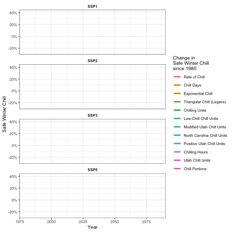
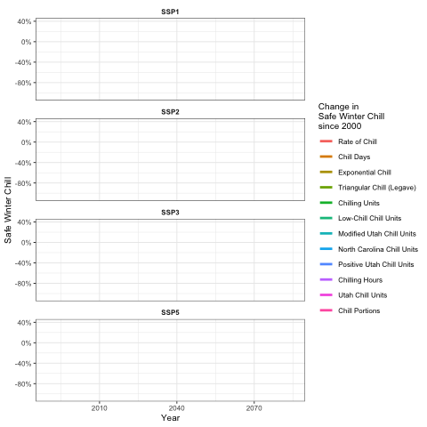
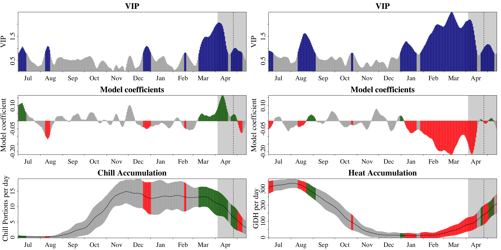
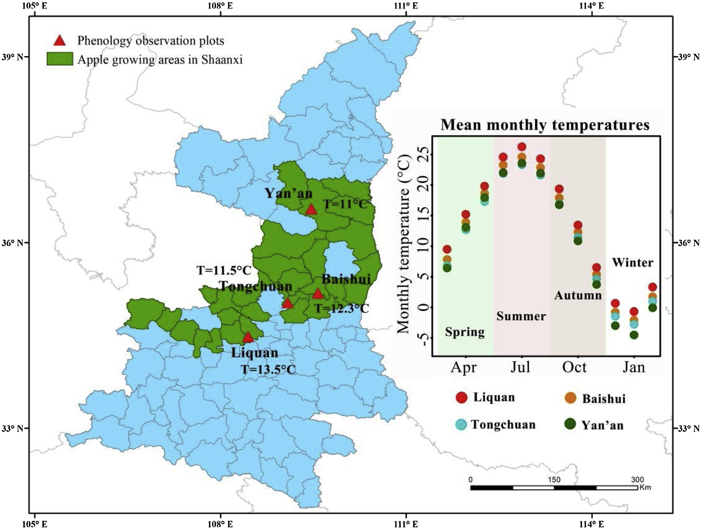

```{r setup, include=FALSE, message  = FALSE, warning = F}
knitr::opts_chunk$set(echo = TRUE,  message = FALSE,  warning = FALSE,  tidy = TRUE)
library(chillR)
library(tidyverse)
library(dplyr)
library(tidyr)
library(knitr)
library(pander)
library(kableExtra)
library(ggplot2)
library(tibble)
library(lubridate)
library(reshape2)
library(downlit)
library(xml2)
library(stats)
library(patchwork)
library(ncdf4)
library(PCICt)
library(ggpmisc)
library(devtools)
library(dormancyR)
library(colorRamps)
library(gganimate)
library(gifski)
library(png)
library(transformr)
library(Kendall)
library(grid)
library(pls)
library(fields)
library(metR)
library(cowplot)
library(magick)
library(leaflet)
library(htmltools)
```

<style>
    body { background-color:  #F0FFFF; }
    pre, pre:not([class]) { background-color: #d7f4f4; }
</style>


<br>

***This document records my notes and progress in the course titled "Tree Phenology Analysis with R."***

<br>


## Chapter 3: Tree Dormancy


### <span style="color:#71797E">3.1</span>&nbsp; Introduction to dormancy

<div style="height: 18px;"></div>

- Fruit trees go into dormant state to survive unfavorable conditions in winter

- Dormancy phases: 
    - **Dormancy establishment** (controlled by environmental signals&mdash; Day length/photoperiod, Temperature)
    - **Endo-dormancy** (controlled by plants' endogenous factors&mdash; their abilities to grow even in unfavorable conditions; a period of rest and then regrow/ endo-dormancy is overcome once the trees have experienced a certain level of chill but they don't immediately resume growth)
    - **Eco-dormancy** (trees are acclimated&mdash; no morphological changes, but not deeply dormant; (warm) temp is the main environmental driver)
    - **Growth resumption** (first apparent morphological changes occur in end of winter or earliest spring depending on species and cultivars&mdash; trees quickly un-acclimatized to grow and become sensitive to freezing temperature before buds burst? Warm temp promotes growth)
    
\n

- Physiological processes that regulate dormancy
    - **Transport at both whole-plant and cellular level:** The transport of water and solutes stop during dormancy both at the whole plant and cellular levels within the meristems.
    - **Phytohormone dynamics:** Plant hormones are short and long distance signalling compounds acting in a very low concentrations. Myoregulators for plants growth and development, as well as mediate responses to biotic and abiotic stressors. 
    - **Genetic and epigenetic regulation:** A group of genes related to dormancy&mdash; regulation of bad dormancy.
    - **Dynamics of nonstructural carbohydrates:** Non-structural carbohydrates have three main functions&dash; energy esterase?, transport and supply, and osmotic regulation and signaling (these varies within and between seasons).
    
<br>

### <span style="color:#71797E">3.2</span>&nbsp; Dormancy physiology

<div style="height: 18px;"></div>


Reference: [*A Conceptual Framework for Winter Dormancy in Deciduous Trees (Fadón et al., 2020)*](https://www.mdpi.com/2073-4395/10/2/241)

<br>

### <span style="color:#71797E">3.3</span>&nbsp; Experimental and statistical determination of the chilling and forcing periods

<div style="height: 18px;"></div>

- High chill accumulation during endodormancy advances flowering dates, but similarly cool temperatures during ecodormancy may cause flowering delays. 

- Endo- and eco- dormancy occur under the same phenological stage, but the temperatures have the opposite effect on flowering according to the dormancy phase. 

- Endo- Vs. Eco- dormancy phase differentiation: 
    - **Empirically** (See if there is growth after chilling period&mdash; whether the chill period is overcome to allow forcing period)
    - **Statistically** (Long phenological data sets and temperature records&mdash; estimate the date of chilling fulfillment based on the long series of phenological observations, flowering dates and relating them with previous temperature records)
    
\n

- `chillR` package to perform PLS analysis with phenology data and temperature, which gives two outputs:
    - **Model coefficients** which indicate the strength and the sense of the influence 
    - **Variable important in the projections (VIP)**, which points out the significant importance of the model coefficient values&mdash; values from 0.8 are considered significant??
   
<br>

### <span style="color:#71797E">3.4</span>&nbsp; Phenology record and BBCH scale

<div style="height: 18px;"></div>

- **Phenology** is the study of periodic events in **biological life cycles** (e.g. seasonal changes in trees) and how these are influenced **by seasonal and interannual variations** in climate.

- Application of phenology in agriculture:
    - Select suitable crops and varieties (to organize the cropping schedules, organize the crop rotation)
    - Forecasts of plant development and harvest dates (e.g. to evaluate the risk of frost damage)
    - Timing of the agricultural practices&mdash; irrigation, fertilization, crop protection, etc. 
    
\n

- Trees go through many developmental stages over the course of the year, and these are usually referred to by a two-digit code. <span style="color:grey">*(Read more [here.](https://www.openagrar.de/servlets/MCRFileNodeServlet/openagrar_derivate_00010428/BBCH-Skala_en.pdf))*</span>

  - Principal growth stages&mdash; describe time spans (0-9)
  - Secondary growth stages&mdash; precise steps in plant development (0-9)
      

<br>

### <span style="color:#71797E">3.5</span>&nbsp; Exercises on tree dormancy

<div style="height: 18px;"></div>

***1. Put yourself in the place of a breeder who wants to calculate the temperature requirements of a newly released cultivar. Which method will you use to calculate the chilling and forcing periods? Please justify your answer.***

As a breeder, I will use the empirical method rather than the statistical method to calculate the chilling and forcing periods in this particular case, for two reasons:

- It requires little statistical expertise, as many breeders may not have in-depth statistical expertise, and hiring an expert could incur extra costs.

- The statistical method relies on long phenological data sets and temperature records. Since this cultivar is newly released, such longitudinal data sets and records may not be available for statistical computation.

Anyway, after I looked up the definition of plant breeder, they are scientists, so statistics may not be a problem. In that case, start with empirical first and then combine with statistical method as more data accumulates. 😁


<br>

***2. Which are the advantages (2) of the BBCH scale compared with earlier scales?***

- Covers the whole development of the plant, rather than development of only the flower buds as in the traditional scale

- Provides a general frame for all the species, while the traditional scale is species specific
  
<br>

***3. Classify the following phenological stages of sweet cherry according to the BBCH scale:***


From left to right:

- BBCH stage 54 (Inflorescence enclosed by light green scales)

- BBCH stage 65 (Full flowering: at least 50% of flowers open, first petals falling)

- BBCH stage 89 (Fruit ripe for harvesting for immediate consumption&mdash; fruit have typical taste and firmness)
    - <span style="color:grey">*I chose stage 89, rather than the fruit-picking stage 87, due to the cherries' uniform and rich red color. However, further assessment of their firmness, taste, and aroma is required to accurately confirm the stage.*</span>

<br>

## Chapter 4: Climate change and impact projection

### <span style="color:#71797E">4.1</span>&nbsp; The drivers of climate change

<div style="height: 18px;"></div>

In this lecture, I learned about how the climate changes occurs, as well as the main and long-term drivers of climate change. I also learned about the impact of greenhouse gases on recent global warming&mdash; particularly CO~2~, CH~4~ and N~2~O in the atmosphere.

<br>

### <span style="color:#71797E">4.2</span>&nbsp; What we’ve already seen

<div style="height: 18px;"></div>

This lecture taught me about the alarming increase in global temperatures in recent decades due to human activities, and how even a slight rise in temperature can cause significant shifts in the Earth's land areas. The lecture also discussed these trends on a global scale, as well as specifically in Germany. Additionally, there was a brief discussion on precipitation trends in Germany.

<br>

### <span style="color:#71797E">4.3</span>&nbsp; Future scenarios

<div style="height: 18px;"></div>

I learned a lot about future climate projections and the process to make those projections (RCP, GCM, downscaling, etc) in this lecture. I also learned about the importance of impact models&mdash; even after we achieved perfect climate projections, there is a need for multiple impact models, as there will still be uncertainty about the biological responses and how we should describe them. There was also a nice discussion on how the changes in the ocean circulation and other tipping points can drive climate change. The lecture also emphasized the importance of being concerned about the future and taking action now to ensure future generations can experience the same world we live in.

<br>

### <span style="color:#71797E">4.4</span>&nbsp; Impact projection approaches

<div style="height: 18px;"></div>

I learned about different models in making predictions for the future. The lecture compares between the four climate project models, and discussed in details the advantages and the disadvantages of each. There is also a nice instruction on how we should build a model in the beginning&mdash; we may not want to go into detail for each aspect, but try to cover all aspects in a broader sense. 

<br>

### <span style="color:#71797E">4.5</span>&nbsp; Exercises on climate change

<div style="height: 18px;"></div>


***1. List the main drivers of climate change at the decade to century scale, and briefly explain the mechanism through which the currently most important driver affects our climate.***

- Sun
- Aerosols
- Cloud
- Ozone
- Surface albedo
- Greenhouse gases
- Long-term drivers
    - Trends in solar activity
    - Ocean currents/ continent constellations
    - Plant vs. animals (Balance of CO~2~ production and consumption)
    - Volcanic and meteroite activity
    - Milankovic cycles
    
The current most important driver that affects our climate is the rising concentrations of atmospheric greenhouse gases. Human activities, particularly the burning of fossil fuels, release CO~2~ and other greenhouse gases into the atmosphere. These gases allow the passage of short-wave radiation from the sun, while absorbing the long-wave (infrared) radiation from the Earth. The absorbed infrared radiation is then re-emitted back to the atmosphere and the Earth's surface. This greenhouse effect traps heat in the Earth's atmosphere, causing the planet to warm.

<br>

***2. Explain briefly what is special about temperature dynamics of recent decades, and why we have good reasons to be concerned.***

Temperature dynamics of recent decades is special&mdash;or perhaps alarming&mdash;because global temperatures have been rising faster than ever before in human history. This phenomenon was illustrated by Prof. Micheal E. Mann in his book, titled "The Hockey Stick and the Climate Wars."


In the figure, we can clearly see there was little change in temperature in the earlier centuries, showing that nature had a way to balance without human intervention. However, the global temperature increased substantially by 1800s, coinciding with the widespread use of steam engines and industrial revolution. As human are the dominant species on Earth, there is no predator or natural forces that can counter the environmental impacts caused by human. This is evident by the continued rise in global temperature to this decade, such as the  8&deg;C increase in Siberia's surface temperature in 2020 compared to the 2003-2018 average. 

This trend gives us good reasons to be concerned because if left unaddressed, global temperature changes caused by human activities can escalate exponentially. Without proper interventions, future generations may inherit a drastically different&mdash; and likey worse&mdash; Earth than the one we experience today. 

<br>

***3. What does the abbreviation 'RCP' stand for, how are RCPs defined, and what is their role in projecting future climates?***

The abbreviation 'RCP' stands for the 'Representative Concentration Pathways.'

RCPs are defined by the additional radiative forcing (Wm^-2^) expected by the end of the 21^st^ century (year 2100), representing different levels of greenhouse gas emissions. In the IPCC's Fifth Assessment Reports (AR5), the four main RCPs are defined as follows:

- **RCP2.6:** Low-emission scenario (~2.6 Wm^-2^)

- **RCP4.5:** Intermediate scenario (~4.5 Wm^-2^)

- **RCP6.0:** Moderate-emission scenario (~6.0 Wm^-2^)

- **RCP8.5:** High-emission scenario (~8.5 Wm^-2^)

RCPs are the climate scenarios fed into climate models. Hence, RCPs serve as inputs for the climate models to make projections of future temperature changes and weather patterns based on varying greenhouse gas emissions. These RCP-based scenarios also allow policymakers to assess different mitigation strategies to counter climate change by exploring different emission pathways and their impacts on the global climate.

<br>

***4. Briefly describe the 4 climate impact projection methods described in the fourth video.***

- **Statistical models:** These models establish relationship between climate parameters and impact measure (e.g. corp yield), and are used to explain past trends and project future climate impacts. However, they have limitations such as overlooking important confounding factors and relying on past trends, which may lead to invalid projections if future climate conditions change significantly.

- **Process-based models:** Also known as mechanistic models, which aim to represent all major system processes through equations. These models try to capture best scientific knowledge of all processes, but the problem is processes are often not sufficiently understood. Hence, process-based models may omit many key defining factors. They can also be unrealistic for most complex systems, often requiring extensive parameterization or assumptions. Another limitation is that they may become valid over time due to non-linear changes in variables, and uncertainties are not always well represented. 

- **Species distribution models (SDMs):**They are also known as ecological niche modeling, which establish relationship between different climatic parameters and presence or absence of data for either species or ecosystems. SDMs use these relationships to project future species distributions under changing climate conditions. Results can vary significantly between different algorithms, so ensemble modeling is often used to combine multiple models for more robust predictions.

- **Climate analogue models:**In these models, we identify locations with climates similar to those projected for the area of interest in the future. By examining the climate conditions at these analogue sites, we can get a glimpse potential future scenarios, which allow us to explore different adaptation strategies. However, there are limitations&mdash; analogue sites may differ from the baseline in important non-climatic factors, leading to confusion about whether observed differences are due to climate or other variables. Furthermore, climate data can be too limited or of poor quality to reliably apply these models&mdash; error estimates of these models are required as all impact projects are uncertain. 

<br>

## Chapter 5: Winter chill projections

### <span style="color:#71797E">5.1</span>&nbsp; Winter chill projections

#### <span style="color:#71797E">5.1.1</span>&nbsp; Winter chill in Oman

<div style="height: 18px;"></div>

- To calculate nutrient budgets for the oases in the Sultanate of Oman, by measuring the yields of the various fruit trees there

- But, many of the trees in the oasis system did not produce fruits in the years of analysis

- A hypothesis for that was "the lack of chilling," due to most of the trees in these high-altitude oases were not the typical species of the Arabian Peninsula, but temperate trees

- So, from focusing on nutrient budget to chilling hours

- Chilling Hours model&mdash; this model can’t really be trusted, especially in a warm location
    - Placed temperature loggers in three oases at different levels of elevation, which allowed studying chill accumulation along an elevation gradient (can't collect meaningful data for a reasonable period of time )
    - So, obtain data from an official long-term weather station is located in the vicinity, near the top of the valley, roughly 1000 m above the lowest oasis&mdash; data not representative of all the locations along the elevation gradient
    - So, use the records from the oases to define transfer functions that allowed deriving oasis temperatures from long-term data
    - Set the transfer functions up (using PLS&mdash; not a good idea?) to directly calculate hourly temperatures in the oases from the daily records of the official station at Saiq
    - Regression between temperature at Saiq and temperature in three oases to calculate winter chill dynamics over the entire time span covered by the official weather station (Hourly data were needed to calculate the number of Chilling Hours)
    
\n

- Weather generators to add future climate scenarios
    - *Weather generators are tools that can produce random draws of plausible weather, based on observed weather for a particular location.*
    - Fed the LARS-WG weather generator with the data (we had) for the highest-elevation oasis and told it to generate plausible weather for a number of years
        - Request the generator to produce the highest-elevation oasis and told it to generate plausible weather for a number of years
        - Result: Chill prospects for 1°C and 2°C warming scenarios

\n

<br>

#### <span style="color:#71797E">5.1.2</span>&nbsp; Chill model sensitivity

<div style="height: 18px;"></div>

- In projecting climate change impacts on winter chill in the Central Valley, one of the world’s most productive regions for temperate fruit trees, **the choice of chill model matters a lot**

- Created a bunch of temperature scenarios for multiple locations and calculated how chill accumulation was likely to change in the future, according to multiple chill models
    - Looked at what changes the various models predicted for the same locations and the same future scenarios
    - The chill projection results varied considerably across the four models&mdash; **strong indication that not all models can be right**
    - Based on the literature, as well as on another study [(Luedeling et al., 2009d)](https://www.sciencedirect.com/science/article/pii/S0168192309001580), Dynamic Model was concluded to be the most reliable one&mdash; used mostly in this course
          - But, the Dynamic model is too complicated (cumbersome, error-prone and boring)
          
<br>

#### <span style="color:#71797E">5.1.3</span>&nbsp; Winter chill in California

<div style="height: 18px;"></div>

- To produce a winter chill projection for California's fruit and nut growing region&mdash; the Central Valley
    - Multiple scenarios (20 or so) for records of all 100+ weather stations in California (automate processing steps)
    
\n

- Result: produce projections for all stations, which consisted of chill accumulation over 100 plausible winter seasons per scenario, generated with a weather generator

- Summarize the data by defining a metric called ‘Safe Winter Chill’. 
    - This is the 10th percentile of the chill distribution, i.e. the amount of chill that is exceeded in 90% of all years, derived from the ‘replicates’ of annual temperature dynamics produced by the weather generator 
    - Economically, it may be feasible to grow a tree cultivar that requires this much chill. 
    
\n

- Source: [(Luedeling et al.,2009d)](https://journals.plos.org/plosone/article?id=10.1371/journal.pone.0006166)
    
<br>

#### <span style="color:#71797E">5.1.4</span>&nbsp; Winter chill ratios

<div style="height: 18px;"></div>

- To produce a chill projection for the whole planet, using data from the Global Summary of the Day database

- Processed data for about 5000 globally distributed weather stations, for which multiple chill metrics were calculated

- To compare chill models, the ratio between various chill metrics was calculated for each weather station in the data set.
    -  Had these ratios been largely constant all over the planet (e.g. one Chill Portion always corresponds to 10 Chilling Hours), we would have been fairly safe using any of the chill models.
    - Unfortunately, this wasn’t the case, with enormous variation in chill metric ratios around the world.
    
\n

- Source: [(Luedeling & Brown, 2011a)](https://link.springer.com/article/10.1007/s00484-010-0352-y)

<br>

#### <span style="color:#71797E">5.1.5</span>&nbsp; A global pojection of future winter chill

<div style="height: 18px;"></div>

- Produce a global projection of the likely impacts of climate change on winter chill

- Projected decline in winter chill&mdash; it seems unlikely that growers will remain able to grow the tree cultivars they currently rely on with such dramatic chill losses

- Source: [(Luedeling et al., 2011b)](https://journals.plos.org/plosone/article?id=10.1371/journal.pone.0020155)

<br>

#### <span style="color:#71797E">5.1.6</span>&nbsp; Winter chill in Germany

<div style="height: 18px;"></div>

- Germany is not highlighted as particularly vulnerable to chill losses.

- The reason for this lack of major changes is that current winter temperatures in Germany are right in the middle of what appears to be the most effective temperature range for chill accumulation.

- Source: [(Luedeling et al., 2009a)](https://link.springer.com/article/10.1007/s10341-009-0085-4)

<br>

#### <span style="color:#71797E">5.1.7</span>&nbsp; Winter chill in Tunisia

<div style="height: 18px;"></div>

- Models: SRES, GCMs, RCPs
    - The so-called SRES emissions scenarios (named after the IPCC Special Report on Emissions Scenarios), usually focusing on the three most commonly used scenarios B2, A1B and A2
    - ‘General Circulation Models’ (GCMs; many people also use an alternative long form: ‘Global Climate Models’)
    - ‘Representative Concentration Pathways’ (RCPs) to replace the SRES scenarios
    
\n

- No way of deciding which of these models, if any, is right&mdash; should produce *ensemble* forecasts, i.e. project changes using outputs from all the available models (that are considered credible)

- Produce chill distribution at a particular point in time using a weather generator that is accessed by `chillR`. 
    - This weather generator is calibrated with observed weather data and provided with an estimate of how various climate metrics differed from the long-term average climate in 1975, 2000 and 2015.
    - With this information, we can generate a large number of artificial yearly weather records that might have occurred at these points in time.
    
\n

- The weather generator was also used to produce future scenarios. 
    - In the case of Pistachios in Tunisia, the tool is calibrated with observed data, but the scenarios that were added were not derived from the historic record, but extracted from the AFRICLIM database.
    
<br>

#### <span style="color:#71797E">5.1.8</span>&nbsp; Winter chill in Chile

<div style="height: 18px;"></div>

- A tool that could quickly access single-location data for weather stations anywhere on the planet: ClimateWizard

<br>

#### <span style="color:#71797E">5.1.9</span>&nbsp; Chill projection for Patagonia

<div style="height: 18px;"></div>

- Looked into the climatic suitability for fruit and nut trees near agriculture’s southern frontier - in Patagonia, in southern Argentina [(del Barrio et al., 2020)](https://rmets.onlinelibrary.wiley.com/doi/pdf/10.1002/joc.6649).

- Used the weather station records to calibrate weather generator and downloaded climate projections from the ClimateWizard database. 
    - to make past and future temperature scenarios for all stations
    - to compute winter chill and a few other agroclimatic metrics
    
<br>

#### <span style="color:#71797E">5.1.10</span>&nbsp; Chill model comparison

<div style="height: 18px;"></div>

- Used climate change analysis framework to compare chill models [(Fernandez et al., 2020b)](https://www.sciencedirect.com/science/article/pii/S1161030120301106)

- Model choice matters!

<br>


#### <span style="color:#71797E">5.1.11</span>&nbsp; Chill projection for all of Tunisia

<div style="height: 18px;"></div>

- Mapped chill accumulation across Tunisia, based on the previous framework
    - Applied the analysis framework developed to each of the 20 weather station locations across Tunisia and neighboring countries
    - Interpolated results to produce chill maps that track chill availability in Tunisia over the past few decades

\n

- How to interpolate the site-specific results into a map that covers the whole country
    - Take the site-specific predictions of Safe Winter Chill and interpolate a surface through them (using the Kriging technique)
    - Repeat the same for the elevations of the locations
    - Then, fitted a linear model to relate chill accumulation to elevation
    - Calculate the difference between the elevation model derived from the weather station elevations and the true elevations of each location of the country, using a Digital Elevation Model (DEM)
    - Considering that this difference is not yet accounted for by the chill surface that was derived by interpolating chill data for the weather stations, we used the elevation~chill relationship we determined to correct chill predictions.
    - Will only work in places with a linear relationship between elevation and chill availability
    
<br>

#### <span style="color:#71797E">5.1.12</span>&nbsp; Revisiting chill accumulation in Oman

<div style="height: 18px;"></div>

- Adding some new ideas on how to convert daily into hourly temperatures in a place like the oases of Oman we were interested in, we produced updated assessments of past winter chill and forecasts of future chill for the oases of Al Jabal Al Akhdar. [(Buerkert et al., 2020)](https://link.springer.com/article/10.1007/s10584-020-02862-8)

<br>

### <span style="color:#71797E">5.2</span>&nbsp; Exercises on past chill projections

<div style="height: 18px;"></div>

***1. Sketch out three data access and processing challenges that had to be overcome in order to produce chill projections with state-of-the-art methodology.***


- The need to automate the process to create multiple climate scenarios for large number of weather stations and to handle large data output of simulation scenarios. For example, challenge in data transfer when replacing old scenarios (SRES) with the new (RCPs). 

- Scarcity of source to find appropriate information/ data on future climates that can easily be used for the purposes of chill modeling. For example, data (e.g. temperature records) available may not be representative of all locations of interest and the need for hourly records to run chill models. 
  
- The need to download large datasets when users may only be interested in data for a single location. This problem is overcome by a function that extracts data for single locations from `ClimateWizard` tool. The function is now publicly available through the use of an application programming interface (API) to access outputs from 15 climate models from the RCP scenarios. 

<br>

***2. Outline, in your understanding, the basic steps that are necessary to make such projections.***

Based on the information given in Chapter 5, the basic steps necessary to make chill projections are as follows:

- Set up temperature loggers in the location of interest to collect temperature data (can't provide meaningful long-term data)

- Obtain long-term data from official weather stations located in the vicinity (these data may not representative of all locations)

- Using the records obtained from the location of interest, derive meaningful daily temperature data from the long-term data. 

- Calculate hourly temperatures directly from the daily records using methods such as PLS regression, since the chilling hours calculation requires hourly data. 
    - Now we can calculate estimated chilling hours for the entire time span covered by the official weather station. In other words, we now have chill dynamics for the past period. 
    
\n

- To add the future climate scenarios, we can input these data into a weather generator, and generate plausible weathers for a specified number of years. Here, we can also generate weather conditions based on historical temperatures or for scenarios where temperatures are a few degrees higher.

- Now, we can make chill projections for the weather generator's scenarios of our location, using chill models. Here the choice of chill model matters as not all chill models are reliable&mdash; select an appropriate chilling model or an ensembles of models. 

<br>

## Chapter 6: Manual chill analysis

### <span style="color:#71797E">6.1</span>&nbsp; Computing Chilling Hours from hourly temperature data

<div style="height: 18px;"></div>

- Need hourly temperature data to compute Chilling Hours

- `chillR` offers a few neat tools to make pretty good approximations of hourly temperature data from daily records

<br>

#### *Display the `Winters_hours_gaps` dataset in `chillR` using `kable`* {.unnumbered}


```{r 6.1.1}

# Display the Winters_hours_gaps dataset in chillR using kable
kable(Winters_hours_gaps[1:10,]) %>%
  kable_styling("striped", position = "left", font_size = 10)

```

<br>

#### *Remove column `Temp_gaps` and create a new dataset (`hourtemps`)* {.unnumbered}

```{r 6.1.2}

# Remove column Temp_gaps and create a new dataset (hourtemps)
hourtemps <- Winters_hours_gaps[,
                                c("Year",
                                  "Month",
                                  "Day",
                                  "Hour",
                                  "Temp")]

kable(hourtemps[1:10,]) %>%
  kable_styling("striped", position = "left", font_size = 10)

```

<br>

#### *Display only the third row with all columns* {.unnumbered}

```{r 6.1.3}

# Display only the third row with all columns
hourtemps[3, ]

```

<br>

#### *Display the `Temp` column of the third row only* {.unnumbered}

```{r 6.1.4}

# Display the temp column of the third row only
hourtemps[3, "Temp"]

```

<br>

#### *Display the first five rows of `Temp` column* {.unnumbered}

```{r 6.1.5}

# Display the first five rows of Temp column
hourtemps$Temp[1:5]

```

<br>

#### *Display the first five rows and all columns of `hourtemps` dataset* {.unnumbered}

```{r 6.1.6}
# Display the first five rows and all columns of hourtemps dataset
hourtemps[1:5, ]

```

<br>

#### *Check for temperatures that fall within `Chilling Hours` range* {.unnumbered}

<div style="height: 18px;"></div>

- Every hour with temperatures above (and including) 0°C and below (and including) 7.2°C is considered a Chilling Hour.

- Check for every hour whether temperatures fall in this range, using simple comparison commands (`<`, `<=`, `==`, `=>` and `>`) in R

<br>

#####  *Using simple comparison commands* {.unnumbered}


```{r 6.1.7.1}

# Use == command
1 == 2
1 == 1

# Test > command
c(1, 2, 3) > 2

# Use >= command
a <- 1
b <- 2
c <- 3
c(a, b, c) >= 2

# Use & command
c(a, b, c) >= 2 & c(a, b, c) <3

```

<br>

##### *Check for `Chilling Hours`* {.unnumbered}

```{r 6.1.7.2}

# Assign new column Chiling_Hour 
hourtemps[,"Chilling_Hour"] <-
  hourtemps$Temp >= 0 & hourtemps$Temp <= 7.2

# Check if the temperatures fall within Chilling_Hour for row 13 to 20
hourtemps[13:20, ]

# Find total chilling hour for a particular period by defining rows (3-4 March 2008)
sum(hourtemps$Chilling_Hour[13:20])

# Use `which` function to set the dates for total chilling hours calculation
Start_Date <- which(hourtemps$Year == 2008 &
                      hourtemps$Month == 10 &
                      hourtemps$Day == 1 &
                      hourtemps$Hour == 12)

End_Date <- which(hourtemps$Year == 2008 &
                    hourtemps$Month == 10 &
                    hourtemps$Day == 31 &
                    hourtemps$Hour == 12)

sum(hourtemps$Chilling_Hour[Start_Date:End_Date])

# So in October of 2008, Winters experienced 28 Chilling Hours.

```

<br>

### <span style="color:#71797E">6.2</span>&nbsp; Our first chill function

<div style="height: 18px;"></div>

- A function consists of a name, some arguments that are passed to the function, and some code that should be executed.

- We can define is as `OurFunctionName <- function(argument1, argument2, ...) {ourCode}`.

- What’s returned is either the last object that’s mentioned in the function code or some content specified by the `return()` function.

```{r 6.2}

# Example function for Chilling_Hour calculation
# Function that adds Chilling_Hour column to dataframe
CH <- function(hourtemps)
{
  hourtemps[, "Chilling_Hour"] <-
    hourtemps$Temp >= 0 & hourtemps$Temp <= 7.2
  return(hourtemps)
}

# Check chilling hour `yes or no` for rows 13-20
CH(hourtemps)[13:20, ]

# Create more complex functions, e.g. to calculate the number of Chilling Hours
# between two dates, which we can specify in the YEARMODA format 
# (i.e. year, month and day, combined in one number).
sum_CH <- function(hourtemps,
                   Start_YEARMODA,
                   End_YEARMODA)
{
  Start_Year <- trunc(Start_YEARMODA / 10000) # "trunc" removes all decimals
  Start_Month <-
    trunc((Start_YEARMODA - Start_Year*10000) / 100)
  Start_Day <- 
    Start_YEARMODA - Start_Year * 10000 - Start_Month * 100
  Start_Hour <- 12 # This could also be flexible, but let's skip this for now
  End_Year <- trunc(End_YEARMODA / 10000)
  End_Month <- trunc((End_YEARMODA - End_Year * 10000) / 100)
  End_Day <- End_YEARMODA - End_Year * 10000 - End_Month * 100
  End_Hour <- 12 # This could also be flexible, but let's skip this for now

  Start_Date <- which(hourtemps$Year == Start_Year &
                        hourtemps$Month == Start_Month &
                        hourtemps$Day == Start_Day &
                        hourtemps$Hour == Start_Hour)
  End_Date <- which(hourtemps$Year == End_Year &
                    hourtemps$Month == End_Month &
                    hourtemps$Day == End_Day &
                    hourtemps$Hour == End_Hour)

  Chill_hours <- CH(hourtemps)
  
  return(sum(Chill_hours$Chilling_Hour[Start_Date:End_Date]))

}

# Check the total chilling hours from March 1 to October 11, 2008
# Note that the dataset only goes from 3rd March to 11th November 2008, 
# so use of any dates outside that range will generate an error message. 
sum_CH(hourtemps, 20080401, 20081011)

```

<br>

### <span style="color:#71797E">6.3</span>&nbsp; Exercise on basic chill modeling

<div style="height: 18px;"></div>

***1. Write a basic function that calculates warm hours (>25°C)***

```{r 6.3.1}

## Check for warm hours above 25 degree C in Winters_hours_gaps dataset
# Create a dataset without temperature gaps
W_data <- Winters_hours_gaps[,
                             c("Year",
                               "Month",
                               "Day",
                               "Hour",
                               "Temp")]

# Write function that calculates warm hours above 25 degree C
WH <- function(W_data)
{
  W_data[, "Warm_Hour"] <-
    W_data$Temp > 25
  return(W_data)
}

# Show the the first 4 rows
WH(W_data)[1:4, ]

# Calculate total warm hours for the dataset
WH_sum <- WH(W_data)
sum(WH_sum$Warm_Hour)

```

<br>

***2. Apply this function to the Winters_hours_gaps dataset***

```{r 6.3.2}

# Apply the function to original Winters_hours_gaps dataset
kable(WH(Winters_hours_gaps[961:970, ]), row.names = FALSE) %>%
  kable_styling("striped", position = "left", font_size = 10)

```

<br>

***3. Extend this function, so that it can take start and end dates as inputs and sums up warm hours between these dates***

```{r 6.3.3}

sum_WH <- function(W_data,
                   Start_YEARMODA,
                   End_YEARMODA) {
  Start_Year <- trunc(Start_YEARMODA / 10000)
  Start_Month <- trunc((Start_YEARMODA - Start_Year * 10000) / 100)
  Start_Day <- trunc((Start_YEARMODA - Start_Year *10000) - 
                         Start_Month * 100)
  Start_Hour <- 12
  
  End_Year <- trunc(End_YEARMODA / 10000)
  End_Month <- trunc((End_YEARMODA - Start_Year * 10000) / 100)
  End_Day <- trunc((End_YEARMODA - Start_Year *10000) - 
                         End_Month * 100)
  End_Hour <- 12
  
  Start_Date <- which(W_data$Year == Start_Year &
                        W_data$Month == Start_Month &
                        W_data$Day == Start_Day &
                        W_data$Hour == Start_Hour)
  
  End_Date <- which(W_data$Year == End_Year &
                        W_data$Month == End_Month &
                        W_data$Day == End_Day &
                        W_data$Hour == End_Hour)
  
  Warm_Hours <- WH(W_data)
  
  return(sum(Warm_Hours$Warm_Hour[Start_Date:End_Date]))
  
}  # See in-class script for setting year, month and date with substr 

# Total warm hours for the whole period of dataset 
sum_WH(W_data, 20080303, 20081110)

```

<br>

## Chapter 7: Chill models

### <span style="color:#71797E">7.1</span>&nbsp; Chill models in `chillR`

#### *`Chilling_Hours()` function* {.unnumbered}

<div style="height: 18px;"></div>

- Chilling Hours are great for an entry-level tutorial on chill modeling, but they’re not a particularly credible metric, so I suggest you forget them right away.    

\n

```{r 7.1.1}

# Chilling_Hours() function in chillR to calculate chilling hours
Chilling_Hours

# Apply Chilling_Hours() function to Winters_hours_gap dataset
Chilling_Hours(Winters_hours_gaps$Temp)[1:100]
```

<br>

#### *The Utah model* {.unnumbered}

<div style="height: 18px;"></div>

- `step_model()` function allows you to define your own model, based on temperature thresholds and weights. 

- To implement various variations of the Utah Model that have been developed for different locations

```{r 7.1.2}

Utah_Model

Utah_Model(Winters_hours_gaps$Temp)[1:100]

# Create a data.frame for temperatures with weights
df <- data.frame(
  lower  = c(-1000, 1, 2, 3, 4, 5,    6),
  upper  = c(    1, 2, 3, 4, 5, 6, 1000),
  weight = c(    0, 1, 2, 3, 2, 1,    0))

kable(df) %>%
  kable_styling("striped", position = "left", font_size = 10)

# Use custom() function to implement a chill model based on df
custom <- function(x) step_model(x, df)

custom(Winters_hours_gaps$Temp)[1:100]


```

<br>

#### *The dynamic model* {.unnumbered} 

<div style="height: 18px;"></div>

```{r 7.1.3}

Dynamic_Model

Dynamic_Model(Winters_hours_gaps$Temp)[1:100]

```

<br>

#### *`make_JDay()` and `tempResponse` functions* {.unnumbered}

<div style="height: 18px;"></div>

- Add the Julian dates (counts the days of the year) to the dataset 

- The `chilling()` function implements the Chilling Hours, Utah and Dynamic Models, and it also calculates Growing Degree Days (GDH); use `tempResponse` function otherwise

```{r 7.1.4}

# Use chilling() function
output <- chilling(make_JDay(Winters_hours_gaps),
                   Start_JDay = 90,
                   End_JDay = 100)

kable(output) %>%
  kable_styling("striped", 
                position = "left",
                font_size = 10)

# Use tempResponse function
output <- tempResponse(make_JDay(Winters_hours_gaps),
                       Start_JDay = 90,
                       End_JDay = 100,
                       models = list(Chill_Portions = Dynamic_Model,
                                     GDH = GDH))

kable(output) %>%
  kable_styling("striped",
                position = "left",
                font_size = 10)

```

<br>

### <span style="color:#71797E">7.2</span>&nbsp; Exercise on chill models

<div style="height: 18px;"></div>

***1. Run the `chilling()` function on the `Winters_hours_gap` dataset***

```{r 7.2.1}

# Check JDay for start and end of dataset period
dates <- data.frame(Year = c(2008, 2008),
                    Month = c(3, 11),
                    Day = c(3, 11))

kable(make_JDay(dates)) %>%
  kable_styling("striped",
                position = "left",
                font_size = 10)

# Apply chilling() function on Winters_hours_gap dataset
c_output <- chilling(make_JDay(Winters_hours_gaps),
                     Start_JDay = 63,
                     End_JDay = 316)

kable(c_output) %>%
  kable_styling("striped",
                position = "left",
                font_size = 10)

```

<br>

***2. Create your own temperature-weighting chill model using the `step_model()` function***

```{r 7.2.2}

t_data <- data.frame(
  lower  = c(-1000, 2, 8, 12, 15, 18, 20, 25),
  upper  = c(2, 8, 12, 15, 18, 20, 25, 1000),
  weight = c(0, 0.5, 1, 2, 0.5, -0.5, -1, -2)
)

kable(t_data) %>%
  kable_styling("striped", position = "left", font_size = 10)

custom <- function(x) step_model(x, t_data)

```

<br>

***3. Run this model on the `Winters_hours_gaps` dataset using the `tempResponse()` function.***

```{r 7.2.3}

t_output <- tempResponse(make_JDay(Winters_hours_gaps),
                         Start_JDay = 63,
                         End_JDay = 316,
                         models = list (Cumulative_Temp = custom,
                                        Chilling_Hours = Chilling_Hours,
                                        Chill_Portions = Dynamic_Model,
                                        Utah_Model = Utah_Model,
                                        GDH = GDH))

kable(t_output) %>%
  kable_styling("striped", position = "left", font_size = 10)

# Here we see a big difference between the outputs of various models, 
# due to the different parameters chosen? 

```

<br>

## Chapter 8: Making hourly temperatures

### <span style="color:#71797E">8.1</span>&nbsp; Generating hourly temperatures

<div style="height: 18px;"></div>

- Most sources only provide daily data, usually including minimum and maximum temperature of the day, from which we can’t directly calculate Chilling Hours.

- The rate of temperature increase in the morning is not the same as the rate of decrease in the evening. Besides, in particular the time of the lowest daily temperature varies considerably throughout the year (unless you’re close to the equator), and it would be good to consider this.
    - 'Triangular' daily temperature pattern, achieved by interpolating linearly for hours between daily minimum temperature recorded at a certain time of day, and the maximum temperature at another time, is not realistic. 

<br>

#### <span style="color:#71797E">8.1.1</span>&nbsp; Idealized daily temperature curves

<div style="height: 18px;"></div>

- [(Linvill, 1990)](https://journals.ashs.org/hortsci/view/journals/hortsci/25/1/article-p14.xml) described the daily temperature curve using a combination of two mathematical equations: a sine curve to describe daytime warming, and a logarithmic decay function for nighttime cooling.

- The transition points between the two parts were determined by sunrise and sunset, and the duration of the parts was related to daylength.

- One aspect that made Linvill’s equations hard to use across different locations was the dependency on sunrise and sunset times.

- Fortunately, at least for locations without major topographic features, sunrise and sunset times can be calculated based on what we know about the geometry of our solar system.

- Use `daylength` function to produce daily temperature curves.

- January 1st ist JDay 1, and December 31st either JDay 365 (in normal years) or JDay 366 (in leap years).


```{r 8.1.1}

# Make plots of the sunrise time, sunset time and daylength 
# at Klein-Altendorf (Latitude: 50.4°N) over the course of the year
Days <- daylength(latitude = 50.4, JDay = 1:365)
Days_df <- 
  data.frame(
    JDay = 1:365,
    Sunrise = Days$Sunrise,
    Sunset = Days$Sunset,
    Daylength = Days$Daylength
  )

# Use pivot_longer from tidyr to convert the data.frame, 
# so that the three time series (Sunrise, Sunset and Daylength) 
# were stacked on top of each other.
Days_df <- pivot_longer(Days_df, cols = c(Sunrise:Daylength))

ggplot(Days_df, aes(JDay, value)) +
  geom_line(lwd = 1.5) +
  facet_grid(cols = vars(name)) +
  ylab("Time of Day / Daylength (Hours)") +
  theme_bw(base_size = 20)

```

<br>

##### *Calculate hourly temperatures* {.unnumbered} 

<div style="height: 18px;"></div>

- `stack_hourly_temps()` function takes as input a dataset of daily minimum and maximum temperatures
    - Columns: `Tmin`, `Tmax`, `Year`, `Month`, `Day`
    - Need the latitude of the place of interest
    - Can also output the sunrise and sunset times
    

```{r 8.1.1a}

# Use KA_weather dataset to demonstrate stack_hourly_temps() function
kable(chillR:: KA_weather[1:10, ]) %>%
  kable_styling("striped", position = "left", font_size = 10)

## Adrian's codes 
# i recommend getting the prior day as well - because it will affect 
# the idealized curve pattern 
KA_weather_subset <- 
  KA_weather %>% 
  filter(Year == 1998) %>% 
  filter(Month == 1) %>% 
  filter(Day == 4
         | Day == 5
         | Day == 6
         )

sh_data <- stack_hourly_temps(KA_weather_subset, latitude = 50.4)

# stack_hourly_temps produces a list with 2 elements - the data and 
# a quality control table - select the hourtemps element to get the actual data
sh_data <- sh_data[["hourtemps"]]

# filter by day if you want to
kable(sh_data %>% filter(Day == 5)) %>%
  kable_styling("striped", position = "left", font_size = 10)
  

```

<br>

Here, I will try to recreate the line graph shown in the coursebook.

```{r 8.1.1b}

# Here I select from day 1 to 6 because the graph in the coursebook starts from
# day 2. I found the graph lies flat if I started from day 2, so need to select
# one day before and one day after to show the direction of the graph better
KA_weather_subset <- 
  KA_weather %>% 
  filter(Year == 1998) %>% 
  filter(Month == 1) %>% 
  filter(Day == 1
         | Day == 2
         | Day == 3
         | Day == 4
         | Day == 5
         | Day == 6
  )

sh_data <- stack_hourly_temps(KA_weather_subset, latitude = 50.4)

sh_data <- sh_data[["hourtemps"]]

# Choose from day 1 to 5 to show x-axis from day 2 to 5
sh_data_plot <- sh_data %>%
  filter(Day >= 1 & Day <= 5) %>%
  mutate(DateTime = ymd_h(paste(Year, Month, Day, Hour, sep = "-")))

# Plot the data with DateTime on the x-axis for continuous plotting and use
# POSIXct to extend the curve a bit before day 2 and beyond day 5 like the graph
# in the coursebook 
ggplot(sh_data_plot, aes(x = DateTime, y = Temp)) +
  geom_line(lwd = 1.5) +
  scale_x_datetime(limits = c(as.POSIXct("1998-01-01 20:00:00"), 
                              as.POSIXct("1998-01-05 07:00:00"))) +
  labs(x = "Date", y = "Temperature (°C)") +
  theme_bw(base_size = 10) 


```

<br>

#### <span style="color:#71797E">8.1.2</span>&nbsp; Empirical daily temperature curves

<div style="height: 18px;"></div>

- There are some locations where idealized daily temperature curves don’t work, e.g., rugged topography&mdash; trees maybe shaded for part of the day.

- Also the temperature curve in an orchard, which may feature its own microclimate, with shaded and sunny spots, with dew-covered grass or bare ground etc., may not closely resemble the curve drawn up by [Linvill (1990)](https://journals.ashs.org/hortsci/view/journals/hortsci/25/1/article-p14.xml)

- Addressing the issue with [(Buerkert et al., 2020)](https://link.springer.com/article/10.1007/s10584-020-02862-8)
    - Obtain a dataset of hourly temperature data for the location interest (at least a full year, ideally multiple years)
    - Then, use `Empirical_daily_temperature_curve()`  function to determine the typical pattern of hourly temperatures at this location&mdash; done separately for each month of the year (could be continuous?)
    - Then, apply the obtained set of coefficients to a daily dataset from the same location to get a reasonable hourly temperature record. Use `Empirical_hourly_temperatures` function which requires as inputs a set of hourly coefficients, and a daily temperature record (which includes `Tmin` and `Tmax` columns).
    
    
```{r 8.1.2}

empi_curve <- Empirical_daily_temperature_curve(Winters_hours_gaps)

# Show results in a table 
kable(empi_curve[1:48, ]) %>%
  kable_styling("striped", position = "left", font_size = 10)

# Show results in a figure
ggplot(data = empi_curve[1:96, ],
       aes(Hour, Prediction_coefficient)) +
  geom_line(lwd = 1.3,
            col = "red") +
  facet_grid(rows = vars(Month)) +
  xlab("Hour of the day") +
  ylab("Prediction coefficient") + # hourly coefficients needed as inputs for step 3
  theme_bw(base_size = 20)


```

<br>

##### *`make_all_day_table` function* {.unnumbered}

<div style="height: 18px;"></div>

- Fill gaps in daily or hourly temperature records

- Summarize hourly records into daily minimum and maximum temperatures


```{r 8.1.2a}

# Summarize hourly records into daily minimum and maximum temperatures
coeffs <- Empirical_daily_temperature_curve(Winters_hours_gaps)
Winters_daily <- 
  make_all_day_table(Winters_hours_gaps, input_timestep = "hour")
Winters_hours <- Empirical_hourly_temperatures(Winters_daily, coeffs)

# Simplify data a bit to make it easier to use
# require(reshape2)
Winters_hours <- Winters_hours[, c("Year", "Month", "Day", "Hour", "Temp")]
colnames(Winters_hours)[ncol(Winters_hours)] <- "Temp_empirical"
Winters_ideal <-
  stack_hourly_temps(Winters_daily, latitude = 38.5)$hourtemps
Winters_ideal <- Winters_ideal[, c("Year", "Month", "Day", "Hour", "Temp")]
colnames(Winters_ideal)[ncol(Winters_ideal)] <- "Temp_ideal"

# Make triangular dataset to understand how it works
Winters_triangle <- Winters_daily
Winters_triangle[, "Hour"] <- 0
Winters_triangle$Hour[nrow(Winters_triangle)] <- 23
Winters_triangle[, "Temp"] <- 0
Winters_triangle <-
  make_all_day_table(Winters_triangle, timestep = "hour")
colnames(Winters_triangle)[ncol(Winters_triangle)] <-
  "Temp_triangular"

# with the following loop, we fill in the daily Tmin and Tmax values for every
# hour of the dataset
for (i in 2:nrow(Winters_triangle))
{
  if (is.na(Winters_triangle$Tmin[i]))
    Winters_triangle$Tmin[i] <- Winters_triangle$Tmin[i - 1]
  if (is.na(Winters_triangle$Tmax[i]))
    Winters_triangle$Tmax[i] <- Winters_triangle$Tmax[i - 1]
}
Winters_triangle$Temp_triangular <- NA

# now we assign the daily Tmin value to the 6th hour of every day
Winters_triangle$Temp_triangular[which(Winters_triangle$Hour == 6)] <-
  Winters_triangle$Tmin[which(Winters_triangle$Hour == 6)]

# we also assign the daily Tmax value to the 18th hour of every day
Winters_triangle$Temp_triangular[which(Winters_triangle$Hour == 18)] <-
  Winters_triangle$Tmax[which(Winters_triangle$Hour == 18)]

# in the following step, we use the chillR function "interpolate_gaps"
# to fill in all the gaps in the hourly record with straight lines
Winters_triangle$Temp_triangular <-
  interpolate_gaps(Winters_triangle$Temp_triangular)$interp
Winters_triangle <-
  Winters_triangle[, c("Year", "Month", "Day", "Hour", "Temp_triangular")]

# Now, merge all these into data.frames to display them easily
Winters_temps <-
  merge(Winters_hours_gaps,
        Winters_hours,
        by = c("Year", "Month", "Day", "Hour"))
Winters_temps <-
  merge(Winters_temps,
        Winters_triangle,
        by = c("Year", "Month", "Day", "Hour"))
Winters_temps <-
  merge(Winters_temps,
        Winters_ideal,
        by = c("Year", "Month", "Day", "Hour"))

# Now we have a dataset with the observed temperatures and the three 
# approximations (triangular, idealized curve and empirical curve). 
# To plot this effectively, let’s convert the Year, Month, Day and Hour columns 
# into R’s date format (using ISOdate) and reorganize the data.frame a bit.
Winters_temps[, "DATE"] <-
  ISOdate(Winters_temps$Year,
          Winters_temps$Month,
          Winters_temps$Day,
          Winters_temps$Hour)


Winters_temps_to_plot <-
  Winters_temps[, c("DATE",
                    "Temp",
                    "Temp_empirical",
                    "Temp_triangular",
                    "Temp_ideal")]
Winters_temps_to_plot <- Winters_temps_to_plot[100:200, ]
Winters_temps_to_plot <- pivot_longer(Winters_temps_to_plot, cols=Temp:Temp_ideal)
colnames(Winters_temps_to_plot) <- c("DATE", "Method", "Temperature")


ggplot(data = Winters_temps_to_plot, aes(DATE, Temperature, colour = Method)) +
  geom_line(lwd = 1.3) + ylab("Temperature (°C)") + xlab("Date")

# This plots shows that the triangular curve is quite far off the mark. 
# Temp_empirical and Temp_ideal look pretty similar and are hard to distinguish.

# Use the `Root Mean Square Error` function-- useful for quantifying the 
# correspondence between predicted and observed values-- to compare these curves
# a bit more thoroughly by computing

# here's the RMSE for the triangular method:
chillR::RMSEP(Winters_temps$Temp_triangular, Winters_temps$Temp)

# here's the RMSE for the idealized-curve method:
chillR::RMSEP(Winters_temps$Temp_ideal, Winters_temps$Temp)

# and here's the RMSE for the empirical-curve method:
chillR::RMSEP(Winters_temps$Temp_empirical, Winters_temps$Temp)

# RMSE of 4.7 for the triangular method, an RMSE of 1.63 for the 
# idealized-curve method, and an RMSE of 1.41 for the empirical-curve method.
# Since this metric should be low, we see that calibrating the prediction 
# function with observed hourly data brought some advantages, in particular 
# when compared with the triangular method.

```

<br>

### <span style="color:#71797E">8.2</span>&nbsp; Exercise on hourly temperatures

<div style="height: 18px;"></div>

***1. Choose a location of interest, find out its latitude and produce plots of daily sunrise, sunset and daylength.***

My location of interest is M&ouml;ssigen, an orchard town in Baden-W&uuml;rttemberg, which is a state that ranks highest among regions for cultivation of top fruits, according to the [report](https://www.destatis.de/EN/Themes/Economic-Sectors-Enterprises/Agriculture-Forestry-Fisheries/Fruit-Vegetables-Horticulture/Tables/2-2-area-of-tree-fruits-laender.html) by Statistisches Bundesmat. The GPS coordinates of M&ouml;ssigen are 48.40567° N latitude, and 9.05419° E longitude, as stated in [database.earth](https://database.earth/countries/germany/regions/baden-wurttemberg/cities/mossingen).

```{r 8.2.1}

# Compute daylength
MS_days <- daylength(latitude = 48.4, JDay = 1:365)
MS_days_df <- 
  data.frame(
    JDay = 1:365,
    Sunrise = MS_days$Sunrise,
    Sunset = MS_days$Sunset,
    Daylength = MS_days$Daylength
  )

# Convert data.frame for ggplot
MS_days_df <- pivot_longer(MS_days_df, cols = c(Sunrise:Daylength))

ggplot(MS_days_df, aes(JDay, value)) +
  geom_line(lwd = 1.5) +
  facet_grid(cols = vars(name)) +
  ylab("Time of Day / Daylength (Hours)") +
  theme_bw(base_size = 20)

```

<br>

***2. Produce an hourly dataset, based on idealized daily curves, for the `KA_weather` dataset (included in `chillR`)***

```{r 8.2.2}

# I want to produce an hourly dataset for 4 October 1998
# Chose values for one day before and one day after as they can impact the curve
KA_weather_subset <- 
  KA_weather %>% 
  filter(Year == 1998) %>% 
  filter(Month == 10) %>% 
  filter(Day == 3
         | Day == 4
         | Day == 5
         )

# Produce hourly dataset
MS_sh_data <- stack_hourly_temps(KA_weather_subset, latitude = 48.4)

# Select the hourtemps output only 
MS_sh_data <- MS_sh_data[["hourtemps"]]

# Filter for day 4
kable(MS_sh_data %>% filter(Day == 4)) %>%
  kable_styling("striped", position = "left", font_size = 10)

```

<br>

***3. Produce empirical temperature curve parameters for the `Winters_hours_gaps` dataset, and use them to predict hourly values from daily temperatures (this is very similar to the example above, but please make sure you understand what’s going on)***

```{r 8.2.3}

# Produce empirical daily temperature coefficients from observed hourly data
WH_empi_temp_coeff <- Empirical_daily_temperature_curve(Winters_hours_gaps)

# Fill the missing gaps in hourly data of daily records
WH_daily <- make_all_day_table(Winters_hours_gaps, input_timestep = "hour")

# Predict hourly temperatures from daily dataset using the obtained coefficients
WH_hours <- Empirical_hourly_temperatures(WH_daily, WH_empi_temp_coeff)

# Select necessary columns from WH_hours dataset
WH_hours <- WH_hours[, c("Year", "Month", "Day", "Hour", "Temp")]

# Rename the last column "Temp" to "Temp_empirical"
colnames(WH_hours)[ncol(WH_hours)] <- "Temp_empirical"

# Merge predicted WH_hours with Winter_hours_gaps dataset to display
# observed vs. approximated temperatures
WH_temps <- merge(Winters_hours_gaps,
                  WH_hours,
                  by = c("Year", "Month", "Day", "Hour"))

# Add a new "DATE" column with R's date format for plotting purpose
WH_temps[, "DATE"] <- ISOdate(WH_temps$Year,
                              WH_temps$Month,
                              WH_temps$Day,
                              WH_temps$Hour)

# Select the necessary columns and add into a new data.frame
WH_temps_to_plot <- WH_temps[, c("DATE",
                                 "Temp",
                                 "Temp_empirical")]

# Specify rows 300-400 (October 20-25) to plot
WH_temps_to_plot <- WH_temps_to_plot[300:400, ]

# Stack columns into rows for plotting
WH_temps_to_plot <- pivot_longer(WH_temps_to_plot, cols = Temp:Temp_empirical)

# Rename columns for graph display 
colnames(WH_temps_to_plot) <- c("DATE", "Method", "Temperature")

# Generate plot
ggplot(data = WH_temps_to_plot, aes(DATE, Temperature, colour = Method)) +
  geom_line(lwd = 1.3) + ylab("Temperature (°C)") + xlab("Date")

```

<br>

## Chapter 9: Some useful tools in R

### <span style="color:#71797E">9.1</span>&nbsp; An evolving language&mdash; and a lifelong learning process

<div style="height: 18px;"></div>

- Possible to solve most problems with `base R` functions

<br>

### <span style="color:#71797E">9.2</span>&nbsp; The `tidyverse`

<div style="height: 18px;"></div>

- Access the whole collection of the `tidyverse` package [here.](https://www.tidyverse.org/)

- Load `library(tidyverse)` to access the package

<br>

### <span style="color:#71797E">9.3</span>&nbsp; The `ggplot2` package

<div style="height: 18px;"></div>

- A great introduction to ggplot2 and links to various tutorials etc. can be accessed [here.](https://ggplot2.tidyverse.org/)

<br>

### <span style="color:#71797E">9.3</span>&nbsp; The `tibble` package

<div style="height: 18px;"></div>

- A `tibble` is an advanced version of a `data.frame`, which includes several improvements.

- A `tibble` doesn’t follow the classic `data.frame` habit of converting strings to factors at times when you don’t expect it.

- Read more [here.](https://tibble.tidyverse.org/)

```{r 9.3}

# Use as_tibble command to create a normal data.frame (or a similar structure)
dat <- data.frame(a = c(1, 2, 3),
                  b = c(4, 5, 6))

d <- as_tibble(dat)

d

```

<br>

### <span style="color:#71797E">9.5</span>&nbsp; The `magrittr` package&mdash; pipes

<div style="height: 18px;"></div>

- The main thing `magrittr` adds is a structure to organize workflows that are applied to the same dataset. 

- A data structure such as a `tibble` can be subjected to one or multiple operations organized in a pipe&mdash; `%>%`

- After a pipe, the following function always assumes that the first input to the function is the product received through the pipe.

```{r 9.5}

# Calculate the sum of all numbers in the tibble "d" created above
d %>% sum()

```

<br>

### <span style="color:#71797E">9.6</span>&nbsp; The `tidyr` package

<div style="height: 18px;"></div>

- Provides useful functions for organizing data.

```{r 9.6}

# Use KA_weather dataset to see how it works
KAw <- as_tibble(KA_weather[1:10, ])
KAw

```

<br>

#### <span style="color:#71797E">9.6.1</span>&nbsp; `pivot_longer`

<div style="height: 18px;"></div>

- Use `pivot_longer` to transfer data from separate columns into distinct rows.

- Stack one row of a column over another row of another column&mdash; often necessary, for instance, when using `ggplot2` package for plotting data. 

- `pivot_longer` fulfills a similar function to the `melt` function of the `reshape2` package

```{r 9.6.1}

# Generate a table with one row containing Tmin and one row for Tmax for 
# each day of the record (with a pipe)
KAwlong <- KAw %>% pivot_longer(cols = Tmax:Tmin) # specify column we want to stack up 

KAwlong

```

<br>

#### <span style="color:#71797E">9.6.2</span>&nbsp; `pivot_wider`

<div style="height: 18px;"></div>

- We can also do an opposite conversion to the one implemented by `pivot_longer` by using the `pivot_wider` command.

```{r 9.6.2}

KAwwide <- KAwlong %>% pivot_wider(names_from = name) #can work without () `here`
# name_from specifies the column that contains new column header

KAwwide


```

<br>

#### <span style="color:#71797E">9.6.3</span>&nbsp; `select`

<div style="height: 18px;"></div>

- `select` function picks out a subset of the columns of a `data.frame` or `tibble`. 

```{r 9.6.3}

KAw %>% select(c(Month, Day, Tmax))


```

<br>

#### <span style="color:#71797E">9.6.4</span>&nbsp; `filter`

<div style="height: 18px;"></div>

- The `filter` function reduces a `data.frame` or `tibble` to just the rows that fulfill certain conditions. 

```{r 9.6.4}

KAw %>% filter(Tmax > 10)

```

<br>

#### <span style="color:#71797E">9.6.5</span>&nbsp; `mutate`

<div style="height: 18px;"></div>

- The `mutate` function creates, modifies, and deletes columns from a `data.frame` or `tibble`. 

- Check out [help file](https://dplyr.tidyverse.org/reference/mutate.html) for more options that can be done with `mutate`. 

```{r 9.6.5}

# Create two new columns that contain Tmin and Tmax in Kelvin 
KAw_K <- KAw %>% mutate(Tmax_K = Tmax + 273.5, Tmin_K = Tmin + 273.15)

KAw_K

# Delete these columns again, by setting them to NULL
KAw_K %>% mutate(Tmin_K = NULL, Tmax_K = NULL)

# Replace the original temperature values directly with the Kelvin values.
KAw %>% mutate(Tmin = Tmin + 273.15, Tmax = Tmax + 273.15)

```

<br>

#### <span style="color:#71797E">9.6.6</span>&nbsp; `arrange`

<div style="height: 18px;"></div>

- `arrange` is a function to sort data in `data.frames` or `tibbles`. 

```{r 9.6.6}

KAw %>% arrange(Tmax, Tmin)

# Sort in descending order
KAw %>% arrange(desc(Tmax), Tmin)

```

<br>

### <span style="color:#71797E">9.7</span>&nbsp; Loops

<div style="height: 18px;"></div>

- A loop repeats the same operation many times without having to explicitly retype (or copy and paste) the code. 

- More importantly, it also runs the same code while introducing certain modifications in every run.

- Two basic types of loops: `for` loops and `while` loops&mdash; both functions need instructions that regulate the number of runs, as well as instructions on what to do in each of the runs.

- Read detailed explanations on loops [here.](https://intro2r.com/loops.html)

<br>

#### <span style="color:#71797E">9.7.1</span>&nbsp; `for` loops

<div style="height: 18px;"></div>

- A `for` loop requires explicit instructions on how many times the code within the loop should be run. 

- This is usually specified by providing a vector or list of elements and instructing R to run the code for each of these elements. 

- This means that the number of times the code is run equals the number of elements in the vector or list.

- We need a *counter* (often called `i` but can also be any other variable name) to keep track of which run we’re in.

- The *counter* doesn’t have to be numeric, but it can assume many other shapes, e.g. that of a string. 

```{r 9.7.1}

# Run the code three times with for command
for (i in 1:3) print("Hello")

# Make the structure more complex by providing multiple lines of code within
# winged brackets
addition <- 1

for (i in 1:3) # operation is embedded in a loop
{ 
  addition <- addition + 1
  print(addition) # need to instruct R to print value
}

# Use i in more creative ways
names <- c("Paul", "Mary", "John")

for (i in 1:3)
{
  print(paste("Hello", names[i]))
}

# Non-numerical counter
for (i in c("Paul", "Mary", "John"))
{
  print(paste("Hello", i))
}

```

<br>

#### <span style="color:#71797E">9.7.2</span>&nbsp; `while` loops

<div style="height: 18px;"></div>

- A loop with a `while` statement will run, until the specified condition is no longer fulfilled.

- This only makes sense, of course, if the condition can change as a result of what happens inside the loop.

- Note that `while` loops can easily cause problems if the condition remains fulfilled regardless of what happens in the code block. Your code will then get hung up and needs to be cancelled manually.

```{r 9.7.2}

# Run the `while` loop till the condition is met--
# stop running when cond reaches 0 (no longer fulfilled)
cond <- 5

while (cond > 0) 
  {
    print(cond)
  cond <- cond - 1
}

```

<br>

### <span style="color:#71797E">9.8</span>&nbsp; `apply` functions

<div style="height: 18px;"></div>

- The functions from the `apply` family&mdash; `apply`, `lapply` and `sapply`&mdash; are often a much faster way to apply certain operations to multiple elements at the same time. 

- The two central arguments that need to be provided to these functions are the list of items to apply the operation to, and the operation itself.

<br>

#### <span style="color:#71797E">9.8.1</span>&nbsp; `sapply` 

<div style="height: 18px;"></div>

- The easiest function to apply an operation to a vector of elements is `sapply`. 

- It only needs two arguments: the vector (`X`), and the function to be applied (`FUN`). 

```{r 9.8.1}

# Create a simple function `func` which just adds 1 to an object
func <- function(x)
  x + 1

sapply(1:5, func)

# If we apply this function to a list of numbers, the output is a matrix 
# (but the values are the same).
sapply(list(1:5), func)

```

<br>

#### <span style="color:#71797E">9.8.2</span>&nbsp; `lapply` 

<div style="height: 18px;"></div>

- `lapply` function produces output as a list.

- It interprets the input element `X` as a list and returns a list with as many elements as were provided in that list, with each one containing the output of applying `FUN` to the respective element.

```{r 9.8.2}

lapply(1:5, func)

# Note that if the input element X is itself a list, this list is treated as 
# one input element, with FUN applied to the entire list and the result returned
# as a single list element.
lapply(list(1:5), func) # example to understand how it works

```

<br>

#### <span style="color:#71797E">9.8.3</span>&nbsp; `apply` 

<div style="height: 18px;"></div>

- The basic `apply` function is for applying functions to arrays, where we can operate either on the rows (`MARGIN = 1`) or on the columns (`MARGIN = 1`) of the array. *(Not use much)*

```{r 9.8.3}

mat <- matrix(c(1, 1, 1, 2, 2, 2, 3, 3, 3), c(3, 3))

mat

apply(mat, MARGIN = 1, sum) # adding up all the data in each row

```

<br>

### <span style="color:#71797E">9.9</span>&nbsp; Exercise on useful R tools

<div style="height: 18px;"></div>

***1. Based on the `Winters_hours_gaps` dataset, use `magrittr` pipes and functions of the `tidyverse` to accomplish the following:***

**a. Convert the dataset into a `tibble`.**

```{r 9.9.1a}

WHG_tibble <- as_tibble(Winters_hours_gaps)

print(WHG_tibble[1:5, ])

```

<br>

**b. Select only the top 10 rows of the dataset**

```{r 9.9.1b}

WHG_data <- as_tibble(Winters_hours_gaps[1:10, ])

WHG_data

```

<br>

**c. Convert the `tibble` to a `long` format, with separate rows for `Temp_gaps` and `Temp`**

```{r 9.9.1c}

WHG_data_long <- WHG_tibble %>% pivot_longer(cols = Temp_gaps:Temp)

WHG_data_long[1:20, ]

```

<br>

**d. Use `ggplot2` to plot `Temp_gaps` and `Temp` as facets (point or line plot)**

```{r 9.9.1d}

## Point plot
ggplot(WHG_data_long[1:28, ], aes(Hour, value, colour = name)) +
    geom_point() +
  facet_grid(cols = vars(name)) +
  xlab("Hour (JDay 63)") +
  ylab("Temperature (°C)") +
  theme_bw(base_size = 20) +
  labs(colour = NULL) +
  ggtitle("Point plot")
# The first 28 rows is for JDay 63 and there is no missing data in Temp_gaps

## Line plot

# So, for the line plot I will choose the JDay with gaps in temperature
# After checking the dataset, I found JDay 78 has some missing Temp_gaps values
# JDay 78 (18 MAR 2008) is rows 701:748

# Line plot of Temp and Temp_gaps for JDay 78
ggplot(WHG_data_long[701:748, ], aes(Hour, value, colour = name)) +
    geom_line(lwd = 1.5) +
  facet_grid(cols = vars(name)) +
  xlab("Hour (JDay 78)") +
  ylab("Temperature (°C)") +
  theme_bw(base_size = 20) +
  labs(colour = NULL) +
  ggtitle("Line plot")

```

<br>

**e. Convert the dataset back to the `wide` format**

```{r 9.9.1e}

WHG_data_wide <- WHG_data_long %>% pivot_wider()

# Display for JDay 78
WHG_data_wide[351:374, ]

```

<br>

**f. Select only the following columns: `Year`, `Month`, `Day` and `Temp`**

```{r 9.9.1f}

WHG_data_wide[351:374, ] %>% select(c(Year, Month, Day, Temp))

```

<br>

**g. Sort the dataset by the `Temp` column, in descending order**

```{r 9.9.1g}

WHG_data_wide[351:374, ] %>% arrange(desc(Temp))

```

<br>

***2. For the `Winter_hours_gaps` dataset, write a `for` loop to convert all temperatures (Temp column) to degrees Fahrenheit***

```{r 9.9.2}

# I want this output to match the output from 1.g
WHG_JDay78 <- WHG_data_wide[351:374, ] %>% arrange(desc(Temp))

for (i in seq_len(nrow(WHG_JDay78))) 
{
  WHG_JDay78$Temp[i] <- WHG_JDay78$Temp[i] * 1.8 + 32
}

print(WHG_JDay78)

```

<br>

***3. Execute the same operation with a function from the `apply` family***

```{r 9.9.3}

WHG_JDay78_function <- function(x)
 x * 1.8 + 32

# Apply function to Temp column only
WHG_data_wide$Temp <- sapply(WHG_data_wide$Temp, WHG_JDay78_function)

# Print in descending order
WHG_data_wide[351:374, ] %>% arrange(desc(Temp))

```

<br>

***4. Now use the `tidyverse` function `mutate` to achieve the same outcome***

```{r 9.9.4}

# Call the WHG_data_wide again to run the original values
WHG_data_wide <- WHG_data_long %>% pivot_wider()

WHG_mutate <- WHG_data_wide[351:374, ] %>% 
  mutate(Temp_C = Temp, Temp_F = Temp * 1.8 + 32, Temp = NULL)

WHG_mutate <- WHG_mutate %>% 
  arrange(desc(Temp_F))

print(WHG_mutate)

```

<br>

***5. Voluntary: consider taking a look at the instruction materials on all these functions, which I linked above, as well as at other sources on the internet. There’s a lot more to discover here, with lots of potential for making your coding more elegant and easier - and possibly even more fun!***

<br>

## Chapter 10: Getting temperature data

### <span style="color:#71797E">10.1</span>&nbsp; Temperature data needs

<div style="height: 18px;"></div>

- It is preferable to have a high-quality dataset collected in the exact place that you want to analyze.

- If we don’t have such data, however, there are a few databases out there that we can draw on as an alternative option&mdash; `chillR` has access to one global database and one for California.

<br>

### <span style="color:#71797E">10.2</span>&nbsp; The Global Summary of the Day database

<div style="height: 18px;"></div>

- An invaluable source of temperature data: [Global Summary of the Day (GSOD) database](https://www.geoplatform.gov/metadata/89cd9f7c-c14a-4ec2-a51d-7f69dc46ea41) by the [National Centers for Environmental Information (NCEI), formerly the National Climatic Data Center (NCDC)](https://www.ncei.noaa.gov/) of the [ United States National Oceanic and Atmospheric Administration (NOAA)](https://www.noaa.gov/)&mdash; direct access to the weather data [here.](https://www.ncei.noaa.gov/data/global-summary-of-the-day/access/)

- `chillR` automates the tedious data download and assembling process 

- `handle_gsod()` can take care of all data retrieval steps by telling the function's `action` parameter on what to do, since there are multiple steps involved.

<br>

#### <span style="color:#71797E">10.2.1</span>&nbsp; `action=list_stations`

<div style="height: 18px;"></div>

- `handle_gsod()` retrieves the station list and sorts the station based on their proximity to a set of coordinates we specify. 

```{r 10.2.1}

# Search for stations near Bonn (Latitude: 50.73, Longitude: 7.10)
station_list <- handle_gsod(action = "list_stations",
                            location = c(long = 7.10, lat = 50.73),
                            time_interval = c(1990, 2020)) # limit search data

kable(station_list) %>%
  kable_styling("striped", position = "left", font_size = 5)

#  25 closest stations to the location set, ordered by their 
# distance to the target coordinates

# Overlap_years column: the number of years that are available

# Perc_interval_covered column: the percentage of the target interval 
# that is covered based on BEGIN and END dates in the table - 
# it’s quite possible (and usually the case) that the dataset contains gaps, 
# which sometimes cover almost the entire record.

```

<br>

#### <span style="color:#71797E">10.2.2</span>&nbsp; `action="download_weather"`

<div style="height: 18px;"></div>

- When used with this option, the `handle_gsod()` function downloads the weather data for a particular station, based on a station-specific `chillR_code`.

- Rather than typing the code manually, we can refer to the code in the station_list.

```{r 10.2.2}

# Download for the 4th entry in the list, which covers most of our period of interest
  weather <- handle_gsod(action = "download_weather",
                       location = station_list$chillR_code[4], #Koln_bonn airport
                       time_interval = c(1990, 2020))

# Result is a list of two elements:
# Element 1 (weather[[1]]) - an indication of the database the data come from
# Element 2 (weather[[2]]) - the actual dataset
kable(weather[[1]][1:20, ]) %>%
  kable_styling("striped", position = "left", font_size = 5)

```

<div style="height: 18px;"></div>

- The output looks pretty complicated, and it contains a lot of information we don't need.

- `chillR` has a function to simplify this record. But,
    - This removes a lot of variables you may be interested in.
    - More importantly, this also removes quality flags, which may indicate that particular records aren’t reliable.
    
<br>

#### <span style="color:#71797E">10.2.3</span>&nbsp; downloaded weather as `action` argument

<div style="height: 18px;"></div>

- This way of calling `handle_gsod()` serves to clean the dataset and convert it into a format that `chillR` can easily handle

```{r 10.2.3}

# Clean dataset
cleaned_weather <- handle_gsod(weather)

kable(cleaned_weather[[1]][1:20, ]) %>%
  kable_styling("striped", position = "left", font_size = 5)

# Save the output files generated, so that we can use in the next chapters
dir.create("data/Bonn")
write.csv(station_list,"data/Bonn/station_list.csv",row.names=FALSE)
write.csv(weather[[1]],"data/Bonn/Bonn_raw_weather.csv",row.names=FALSE)
write.csv(cleaned_weather[[1]],"data/Bonn/Bonn_chillR_weather.csv",row.names=FALSE)

```


<div style="height: 18px;"></div>

- The output record contains many strange numbers&mdash; degrees Fahrenheit values in origianl database are converted to degrees Celsius 

- $Temperature[^\circ C] = (Temperature[^\circ F] - 32) . \frac{5}{9}$

- The dataset still has pretty substantial gaps, including several entire years of missing data&mdash; Filling gaps in temperature records

- `chillR` has a pretty similar function to download data from the [California Irrigation Management Information System (CIMIS).](https://cimis.water.ca.gov/)

<br>

### <span style="color:#71797E">10.3</span>&nbsp; Exercises on getting temperature data

<div style="height: 18px;"></div>

***1. Choose a location of interest and find the 25 closest weather stations using the `handle_gsod` function***

```{r 10.3.1}

# Look for stations near M&ouml;ssigen (48.40567° N, 9.05419° E)
MS_station_list <- handle_gsod(action = "list_stations",
                               location = c(long = 9.05, lat = 48.40),
                               time_interval = c(1990, 2020))


kable(MS_station_list) %>%
  kable_styling("striped", position = "left", font_size = 10)

```

<br>

***2. Download weather data for the most promising station on the list***

The most promising station in my case is the STUTTGART (airport) weather station (`chillR_code`: 10738099999), which is 34.68 km away from our location of interest. 

```{r 10.3.2}

# Download weather data for STUTTGART
STG_weather <- handle_gsod(action = "download_weather",
                           location = MS_station_list$chillR_code[3],
                           time_interval = c(1990, 2020))

# Show output in table
kable(STG_weather[[1]][1:20, ]) %>%
  kable_styling("striped", position = "left", font_size = 5)

```

<br>

***3. Convert the weather data into `chillR` format***

```{r 10.3.3}

# Clean the dataset and convert to chillR format
STG_cleaned_weather <- handle_gsod(STG_weather)

kable(STG_cleaned_weather[[1]][1:20, ]) %>%
  kable_styling("striped", position = "left", font_size = 5)

# Save the output 
dir.create("data/MS")
write.csv(MS_station_list,"data/MS/MS_station_list.csv",row.names=FALSE)
write.csv(STG_weather[[1]],"data/MS/STG_raw_weather.csv",row.names=FALSE)
write.csv(STG_cleaned_weather[[1]],"data/MS/STG_chillR_weather.csv",row.names=FALSE)

```

<br>

## Chapter 11: Filling gaps in temperature records

### <span style="color:#71797E">11.1</span>&nbsp; Gaps

<div style="height: 18px;"></div>

- Lots of things can go wrong when recording temperature data, including malfunctioning equipment, flat batteries, power cuts or lack of maintenance. Data archiving, transmission and storage in a database presents the next hurdle. 

- Many datasets therefore have gaps&mdash; many scientific methods don’t deal very well with missing data, so we need ways of filling such gaps.

<br>

### <span style="color:#71797E">11.2</span>&nbsp; Filling short gaps in daily records

<div style="height: 18px;"></div>

- Simple linear interpolation is good enough for largely complete weather records, except for isolated incidences of missing daily minimum or maximum temperatures.
    - Take the last recorded value before a gaps and the first after the gap and compute the average
    - Also use for slightly longer gaps (e.g. 2-3 days) or maybe a few days more, but it will be dubious

- In case gaps extend to several weeks or even months, linear interpolation, which simply connects the start and end points of the gap by a straight line, may miss important features of the local temperature dynamics. 

- In the extreme case, where we’re missing an entire year of data, such linear interpolation would miss entire seasons, producing unacceptable errors.

- Other options:
    - `fix_weather()` function, without additional argument, linearly interpolates all gaps in the Tmin and Tmax columns
    - `make_all_day_table()` function adds news lines for the entire days missing in the records
    - `start_year` and `end_year` to specify the range of years to apply this procedure for; `start_date` and `end_date` in Julian days for the dates to work on; and names of the columns to work on if these are different from `Tmin` and `Tmax` 

\n

```{r 11.2}

# This add DATE column in R format
weather <- KA_weather %>% make_all_day_table()

# Interpolate the gaps for Tmin (output: interp- numeric vector with all gaps 
# linearly interpolated and 
# missing- boolean vector, either TRUE (gap) or FALSE (no gap))
Tmin_int <- interpolate_gaps(weather[,"Tmin"])

# Add Tmin and Tmin_interpolated to weather dataset
weather <- weather %>% mutate(Tmin = Tmin_int$interp,
                              Tmin_interpolated = Tmin_int$missing)

# Interpolate the gaps for Tmax
Tmax_int <- interpolate_gaps(weather[,"Tmax"])

# Add Tmax and Tmax_interpolated to weather dataset
weather <- weather %>% mutate(Tmax = Tmax_int$interp,
                              Tmax_interpolated = Tmax_int$missing)

# add an extra day to the KA_weather dataset that is not connected to 
# the days that are already there.
# this creates a large gap, which we can then interpolate
KA_weather_gap <- rbind(KA_weather, c(Year = 2011,
                                      Month = 3,
                                      Day = 3,
                                      Tmax = 26,
                                      Tmin = 14)) 

# fill in the gaps between Julian date 300 (late October) and 100 (early April), 
# only returning data between 2000 and 2011
fixed_winter_days <- KA_weather_gap %>% fix_weather(start_year = 2000,
                                                    end_year = 2011,
                                                    start_date = 300,
                                                    end_date = 100)

# fill in all gaps
fixed_all_days <- KA_weather_gap %>% fix_weather()

```

\n

- `fix_weather()` function produces a list of two outputs:
    - `weather`: a `data.frame` with the interpolated weather data, now including columns `no_Tmin` and `no_Tmax`, which contain `TRUE` for rows where the respective values were originally missing (`FALSE` otherwise).
    - `QC`: a quality control object that summarizes how many values were interpolated for each season.
    
\n

```{r 11.2a}

# QC elements for interpolated fixed_winter_days dataset
kable(fixed_winter_days$QC, 
      caption = 
      "Table 11.2a: Quality control summary produced by fixed_weather(), with
      only winter days interpolated") %>%
  kable_styling("striped", position = "left", font_size = 10)

# QC elements for interpolated fixed_all_days dataset
kable(fixed_all_days$QC,
      caption = 
      "Table 11.2b: Quality control summary produced by fix_weather(),
      with all days interpolated") %>%
  kable_styling("striped", position = "left", font_size = 10)

```

\n

- Linear interpolation is usually acceptable for short gaps in the records, but it gets increasingly less convincing, when the gaps are longer. Here’s a quick demonstration of this:

```{r 11.2b}

# Create gap_weather dataset with rows 200:305 of KA_weather dataset
gap_weather <- KA_weather[200:305,]

# Add a new Tmin_observed column which copies Tmin values
gap_weather[,"Tmin_observed"] <- gap_weather$Tmin

# Replace with NA for Tmin values in selected rows (Create gaps)
gap_weather$Tmin[c(2,4:5,7:9,11:14,16:20,22:27,29:35,
                   37:44,46:54,56:65,67:77,79:90,92:104)] <- NA

# Interpolate the gaps with fix_weather function
fixed_gaps <- fix_weather(gap_weather)$weather # only select weather output

# Plot the result
ggplot(data = fixed_gaps, aes(DATE)) +
  geom_line(aes(y = Tmin_observed, color = "Tmin Observed"), lwd = 1.3) +
  geom_line(aes(y = Tmin, color = "Tmin Interpolated"), lwd = 1.3) +
  scale_color_manual(
    values = c("Tmin Observed" = "black", "Tmin Interpolated" = "red"),
    name = "Legend"
  ) +
  xlab("Date") +
  ylab("Daily minimum temperature (°C)")


```

\n

```{r 11.2c}

# Calculate absolute difference between Tmin_iterpolated and Tmin_observed
fixed_gaps[,"error"] <- abs(fixed_gaps$Tmin - fixed_gaps$Tmin_observed)

ggplot(data=fixed_gaps,
       aes(DATE,error)) +
  geom_line(lwd=1.3) +
  xlab("Date") +
  ylab("Error introduced by interpolation (°C)") +
  # Show in cex=3 size dots the dates where observed Tmin is available
  # Only include rows where no_Tmin is FALSE
  geom_point(data=fixed_gaps[which(!fixed_gaps$no_Tmin),],
             aes(DATE,error),col="red",cex=3)

# Gaps of length == 1 only on the left, and gaps of length == 13 on the right -
# temperature dynamics are captured quite well on the left, but 
# no longer very well on the right. 

# How big the errors get obviously depends on the nature of the dataset - 
# was there a lot of variation during the period of interest, or not? 
# Yet we see a tendency here of errors getting bigger and bigger with 
# increasing gap sizes. Of course for the non-gap points (shown in red in 
# the plot), the error is zero, but especially in the middle of the larger gaps, 
# we can be quite far off from what actually happened.

```

<br>

### <span style="color:#71797E">11.3</span>&nbsp; Filling long gaps in daily records

<div style="height: 18px;"></div>

- For longer gaps, we can experiment with more complex interpolation algorithms, or try to look for additional data&mdash; find another weather station that is close enough to be in a climatically comparable setting and use the data from there to fill gaps for the site of interest.

- This may work ok, if the auxiliary station is in a very similar climatic setting, but it will already introduce an error if we’re dealing with some elevation differences, or with other landscape features that have climatic effects (e.g. lakes, sea, forest). 
    - Such features, as well as topography, can modulate temperatures at a particular place in a way that makes them poor proxies of temperatures in another location.
    
\n

- `patch_weather()` function can fill gaps in a weather record based on a list of weather datasets from auxiliary stations.
    - The function can also test for (some) biases, correct data for bias in mean temperatures, and use the result to fill gaps in the record for the location of interest.
    
```{r 11.3a}

# Fill gaps in dataset for Bonn that was downloaded in Ch. 10
Bonn <- read.csv("data/Bonn/Bonn_chillR_weather.csv")

# Check the quality control summary with fix_weather()
Bonn_QC <- fix_weather(Bonn)$QC

# Display the QC summary
kable(Bonn_QC,
  caption = "Table 11.3a: Quality control summary produced by fix_weather()",) %>%
  kable_styling("striped", position = "left", font_size = 10)

```

\n

- The dataset has substantial gaps between 1998 and 2004 and in 2008 (almost all values missing), and some shorter gaps in 2015, 2018 and 2020.

- We will use data from neighbouring weather stations to patch the dataset.

```{r 11.3b}

# Find nearby weather stations using handle_gsod()
station_list <- handle_gsod(action = "list_stations",
                            location = c(7.10, 50.73),
                            time_interval = c(1990, 2020))

kable(station_list,
      caption = "Table 11.3b: List of GSOD weather stations close to Bonn") %>%
  kable_styling("striped", position = "left", font_size = 10)

```

\n

- Many of these stations are not very useful because they only overlap with the record we already have for a few years, in some cases not at all.

- Maybe we can combine data from multiple auxiliary stations to close all the gaps.

- Stations that look promising are BONN-HARDTHOEHE, BONN-ROLEBER, and NORVENICH.

```{r 11.3c}

# Download data for promising stations (position 2, 3, 6 in station_list) 
# and store them in a list.

# The handle_gsod function can download multiple files at ones, returning 
# a named list of station records.
patch_weather <- 
  handle_gsod(action = "download_weather",
              location = as.character(station_list$chillR_code[c(2, 3, 6)]),
              time_interval = c(1990, 2020)) %>%
  handle_gsod() # clean the downloaded data ?

# Use the list of dowloaded weather records to fill gaps in record for Bonn
patched <- patch_daily_temperatures(weather = Bonn,
                                    patch_weather = patch_weather)

# Look at what happened by looking at `statistics` of the `patched` object
kable(patched$statistics[[1]], 
      caption = "Table 11.3c: Patch statistics for NORVENICH") %>%
  kable_styling("striped", position = "left", font_size = 10)

kable(patched$statistics[[2]], 
      caption = "Table 11.3d: Patch statistics for BONN-HARDTHOEHE") %>%
  kable_styling("striped", position = "left", font_size = 10)

kable(patched$statistics[[3]], 
      caption = "Table 11.3e: Patch statistics for BONN-ROLEBER") %>%
  kable_styling("striped", position = "left", font_size = 10)

```

\n

- Here we see an analysis of how similar the temperature records (separately for Tmin and Tmax) were between each auxiliary station and our station of interest in Bonn, based on days for which both stations had data.

- Besides the number of days for which information was taken from each auxiliary station (`filled`) and the number of gaps that remained afterwards (`gaps_remain`), we see two quality statistics:
    - the mean bias (`mean_bias`), i.e. the mean temperature difference&mdash; easy to address by setting threshold
    - the standard deviation of the daily differences (`stdev_bias`)&mdash; more problematic as this indicates the extent of additional (possibly unsystematic) differences between stations (not sure this can be adjusted or not); so for now we should treat this as an exclusion criterion (i.e. if stdev_bias is above a certain value, we reject the station)
    
\n

- Let’s set some limits for both metrics, which we can pass as arguments to `patch_daily_temperatures()` (using the max_mean_bias and max_stdev_bias parameters). 

- Let’s cap the `mean_bias` at 1 °C and the `stdev_bias` at 2°C, and then look at the statistics again.

```{r 11.3d}

patched <- patch_daily_temperatures(weather = Bonn,
                                    patch_weather = patch_weather,
                                    max_mean_bias = 1,
                                    max_stdev_bias = 2)

kable(patched$statistics[[1]], 
      caption = "Table 11.3f: Patch statistics for NORVENICH") %>%
  kable_styling("striped", position = "left", font_size = 10)

kable(patched$statistics[[2]], 
      caption = "Table 11.3g: Patch statistics for BONN-HARDTHOEHE") %>%
  kable_styling("striped", position = "left", font_size = 10)

kable(patched$statistics[[3]], 
      caption = "Table 11.3h: Patch statistics for BONN-ROLEBER") %>%
  kable_styling("striped", position = "left", font_size = 10)

```

\n

- All records from BONN-HARDTHOEHE, as well as the `Tmax` records from BONN-ROLEBER were rejected, because they didn’t pass the `mean_bias` filter.

- Data from NORVENICH are pretty good&mdash; fill 2146 gaps for `Tmin` and 2146 for `Tmax`. Only 1 and 1 gaps remain for Tmin and Tmax, respectively.

- Use `fix_weather()` function to take a look at where the remaining gaps are:

```{r 11.3e}

post_patch_stats <- fix_weather(patched)$QC

kable(post_patch_stats, 
      caption = "Table 11.3i: Data completeness table for the weather record 
      from Bonn, after applying the patch procedure") %>%
  kable_styling("striped", position = "left", font_size = 10)

```

\n

-  Almost all gaps are filled, with only data for 1 day missing after the patching. It seems safe to use linear interpolation for such a short gap, by applying the `fix_weather()` function.

```{r 11.3f}

# Linear interpoloation to fix a short gap of one day
Bonn_weather <- fix_weather(patched)

post_patch_stats_2 <- fix_weather(Bonn_weather)$QC

kable(post_patch_stats_2, 
      caption = "Table 11.3j: Data completeness table for the weather record 
      from Bonn, after applying the linear interpolation") %>%
  kable_styling("striped", position = "left", font_size = 10)

```

<br>

#### <span style="color:#71797E">11.3.1</span>&nbsp; Bias-correction for shorter intervals

<div style="height: 18px;"></div>

- In the `patch_daily_temperatures` function, the bias correction is based on the average difference between the temperatures of a pair of weather stations over the entire year.
    - The between-station bias can varies throughout the year. 
    - A particular station is useful data source for temperatures in certain seasons but not in others.
    - So, different bias corrections during different parts of the year give better approximations (smaller biases) than the bias correction for the entire year&mdash; use `patch_daily_temps` (not `patch_daily_temperatures`)
    
\n

- The `patch_daily_temps` function, as a default, evaluates temperature records on a monthly basis, i.e. it makes separate between-station comparisons for the temperatures of each calendar month.

- It can then take separate decisions on whether a potential auxiliary station is a useful proxy for temperatures in this monthly interval, and it can apply month-specific bias correction.

```{r 11.3.1a}

patched_monthly <- patch_daily_temps(weather = Bonn,
                                     patch_weather = patch_weather,
                                     max_mean_bias = 1,
                                     max_stdev_bias = 2,
                                     time_interval = "month")

# Finding for minimum temperatures for the NORVENICH station
kable(patched_monthly$statistics$Tmin$NORVENICH,
      caption = "Table 11.3.1a: Bias analysis table for the first station in the
      proxy station list, showing biases on a monthly level") %>%
  kable_styling("striped", position = "left", font_size = 10)

# The mean bias really varies quite a bit here- probably benefit from a 
# month-specific bias correction. 

```

\n

- The `time_interval` parameter of the `patch_daily_temps` function allows us to specify the interval, i.e. either month or week or multiple of these, such as `10 days` or `2 weeks`.

- Note that the function starts counting these intervals on 1^st^ January in each year&mdash; lead to intervals at the end of the year that are smaller than the interval you selected ***(this generates warnings, as you can see below).***

- Note also that the smaller these intervals get, the less data can be used for determining the bias. Especially for short time series, a very short interval may therefore not be desirable.

```{r 11.3.1b, warning=TRUE}

# Warning for very short interval (shorter than specified)
patch_2weeks <- patch_daily_temps(weather = Bonn,
                                  patch_weather = patch_weather,
                                  max_mean_bias = 1,
                                  max_stdev_bias = 2,
                                  time_interval = "2 weeks")

```


\n

- To illustrate the effects of this, let’s create 5000 gaps in the Bonn weather record and fill them with proxy data using annual, monthly and bi-weekly intervals for the bias evaluation. 

```{r 11.3.1c}

Gaps <- sample(seq(1:nrow(Bonn)), size = 5000, replace = FALSE) # no duplicate indices

Bonn_gaps <- Bonn %>% mutate(obs_Tmin = Tmin,
                             obs_Tmax = Tmax)

Bonn_gaps$Tmin[Gaps] <- NA
Bonn_gaps$Tmax[Gaps] <- NA

patch_annual <- patch_daily_temps(weather = Bonn_gaps,
                                  patch_weather = patch_weather,
                                  max_mean_bias = 1,
                                  max_stdev_bias = 2,
                                  time_interval = "year")

patch_month <- patch_daily_temps(weather = Bonn_gaps,
                                 patch_weather = patch_weather,
                                 max_mean_bias = 1,
                                 max_stdev_bias = 2,
                                 time_interval = "month")

patch_2weeks <- patch_daily_temps(weather = Bonn_gaps,
                                  patch_weather = patch_weather,
                                  max_mean_bias = 1,
                                  max_stdev_bias = 2,
                                  time_interval = "2 weeks")

# Add new column values of difference between observed and patched values
Bonn_gaps[,"Tmin_annual"] <- Bonn_gaps$obs_Tmin - patch_annual$weather$Tmin
Bonn_gaps[,"Tmax_annual"] <- Bonn_gaps$obs_Tmax - patch_annual$weather$Tmax
Bonn_gaps[,"Tmin_month"] <- Bonn_gaps$obs_Tmin - patch_month$weather$Tmin
Bonn_gaps[,"Tmax_month"] <- Bonn_gaps$obs_Tmax - patch_month$weather$Tmax
Bonn_gaps[,"Tmin_2weeks"] <- Bonn_gaps$obs_Tmin - patch_2weeks$weather$Tmin
Bonn_gaps[,"Tmax_2weeks"] <- Bonn_gaps$obs_Tmax - patch_2weeks$weather$Tmax

# Modify data for ggplotting
Interval_eval <- Bonn_gaps %>%
  filter(is.na(Tmin)) %>% # only choose when Tmin is NA
  pivot_longer(Tmin_annual:Tmax_2weeks) %>% # stack columns into rows under name
    # create a new Type column as a factor to have specific order for plotting,
    # rather than default alphabetical sorting
  mutate(Type=factor(name,
                     levels = c("Tmin_annual",
                                "Tmin_month",
                                "Tmin_2weeks",
                                "Tmax_annual",
                                "Tmax_month",
                                "Tmax_2weeks")) )

# Plot the resulting errors with ggplot2 using a violin plot
ggplot(Interval_eval,
       aes(Type, value)) +
  geom_violin(draw_quantiles = c(0.25, 0.5, 0.75)) +
  xlab("Variable and bias evaluation interval") +
  ylab("Prediction error")

# Also evaluate the mean daily error
error_eval <- 
  data.frame(Variable = c(rep("Tmin", 3), rep("Tmax", 3)),
             Interval = rep(c("Year", "Month", "Two weeks"), 2),
             Error = c(
  # Get absolute mean of temps differences for rows with missing values in Tmin/max
               # na.rm set to TRUE to ignore any NA values in the vector
               # na.rm set to FALSE will return NA if there are NA values in data
               mean(abs(Bonn_gaps$Tmin_annual[is.na(Bonn_gaps$Tmin)]), na.rm = TRUE),
               mean(abs(Bonn_gaps$Tmin_month[is.na(Bonn_gaps$Tmin)]), na.rm = TRUE),
               mean(abs(Bonn_gaps$Tmin_2weeks[is.na(Bonn_gaps$Tmin)]),na.rm=TRUE),
               mean(abs(Bonn_gaps$Tmax_annual[is.na(Bonn_gaps$Tmin)]),na.rm=TRUE),
               mean(abs(Bonn_gaps$Tmax_month[is.na(Bonn_gaps$Tmin)]),na.rm=TRUE),
               mean(abs(Bonn_gaps$Tmax_2weeks[is.na(Bonn_gaps$Tmin)]),na.rm=TRUE))
  )

kable(error_eval, 
      caption = "Table 11.3.1b: Mean absolute prediction error for minimun and 
      maximum temperature when using different time intervals as a basis for
      correcting for between-station biases") %>%
  kable_styling("striped", position = "left", font_size = 10)

# The improvement isn't very impressive here, possibly because the stations used
# are quite close to each other and the weather doesn't differ much between them.

```

<br>

#### <span style="color:#71797E">11.3.2</span>&nbsp; Saving the data for later

<div style="height: 18px;"></div>

- Save for later the fairly convincing long-term record (from 1990 to 2020) for Bonn, with no remaining gaps.

```{r 11.3.2}

# Choose the dataset with bias correction on monthly intervals-
# still need to interpolate the one missing day, before saving the record
monthly_bias_fixed <- fix_weather(patched_monthly)

# Save the record for weather element only- the data.frame that can easily be
# saved as a spreadsheet table (.csv file).
# We can also save list (including the QC element) but it is a bit more
# complicated- save it for later.
write.csv(monthly_bias_fixed$weather,
          "data/Bonn/Bonn_weather.csv")

```

<br>

### <span style="color:#71797E">11.4</span>&nbsp; Filling gaps in hourly records

<div style="height: 18px;"></div>

- Gaps in hourly records are a lot harder to handle, because linear interpolation usually isn't an option.

- This works for very short gaps only, but it’s probably quite obvious that for gaps that extend over multiple days, you can’t just connect the start and end points with a straight line&mdash; makes it hard to use hourly records, even when they are available.

- [(Luedeling, 2018)](https://link.springer.com/article/10.1007/s00484-018-1582-7) found a solution to make use of hourly data in such cases.

- In principle, having an actual record of hourly temperatures is preferable to deriving hourly data from daily records, but it may cause problems when the record isn't complete, e.g. `Winters_hours_gaps` dataset.

- Such situations arise quite often, because temperature loggers can temporarily fail for many reasons.

```{r 11.4}

# See what happens when we use linear interpolation for Winters_hours_gaps
# Select rows to match the chart in coursebook
gap_Winters <- Winters_hours_gaps[39:350, ]

# Add date in chillR format (for plotting)
gap_Winters <- add_date(gap_Winters)

# View(gap_Winters)

# Create Tmin and Tmax columns to comply with chillR data format
gap_Winters[, "Tmin"] <- gap_Winters$Temp_gaps
gap_Winters[, "Tmin_observed"] <- gap_Winters$Temp
gap_Winters[, "Tmax"] <- gap_Winters$Temp # just placeholder

# View(gap_Winters)

# Interpolate the gaps in Temp_gaps
Temp_int <- interpolate_gaps(gap_Winters[, "Tmin"])

# Add interpolated Temp to the dataset
weather_Winters <- gap_Winters %>% 
  mutate(Temp_interpolated = Temp_int$interp,
         Temps_interpolated = Temp_int$missing)

# View(weather_Winters)

# Plot the result
ggplot(data = weather_Winters[4:260, ], aes(Date)) +
  geom_line(aes(y = Tmin_observed, color = "Temp Observed"), lwd = 1.3) +
  geom_line(aes(y = Temp_interpolated, color = "Temp Interpolated"), lwd = 1.3) +
  scale_color_manual(
    values = c("Temp Observed" = "black", "Temp Interpolated" = "red"),
    name = "Legend"
  ) +
  xlab("Date") +
  ylab("Temperature (°C)")

# In this interpolation, some daytime or nighttime cycles were missed entirely, 
# which can lead to substantial errors when calculating agroclimatic metrics, 
# such as chill or heat stress, that are of particular concern during the 
# warmest and coolest parts of the day.

```

\n

- `interpolate_gaps_hourly()` can produce credible and continuous hourly records from a patchy dataset. It can also derive daily temperature extremes from hourly data that were recorded. Rough mode of operation:
    - Express temperatures for each hour as a function of daily temperature extremes using the functions of [Linvill (1990).](https://journals.ashs.org/hortsci/view/journals/hortsci/25/1/article-p14.xml) According to this idealized curve, all hourly temperatures can be expressed as a function of `Tmin` and `Tmax` on the previous, same or next day of the temperature record (depending on which hour is of interest). For a day with a complete record, 24 equations can be set up.
    - For each daily temperature extreme, empirically solve the system of all equations that contain the respective `Tmin` or `Tmax` variable (this is only attempted, when a minimum of 5 equations are available, to avoid spurious results).
    - Close gaps in the resulting dataset of daily Tmin and Tmax using data from proxy stations or, as a last resort, linear interpolation.
    - Compute idealized temperature curves from the now continuous record of daily `Tmin` and `Tmax` values.
    - Calculate the difference between recorded temperatures and this idealized curve.
    - Linearly interpolate this difference and add then result to the idealized temperature curve.
    
\n

```{r 11.4a, eval=FALSE}

# See how this function works on the Winters dataset, using daily data from 
# a nearby station of the California Irrigation Management Information System 
# (CIMIS) as a proxy.  
# Usually can't download coz of server fails to connect
stations <- handle_cimis("list_stations", # handle_cimis is similar to handle_gsod
                         location = c(-122,38.5))
downloaded_winters <- handle_cimis("download_weather",
                                   stations$chillR_code[2],
                                   time_interval = c(2008,2008))
winters_daily <- handle_cimis(downloaded_winters)$weather

```


- We will use a provided dataset instead. 

```{r 11.4b}

# So, we use a ready-made dataset
winters_daily <- read.csv("data/OT/winters_daily.csv")

# View the dataset
kable(winters_daily[1:5,]) %>%
  kable_styling("striped", position = "left", font_size = 10)

## Use interpolate_gaps_hourly() function to patch
# Call dataset to patch
to_interp <- Winters_hours_gaps

# Add Temp data to new Temp_recorded column
to_interp[, "Temp_recorded"] <- to_interp[, "Temp"]

# Add Temp_gaps data to the Temp column
to_interp[, "Temp"] <- to_interp[, "Temp_gaps"]

# Generate continous hourly records
interp <- interpolate_gaps_hourly(hourtemps = to_interp, 
                                  latitude = 38.5,
                                  daily_temps = list(Winters = winters_daily))
# hourtemps: data.frame containing hourly temperatures. 
  # This has to contain columns c("Year","Month","Day","Hour","Temp").
# latitude: location of interest
# daily_temps: list of (chillR compliant) daily temperature data sets 
  # for patching gaps in the record.
# Winters = : give name to the station, otherwise report as station_x in result

```


The resulting dataset has two elements: $weather and daily_patch_report. Let’s first look at the `daily_patch_report` element.

- The resulting table of the `daily_patch_report` element contains information on 
    - how many gaps in the daily record were filled by solving the system of hourly equations (‘solved’), 
    - how many `Tmin` and `Tmax` values were derived from proxy stations (listed by name, if names were provided in the call to `interpolate_gaps_hourly`; otherwise as station_x), 
    - how many were filled by linear interpolation (this option can be turned off using the `interpolate_remaining` parameter). 

\n

- For proxy stations, it also provides the bias in mean Tmin and Tmax, which has been corrected, as well as the bias in the standard deviation of Tmin and Tmax (which was not corrected).


```{r 11.4c}
kable(interp$daily_patch_report,
      caption = "The element of `daily_patch_report`") %>%
  kable_styling("striped", position = "left", font_size = 10)

```

<br>

The `$weather` element of the interpolation result contains the table of interpolated temperatures.

```{r 11.4d}
# Show only Day 6 of the dataset 
kable(interp$weather[63:86, ],
      caption = "The element of `weather`") %>%
  kable_styling("striped", position = "left", font_size = 10)

``` 

<br>

Here I will try to plot the result like in the coursebook. 

- This illustration shows that the `interpolate_gaps_hourly()` function produced a pretty good approximation (red lines) to the actual temperatures (gray line).

```{r 11.4e}

# Add date in chillR format
interp_plot <- add_date(interp$weather)

## Use codes from package example
# Interpolated temperatures are shown in red, measured temperatures in black.
# plot(interp_plot$Temp[45:320]~c(interp_plot$Date[45:320]),type="l",
#   col="RED",lwd=2,xlab="Date",ylab="Temperature")
# lines(interp_plot$Temp_measured[45:320]~c(interp_plot$Date[45:320]),lwd=2)

# Create a subset of the data for the range between March 6-16
interp_subset <- interp_plot[45:320, ]

# Use ggplot 
# Add the fist line for recorded temperatures as a gray line
# Add the second line for interpolated temperatures as a red line
# Add the third line for measured temperatures as a black line (this is choppy)
ggplot(interp_subset, aes(x = Date)) +
  geom_line(aes(y = Temp_recorded, color = "Temp Recorded"), size = 1.2) +
  geom_line(aes(y = Temp, color = "Temp Interpolated"), size = 1.2) +
  geom_line(aes(y = Temp_measured, color = "Temp Measured"), size = 1.2) +
  scale_color_manual(
    values = c(
      'Temp Interpolated' = "red",
      'Temp Measured' = "black",
      'Temp Recorded' = "grey"),
    name = "Legend" 
  ) + labs(x = "Date", y = "Temperature (°C)") 

```

<br>

#### <span style="color:#71797E">11.4.1</span>&nbsp; Accuracy assessment

<div style="height: 18px;"></div>

- Since the actual hourly temperatures are known, the accuracy of the predictions produced by the various interpolation methods can be evaluated. 

- A common measure for validating predictions is the Root Mean Square Error of the Prediction (RMSEP).

<br>

##### *Root Mean Square Error of the Prediction (RMSEP)* {.unnumbered}

<div style="height: 18px;"></div>


$$
RMSEP = \sqrt{\frac{1}{n} \sum_{i=1}^{n} (y_i - \hat{y}_i)^2}
$$

, with $\hat{y}_i$ being the observed values, $y_i$ the predicted values, and $n$ the number of values.

- The RMSEP provides an indication of how far each predicted value deviates, on average, from the actual values.

- It is, however, quite difficult to interpret RMSEP values alone, because whether they indicate a good or poor model fit depends on how variable the actual values are.
    - For instance, an RMSEP of 5 days for a phenology model (which is close to, but not quite the same as a mean error of 5 days), could indicate a very good model, if observed dates vary by several weeks or months (e.g. for bloom dates of deciduous trees), but a terrible model, if the phenological stage of interest occurs on the same day every year (e.g. the ‘phenological’ event of candles lighting up on ‘festive indoor conifers’).
    
\n

- This is why it makes sense to include in such accuracy assessment the variation in observed values. 

- This can be achieved by dividing the standard deviation of the observed data by the RMSEP to calculate the Residual Prediction Deviation (RPD).

<br>

##### *Residual Prediction Deviation (RPD)* {.unnumbered}

<div style="height: 18px;"></div>

$$
RPD = \frac{sd_y}{RMSEP}
$$
\n

- This equation contains the RMSEP as computed above as well as the standard deviation of the observed values from their mean, defined as:

$$
sd_y = \sqrt{\frac{\sum_{i=1}^n (y_i - \bar{y})^2}{n-1}}
$$

, with $\bar{y}$ being the mean over all observations.

- The RPD is more useful than the RMSEP, but its use of the standard deviation can be a problem, when actual values of $y$ aren’t normally distributed (then the standard deviation can be a poor measure of variation).

- A more robust approach is use the interquartile range instead of the standard deviation. This metric is called the Ratio of Performance to InterQuartile distance (RPIQ).

<br>

##### *Ratio of Performance to InterQuartile distance (RPIQ)* {.unnumbered}

<div style="height: 18px;"></div>

$$
RPIQ = \frac{IQ}{RMSEP}
$$

\n

- IQ is calculated by subtracting the 75^th^ percentile of the distribution of all $y$ from the 25^th^ percentile.

```{r 11.4.1a}

# require(stats)
y <- rnorm(100)
IQ <- quantile(y)[4] - quantile(y)[2]
IQ

```

<br>

- The RPIQ score is a bit harder to evaluate than the RMSEP, with different quality thresholds in use and a very high context dependency.

- Quite commonly, values above 2 are considered ‘good’ or even ‘excellent’, though some studies use substantially higher thresholds (up to 8 for excellence).

- Since the RPIQ makes no assumption about the distribution of $y$, let’s use this for assessing the accuracy of the various interpolation methods. We have a total of four methods to evaluate:
    - **idealized** temperature curves from **daily** records of `Tmin` and `Tmax`, based on records from a **nearby weather station**
    - **idealized** temperature curves from **daily** records of `Tmin` and `Tmax`, based on records from **the same location**
    - **linear** interpolation of **hourly** temperatures
    - interpolation of **hourly** temperatures with `interpolate_gaps_hourly`

\n

- Use the `make_all_day_table()` function to generate a dataset of daily minimum and maximum temperatures from the hourly records for option 2. 

```{r 11.4.1b}

# Call dataset
inter <- interp$weather

# Add date column in chillR format
inter[, "DATE"] <- ISOdate(inter$Year,
                           inter$Month,
                           inter$Day,
                           inter$Hour)

# Aggregate hourly records to daily Tmin, Tmean and Tmax 
orchard_extremes <- make_all_day_table(inter,
                                       timestep = "day",
                                       input_timestep = "hour")
kable(orchard_extremes[1:10, ]) %>%
  kable_styling("striped", position = "left", font_size = 10)

```

<br>

- Let’s first look at the performance of the four methods for the periods that were missing in the hourly temperature record:

```{r 11.4.1c}

# Interpolate gaps in daily records and generate hourly temperatures
winters_hours <- stack_hourly_temps(fix_weather(winters_daily),
                                    latitude = 38)$hourtemps

# Identify the date in winters_hours correspond to the first date of 
# missing period in inter dataset? 
# The output is 1499- row in the dataset???
start_hour_winters <- which(winters_hours$Year == head(inter$Year,1)&
                              winters_hours$Month == head(inter$Month,1)&
                              winters_hours$Day == head(inter$Day,1)&
                              winters_hours$Hour == head(inter$Hour,1))

# Identify the date in winters_hours correspond to the end date of 
# missing period in inter dataset? 
# The output is 7572- row in the dataset???
end_hour_winters <- which(winters_hours$Year == tail(inter$Year,1)&
                            winters_hours$Month == tail(inter$Month,1)&
                            winters_hours$Day == tail(inter$Day,1)&
                            winters_hours$Hour == tail(inter$Hour,1))

# Follow same process for orchard dataset?
orchard_hours <- stack_hourly_temps(orchard_extremes,
                                    latitude = 38)$hourtemps

start_hour_orchard <- which(orchard_hours$Year == head(inter$Year,1)&
                              orchard_hours$Month == head(inter$Month,1)&
                              orchard_hours$Day == head(inter$Day,1)&
                              orchard_hours$Hour == head(inter$Hour,1))

end_hour_orchard <- which(orchard_hours$Year == tail(inter$Year,1)&
                            orchard_hours$Month == tail(inter$Month,1)&
                            orchard_hours$Day == tail(inter$Day,1)&
                            orchard_hours$Hour == tail(inter$Hour,1))

## Extract data for each option
# Actual temp?
observed <- inter$Temp_recorded

# Use proxy data "winters"
option1 <- winters_hours$Temp[start_hour_winters:end_hour_winters]

# Use orchard_extremes data (same location)
option2 <- orchard_hours$Temp[start_hour_orchard:end_hour_orchard]

# Use liner interpolation
option3 <- interpolate_gaps(inter$Temp_gaps)$interp

# Use interpolate_gap_hourly() function
option4 <- inter$Temp

# Create a data.frame for output, under two names of dataset
eval_table <- # This line might not be needed as eval_table is set again below?
  eval_table_gaps <-
  data.frame(Option = 1:4,
             Input_data = c("daily","daily","hourly","hourly"),
             Interpolation_method = c("from proxy","local extremes",
                                      "linear","hourly interpolation"),
             RMSEP = NA,
             RPIQ = NA)

# Extract the values in each option that correspond with the missing gaps
observed_gaps <- observed[which(is.na(inter$Temp_gaps))]
option1_gaps <- option1[which(is.na(inter$Temp_gaps))]
option2_gaps <- option2[which(is.na(inter$Temp_gaps))]
option3_gaps <- option3[which(is.na(inter$Temp_gaps))]
option4_gaps <- option4[which(is.na(inter$Temp_gaps))]

# Add result for RMSEP in the output table created above
# Comparison between data from each option and the recorded data
eval_table_gaps[,"RMSEP"] <- round(c(chillR::RMSEP(option1_gaps, observed_gaps),
                                     chillR::RMSEP(option2_gaps, observed_gaps),
                                     chillR::RMSEP(option3_gaps, observed_gaps),
                                     chillR::RMSEP(option4_gaps, observed_gaps)),
                                   1) # round to 1 decimal point

# Add result for RPIQ in the output table created above
eval_table_gaps[,"RPIQ"] <- round(c(chillR::RPIQ(option1_gaps, observed_gaps),
                                    chillR::RPIQ(option2_gaps, observed_gaps),
                                    chillR::RPIQ(option3_gaps, observed_gaps),
                                    chillR::RPIQ(option4_gaps, observed_gaps)),
                                  1) # round to 1 decimal point

# Display the output table
kable(eval_table_gaps) %>%
  kable_styling("striped", position = "left", font_size = 10)

# This table shows that the interpolate_gaps_hourly function produced the 
# best results, with an RMSEP of 2 and an RPIQ of 5.4.

# Option 3, where hourly records collected in the orchard were interpolated 
# linearly, produced the worst fit. 

# This highlights that, at least in this case, using an idealized temperature 
# curve to close gaps in daily temperatures from the orchard (option 2) 
# and even from the proxy station (option 1) produced more accurate results.

# The quality of option 1 will depend on the similarity between weather at the 
# proxy station and in the orchard (in this case, this should be quite similar).

```


- Restricting the comparison to only the gaps in the record is a bit unfair, because of course records produced by option 3 (linear interpolation of hourly records from the orchard) are completely accurate for hours, when temperatures were recorded.

- So let’s also compare the relative performance of the four methods across all hours of the record.

```{r 11.4.1d}

# Create data.frame for output table again
eval_table <-
  data.frame(Option = 1:4,
             Input_data = c("daily","daily","hourly","hourly"),
             Interpolation_method = c("from proxy","local extremes",
                                      "linear","hourly interpolation"),
             RMSEP = NA,
             RPIQ = NA)

## Comparison between whole datasets- not just the gaps
# Add values for RMSEP 
eval_table[,"RMSEP"] <- round(c(chillR::RMSEP(option1, observed),
                                chillR::RMSEP(option2, observed),
                                chillR::RMSEP(option3, observed),
                                chillR::RMSEP(option4, observed)),
                              1)

# Add values for RPIQ
eval_table[,"RPIQ"] <- round(c(chillR::RPIQ(option1, observed),
                               chillR::RPIQ(option2, observed),
                               chillR::RPIQ(option3, observed),
                               chillR::RPIQ(option4, observed)),
                             1)


# Display output
kable(eval_table) %>%
  kable_styling("striped", position = "left", font_size = 10)

# The quality of the proxy-based idealized temperature curves went down 
# slightly, while all other approaches saw improvements in quality 
# (lower RMSEP and higher RPIQ).

# The RPIQ values for the two interpolations that were based on local data 
# (options 2 and 4) are very high, especially for option 4, which used the 
# interpolate_gaps_hourly function.

# The RPIQ score for option 4 almost exceeds the ‘excellence’ threshold for 
# the most conservative RPIQ evaluation scheme (threshold of 8). This is quite 
# remarkable, given the variable nature of daily temperature fluctuations and 
# the fact that about half of the actually recorded values were removed before 
# running the interpolation.

```


- ***In conclusion, the `interpolate_gaps_hourly` function provided a very good approximation of hourly temperatures for times when no values were recorded.***

<br>

#### <span style="color:#71797E">11.4.2</span>&nbsp; Computing agroclimatic metrics

<div style="height: 18px;"></div>

- Finally, let’s look at the implication of the choice of interpolation method on chill and heat estimates.

- If we’re interested in using the Dynamic Model for winter chill or the Growing Degree Hours model for heat, we can simply calculate this using the `Dynamic_Model` and `GDH()` functions in `chillR`.

- For more functionality, see the `chilling()` and particularly the `tempResponse()` functions.

- First, look at the implications of method choice on chill accumulation:

```{r 11.4.2a}

# Recall the dataset (just to make sure good knitting)
observed <- inter$Temp_recorded
option1 <- winters_hours$Temp[start_hour_winters:end_hour_winters]
option2 <- orchard_hours$Temp[start_hour_orchard:end_hour_orchard]
option3 <- interpolate_gaps(inter$Temp_gaps)$interp
option4 <- inter$Temp

# Create a data.frame with results for each option
all_chill <- data.frame(DATE = inter$DATE,
                        "Obs" = Dynamic_Model(observed),
                        "Opt1" = Dynamic_Model(option1),
                        "Opt2" = Dynamic_Model(option2),
                        "Opt3" = Dynamic_Model(option3),
                        "Opt4" = Dynamic_Model(option4))

# Collapse columns into rows
all_chill <- pivot_longer(all_chill, Obs:Opt4)

# Add a method column with legend names for each option
all_chill[which(all_chill$name == "Obs"),"Method"] <-
  "Observed temperatures"
all_chill[which(all_chill$name == "Opt1"),"Method"] <-
  "Option 1 - idealized record from proxy data"
all_chill[which(all_chill$name == "Opt2"),"Method"] <-
  "Option 2 - idealized record from daily orchard data"
all_chill[which(all_chill$name == "Opt3"),"Method"] <-
  "Option 3 - linear interpolation of hourly data"
all_chill[which(all_chill$name == "Opt4"),"Method"] <-
  "Option 4 - use of interpolate_gaps_hourly"

# Plot the data
ggplot(all_chill, aes(x = DATE, y = value, colour = Method)) +
  geom_line(size = 1.2) +
  labs(x = "Date", y = "Chill accumulation (Chill Portions)") +
theme(
  legend.position = c(0.4, 0.85), 
  legend.background = element_rect(fill = "white", size = 0.2),
  legend.text = element_text(size = 12),
  legend.title = element_text(size = 14),
  legend.key.size = unit(1.2, "lines")
)

## I found another way to plot.
## This is quite a roundabout but I will just save it here anyway.

# Create a data.frame with results for each option
# all_chill <- data.frame(DATE = inter$DATE,
#                         "Obs" = Dynamic_Model(observed),
#                         "Opt1" = Dynamic_Model(option1),
#                         "Opt2" = Dynamic_Model(option2),
#                         "Opt3" = Dynamic_Model(option3),
#                         "Opt4" = Dynamic_Model(option4))
# 
# The latter is not necessary but I just found out how to change names of column 
# all_chill_long <- pivot_longer(all_chill, cols = Obs:Opt4, names_to = 
#                                  "Method", values_to = "Chill_Portion")

# Fill missing values for each method (ggplot gives blank plot with NA values)
# When I first run the coursebook codes, there were NA values and I couldn't plot
# After I filled the missing values using tidyr, I tried running the original
# codes again and there were no NA. Don't know why but maybe this filling step
# is not necessary. 
# all_chill_long <- all_chill_long %>%
#   group_by(Method) %>% # group_by to fill values separately for each method
  # fill values in Chill_Portion using downup direction
  # for values missing above and below within a group
  # tidyr::fill(Chill_Portion, .direction = "downup") %>%
  # ungroup() # ungroup to return data to original data.frame

# Plot the results
# ggplot(all_chill_long, aes(x = DATE, y = Chill_Portion, colour = Method)) +
#   geom_line(size = 1.2) +
#   labs(x = "Date", y = "Chill accumulation (Chill Portions)") +
# 
#   scale_color_discrete(name = "Method", labels = 
#                            c("Observed temperatures",
#                              "Option 1 - idealized record from proxy data", 
#                              "Option 2 - idealized record from daily orchard data",
#                              "Option 3 - linear interpolation of hourly data",
#                              "Option 4 - use of interpolate_gaps_hourly")) +
#   theme(
#     legend.position = c(0.25, 0.85), 
#     legend.background = element_rect(fill = "white", size = 0.2),
#     legend.text = element_text(size = 18),
#     legend.title = element_text(size = 20),
#     legend.key.size = unit(1.2, "lines")
#   )

```

- This figure shows that chill accumulation differed substantially between the options. Both the use of proxy data and the use of linear interpolation of hourly temperatures led to considerable overestimation of chill accumulation.

- Do the same assessment for heat:

```{r 11.4.2b}

all_heat <- data.frame(DATE = inter$DATE,
                       "Obs" = GDH(observed),
                       "Opt1" = GDH(option1),
                       "Opt2" = GDH(option2),
                       "Opt3" = GDH(option3),
                       "Opt4" = GDH(option4))

all_heat <- pivot_longer(all_heat, Obs:Opt4)

all_heat[which(all_heat$name == "Obs"),"Method"] <-
  "Observed temperatures"
all_heat[which(all_heat$name == "Opt1"),"Method"] <-
  "Option 1 - idealized record from proxy data"
all_heat[which(all_heat$name == "Opt2"),"Method"] <-
  "Option 2 - idealized record from daily orchard data"
all_heat[which(all_heat$name == "Opt3"),"Method"] <-
  "Option 3 - linear interpolation of hourly data"
all_heat[which(all_heat$name == "Opt4"),"Method"] <-
  "Option 4 - use of interpolate_gaps_hourly"

# Plot the data
ggplot(all_heat, aes(x = DATE, y = value, colour = Method)) +
  geom_line(size = 1.2) +
  labs(x = "Date", y = "Heat accumulation (Growing Degree Hours)") +
theme(
  legend.position = c(0.4, 0.85), 
  legend.background = element_rect(fill = "white", size = 0.2),
  legend.text = element_text(size = 12),
  legend.title = element_text(size = 14),
  legend.key.size = unit(1.2, "lines")
)


```

<br>

- This comparison doesn’t look quite as bad as for chill accumulation, but also here, option 4 clearly provided the most accurate estimate (it almost coincides with the red line, making the difference hard to see).

- This dataset didn’t cover the winter season, so the chill numbers aren’t too meaningful, but it is nevertheless instructive to compare the total accumulation of chill and heat over the whole temperature record:

```{r 11.4.2c}

CH_table <-
  data.frame(Option = 0:4,
             Input_data = c("observed","daily","daily","hourly", "hourly"),
             Interpolation_method = c("none", "from proxy","local extremes",
                                      "linear","hourly interpolation"),
             Chill_Portions = NA,
             Growing_Degree_Hours= NA)

CH_table$Chill_Portions <- (all_chill %>% 
                          group_by(name) %>%
                         summarise(total_value = sum(value, na.rm = TRUE)) %>%
                         ungroup())$ total_value 
                              


CH_table$Growing_Degree_Hours <- (all_heat %>% 
                          group_by(name) %>%
                         summarise(total_value = sum(value, na.rm = TRUE)) %>%
                         ungroup())$ total_value


kable(CH_table) %>%
  kable_styling("striped", position = "left", font_size = 10)


```

<br>

- This comparison shows that the choice of interpolation method can have substantial impact on our impression of accumulated chill and heat. 

- The `interpolate_gaps_hourly()` function in `chillR` outperformed all other methods evaluated here.

<br>

### <span style="color:#71797E">11.5</span>&nbsp; Exercises on filling gaps

<div style="height: 18px;"></div>

*You already downloaded some weather data in the exercises for the Getting temperatures lesson. You can keep working with this.*

***1. Use `chillR` functions to find out how many gaps you have in this dataset (even if you have none, please still follow all further steps)*** 

There are large gaps in the dataset, particularly missing data for whole years between 1992 and 2002. 

```{r 11.5.1}

MS_weather <- read.csv("data/MS/STG_chillR_weather.csv")

MS_weather_gap_check <- fix_weather(MS_weather)$QC

kable(MS_weather_gap_check) %>%
  kable_styling("striped", position = "left", font_size = 10)


```

<br>

***2. Create a list of the 25 closest weather stations using the `handle_gsod` function***

List of stations from GSOD database:

```{r 11.5.2}

# Look for stations near M&ouml;ssigen (48.40567° N, 9.05419° E)
MS_station_list <- handle_gsod(action = "list_stations",
                               location = c(long = 9.05, lat = 48.40),
                               time_interval = c(1990, 2020))


kable(MS_station_list, 
      caption = "The 25 closet weather stations to Mössigen") %>%
  kable_styling("striped", position = "left", font_size = 10)

```

<br>

I tried to patch data with stations from GSOD database, using the `handle_gsod()` function, but I could not patch the data. I think it could be problems with distance and the few overlap years&mdash; it didn't work even when I used all stations in the list. 

So, I looked around a bit and found `handle_dwd()` function, which draws data from the Deutscher Wetterdienst database. Since my location is in Germany, I decided to try it and it worked well. 

Here is the list of 25 closest stations using `handle_dwd()`

```{r 11.5.2a}

MS_station_list_dwd<-handle_dwd(action="list_stations",
                                location=c(9.05, 48.40),
                             time_interval=c(19900101,20201231))

kable(MS_station_list_dwd) %>%
  kable_styling("striped", position = "left", font_size = 10)
```


<br>

***3. Identify suitable weather stations for patching gaps***

I chose the suitable weather stations based on the distance and start/end years. Here are the list of stations I chose for patching weather data:

```{r 11.5.3}

kable(MS_station_list_dwd[c(1, 2, 4, 7),],
  caption = "List of suitable weather stations for patching weather data") %>%
  kable_styling("striped", position = "left", font_size = 5)


```


<br>

***4. Download weather data for promising stations, convert them to `chillR` format and compile them in a list***

Unlike the `handle_gsod()` function, there is no need to convert to `chillR` format with an additional line of code with the `handle_dwd()` function, as seen in the table below. 

```{r 11.5.3a}

# Download weather data for promising stations
MS_patch_weather <- handle_dwd(action = "download_weather",
                            location = MS_station_list_dwd$Station_ID[c(2,4,7,1)])

kable(MS_patch_weather[[4]] [1:10, ]) %>%
    kable_styling("striped", position = "left", font_size = 5)
```


<br>

***5. Use the `patch_daily_temperatures` function to fill gaps***

```{r 11.5.5}

MS_weather <- read.csv("data/MS/STG_chillR_weather.csv")

MS_patched <- patch_daily_temperatures(weather = MS_weather,
                                    patch_weather = MS_patch_weather,
                                    max_mean_bias = 1,
                                    max_stdev_bias = 2)

# Combine list elements into a data.frame to display patched statistics
patched_stats <- do.call(rbind, MS_patched$statistics)  

write.csv(patched_stats, "data/MS/patched_stats.csv")

MS_patched_stats <- read.csv("data/MS/patched_stats.csv")

kable(MS_patched_stats, caption = "Patched Statistics for Mössigen") %>%
  kable_styling("striped", position = "left", font_size = 10)

# Save for later use
write.csv(MS_patched$weather, "data/MS/MS_patched_weather.csv")


```


<br>

***6. Investigate the results&mdash; have all gaps been filled?***

All gaps have been filled as shown in the table. 

```{r 11.5.6}

MS_QC <- fix_weather(MS_patched)$QC

write.csv(MS_QC,"data/MS/MS_QC.csv")

MS_patched_QC <- read.csv("data/MS/MS_QC.csv")

kable(MS_patched_QC,
      caption = "Check gaps on patched weather dataset for Mössigen") %>%
  kable_styling("striped", position = "left", font_size = 10)


```


<br>

***7. If necessary, repeat until you have a dataset you can work with in further analyses***

I did repeat the process till I got the most suitable stations (in my opinion). The `handle_dwd()` ran faster than the `handle_gsod()`, so I could download all 25 stations within a few seconds. I downloaded all and check the statistics afterwards to see which stations filled the gaps. I initially chose the stations based on distance and overlap years, but then, I thought why not try all and see how it went?

This is what I found:

- The order to download the stations matters.

- At first, I found station 1 is the best choice&mdash; closest in distance and it filled all the gaps if I didn't set threshold for `max_mean_bias` and `max_stdev_bias`. So, only one station would have been needed to patch all the gaps if I didn't mind `max_mean_bias` values of a few decimal points above 1. (Why one though?) 

- When I set those bias values, the station 1 could fill all gaps for `Tmin` but fill none for `Tmax`. Since it filled all gaps in `Tmin`, I think the program assumed that all gaps were filled (maybe the program consider `Tmin` and `Tmax` together?) and it would give `NA` values for all remaining stations I downloaded. 
      
- Since I want the dataset to be patched with values below the bias thresholds, I downloaded the station 1 last (`MS_station_list_dwd$Station_ID[c(2,4,7,1)]`), and it worked perfectly! 

Another thing I want to add here is I selected the best station from the list generated from the GSOD database, and patched that station with data from DWD database. Practically, I should have chosen the station 1 from the DWD list&mdash; I wouldn't have any gaps and it would have been a better choice in terms of data quality. But, for the sake of doing the following exercises, I must either create gaps or use the station I chose from GSOD database. I chose the latter option because there might be times I could not go back to the past and redo everything&mdash; I guess it is a better practice to adapt and keep going.

<br>

## Chapter 12: Generating temperature scenarios

### <span style="color:#71797E">12.1</span>&nbsp; Chill scenarios

<div style="height: 18px;"></div>

- Information on chill availability (or other agroclimatic conditions) at a given site is crucial for orchard managers selecting tree species and cultivars for their orchards.

- Looking at the historic record has already given us a lot of useful information, but this isn’t yet exactly the information that a grower making planting decisions needs. 

- What is really needed is a site-specific agroclimatic characterization that provides an impression of the range of conditions that we can reasonably expect at this location, i.e. how likely it is for the orchard to experience certain levels of chill, heat or whatever other metric we are interested in.

<br>

### <span style="color:#71797E">12.2</span>&nbsp; Risk assessment in orchard planning

<div style="height: 18px;"></div>

- Since trees live and are (hopefully) productive for many years, they experience many different temperature dynamics during their productive lifetime.

- For optimal production, trees should fulfill their climatic needs in all of these years.

- This is why, when we select trees for planting, we need information on the plausible range of ‘weathers’ we can expect. 

- Based on this, we would be able to select trees that safely fulfill their chilling requirements in all plausible weather situations, or we could choose trees that strike a balance between early flowering and the risk of spring frost. 

- All such decisions require information on how likely it is for our orchard to experience certain conditions.

- The plausible range of ‘weathers’ we can expect is defined by the local climate, which is the long-term average of the annually observed weather. 

- We can interpret this ‘climate’ as a virtual collection of all possible weather situations for a given location, from which we receive one random draw each year.

- Annual weather can be interpreted as a random draw from the plausible distribution of all possible ‘weathers’.

- For planning purposes, it would be much more useful to know this virtual distribution of possible ‘weathers’ than just looking at the random samples that happened to be drawn.

- So far, we’ve only been able to get these samples - that was the historic analysis of observed chill.

- We’ll try to get to the actual climate, and from there to ways to use this knowledge for producing temperature profiles for locations of interest that facilitate orchard planning.

<br>

### <span style="color:#71797E">12.3</span>&nbsp; Weather generators

<div style="height: 18px;"></div>

- The best source of information for characterizing the climate of a given location consists in long-term weather records collected there.

- Long-term weather records can be used to easily calculate means of monthly temperatures, rainfall extremes, the frequency of frost events and various other metrics.

- Weather generators vary widely in the way they characterize climatic settings.

- The [RMAWGEN](https://cran.r-project.org/web/packages/RMAWGEN/index.html) package is the only weather generator that is compatible `chillR` structure.

- [LARS-WG](https://sites.google.com/view/lars-wg/) is another weather generator that uses both temperature and rainfall data, identifying the typical length of dry and wet spells and producing distinct temperature profiles for each of these weather situations. (Luedeling et al., [2011a](https://link.springer.com/article/10.1007/s00484-010-0352-y), [2011b](https://journals.plos.org/plosone/article?id=10.1371/journal.pone.0020155))
    - The tool `chillR` currently uses doesn’t do that&mdash; it doesn’t even need precipitation data&mdash; but it also seems to be doing a good job. 

\n

- It is somewhat difficult to assess the performance of these tools, so there is probably still room for improvement here.

<br>

### <span style="color:#71797E">12.4</span>&nbsp; Weather generation in `chillR`

<div style="height: 18px;"></div>

- `chillR` currently can’t generate weather in a comprehensive way, but only focuses on temperature.

- The `temperature_generation` function in `chillR` first needs to be calibrated with observed weather data, in our case long-term temperature data provided in the `chillR` format.

- Based on this, it internally calculates parameters that characterize the local climate, which are then used to simulate a user-specified number or years of synthetic temperature data.

- Besides the temperature data, for which all years have to be complete, the `temperature_generation` function needs a bit of additional information:
    - **years:** a vector specifying the years within the observed record that we want to use for climate characterization
    - **sim_years:** the years we want to simulate. Note that we’re not really simulating weather for the specific years we indicate here&mdash; this is just for the way years are labeled in the output dataset
    - A few optional elements, e.g. `temperature_scenario`&mdash; if we use the default value, which consists of a lot of zeros, it will generate a warning message. 
    
\n

- Here is how to use the weather generator (just the first line of the code chunk) on the Klein-Altendorf dataset (`KA_weather`), and to get an impression of how the generated data compare with the observed records.

```{r 12.4a}

# Use weather generator on real weather data to generate simulated temp dataset
Temp <- KA_weather %>% 
  temperature_generation(years=c(1998,2005),
                         sim_years = c(2001,2100))
    
# Create a new dataset by combining observed and simulated data
                              # filter only data between these years
Temperatures <- KA_weather %>% filter(Year %in% 1998:2005) %>% 
  # only take observed data and add observe note as new Data_source column 
  cbind(Data_source="observed") %>% 
  rbind(# Only select those columns from the list 1 of Temp (it has only one list)
    Temp[[1]] %>% select(c(Year,Month,Day,Tmin,Tmax)) %>% 
# only take simulated data and bind it- stack the observed and simulated rows
      cbind(Data_source="simulated")
    ) %>%
  # add Date column in chillR format
  mutate(Date=as.Date(ISOdate(2000,Month,Day)))

# Plot the data for Tmin
ggplot(data=Temperatures,
       aes(Date,Tmin)) +
  geom_smooth(aes(colour = factor(Year))) + # different colors for each year
  facet_wrap(vars(Data_source)) +
  theme_bw(base_size = 20) +
  theme(legend.position = "none") + # hides legend
  # customize x-axis labels:
  # %b:abbreviated month name, %B:full month name, %Y:year, %d:day of month,
  # %b %Y:Abbreviated month followed by year
  scale_x_date(date_labels = "%b")

# Plot the data for Tmax
ggplot(data=Temperatures,
       aes(Date,Tmax)) +
  geom_smooth(aes(colour = factor(Year))) +
  facet_wrap(vars(Data_source)) +
  theme_bw(base_size = 20) +
  theme(legend.position = "none") +
  scale_x_date(date_labels = "%b")

```

<br>

- The `geom_smooth` function of ggplot removed much of the noise in the dataset, which would otherwise have made this figure hard to read.

- The overall temperature dynamics were represented quite well, though it is certainly possible that some nuances of the local weather were missed.

- In the simulated dataset, we now have 100 years of data, even though we only used 8 years for calibration.

- Based on these 100 years, we can now get a pretty good idea of the frequency of particular temperature-related events.

- Let’s look at the distribution of winter chill for Klein-Altendorf based on this analysis:

```{r 12.4b}

# Generate hourly temps for observed data
chill_observed <- Temperatures %>%
  filter(Data_source == "observed") %>%
  stack_hourly_temps(latitude = 50.4) %>% 
  chilling(Start_JDay = 305,
           End_JDay = 59)

# Generate hourly temps for simulated data 
chill_simulated <- Temperatures %>%
  filter(Data_source == "simulated") %>%
  stack_hourly_temps(latitude = 50.4) %>%
  chilling(Start_JDay = 305,
           End_JDay = 59)

# Bind observed and simulated data (stacked rows)
chill_comparison <-
  cbind(chill_observed,
        Data_source = "observed") %>%
  rbind(cbind(chill_simulated,
              Data_source = "simulated"))

# Remove years with incomplete data days
chill_comparison_full_seasons <- 
  chill_comparison %>%
  filter(Perc_complete == 100)

# Plot the data
ggplot(chill_comparison_full_seasons,
       aes(x=Chill_portions)) + 
  geom_histogram(binwidth = 1,
                 aes(fill = factor(Data_source))) +
  theme_bw(base_size = 20) +
  labs(fill = "Data source") +
  xlab("Chill accumulation (Chill Portions)") +
  ylab("Frequency")

```

<br>

- Note that in the code chunk above, we had to manually remove all incomplete winter seasons. 

- Now we have a histogram showing the distribution of chill that it would have been reasonable to expect in Klein-Altendorf betwen 1998 and 2005, and these distributions get better with more observations.

- We can also plot these data as a cumulative distribution function, which makes it easy to extract the risk of falling below a particular level of chill accumulation.

```{r 12.4c}

# Filter only the simulated data
chill_simulations <-
  chill_comparison_full_seasons %>%
  filter(Data_source == "simulated")

# Plot the chill portions of the data
ggplot(chill_simulations,
       aes(x = Chill_portions)) +
  # Compute empirical cumulative distribution
  stat_ecdf(geom = "step", # a step plot
            lwd = 1.5,
            col = "blue") +
  ylab("Cumulative probability") +
  xlab("Chill accumulation (in Chill Portions)") +
  theme_bw(base_size = 20)


```

<br>

- We can also directly compute this using the `quantile` function.

```{r 12.4d}

# Here's the amount of chill that is exceeded in 90% of all years.
quantile(chill_simulations$Chill_portions,0.1)

# and here's the 50% confidence interval (25th to 75th percentile)
quantile(chill_simulations$Chill_portions, c(0.25,0.75))

```

<br>

- Note that the 10% quantile calculated above is equivalent to ‘Safe Winter Chill’. 

)](./pic/ch12_1.png)

<br>

- The idea behind Safe Winter Chill is that a grower might be able to tolerate a small risk of not meeting a tree’s chilling requirement.

- If we grow a tree with a chilling requirement that corresponds exactly to the Safe Winter Chill of the site, we should expect chill-related problems in about one out of ten years&mdash; may or may not be an okay threshold based on the grower's risk tolerance, but it is still a reasonable threshold to use. 

- A similar metric can be calculated for a grower with a different level of risk tolerance. 

<br>

### <span style="color:#71797E">12.5</span>&nbsp; Exercises on temperature generation

<div style="height: 18px;"></div>

***1. For the location you chose for your earlier analyses, use `chillR`’s weather generator to produce 100 years of synthetic temperature data.***

```{r 12.5.1, , fig.width=10, fig.height=8}

MS_patched_weather <- read.csv("data/MS/MS_patched_weather.csv")

MS_temp <- MS_patched_weather %>% 
  temperature_generation(years=c(1990,2020),
                         sim_years = c(2001,2100))

# Modify the MS_patched_weather dataset to have same column structures as MS_temp
MS_patched_weather_fixed <- MS_patched_weather %>%
  select(Year, Month, Day, Tmin, Tmax)
    

MS_temperatures <- MS_patched_weather_fixed %>% filter(Year %in% 1990:2020) %>%
  cbind(Data_source="observed") %>%
  rbind(
    MS_temp[[1]] %>% select(c(Year,Month,Day,Tmin,Tmax)) %>% 
      cbind(Data_source="simulated")
    ) %>%
  mutate(Date=as.Date(ISOdate(2000,Month,Day)))


# Plot for Tmin
p1 <- ggplot(data=MS_temperatures, aes(Date, Tmin)) +
  geom_smooth(aes(colour = factor(Year))) +
  facet_wrap(vars(Data_source)) +
  theme_bw(base_size = 20) +
  theme(legend.position = "none") +
  scale_x_date(date_labels = "%b")

# Plot for Tmax
p2 <- ggplot(data=MS_temperatures, aes(Date, Tmax)) +
  geom_smooth(aes(colour = factor(Year))) +
  facet_wrap(vars(Data_source)) +
  theme_bw(base_size = 20) +
  theme(legend.position = "none") +
  scale_x_date(date_labels = "%b")

# Combine the plots vertically
p1 / p2

```

<br>

***2. Calculate winter chill (in Chill Portions) for your synthetic weather, and illustrate your results as histograms and cumulative distributions.***

**Winter chill in Mössingen as histogram:**

```{r 12.5.2a}

MS_chill_observed <- MS_temperatures %>%
  filter(Data_source == "observed") %>%
  stack_hourly_temps(latitude = 48.4) %>%
  chilling(Start_JDay = 305,
           End_JDay = 59)
  
MS_chill_simulated <- MS_temperatures %>%
  filter(Data_source == "simulated") %>%
  stack_hourly_temps(latitude = 48.4) %>%
  chilling(Start_JDay = 305,
           End_JDay = 59)
  
MS_chill_comparison <-
  cbind(MS_chill_observed,
        Data_source = "observed") %>%
  rbind(cbind(MS_chill_simulated,
              Data_source = "simulated"))
  
MS_chill_comparison_full_seasons <- 
  MS_chill_comparison %>%
  filter(Perc_complete == 100)

ggplot(MS_chill_comparison_full_seasons,
       aes(x=Chill_portions)) + 
  geom_histogram(binwidth = 1,
                 aes(fill = factor(Data_source))) +
  theme_bw(base_size = 20) +
  labs(fill = "Data source") +
  xlab("Chill accumulation (Chill Portions)") +
  ylab("Frequency")


```

<br>

**Winter chill in Mössingen as cumulative distribution:**

```{r 12.5.2b}

MS_chill_simulations <-
  MS_chill_comparison_full_seasons %>%
  filter(Data_source == "simulated")

ggplot(MS_chill_simulations,
       aes(x = Chill_portions)) +
  stat_ecdf(geom = "step",
            lwd = 1.5,
            col = "blue") +
  ylab("Cumulative probability") +
  xlab("Chill accumulation (in Chill Portions)") +
  theme_bw(base_size = 20)

```


<br>

***3. Produce similar plots for the number of freezing hours (<0°C) in April (or October, if your site is in the Southern Hemisphere) for your location of interest.***

**Check JDay for the month of April:**

```{r 12.5.3a, message=FALSE, warning=FALSE}

# Add a freezing model 
df <- data.frame(
  lower= c(-1000, 0),
  upper= c(    0, 1000),
  weight=c(    1, 0))

freezing_hours <- function(x) step_model(x,df)

## Check JDay number for the month of April

# Generate JDay for the dataset
JDay_MS <- make_JDay(MS_temperatures$Date)

# Create a data frame because JDay_MS is a vector
JDay_MS_df <- data.frame(Date = as.Date(JDay_MS))

# Extract Year, Month, and Day from the Date (to show JDay output as table)
# This was only done because of the error message:
# "Table is missing at least one required column ('Day','Month' or 'Year')"
JDay_MS_df$Year <- format(JDay_MS_df$Date, "%Y")
JDay_MS_df$Month <- format(JDay_MS_df$Date, "%m")
JDay_MS_df$Day <- format(JDay_MS_df$Date, "%d")

# Display only for the month of April
JDay_april <- JDay_MS_df[91:120, ] 

kable(JDay_april[c(1, nrow(JDay_april)), ], col.names =
        c("JDay", "Date", "Year", "Month", "Day")) %>%
  kable_styling("striped", position = "left", font_size = 10)

```

<br>

**Frost incidence in Mössingen as histogram:**

```{r 12.5.3b}


MS_apr_chill_observed <- MS_temperatures %>%
  filter(Data_source == "observed") %>% 
  stack_hourly_temps(latitude = 48.4) %>%
  tempResponse(Start_JDay = 91,
               End_JDay = 120,
               models = list(Frost = freezing_hours,
                             Chill_portions = Dynamic_Model,
                             GDH = GDH))


MS_apr_chill_simulated <- MS_temperatures %>%
  filter(Data_source == "simulated") %>% 
  stack_hourly_temps(latitude = 48.4) %>%
  tempResponse(Start_JDay = 91, 
               End_JDay = 120,
               models=list(Frost = freezing_hours,
                           Chill_portions = Dynamic_Model,
                           GDH = GDH))

# Combine observed and simulated in one data frame
MS_apr_chill_comparison <-
  cbind(MS_apr_chill_observed, 
        Data_source = "observed") %>%
  rbind(cbind(MS_apr_chill_simulated, 
              Data_source = "simulated"))

# Only include the columns with full data 
MS_apr_chill_comparison_full_seasons <-
  MS_apr_chill_comparison %>%
  filter(Perc_complete == 100)


ggplot(MS_apr_chill_comparison_full_seasons,
       aes(x = Frost)) + 
  geom_histogram(binwidth = 10,
                 aes(fill = factor(Data_source))) +
  theme_bw(base_size = 10) +
  labs(fill = "Data source") +
  xlab("Frost incidence during April (hours)") +
  ylab("Frequency")

```

<br>

**Frost incidence in Mössingen as cumulative probability:**

```{r 12.5.3c}

MS_apr_chill_simulations <-
  MS_apr_chill_comparison_full_seasons %>%
  filter(Data_source == "simulated")
  

ggplot(MS_apr_chill_simulations,
       aes(x = Frost)) +
  stat_ecdf(geom = "step",
            lwd = 1.5,
            col = "blue") +
  ylab("Cumulative probability") +
  xlab("Frost incidence during April (hours)") +
  theme_bw(base_size = 20)

```

<br>

## Chapter 13: Saving and loading data (and hiding this in markdown)

### <span style="color:#71797E">13.1</span>&nbsp; Saving and loading data

<div style="height: 18px;"></div>

- `save` and `load` functions in `R`&mdash; may not allow to manually open the file for inspection outside `R`?

- For simple `data.frames` saving can simply be done using the `write.csv` function. 

- `chillR` function called `read_tab` is similar to `R`'s inbuilt `read.csv`, read the comma-separated values of the saved files, but the German computers separate values in csv file by semicolons&mdash; the `read_tab` function recognizes this and correctly reads files from different language regions. 

```{r 13.1a}

# Recall from last lesson (for knitting)
Temp <- KA_weather %>% 
  temperature_generation(years=c(1998,2005),
                         sim_years = c(2001,2100))
    

Temperatures <- KA_weather %>% filter(Year %in% 1998:2005) %>%
  cbind(Data_source="observed") %>%
  rbind(
    Temp[[1]] %>% select(c(Year,Month,Day,Tmin,Tmax)) %>% 
      cbind(Data_source="simulated")
    ) %>%
  mutate(Date=as.Date(ISOdate(2000,Month,Day)))

# Display head data
kable(head(Temperatures)) %>%
  kable_styling("striped", position = "left", font_size = 10)

# Save the data
write.csv(Temperatures, file="data/OT/Temperatures.csv",
          row.names = FALSE) # don't want rows to be numbered

# Load the data again
Temperatures <- read_tab("data/OT/Temperatures.csv")

kable(head(Temperatures)) %>%
  kable_styling("striped", position = "left", font_size = 10)

```

<br>

- To save objects that are more complex than simple `data.frames` (a list of multiple `data.frames`), `chillR` includes functions for writing and reading lists that consist of numbers, character strings and/or data.frames. 

```{r 13.1b}

# Create test_list with three elements- double, character, list
test_list <- list(Number = 1,
                  String = "Thanks for using chillR!",
                  DataFrame = data.frame(a = c(1,2,3),
                                         b = c(3,2,1),
                                         c = c(5,4,3)))

# Save the test_list in local file using `save_temperature_scenarios` function
# It saves dataset as three separate csv files
save_temperature_scenarios(test_list,
                           path = "data/OT",
                           prefix = "test_list")

# Retreive information from three saved files using another chillR function
test_list <- load_temperature_scenarios(path = "data/OT",
                                        prefix = "test_list")
```

<br>

### <span style="color:#71797E">13.2</span>&nbsp; Hiding all this from the readers of our markdown file

<div style="height: 18px;"></div>

- Normal code chunks start with  "`{r}". Options can be added after the r, separated by a comma.
    - option “echo=FALSE” means that the code block will be run but the code and output are not produced in the final document. We’ll still see ‘side effects’, such as figures that are produced.
    - option “eval=FALSE” means that the code will be shown in the final document, but it will not be run.
    - More options for code chunk are [here.](https://rmarkdown.rstudio.com/lesson-3.html)

<br>

## Chapter 14: Historic temperature scenarios

### <span style="color:#71797E">14.1</span>&nbsp; Climate change scenarios

<div style="height: 18px;"></div>

- We recently learned how to use a weather generator accessed by `chillR` to produce agroclimatic profiles for a given location. We calibrated the weather generator with historically observed temperature data, and the profile we produced was representative of climatic conditions during the period used for calibration.

- The weather generator can also produce scenarios that represent different climatic conditions. Specifically, the `temperature_generation` function contains a parameter called `temperature_scenario`, which we can use to send the necessary instructions to the weather generator.

- The temperature_scenario parameter requires a `data.frame` with columns `Tmin` and `Tmax`. Each of these columns should have 12 values that specify changes to the mean minimum and maximum temperatures, respectively, for each month of the year. If we don’t specify this parameter, the function uses the default object&mdash; a `data.frame` with zeros for all changes.

- Our first climate change scenario will be simple. We’ll just add arbitrary numbers to all the monthly *T~min~* and *T~max~* values.

```{r 14.1a}

# Here's the call from the earlier lesson. We don't have to run this again.
Temp <- temperature_generation(KA_weather,
                               years = c(1998,2005),
                               sim_years = c(2001,2100))
 
# Now we make a temperature scenario that raises all temperatures by 2°C
change_scenario <- data.frame(Tmin = rep(2,12), # for 12 months
                              Tmax = rep(2,12))

kable(change_scenario) %>%
  kable_styling("striped", position = "left", font_size = 10)

# Input change_scenario to simulated temperature generations
Temp_2 <- temperature_generation(KA_weather,
                                 years = c(1998,2005),
                                 sim_years = c(2001,2100),
                                 temperature_scenario = change_scenario)

# As before, we'll make a data.frame that contains all
# our data, so we can take a look at it.

Temperature_scenarios <- KA_weather %>%
  filter(Year %in% 1998:2005) %>%
  cbind(Data_source = "observed") %>%
  rbind(Temp[[1]] %>% 
          select(c(Year, Month, Day, Tmin, Tmax)) %>% 
          cbind(Data_source = "simulated")
        ) %>%
  rbind(Temp_2[[1]] %>%
          select(c(Year, Month, Day, Tmin, Tmax)) %>% 
          cbind(Data_source = "Warming_2C")
        ) %>%
  mutate(Date = as.Date(ISOdate(2000,
                                Month,
                                Day)))

```

<br>

- Plot for `Tmin` after applying `change_scenario` (increase temp by 2°C):

```{r 14.1b}

# Since the structure of this dataset is the same as we had in the earlier 
# lesson, we can use identical code to illustrate it 
# - just have to replace the data.frame name.
ggplot(data = Temperature_scenarios, 
       aes(Date,Tmin)) +
  geom_smooth(aes(colour = factor(Year))) +
  facet_wrap(vars(Data_source)) +
  theme_bw(base_size = 20) +
  theme(legend.position = "none") +
  scale_x_date(date_labels = "%b")

```

<br>

- Plot for `Tmax` after applying `change_scenario` (increase temp by 2°C):

```{r 14.1c}

ggplot(data = Temperature_scenarios,
       aes(Date,Tmax)) +
  geom_smooth(aes(colour = factor(Year))) +
  facet_wrap(vars(Data_source)) +
  theme_bw(base_size = 20) +
  theme(legend.position = "none") +
  scale_x_date(date_labels = "%b")

```

<br>

- This was an arbitrary climate scenario. Nobody expects future changes to be so uniformly distributed across all months, and this certainly hasn’t happened in the past.

- This is, however, pretty similar to ([Luedeling et al., 2009b](https://link.springer.com/article/10.1007/s10584-009-9581-7))'s first attempt at climate change scenario modeling. 

- Let’s try to make scenarios that are a bit more realistic. For this, we start with scenarios that represent particular years from the historic record. As we discussed already, we could of course simply look at temperatures recorded during a particular year. We may, however, also be interested in what temperature conditions should have been considered normal at the time, rather than what actually happened. 

- Such a perspective can make it much easier to identify historic trends, because we can now try to evaluate the gradual shift in climate (the collection of plausible weather) rather than just looking at the random weathers we’ve been dealt in the past, where trends are often obscured by interannual variation and possibly by some freaky outliers that distort our trend analysis.

<br>

### <span style="color:#71797E">14.2</span>&nbsp; Making historic temperature scenarios

<div style="height: 18px;"></div>

- To make this a meaningful exercise, we’ll need a long-term dataset. 

```{r 14.2a}

## Download and patch weather for Bonn

# download weather station list for the vicinity of Bonn
station_list <- handle_gsod(action = "list_stations",
                            location=c(7.1,50.8))

# download weather data for Cologne/Bonn airport and convert it to chillR format
Bonn_weather <- handle_gsod(action = "download_weather",
                            location = station_list$chillR_code[1],
                            # more years than in previous exercies
                            time_interval = c(1973,2019)) %>% 
  handle_gsod()

# check record for missing data
kable(fix_weather(Bonn_weather$`KOLN BONN`)$QC,
      caption = "Check for missing data") %>%
  kable_styling("striped", position = "left", font_size = 10)

# (incidentally almost all gaps are for years covered by the KA_weather dataset)
Bonn_patched <- patch_daily_temperatures(
  weather = Bonn_weather$`KOLN BONN`,
  patch_weather = list(KA_weather))

kable(fix_weather(Bonn_patched)$QC,
      caption = "Check for missing data after patching") %>%
  kable_styling("striped", position = "left", font_size = 10)

# There are still 4 days missing here, out of 47 years -
# let's simply interpolate these gaps now

Bonn<-fix_weather(Bonn_patched)

Bonn_temps<-Bonn$weather


```

<br>

- We could now easily run the weather generator to produce weather scenarios that correspond to the normal climate between 1973 and 2019.

- Since temperatures have been gradually rising over this period, the best guess for the year that would best represent this scenario would be the median of the time period, which is 1996. 

- But let’s say we’re not interested in 1996, but in scenarios representing 1980, 1990, 2000 and 2010. How can we make such scenarios?

- The way to address this challenge is to examine the historic temperature record to determine the changes that happened between the year we’re interested in and the year our temperature data represent.

- Let’s call this representative year the **baseline** of our observed temperature data, and the years we want to make simulations for the **simulation** years.

- `chillR` has a function that helps us make temperature scenarios from temperature records, which is called `temperature_scenario_from_records`.

```{r 14.2b}

scenario_1980 <- temperature_scenario_from_records(weather = Bonn_temps,
                                                   year = 1980)

kable(do.call(rbind, scenario_1980$`1980`)) %>%
  kable_styling("striped", position = "left", font_size = 10)

# data: a data.frame specifying Tmin and Tmax values that are representative of 
# the year of interest

# scenario_year: the year we’re interested in

# reference_year: for scenarios that describe temperature changes 
# (which is not the case here), this would specify relative to what year 
# these changes are expressed (NA in this case)

# scenario_type: specifies whether this scenario contains absolute temperatures 
# for the year of interest (true in this case), or whether it expressed changes 
# relative to another year

# labels: contains additional information we can attach to scenarios. 
# In this case, this says “running mean scenario”. 

```

<br>

- This explains the warning messages we previously received when we first started running our weather generator:
    - *scenario doesn’t contain named elements&mdash; consider using the following element names: ‘data’, ‘reference_year’,‘scenario_type’,‘labels’*
    - *setting `scenario_type` to ‘relative’*
    - *Reference year missing&mdash; can’t check if relative temperature scenario is valid*

\n

- Our input for the scenario at that time was simply a `data.frame`, but we’ve just seen that scenarios can contain more information.The `temperature_generation` recognized this and decided to warn us. This is because all this information has a purpose, and if it’s not provided, `temperature_generation` has to make some assumptions on what it’s supposed to do with the information. 

- The second element of the warning indicates that the `scenario_type` was automatically set to ‘relative’. The function contains some decision rules for deciding whether a temperature scenario specifies absolute or relative temperatures, and here we are informed about what the outcome of that decision was.

- Finally, we are informed that the reference year is missing. This means that we’ve specified a relative temperature scenario, but we didn’t specify relative to what. In our case, this was simply the year that the historic record represented (e.g. the median year of the observed record), but this isn’t always clear, as we’ll see when we start talking about future projections.

- Well, in the scenario we just built here, we shouldn’t get such warning messages, because now we have a comprehensive list that contains all the information the `temperature_generation` function needs. 

```{r 14.2c, warning=TRUE}

temps_1980 <- temperature_generation(weather = Bonn_temps,
                                     years = c(1973,2019),
                                     sim_years = c(2001,2100),
                                     temperature_scenario = scenario_1980)

```

- We still got a warning message, which means that the weather generator evaluated the calibration dataset with respect to variation of temperatures around the mean temperatures. It then generated a dataset with means (for *T~min~* and *T~max~* of each month) that correspond to the (absolute) temperature scenario we provided, and variation similar to that in the observed record. This is what we wanted, so we’re good.

- If we want to convert this absolute temperature scenario into a relative scenario, we have to specify a baseline scenario to compare it with. In our case, 1996 is a good choice, because that is the median year of our observed record. So let’s make a scenario for that year:

```{r 14.2d}

# Absolute temperature scenario, where the baseline (reference_year) is NA
scenario_1996 <- temperature_scenario_from_records(weather = Bonn_temps,
                                                   year = 1996)
kable(do.call(rbind, scenario_1996$`1996`),
      caption = "Absolute temperature scenario") %>%
  kable_styling("striped", position = "left", font_size = 10)

```

<br>

- We can produce a relative change scenario by applying the `temperature_scenario_baseline_adjustment` function:

```{r 14.2e}

relative_scenario <- temperature_scenario_baseline_adjustment(
  baseline = scenario_1996,
  temperature_scenario = scenario_1980)

kable(do.call(rbind, relative_scenario$`1980`),
      caption = "Relative change scenario") %>%
  kable_styling("striped", position = "left", font_size = 10)

## Now we have a relative change scenario - a list with the following elements:

# data: a data.frame with Tmin and Tmax columns, but now containing
# relative changes between 1996 and 1980 (all negative values, 
# because 1980 was cooler than 1996)

# scenario_year: still 1980

# reference_year: now 1996

# scenario_type: now ‘relative’

# labels: still ‘running mean scenario’

```

- We can now try to apply this scenario in a similar way to what we did earlier, without generating error message because we provided the `temperature_generation` function with everything it needed to know:


```{r 14.2f, warning=TRUE}

temps_1980<-temperature_generation(weather = Bonn_temps,
                                   years = c(1973,2019),
                                   sim_years = c(2001,2100),
                                   temperature_scenario = relative_scenario)

```

<br>

- So let’s now make all the scenarios we had in mind. This is facilitated by most of the functions also accepting vectors and lists, rather than just single numbers and `data.frames`.

```{r 14.2g}

# Create scenarios from records of interested years
all_past_scenarios <- temperature_scenario_from_records(
  weather = Bonn_temps,
  year = c(1980,
           1990,
           2000,
           2010))

# Make temperature scenario relative to a particular baseline 
adjusted_scenarios <- temperature_scenario_baseline_adjustment(
  baseline = scenario_1996,
  temperature_scenario = all_past_scenarios)

# Generate temperatures for simulation years, relative to adjusted_scenarios
all_past_scenario_temps <- temperature_generation(
  weather = Bonn_temps,
  years = c(1973,2019),
  sim_years = c(2001,2100),
  temperature_scenario = adjusted_scenarios)

# Save as four different files of 100 year simulations
save_temperature_scenarios(all_past_scenario_temps,
                           "data/bonn", "Bonn_hist_scenarios")

```


- The `all_past_scenario_temps object` is a list that now contains 100 years of synthetic weather for all the past scenarios we had in mind.

- Now, to calculate chill accumulation again, we could go back and find all the functions we used before and apply them to each of the four temperature scenarios we just generated, OR use a `chillR` function, `tempResponse_daily_list` that has already automated all this. 

- To demonstrate, make a simple frost model and select only the Dynamic Model and GDH Model for the evaluation:


```{r 14.2h}

# Calculate heat for temperate trees according to a stepwise model provided
frost_model <- function(x)
  step_model(x,
             data.frame(
               lower=c(-1000,0),
               upper=c(0,1000),
               weight=c(1,0))) # user-defined stepwise weight function 

# Call the functions for each model for chill, heat and frost accumulations
models <- list(Chill_Portions = Dynamic_Model,
               GDH = GDH, 
               Frost_H = frost_model)

# Calculate chill accumulation for the four temperature scenarios generated
chill_hist_scenario_list <- tempResponse_daily_list(all_past_scenario_temps,
                                                    latitude = 50.9,
                                                    Start_JDay = 305,
                                                    End_JDay = 59,
                                                    models = models)

# Remove all the incomplete winters from the record, before saving
chill_hist_scenario_list <- lapply(chill_hist_scenario_list,
                                   function(x) x %>%
                                     filter(Perc_complete == 100))

# Include the place name and the start and end dates of the considered period
# in the saved file name
save_temperature_scenarios(chill_hist_scenario_list,
                           "data/Bonn","Bonn_hist_chill_305_59")

# Store the years (1980, 1990, 2000, 2010) in a character vector
scenarios <- names(chill_hist_scenario_list)[1:4]

# Combine all scenarios into one dataset, with a new column scenario for year
all_scenarios <- chill_hist_scenario_list[[scenarios[1]]] %>%
  mutate(scenario = as.numeric(scenarios[1]))

# Repeat with loop for the remaining scenarios and bind to all_scenarios
for (sc in scenarios[2:4])
 all_scenarios <- all_scenarios %>%
  rbind(chill_hist_scenario_list[[sc]] %>%
          cbind(
            scenario=as.numeric(sc))
        ) %>%
  filter(Perc_complete == 100) # result is chillR data.frame

# Let's compute the actual 'observed' chill for comparison
actual_chill <- tempResponse_daily_list(Bonn_temps,
                                        latitude=50.9,
                                        Start_JDay = 305,
                                        End_JDay = 59,
                                        models)[[1]] %>%
  filter(Perc_complete == 100)

ggplot(data = all_scenarios,
       aes(scenario,
           Chill_Portions,
           fill = factor(scenario))) +
  geom_violin() +
  ylab("Chill accumulation (Chill Portions)") +
  xlab("Scenario year") +
  theme_bw(base_size = 15) +
  ylim(c(0,90)) +
  geom_point(data = actual_chill,
             aes(End_year,
                 Chill_Portions,
                 fill = "blue"),
             col = "blue",
             show.legend = FALSE) +
  scale_fill_discrete(name = "Scenario",
                      breaks = unique(all_scenarios$scenario)) 


```

<br>

- Now we have chill distribution scenarios representing the years 1980, 1990, 2000 and 2010&mdash; not much change here, which means we probably won’t have to worry about chill deficiencies in Bonn any time soon.

- Note that all the annual scenarios so far were based on running means of *T~min~* and *T~max~*. This seems appropriate because in times of accelerating climate change, estimating temperatures at any given time via clean mathematical equations seems rather challenging.

- However, `chillR` also contains the option of using linear regression to determine these representative temperatures for a particular historic scenario. Let’s quickly look at what kind of difference this makes in this case:

```{r 14.2i}

# Save the observed chill data to use in making the CMPI6 scenarios in later ch
write.csv(actual_chill,"data/Bonn/Bonn_observed_chill_305_59.csv", 
          row.names = FALSE)

# 
# aggregate: Splits the data into subsets, computes summary statistics for each, 
# and returns the result in a convenient form.
temperature_means <- 
  data.frame(Year = min(Bonn_temps$Year):max(Bonn_temps$Year),
             Tmin = aggregate(Bonn_temps$Tmin,
                              FUN = "mean",
                              by = list(Bonn_temps$Year))[,2],  
             Tmax=aggregate(Bonn_temps$Tmax,
                            FUN = "mean",
                            by = list(Bonn_temps$Year))[,2]) %>% # only mean column
  mutate(runn_mean_Tmin = runn_mean(Tmin,15),
         runn_mean_Tmax = runn_mean(Tmax,15)) # moving average 


Tmin_regression <- lm(Tmin~Year,
                      temperature_means) # data.frame for lm

Tmax_regression <- lm(Tmax~Year,
                      temperature_means)

# Use regression model (y = a + bx) to predict Tmin and Tmax values for 
# each yeaer and bind them to temperature_means dataset
temperature_means <- temperature_means %>%
  mutate(regression_Tmin = Tmin_regression$coefficients[1]+
           Tmin_regression$coefficients[2]*temperature_means$Year,
           regression_Tmax = Tmax_regression$coefficients[1]+
           Tmax_regression$coefficients[2]*temperature_means$Year)

# Plot for Tmin
ggplot(temperature_means,
       aes(Year,
           Tmin)) + 
  geom_point() + 
  geom_line(data = temperature_means,
            aes(Year,
                runn_mean_Tmin),
            lwd = 2,
            col = "blue") + 
  geom_line(data = temperature_means,
            aes(Year,
                regression_Tmin),
            lwd = 2,
            col = "red") +
  theme_bw(base_size = 15) +
  ylab("Mean monthly minimum temperature (°C)")


# Plot for Tmax
ggplot(temperature_means,
       aes(Year,
           Tmax)) + 
  geom_point() + 
  geom_line(data = temperature_means,
            aes(Year,
                runn_mean_Tmax),
            lwd = 2,
            col = "blue") + 
  geom_line(data = temperature_means,
            aes(Year, 
                regression_Tmax),
            lwd = 2,
            col = "red") +
  theme_bw(base_size = 15) +
  ylab("Mean monthly maximum temperature (°C)")

```

<br>

- There’s a bit of a difference between the running mean function (blue) and the linear regression line (red). Sometimes this can be important, and we should expect the difference to become more pronounced as climate change progresses.

<br>

### <span style="color:#71797E">14.3</span>&nbsp; Exercises on generating historic temperature scenarios

<div style="height: 18px;"></div>

***1. For the location you chose for previous exercises, produce historic temperature scenarios representing several years of the historic record (your choice).***

```{r 14.3.1}

# Call the patched weather dataset for Mössingen again
MS_patched_weather <- read.csv("data/MS/MS_patched_weather.csv")

# I chose years between 1990 and 2020; so set 2005 as baseline year (median)
# and the start year of dataset 1990 scenarios for comparison
MS_scenario_1990 <- temperature_scenario_from_records(weather = MS_patched_weather, 
                                                   year = 1990)


# Absolute temperature scenario, where the baseline (reference_year) is NA
MS_scenario_2005 <- temperature_scenario_from_records(weather = MS_patched_weather,
                                                   year = 2005)
kable(do.call(rbind, MS_scenario_2005$`2005`), 
      caption = "Absolute temperature scenario") %>%
    kable_styling("striped", position = "left", font_size = 10)

# Relative change scenarios (2005 vs. 1990)
MS_relative_scenario <- temperature_scenario_baseline_adjustment(baseline = MS_scenario_2005,
    temperature_scenario = MS_scenario_1990)

kable(do.call(rbind, MS_relative_scenario$`1990`), caption = "Relative change scenario") %>%
    kable_styling("striped", position = "left", font_size = 10)

# Create scenarios from records of interested years
MS_all_past_scenarios <- temperature_scenario_from_records(weather = MS_patched_weather, 
                                                           year = c(1990, 2000, 2010, 2020))

# Make temperature scenario relative to a particular baseline
MS_adjusted_scenarios <- temperature_scenario_baseline_adjustment(baseline = MS_scenario_2005,
    temperature_scenario = MS_all_past_scenarios)

# Generate temperatures for simulation years, relative to adjusted_scenarios
MS_all_past_scenario_temps <- temperature_generation(weather = MS_patched_weather, 
                                                     years = c(1990,2020), 
                                                     sim_years = c(2001, 2100),
                                                     temperature_scenario = MS_adjusted_scenarios)

# Save as four different files of 100 year simulations
save_temperature_scenarios(MS_all_past_scenario_temps, "data/MS", "MS_hist_scenarios")

MS_historic_temp_scenario_list <- load_temperature_scenarios(path = "data/MS",
                                                    prefix = "MS_hist_scenarios")

MS_historic_sc <- do.call(rbind, MS_historic_temp_scenario_list)

kable(MS_historic_sc[c(1:10, 40001:40010, 80001:80010, 120001:120010), ],
      caption = "Data snippets of historic temperature scenarios 
      representing the years 1990, 2000, 2010 and 2020 for Mössigen") %>%
  kable_styling("striped", position = "left", font_size = 10)

```

<br>

***2. Produce chill distributions for these scenarios and plot them.***

Similar to Bonn, M&ouml;ssigen shows comparable chill distribution scenarios for the years 1990, 2000, 2010, and 2020, indicating a low risk of chill deficiencies in the region in the future.

```{r 14.3.2}

# Calculate heat for temperate trees according to a stepwise model provided
frost_model <- function(x) 
  step_model(x, data.frame(lower = c(-1000, 0), 
                           upper = c(0,1000), 
                           weight = c(1, 0))) 

# Call the functions for each model for chill, heat and frost accumulations
models <- list(Chill_Portions = Dynamic_Model, GDH = GDH, Frost_H = frost_model)

# Calculate chill accumulation for the four temperature scenarios generated
MS_chill_hist_scenario_list <- tempResponse_daily_list(MS_all_past_scenario_temps, 
                                                       latitude = 48.4,
                                                       Start_JDay = 305, 
                                                       End_JDay = 59, 
                                                       models = models)

# Remove all the incomplete winters from the record, before saving
MS_chill_hist_scenario_list <- lapply(MS_chill_hist_scenario_list, function(x) x %>%
    filter(Perc_complete == 100))

# Include the place name and the start and end dates of the considered period
# in the saved file name
save_temperature_scenarios(MS_chill_hist_scenario_list, 
                              "data/MS", "MS_hist_chill_305_59")

# Store the years (1990, 2000, 2010, 2020) in a character vector
scenarios <- names(MS_chill_hist_scenario_list)[1:4]

# Combine all scenarios into one dataset, with a new column scenario for year
MS_all_scenarios <- MS_chill_hist_scenario_list[[scenarios[1]]] %>%
    mutate(scenario = as.numeric(scenarios[1]))

# Repeat with loop for the remaining scenarios and bind to all_scenarios
for (sc in scenarios[2:4]) MS_all_scenarios <- MS_all_scenarios %>%
    rbind(MS_chill_hist_scenario_list[[sc]] %>%
        cbind(scenario = as.numeric(sc))) %>%
    filter(Perc_complete == 100)  # result is chillR data.frame

# Call weather output of MS_patched_weather dataset
MS_temps <- read_tab("data/MS/MS_patched_weather.csv")

# Let's compute the actual 'observed' chill for comparison
MS_actual_chill <- tempResponse_daily_list(MS_temps, latitude = 48.4, 
                                           Start_JDay = 305,
                                           End_JDay = 59, models)[[1]] %>%
    filter(Perc_complete == 100)

ggplot(data = MS_all_scenarios, 
       aes(scenario, Chill_Portions, 
           fill = factor(scenario))) +
    geom_violin() + 
  ylab("Chill accumulation (Chill Portions)") + 
  xlab("Scenario year") +
    theme_bw(base_size = 15) + 
  ylim(c(0, 90)) + 
  geom_point(data = MS_actual_chill, 
             aes(End_year,
                 Chill_Portions, 
                 fill = "blue"), col = "blue", show.legend = FALSE) + 
  scale_fill_discrete(name = "Scenario",
    breaks = unique(MS_all_scenarios$scenario))

```

<br>

## Chapter 15: Future temperature scenarios

### <span style="color:#71797E">15.1</span>&nbsp; Impacts of future climate change

<div style="height: 18px;"></div>

- We’re expecting future impacts to be more dramatic than what we’ve seen so far, mainly because atmospheric greenhouse gas concentrations are now higher than they’ve ever been, since our species appeared on the planet (and in fact many millions of years before).

- Despite some efforts to mitigate climate change, the world’s factories, cars etc. are also still emitting carbon dioxide on the order of 40 Gt CO2-eq per year&mdash; at or at least close to the all-time peak, with only weak signs of significant slowdown over the coming decades. 

- We also know that near-global ecosystem degradation is gradually chipping away at the buffers, checks and balances that have managed to maintain stable ecosystems to date. To anticipate the future impacts of climate change, we have to keep all these dynamics in mind. 

- It then becomes pretty obvious that we cannot predict with certainty what is going to happen in the future&mdash; to what extent global efforts to curb carbon dioxide emissions or sequester carbon from the atmosphere will be successful or how much change the Earth’s marine and terrestrial ecosystems will be able to absorb before irreversible and possibly self-reinforcing degradation will set in.

- We can’t address all uncertainties with `chillR`, but we can accommodate&mdash; to some extent&mdash; our uncertainty about future climatic conditions. In climate change adaptation research, the challenge is often conceptualized using the concept of exposure, sensitivity and adaptive capacity:

)***](./pic/ch15_1.png)

<br>

- In this concept, ***exposure*** describes the future conditions we expect, and ***sensitivity*** is the way the system responds to change. By combining exposure and sensitivity, we can determine the ***potential impact*** of expected conditions on the system of interest.

- These aren’t necessarily the actual impacts, however, because the system may be able to adapt to some extent. This system attribute is often referred to as ***adaptive capacity***.

- Adaptation actions usually either aim to reduce system sensitivity (e.g. by choosing different tree cultivars) or to raise adaptive capacity (e.g. by establishing management options that allow dealing with chill shortfalls).

- What exact aspects of this concept we’re working on depends a bit on our interpretation of these terms. 
    - For the most part, we’re looking at exposure, because we’re producing scenarios of conditions that orchards will be confronted with in the future.
    - However, our chill models consider&mdash; to some extent&mdash; the biological response of trees, which we could argue comes close to the concept of sensitivity.
    - Yet we’re not fully capturing this sensitivity, so I would place the analyses we’re currently doing mostly within the exposure category.

<br>

### <span style="color:#71797E">15.2</span>&nbsp; Future climate scenarios

<div style="height: 18px;"></div>

- We have already learned about future climate scenarios, and how we can make historic chill scenarios, including some technical details, but what is still missing now is a source of information on conditions that climate models predict for the place we’re interested in.

- In principle, all the `chillR` functions work just as well with great future scenarios as they do with deeply flawed ones&mdash; so if you happen to be collaborating with a world-class climate modeling group, or you have access to state-of-the-art climate scenarios for your region, it may be a good idea to use those data.

- `chillR` can’t keep track of all downscaling efforts that are going on, or be aware of all regional initiatives. It does, however, includes functions that allows us easy access to useful databases of climate information.

<br>

#### <span style="color:#71797E">15.2.1</span>&nbsp; Some background on climate models and warming pathways

<div style="height: 18px;"></div>

- Until November 2023, the best source of climate data that chillR had to offer was the `ClimateWizard` database, maintained by the Center for Tropical Agriculture (CIAT).

- Climate science evolves rapidly and models get better and better. More importantly, the type of warming scenarios that are recommended by the IPCC get updated with every major report they issue. 

- These scenarios are produced by the [Coupled Model Intercomparison Project (CMIP)](https://en.wikipedia.org/wiki/Coupled_Model_Intercomparison_Project), a major effort to assemble the best that climate science has to offer in terms of future projections.

- CMIP is structured in phases:
    - Phase 5 (CMIP5) went from 2010 to 2014 and it included a certain set of climate models. 
    - The following CMIP6 includes has a slightly different array of climate models, which (at the time of writing) represents the **state of the art** of climate science, as endorsed by the IPCC.
    
\n

- Another feature of these future projections that gets updated occasionally are the warming scenarios which, over the years, have evolved from the scenarios contained in the [Special Report on Emission Scenarios (SRES)](https://en.wikipedia.org/wiki/Special_Report_on_Emissions_Scenarios) via the [Representative Concentration Pathways (RCPs)](https://en.wikipedia.org/wiki/Representative_Concentration_Pathway) to the currently recommended [Shared Socioeconomic Pathways (SSPs)](https://en.wikipedia.org/wiki/Shared_Socioeconomic_Pathways).

- The SSPs are the latest generation of scenarios, which was published in 2021. If you want to produce state-of-the-art projections, these are the scenarios you should be using, and you should be using the outputs of the CMIP6 set of climate models. (`ClimateWizard` only includes RCP scenarios, and it even only has two of these, which don’t really bracket the full array of future climates that climate scientists consider plausible.)

<br>

### <span style="color:#71797E">15.3</span>&nbsp; Exercises on future temperature scenarios

<div style="height: 18px;"></div>

***1. Briefly describe the differences between the RCPs and the SSPs (you may have to follow some of the links provided above).***

The Representative Concentration Pathways (RCP) are the climate change scenarios that project future concentrations of pollutants and greenhouse gases emitted from human activities, accounting for efforts to reduce these emissions. These scenarios quantitatively describe the concentrations of these substances in the atmosphere over time and their radiative forcing in the year 2100 ([Bjørnæs , 2022](https://cicero.oslo.no/en/articles/a-guide-to-representative-concentration-pathways)).


Descriptions of various RCP scenarios are shown in the table below:

)***](./pic/ch16_1.png)

<br>

The Shared Socio-economic Pathways (SSPs) are also climate change scenarios, but unlike the RCPs, their projections are for global socioeconomic changes and their impact on climate change up to the year 2100, as stated in the 2021 IPCC Sixth Assessment Report. In other words, the SSP scenarios are a further refinement of the RCP scenarios previously used for climate modelling in the IPCC fifth Assessment Report([Ministry for the Environment, 2024](https://environment.govt.nz/what-you-can-do/climate-scenarios-toolkit/climate-scenarios-list/ipccs-ssp-rcp-scenarios/)). 

The SSP scenarios are built on assumptions about socio-economic, geopolitical, economic and technological trends, which are then translated into greenhouse gas emissions scenarios by coupling these assumptions with mitigation targets for climate change. On the other hand, the RCPs directly focus on **greenhouse gases**&mdash; such as carbon dioxide, methane, nitrous oxide, flourocarbons and sulphur groups and hexafluroide&mdash; as well as **aerosols and chemically active gases**, including sulphur dioxide, soot, organic carbon, carbon monoxide, nitrogen oxides, volatile organic compounds and ammonia.

The justification for the RCPs not including assumptions about population growth, economic and technological developments was that the level of radiative forcing can be the same for different socio-economic futures. Therefore, instead of focusing on a specific economic development and calculate climate change for that scenario, scientists could just pick a RCP scenario that is most aligned with a climate target, and experiment with various technology and policy choices([Bjørnæs , 2022](https://cicero.oslo.no/en/articles/a-guide-to-representative-concentration-pathways)). 

However, this later was considered as a drawback due to the lack of standardization of the socio-economic characteristics of the RCP scenarios, which made it difficult to map out societal changes and relevant policies for a climate target. This led to the development on SSPs (based on RCPs), which provide a standardized framework for comparing socio-economic and other societal changes, as well as their impact on climate change levels ([ClimateData.ca, 2023](https://climatedata.ca/resource/understanding-shared-socio-economic-pathways-ssps/)). 

In the IPCC's latest Sixth Assessment Report (AR6), the Shared Socio-economic Pathways (SSPS) are combined with the Representative Concentration Pathways (RCPs) to form the **SSP-RCP** scenarios, which integrate the baseline socio-economic scenarios of the SSPs with the emission trajectories from the RCPs ([Ministry for the Environment, 2024](https://environment.govt.nz/what-you-can-do/climate-scenarios-toolkit/climate-scenarios-list/ipccs-ssp-rcp-scenarios/)).

The table below shows how each SSP is linked to each RCP, and its description in CMIP6.

***](./pic/ch16_2.png)

<br>

## Chapter 16: Making CMIP6 scenarios

### <span style="color:#71797E">16.1</span>&nbsp; Accessing gridded climate data from the Copernicus climate data store data

<div style="height: 18px;"></div>
        
- Most future climate data come in the form of grids&mdash; if we want to obtain information on a particular climatic metric for a particular place, we may have to download a sometimes fairly large file that contains data for a lot of other places as well.

- To make use of the data provided by the [Copernicus Climate Data Store](https://cds.climate.copernicus.eu/) via their Application Programming Interface (API), we need a user ID and a key (called Access Token on their site).

- To get this, we have to create a free account [here](https://cds.climate.copernicus.eu/) (registration button is in the top right corner), before using the `chillR` functions.

- Once you’ve set up your account, navigate to your user profile on the [Copernicus Climate Data Store website](https://cds.climate.copernicus.eu/), where  you’ll find your `User ID` and your `Personal Access Token` (both are long, cryptic strings of symbols), both of which you will need to download data. 

- After registering, you also have to read and accept the [Terms of Use for Data Access](https://cds.climate.copernicus.eu/datasets/projections-cmip6?tab=download#manage-licences). After this is done, the following code should work.


)***](./pic/ch16_2.png)

<br>

#### <span style="color:#71797E">16.1.1</span>&nbsp; Downloading future climate data

<div style="height: 18px;"></div>

- With the `download_cmip6_ecmwfr` function, we can only download data for grids.

- To achieve this, we need to specify the extent of the download area.
    - We will  actually download the data to our computer. 
    - We can keep the data there, so that we don’t have to download them again.
    
\n

- For subsequent steps, we can access these data and extract whatever we need. This means that if we really only want to analyze data for a single station, we can choose a small extent around this station.

- If we want to evaluate multiple stations, however, especially when these are located close to each other, it may be advisable to choose an extent that includes all these stations.

- For example, if we want to evaluate data for Bonn, which is located at approximately 7.1°E and 50.8°N, we should choose a small extent around this&mdash; specify in the form of a vector structured as follows: `c(maximum latitude, minimum longitude, minimum latitude, maximum longitude)`.

```{r 16.1.1, eval=FALSE}

# Choose/set area to download data
location = c(7.1, 50.8)
area <- c(52, 6, 50, 8)

# Download the data. The download_cmip6_ecmwfr contains a default set of models. 
# Start by only using data for SSP1 (ssp126).
download_cmip6_ecmwfr(
  scenarios = 'ssp126',
  area =  area,
  user = 'cdc26d1b-d9e9-4552-9b32-e2b974562cee',
  key = '1aee996e-75a8-48d2-b7e7-fe4aac7fc8df',
  model = 'default',
  frequency = 'monthly',
  variable = c('Tmin', 'Tmax'),
  year_start = 2015,
  year_end = 2100)

# This function took a while to run, and it generated a bunch of files in a 
# subfolder of our working directory- change the name of this folder 
# (using the path_download parameter),otherwise the data should be stored in 
# the cmip6_downloaded folder. 

# We also received a message about Dropped models. These are climate models, for
# which the database contained no data with the specifications we provided. 
# For these models, the function attempted to download data but didn’t find 
# anything in the database. These models are then blacklisted, i.e. the function
# leaves a note in the download folder to prevent the function from trying to 
# download these data again.

# Assuming that this worked well, we should now expand the download to 
# additional SSP scenarios. We can simply provide a vector of such scenarios as 
# the scenarios parameter. 

# I’ll use the scenarios SSP126, SSP245, SSP370 and SSP585. These are the 
# standard scenarios of CMIP6 (and currently the only ones that this function 
# can download). 

# Note that we can add “ssp126” here again, because the function is able to 
# detect whether the respective data have already been downloaded. 
# It automatically skips all files that are already present.

# Download additional SSP scenarios
download_cmip6_ecmwfr(
  scenarios = c("ssp126", "ssp245", "ssp370", "ssp585"),
  area = area,
  user = 'cdc26d1b-d9e9-4552-9b32-e2b974562cee',
  key = '1aee996e-75a8-48d2-b7e7-fe4aac7fc8df',
  model = 'default',
  frequency = 'monthly',
  variable = c('Tmin', 'Tmax'),
  year_start = 2015, 
  year_end = 2100)

```

<br>

#### <span style="color:#71797E">16.1.2</span>&nbsp; Generating change scenarios

<div style="height: 18px;"></div>

- We should now have downloaded a lot of data to a folder called `cmip6_downloaded/52_6_50_8`, but we still need more.

- What we have now are future scenarios. The simulated records start in 2015, and earlier data aren’t available for the SSP scenarios.

- These data come out of very coarse-resolution climate models. The pixels of such models often include entire landscapes, with rivers and mountains, coastal areas and inland regions. 

- The values we downloaded represent an average of all of these, so it may be quite unlikely that they are a good approximation of the temperature conditions of our place of interest.

- The coarse resolution is certainly a problem, and for rainfall patterns or hydrological applications, landscape-scale features may be so important that we may have to wait for someone to apply spatial downscaling to these coarse datasets. 

- In (dynamic) downscaling, the coarse GCM outputs are inserted into a finer-scale climate model that actually represents all the crucial landscape features. After such downscaling, we may have a chance to get accurate information on rainfall patterns etc. 

- Fortunately, we’re really only interested in temperature here. While landscape features also influence temperature dynamics, the effect isn’t nearly as dramatic as for precipitation.

- Still, we should not use temperature data from our GCM projections directly, but the temperature **change** projected by these models is still quite useful. If, for instance, a GCM projects January temperatures that are 2°C warmer than today for some future scenario, then we could add these 2°C to what we observe today (ideally as a scenario for a weather generator).

- When we talk about climate change, we often refer to warming by a certain number of degrees, e.g. in the prerogative to limit warming to 1.5°C that the international community agreed on in the [Paris Agreement](https://unfccc.int/process-and-meetings/the-paris-agreement), but such talk only makes sense if we know the baseline that this change is relative to&mdash; **today**.

- Quite obviously, in a warming world, a 2°C change on top of conditions in, say, 1850 takes us to a cooler scenario than if we apply the same warming to today’s much warmer climate. We therefore should be very much aware of the reference conditions that apply to our warming scenario. 

- In the `chillR` workflow for the CMIP6 data, we can control this to some extent, but we’ve also chosen a useful default for you: the 29-year period from 1986 to 2014, because 
    - data for this interval are available for the historical model runs in the Copernicus database, 
    - the median year of this interval is a nice round number (2000), and
    - 29 years is pretty close to the 30 years that climate scientists generally recommend as the basis for a robust climatology.
    
\n

- To create change scenarios from our climate data, we have to subtract conditions during the baseline period from the future projections. For this, it is important that the baseline and the future data are generated with the same tool, i.e. the same climate model. 

- Fortunately, for every climate model contained in the CMIP6 ensemble, we can also retrieve historical information from the Copernicus database. We can get this done with the `download_baseline_cmip6_ecmwfr` function:

```{r 16.1.2, eval=FALSE}

# Download historical information (baseline data for 29 years period)
download_baseline_cmip6_ecmwfr(
  area = area,
  key = '1aee996e-75a8-48d2-b7e7-fe4aac7fc8df',
  model = 'match_downloaded',
  frequency = 'monthly',
  variable = c('Tmin', 'Tmax'),
  year_start = 1986,
  year_end = 2014,
  month = 1:12) # we are using average of the years over the period

# Note that if we specify `models = match_downloaded` here, the function will 
# automatically look into the download folder, determine what models were used 
# and download all respective baseline data.

```

<br>

#### <span style="color:#71797E">16.1.3</span>&nbsp; Extracting data from the grids

<div style="height: 18px;"></div>

- These data are still gridded, so we have to extract the data for the point of interest.

- To do this, we’ll create a small `data.frame` that contains the station name and the coordinates for Bonn. 

- We could also add more station locations to this `data.frame` but this lesson I’m only interested in data for Bonn. 

- We’ll then use the `extract_cmip6_data` function to extract the point location data.

```{r 16.1.3a}

# Create data.frame for location "Bonn"
station <- data.frame(
  station_name = c("Bonn"),
  longitude = c(7.1),
  latitude = c(50.8))

# Extract point location data for Bonn
extracted <- extract_cmip6_data(stations = station,
                                download_path = "data/Bonn/cmip6_downloaded")

# Let’s look at some of the data for one of the climate models.
kable(head(extracted$`ssp126_AWI-CM-1-1-MR`)) %>%
  kable_styling("striped", position = "left", font_size = 10)

```

<br>

- Since we have stored the baseline data in the same folder, we can now use a very compact call to generate change scenarios for all the climate projections in the folder.

```{r 16.1.3b}

change_scenarios <-gen_rel_change_scenario(extracted, 
                                            scenarios = c(2050, 2085), 
                                            reference_period = c(1986:2014),
                                            future_window_width = 30)
kable(head(change_scenarios)) %>%
  kable_styling("striped", position = "left", font_size = 10)

```

<br>

- As you can see, all the data are stored in one long data.frame. This is a format that we can easily save as a `csv` file. 

- We can’t directly use this with our weather generator, but fortunately, `chillR` has a conversion function called `convert_scen_information` that can extract the relevant information and produce scenarios that are compatible with the `temperature_generation` function.

```{r 16.1.3c}

write.csv(change_scenarios, "data/Bonn/all_change_scenarios.csv", 
          row.names = FALSE)

change_scenarios <- read.csv("data/Bonn/all_change_scenarios.csv")

scen_list <- convert_scen_information(change_scenarios)

# Let’s look at one of the elements in the scenario lists.
scen_list$Bonn$ssp126$`ACCESS-CM2`$'2050'

```

<br>

- As you see, this scenario contains changes for the mean daily minimum and mean daily maximum temperature of every month, as well as several pieces of information that define the scenario:
    - `scenario` specifies the SSP scenario, 
    - `scenario_type` says that this is a relative scenario, and 
    - `labels` contains the name of the GCM. 
    
\n

- Then we have four attributes that contain years. `start_year`, `end_year` and `scenario_year` describe the time slice that this scenario is for. 

- We see that this corresponds to a 31-year window (2035-2065), with the median of this range (2050) serving as the `scenario_year`, i.e. the year that this scenario should be considered most typical for. 

- The final parameter, `reference_year`, is also quite important. This identifies the year that the specified change is relative to, i.e. the temperature changes given in this scenario describe the warming relative to conditions in 2000.

- We can use the same convert_scen_information function to convert this list back to the data.frame format.

```{r 16.1.3d}

scen_frame <- convert_scen_information(scen_list)
kable(scen_frame[1:10, ],
      caption = "First ten row in data.frame format of the converted data 
      suitable for temperature_generation function") %>%
  kable_styling("striped", position = "left", font_size = 10)

```

<br>

#### <span style="color:#71797E">16.1.4</span>&nbsp; Baseline adjustment

<div style="height: 18px;"></div>

- We want to produce scenarios for the future, but we also want to use the observed data from Bonn to inform the weather generator and to ensure that we actually simulate temperatures for Bonn rather than the average conditions of some GCM pixel.

- In principle, the weather generator can do this, so let’s first try with one of the scenarios.

```{r 16.1.4a}

Bonn_temps<-read_tab("data/Bonn/Bonn_temps.csv")

# temperature_generation(Bonn_temps, 
#                        years = c(1973, 2019),
#                        sim_years = c(2001, 2100),
#                        scen_list$Bonn$ssp126$`ACCESS-CM2`)

# Error: weather data used for calibration not valid as a baseline for this 
# scenario the reference year of the scenario must correspond to the median year 
# of the weather record (specified by c(year_min,year_max). At the moment, 
# this is 1996 but it should be 2000, so that it works for this scenario

# This didn’t work! Instead, we got an error message alerting us that the 
# reference year of the scenario must correspond to the reference year of 
# the future scenario. 

# The reference year of the weather station data is 1996, the median year of 
# the record, which runs from 1973 to 2019. 

# We could decide now to use fewer data. If we only use observations from 1981, 
# the median year of the observations becomes 2000 and it matches the reference 
# year of the future projections. 

# But maybe we really want to use the old data as well. For that case, chillR 
# offers a tool to adjust the reference year based on an analysis of the 
# temperature trends within the observed dataset.

# If we want to adjust the baseline of the observed weather, we can conduct a 
# baseline adjustment. For this, we first need to find out how much warming 
# (or cooling) has occurred in Bonn between 1996 and 2000. 

# To do this we first determine typical temperature conditions in both years 
# using the temperature_scenario_from_records function.
temps_1996 <- temperature_scenario_from_records(Bonn_temps,
                                                1996)

temps_2000 <- temperature_scenario_from_records(Bonn_temps,
                                                2000)

temps_1996
temps_2000

```

<br>

- These are both absolute temperature scenarios, i.e. they describe typical conditions in 1996 and 2000. 

- From these, we can now compute a relative change scenario that describes the changes that occurred over this period with the `temperature_scenario_baseline_adjustment` function.

```{r 16.1.4b}

base <- temperature_scenario_baseline_adjustment(temps_1996,
                                                 temps_2000)

base

```

<br>

- We can now apply this baseline correction to our climate scenarios. 

- For now, this only works with an unstructured list of scenarios, so we’ll have to convert the scenarios again using the `give_structure = FALSE` option.

- Then, we can start the temperature generation process. Note that, since we have many scenarios, this can take hours.


```{r 16.1.4c, eval=FALSE}

scen_list <- convert_scen_information(change_scenarios, 
                                      give_structure = FALSE)

adjusted_list <- 
  temperature_scenario_baseline_adjustment(
    base,
    scen_list,
    temperature_check_args =
      list( scenario_check_thresholds = c(-5, 15)))

for(scen in 1:length(adjusted_list))
{
  if(!file.exists(paste0("data/Bonn/Bonn_future_climate/Bonn_future_",
                       scen,"_",
                       names(adjusted_list)[scen],".csv")) )
  {temp_temp <- temperature_generation(Bonn_temps,
                                   years = c(1973, 2019),
                                   sim_years = c(2001, 2100),
                                   adjusted_list[scen],  
                                   temperature_check_args = 
                                     list( scenario_check_thresholds = c(-5, 15)))
  write.csv(temp_temp[[1]],paste0("data/Bonn/Bonn_future_climate/Bonn_future_",
                                  scen,"_",names(adjusted_list)[scen],".csv"),
                             row.names=FALSE)
  print(paste("Processed object",scen,"of", length(adjusted_list)))
  }
}


## Temperature_generation function takes very long time and hard to know 
## if it is running or stuck already.
## And you won't get results until the function is finished running, so you will
## be left with nothing if computer crashes or you abadon it half-way through.

## So, better use the "loop" option as shown above- that processes one scenario
## at a time, saving the result after each run. You can even check if certain 
## scenarios have already been processed and only work on the remaining ones. 
## And you can output status messages that allow you to track the progress.

## Option to use temperature-generation function
# temps <- temperature_generation(
#   Bonn_temps, 
#   years = c(1973, 2019), 
#   sim_years = c(2001, 2100), 
#   adjusted_list,    
#   temperature_check_args =
#     list( scenario_check_thresholds = c(-5, 15)))

# save_temperature_scenarios(temps,
#                            "data/future_climate",
#                            "Bonn_futuretemps")

```

- Now we can calculate temperature responses based on these records by using the `tempResponse_daily_list` function&mdash; the Dynamic Model for chill accumulation, the GDH model for heat accumulation and a simple model to compute frost hours.

```{r 16.1.4d, eval=FALSE}

# Make a simple model to compute frost hours
frost_model <- function(x)
  step_model(x,
             data.frame(
               lower = c(-1000, 0),
               upper = c(0, 1000),
               weight = c(1, 0)))

# Save the models as list
models <- list(Chill_Portions = Dynamic_Model,
               GDH = GDH,
               Frost_H = frost_model)

# Calculate temperature responses for chill accumulation and save output
chill_future_scenario_list <- 
  tempResponse_daily_list(temps,
                          latitude = 50.8,
                          Start_JDay = 305,
                          End_JDay = 59,
                          models = models)

# Only select complete data
chill_future_scenario_list <- 
  lapply(chill_future_scenario_list,
         function(x) x %>%
           filter(Perc_complete == 100))

# Save future chill accumulation for Bonn
save_temperature_scenarios(chill_future_scenario_list,
                           "data/Bonn/Bonn_future_climate",
                           "Bonn_futurechill")

# simulate for the observed record
Bonn_temps <- read_tab("data/Bonn/Bonn_temps.csv")

observed_chill <- tempResponse_daily_list(Bonn_temps,
                                          latitude = 50.8,
                                          Start_JDay = 305,
                                          End_JDay = 59,
                                          models = models)

write.csv(observed_chill, "data/Bonn/Bonn_observed_chill_305_59.csv")

```

- In `chillR`, the most convenient way to plot all the data is to produce climate scenarios with the `make_climate_scenario` function. The plotting function then simply processes a list of such climate scenarios. 

- Let’s start with a historical scenario that contains both the distributions for historic years and the historically observed chill. 

```{r 16.1.4e}

# Load the historical data saved in Historic Temperature Scenarios lesson
chill_hist_scenario_list<-load_temperature_scenarios("data/Bonn",
                                                     "Bonn_hist_chill_305_59")

# Load the observed chill data
observed_chill <- read_tab("data/Bonn/Bonn_observed_chill_305_59.csv")

# Produce climate scenarios
chills <- make_climate_scenario(
  chill_hist_scenario_list,
  caption = "Historical",
  historic_data = observed_chill,
  time_series = TRUE)

plot_climate_scenarios(
  climate_scenario_list = chills,
  metric = "Chill_Portions",
  metric_label = "Chill (Chill Portions)")

```

<br>

- This function has two effects&mdash; itt produced a plot and it returned a short list containing the message “time series labels”. 

- If we want to just store this information rather than immediately displaying it in our output, we can assign the plotting command to a new object (as in `info <- plot_climate_scenarios(...)`).  The function will then just produce its side effect, which is the plot itself.

- Now we run through the same process for all the future climate scenarios. For each one, we add the climate scenario to the `chills` object (`make_climate_scenario` has an argument `add_to`, where we can specify that). 

- As a preparatory step, we’ll have to identify the data that belong to specific combinations of SSP and Time.

```{r 16.1.4f}

# Load data
chill_future_scenario_list <- load_temperature_scenarios("data/Bonn/Bonn_future_climate","Bonn_futurechill")
chill_hist_scenario_list<-load_temperature_scenarios(
  "data/Bonn/Bonn_future_climate","Bonn_hist_chill_305_59")
observed_chill <- read_tab("data/Bonn/Bonn_observed_chill_305_59.csv")


SSPs <- c("ssp126", "ssp245", "ssp370", "ssp585")
Times <- c(2050, 2085)

list_ssp <- 
  strsplit(names(chill_future_scenario_list), '\\.') %>%
  map(2) %>%
  unlist()

list_gcm <-
  strsplit(names(chill_future_scenario_list), '\\.') %>%
  map(3) %>%
  unlist()

list_time <-
  strsplit(names(chill_future_scenario_list), '\\.') %>%
  map(4) %>%
  unlist()


for(SSP in SSPs)
  for(Time in Times)
    {
    
    # find all scenarios for the ssp and time
    chill <- chill_future_scenario_list[list_ssp == SSP & list_time == Time]
    names(chill) <- list_gcm[list_ssp == SSP & list_time == Time]
    if(SSP == "ssp126") SSPcaption <- "SSP1"
    if(SSP == "ssp245") SSPcaption <- "SSP2"
    if(SSP == "ssp370") SSPcaption <- "SSP3"
    if(SSP == "ssp585") SSPcaption <- "SSP5"    
    if(Time == "2050") Time_caption <- "2050"
    if(Time == "2085") Time_caption <- "2085"
    chills <- chill %>% 
      make_climate_scenario(
        caption = c(SSPcaption,
                    Time_caption),
        add_to = chills)
}

## Now we have everything we need to plot the results of our climate change 
## analysis:

# For Chill Accumulation in Klein-Altendorf
info_chill <-
  plot_climate_scenarios(
    climate_scenario_list = chills,
    metric = "Chill_Portions",
    metric_label = "Chill (Chill Portions)",
    texcex = 1.5)

# For Heat Accumulation in Klein-Altendorf
info_heat <-
  plot_climate_scenarios(
    climate_scenario_list = chills,
    metric = "GDH",
    metric_label = "Heat (Growing Degree Hours)",
    texcex = 1.5)

# For Frost hours in Klein-Altendorf
info_frost <-
 plot_climate_scenarios(
   climate_scenario_list=chills,
   metric="Frost_H",
   metric_label="Frost hours",
   texcex=1.5)

# As we saw earlier, the function didn’t only return the plot, but also some 
# supplementary information, which we stored in the `info...` objects in the 
# latest code chunk. 

# If you inspect these objects, you’ll see that they contain the names of the 
# climate models for each of the subplots (in addition to the time series labels
# for the historic plot). 

# Since we used the same models each time, all information is listed multiple 
# times. Let’s only look at this once, and only for one of the plots:

# These labels aren’t provided directly in the plot, because they would take up 
# quite a bit of space. Instead, each model is specified by a number, with the
# key to these number codes given in this table.
info_chill[[2]]

```

<br>

### <span style="color:#71797E">16.2</span>&nbsp; Exercises on generating CMIP6 temperature scenarios

<div style="height: 18px;"></div>

***1. Analyze the historic and future impact of climate change on two agroclimatic metrics of your choice, for the location you’ve chosen for your earlier analyses.***

Codes for historic and future climatic scenarios for M&ouml;ssigen:

```{r 16.2a, eval=FALSE}

require(chillR)
require(tidyverse)
MS_temps <- read_tab("data/MS/MS_patched_weather.csv")

location = c(9.0, 48.4)

area <- c(50, 8, 48, 10)


download_cmip6_ecmwfr(
  scenarios = 'ssp126',
  area =  area,
  user = 'cdc26d1b-d9e9-4552-9b32-e2b974562cee',
  key = '1aee996e-75a8-48d2-b7e7-fe4aac7fc8df',
  model = 'default',
  frequency = 'monthly',
  variable = c('Tmin', 'Tmax'),
  year_start = 2015,
  year_end = 2100,
  path_download = "data/MS/MS_cmip6_downloaded")


download_cmip6_ecmwfr(
  scenarios = c("ssp126", "ssp245", "ssp370", "ssp585"),
  area = area,
  user = 'cdc26d1b-d9e9-4552-9b32-e2b974562cee',
  key = '1aee996e-75a8-48d2-b7e7-fe4aac7fc8df',
  model = 'default',
  frequency = 'monthly',
  variable = c('Tmin', 'Tmax'),
  year_start = 2015,
  year_end = 2100,
  path_download = "data/MS/MS_cmip6_downloaded")


download_baseline_cmip6_ecmwfr2 <-
  function (area, model = "match_downloaded", service = "cds",
            frequency = "monthly", variable = c("Tmin", "Tmax"), year_start = 1990,
            year_end = 2020, month = 1:12, sec_wait = 3600, n_try = 10,
            update_everything = FALSE, path_download = "data/MS/MS_cmip6_downloaded",
            user = "ecmwfr", key = NULL)
  {
    if (model == "match_downloaded") {
      if (dir.exists(paste0(path_download, "/", paste(area,
                                                      collapse = "_"))) == FALSE) {
        stop("There is no directory matching your arguments. Check if you really downloaded the \n           SSP scenarios and that you used the same area argument.")
      }
      f <- list.files(paste0(path_download, "/", paste(area,
                                                       collapse = "_")))
      if (length(f) == 0) {
        stop("The directory is empty. Please chekc if the \"path_download\" and the \"area\" \n           argument are correct")
      }
      # model <- f %>% strsplit("_") %>% purrr::map(function(x) paste(x[5:(length(x) -
      #                                                                      5)], collapse = "_")) %>% unique() %>% unlist()
      model <- gsub("(tmin_|tmax_|historical_|ssp1_2_6_|ssp2_4_5_|ssp3_7_0_|ssp5_8_5_|_monthly.+$|tas.+)",
                    "",
                    f) %>%
        unique() %>% 
        .[.!=""]
    }
    download_cmip6_ecmwfr(scenarios = "historical", area = area,
                          model = model, service = service, frequency = frequency,
                          variable = variable, year_start = year_start, year_end = year_end,
                          month = month, sec_wait = sec_wait, n_try = n_try, update_everything = update_everything,
                          path_download = path_download, user = user, key = key)
  }


download_baseline_cmip6_ecmwfr2(
  area = area,
  user = 'cdc26d1b-d9e9-4552-9b32-e2b974562cee',
  key = '1aee996e-75a8-48d2-b7e7-fe4aac7fc8df',
  model = 'match_downloaded',
  frequency = 'monthly',
  variable = c('Tmin', 'Tmax'),
  year_start = 1990,
  year_end = 2020,
  month = 1:12,
  path_download = "data/MS/MS_cmip6_downloaded")

station <- data.frame(
  station_name = c("MS"),
  longitude = c(9.0),
  latitude = c(48.4))

extracted <- extract_cmip6_data(stations = station,
                                download_path = "data/MS/MS_cmip6_downloaded")

library(ncdf4)
library(PCICt)

# extracted <- extract_cmip6_data(stations = station)


head(extracted$`ssp126_AWI-CM-1-1-MR`)


change_scenarios <- 
  gen_rel_change_scenario(extracted,
                          scenarios = c(2050, 2085),
                          reference_period = c(1990:2020),
                          future_window_width = 30)
head(change_scenarios)


write.csv(change_scenarios, "data/MS/MS_all_change_scenarios.csv", row.names = FALSE)

change_scenarios <- read.csv("data/MS/MS_all_change_scenarios.csv")


scen_list <- convert_scen_information(change_scenarios)

scen_frame <- convert_scen_information(scen_list)

scen_list$MS$ssp126$`ACCESS-CM2`$'2050'


MS_temps <- read_tab("data/MS/MS_patched_weather.csv")

temps_1990 <- temperature_scenario_from_records(MS_temps,
                                                1990)
temps_2005 <- temperature_scenario_from_records(MS_temps,
                                                2005)
temps_1990
temps_2005


base <- temperature_scenario_baseline_adjustment(temps_1990,
                                                 temps_2005)

base


scen_list <- convert_scen_information(change_scenarios,
                                      give_structure = FALSE)

adjusted_list <- temperature_scenario_baseline_adjustment(base,
                                                          scen_list,
                                                          temperature_check_args = 
                                                            list(scenario_check_thresholds = c(5, 15)))

dir.create("data/MS/MS_future_climate", recursive = TRUE)

for(scen in 1:length(adjusted_list))
{
  if(!file.exists(paste0("data/MS/MS_future_climate/MS_future_",
                         scen,"_",
                         names(adjusted_list)[scen],".csv")) )
  {temp_temp <- temperature_generation(MS_temps,
                                       years = c(1990, 2020),
                                       sim_years = c(2001, 2100),
                                       adjusted_list[scen],  
                                       temperature_check_args = 
                                         list( scenario_check_thresholds = c(5, 15)))
  write.csv(temp_temp[[1]],paste0("data/MS/MS_future_climate/MS_future_",scen,"_",names(adjusted_list)[scen],".csv"),
            row.names=FALSE)
  print(paste("Processed object",scen,"of", length(adjusted_list)))
  
  
  }
  
}

temps <- load_temperature_scenarios("data/MS/MS_future_climate","MS_future_")

# now we have temperature scenarios

frost_model <- function(x)
  step_model(x,
             data.frame(
               lower = c(-1000, 0),
               upper = c(0, 1000),
               weight = c(1, 0)))

models <- list(Chill_Portions = Dynamic_Model,
               GDH = GDH,
               Frost_H = frost_model)


chill_future_scenario_list <- 
  tempResponse_daily_list(temps,
                          latitude = 48.4,
                          Start_JDay = 305,
                          End_JDay = 59,
                          models = models)

chill_future_scenario_list <- 
  lapply(chill_future_scenario_list,
         function(x) x %>%
           filter(Perc_complete == 100))

save_temperature_scenarios(chill_future_scenario_list,
                           "data/MS/MS_future_climate",
                           "MS_futurechill")

# this would be for spring frost, but we're not running this
chill_future_scenario_list_frost <- 
  tempResponse_daily_list(temps,
                          latitude = 48.4,
                          Start_JDay = 75,
                          End_JDay = 120,
                          models = list(GDH = GDH,
                                        Frost_H = frost_model))

chill_future_scenario_list_frost <- 
  lapply(chill_future_scenario_list_frost,
         function(x) x %>%
           filter(Perc_complete == 100))


save_temperature_scenarios(chill_future_scenario_list_frost,
                           "data/MS/MS_future_climate",
                           "MS_futurefrost")

observed_chill <- tempResponse_daily_list(MS_temps,
                                          latitude = 48.4,
                                          Start_JDay = 305,
                                          End_JDay = 59,
                                          models = models)

write.csv(observed_chill, "data/MS/MS_observed_chill_305_59.csv")

# simulate chill for historic scenarios

hist_temps <- load_temperature_scenarios("data/MS","MS_hist_scenarios")


chill_hist_scenario_list <- tempResponse_daily_list(hist_temps,
                                                    latitude = 48.4,
                                                    Start_JDay = 305,
                                                    End_JDay = 59,
                                                    models = models)

chill_hist_scenario_list <- lapply(chill_hist_scenario_list,
                                   function(x) x %>%
                                     filter(Perc_complete == 100))

save_temperature_scenarios(chill_hist_scenario_list,
                           "data/MS",
                           "MS_hist_chill_305_59")

```

<br>

Plot the results for chill/heat accumulation and frost incidence: *(The question asked for two only, but I added all three because I just wanted to save them.)*
```{r 16.2b}

chill_future_scenario_list <- load_temperature_scenarios("data/MS/MS_future_climate","MS_futurechill")
chill_hist_scenario_list<-load_temperature_scenarios("data/MS","MS_hist_chill_305_59")
observed_chill <- read_tab("data/MS/MS_observed_chill_305_59.csv")

# prepare for plotting

chills <- make_climate_scenario(
  metric_summary = chill_hist_scenario_list,
  caption = "Historical",
  historic_data = observed_chill,
  time_series = TRUE)

plot_climate_scenarios(
  climate_scenario_list = chills,
  metric = "Chill_Portions",
  metric_label = "Chill (Chill Portions)")


list_ssp <- 
  strsplit(names(chill_future_scenario_list),
           '\\.') %>%
  map(2) %>%
  unlist()

list_gcm <-
  strsplit(names(chill_future_scenario_list), '\\.') %>%
  map(3) %>%
  unlist()

list_time <-
  strsplit(names(chill_future_scenario_list), '\\.') %>%
  map(4) %>%
  unlist()

SSPs <- c("ssp126", "ssp245", "ssp585")
Times <- c(2050, 2085)


for(SSP in SSPs)
  for(Time in Times)
  {
    
    # find all scenarios for the ssp and time
    chill <- chill_future_scenario_list[list_ssp == SSP &
                                          list_time == Time]
    names(chill) <- list_gcm[list_ssp == SSP &
                               list_time == Time]
    if(SSP == "ssp126") SSPcaption <- "SSP1"
    if(SSP == "ssp245") SSPcaption <- "SSP2"
    if(SSP == "ssp585") SSPcaption <- "SSP5"    
    chills <- chill %>% 
      make_climate_scenario(
        caption = c(SSPcaption,
                    Time),
        add_to = chills)
  }


info_chill <-
  plot_climate_scenarios(
    climate_scenario_list = chills,
    metric = "Chill_Portions",
    metric_label = "Chill (Chill Portions)",
    texcex = 1)

info_heat <-
  plot_climate_scenarios(
    climate_scenario_list = chills,
    metric = "GDH",
    metric_label = "Heat (Growing Degree Hours)",
    texcex = 1)

info_frost <- 
  plot_climate_scenarios(  
    climate_scenario_list=chills,
    metric="Frost_H",
    metric_label="Frost incidence (hours)",
    texcex=1)

```


***To check/ add details later***

<br>

## Chapter 18: Plotting future scenarios

### <span style="color:#71797E">18.1</span>&nbsp; Making attractive plots

<div style="height: 18px;"></div>

- We produce similar plots to `plot_climate_scenarios` using `ggplot`.

- We’ll be building on our previous work, so we’ll have to load the outputs we produced in chapters **Historic temperature scenarios** and **Making CMIP6 scenarios** now.

```{r 18.1a}

# library(kableExtra)
# library(chillR)
# library(tidyverse)
# library(ggpmisc)
# library(patchwork)

chill_hist_scenario_list <- load_temperature_scenarios("data/Bonn",
                                                       "Bonn_hist_chill_305_59")

actual_chill <- read_tab("data/Bonn/Bonn_observed_chill_305_59.csv")

chill_future_scenario_list <- load_temperature_scenarios("data/Bonn/Bonn_future_climate","Bonn_futurechill")

chills <- make_climate_scenario(
  chill_hist_scenario_list,
  caption = "Historic",
  historic_data = actual_chill,
  time_series = TRUE)

SSPs <- c("ssp126", "ssp245", "ssp370", "ssp585")
Times <- c(2050, 2085)

list_ssp <- 
  strsplit(names(chill_future_scenario_list), '\\.') %>%
  map(2) %>%
  unlist()

list_gcm <-
  strsplit(names(chill_future_scenario_list), '\\.') %>%
  map(3) %>%
  unlist()

list_time <-
  strsplit(names(chill_future_scenario_list), '\\.') %>%
  map(4) %>%
  unlist()


for(SSP in SSPs)
  for(Time in Times)
    {
    
    # find all scenarios for the ssp and time
    chill <- chill_future_scenario_list[list_ssp == SSP & list_time == Time]
    names(chill) <- list_gcm[list_ssp == SSP & list_time == Time]
    if(SSP == "ssp126") SSPcaption <- "SSP1"
    if(SSP == "ssp245") SSPcaption <- "SSP2"
    if(SSP == "ssp370") SSPcaption <- "SSP3"
    if(SSP == "ssp585") SSPcaption <- "SSP5"    
    if(Time == "2050") Time_caption <- "2050"
    if(Time == "2085") Time_caption <- "2085"
    chills <- chill %>% 
      make_climate_scenario(
        caption = c(SSPcaption,
                    Time_caption),
        add_to = chills)
}

```

- `ggplot` works best with all data arranged in a single `data.frame` rather than the kind of list we’ve stored our projection data in. 

- Each row of this `data.frame` should contain information about the GCM, the SSP and the Year. 

- This is most easily done by looping through the elements of our chill projection list, extracting the needed information and assembling it in a new, long `data.frame`.

```{r 18.1b}

# We'll first process the past scenarios (element 1 of the chills list).
# Within the data element, we have a list of multiple data.frames for
# the various past scenarios.
# Using a 'for' loop, we cycle through all these data.frames.

for(nam in names(chills[[1]]$data))
  {
   # Extract the data frame.
   ch <- chills[[1]]$data[[nam]]
   # Add columns for the new information we have to add and fill them.
   ch[,"GCM"] <- "none"
   ch[,"SSP"] <- "none"
   ch[,"Year"] <- as.numeric(nam)
   
   # Now check if this is the first time we've gone through this loop.
   # If this is the first time, the ch data.frame becomes the output
   # object (past_simulated).
   # If it is not the first time ('else'), we add the current data.frame
   # to the 'past_simulated' object
  if(nam == names(chills[[1]]$data)[1])
    past_simulated <- ch else
      past_simulated <- rbind(past_simulated,
                              ch)
  }

# We add another column called 'Scenario' and label all rows as 'Historical' 
past_simulated["Scenario"] <- "Historical"

kable(head(past_simulated))  %>%
  kable_styling("striped", position = "left",font_size = 8)

# We'll want to add the historic observation too, so let's simplify the
# pointer to this information for easier use later
past_observed <- chills[[1]][["historic_data"]]
kable(head(past_observed)) %>%
  kable_styling("striped", position = "left", font_size = 10)

# Now we do the same thing for future data
# Extract future data
for(i in 2:length(chills))
  for(nam in names(chills[[i]]$data))
    {ch <- chills[[i]]$data[[nam]]
     ch[,"GCM"] <- nam
     ch[,"SSP"] <- chills[[i]]$caption[1]
     ch[,"Year"] <- chills[[i]]$caption[2]
     if(i == 2 & nam == names(chills[[i]]$data)[1])
       future_data <- ch else
         future_data <- rbind(future_data,ch)
  }

kable(head(future_data)) %>%
  kable_styling("striped", position = "left", font_size = 10)
```

<br>

- Now our data are in a format that ggplot should be able to work with. We have three metrics in our dataset: `Chill_Portions`, `GDH` and `Frost_H`. We’re not going to write an actual function now (though we probably should), but the code should be flexible enough to allow plotting all three metrics without major adjustments. So I’m defining a variable `metric`, and a variable `axis_label` that we can easily adjust later.

- The complex plot we’re going to produce is difficult (or even impossible) to make as a single `ggplot` plot, but this is no problem, because we can assemble multiple plots into a compound figure later. Here we’ll do this with the `plot_layout` function of the `patchwork` package. One problem that arises when we combine figures from multiple plots and we want to use common axes (the y-axis in this case) is that these axes may not be similar. The data in the various plots may span different ranges, so that the automatic selection of reasonable axis settings may lead to different results. Here, we’ll use the `range` function to identify reasonable axis extents that work across all plots.

```{r 18.1c}

# Define variables `metric` and `axis_label` to easily adjust later
metric <- "GDH"
axis_label <- "Heat (in GDH)"

## get extreme values for the axis scale
# range returns a vector containing the minimum and maximum of 
# all the given arguments.
rng <- range(past_observed[[metric]],
             past_simulated[[metric]],
             future_data[[metric]])  
rng

# Now we’re ready for our first plot. We’ll start with the past scenarios:
past_plot <- ggplot() +
  geom_boxplot(data = past_simulated,
               aes_string("as.numeric(Year)",
                          metric,group="Year"),
               fill = "skyblue")

past_plot

```

<br>

- You’ll have noticed that in many places in `ggplot` commands, we can simply write the names of the variables we want to use (as in `group=Year`). This is a bit unusual, because normally in R we have to place such strings in quotation marks. Otherwise, R thinks these are variable names and&mdash; if no such variable is defined&mdash; we get an error message. 

- This requirement is no more, and it sure makes life easier, until you’re trying to use actual variable names in a `ggplot2` call. Then we’d actually like to have the distinction between strings and variable names back. Well, we can get it back by using the `aes_string` command instead of `aes`, as you can see in the call above.

- As I said earlier, we need to make sure that the y-axis can accommodate not only the data in this plot, but also all future scenarios. We can use the `rng` range we produced before. I’ll also adjust the axis labels (including for the y axis the customized `axis_label` we made above):

```{r 18.1d}

past_plot <- past_plot +
  scale_y_continuous(
    limits = c(0, 
               round(rng[2] + rng[2]/10))) +
  labs(x = "Year", 
       y = axis_label)

past_plot

```

<br>

- Now we already have a fine plot of the past scenarios, but to make sure it is formatted in a similar way as the future data, we still need some adjustments. 

- Here we only have one plot, but for the future scenarios, we’ll produce multiple plots, once again using the `facet_wrap` function. This will automatically add some design elements to our plot. 

- To ensure we have a consistent layout for the whole figure, we therefore also make this single plot into a facet. We’ll also choose our black and white theme again:

```{r 18.1e}

past_plot <- past_plot +
  facet_grid(~ Scenario) +
  theme_bw(base_size = 15) 
  
past_plot

```

<br>

- Finally, some finishing touches, related to the facet title (make background disappear and text bold) and the x-axis text (place at an angle, so that all year labels can be displayed properly, even when we change the text size).

```{r 18.1f}

past_plot <- past_plot +  
  theme(strip.background = element_blank(),
        strip.text = element_text(face = "bold"),
        axis.text.x = element_text(angle=45,
                                   hjust=1)) 

past_plot

```

<br>

- This is our plot of past scenarios. Now let’s add the actual observations. I’ll make them blue, so that they can be distinguished from the outliers in the `box_plots`. That one is fairly straightforward:

```{r 18.1g}

# add historic data
past_plot <- past_plot +
  geom_point(data = past_observed,
             aes_string("End_year",
                        metric),
             col = "blue")

past_plot

```

<br>

- Now we have what we needed for the past. The plots for the future an be produced in a largely similar way. 

- To organize things properly, we’ll produce one plot for the two scenarios for 2050 first, and then another one for 2085. Then we can display them as two groups of two plots each. 

- I’ll save these two plots in a list. This wouldn’t really be necessary here, but such a structure would allow us to later add more scenarios, should that seem desirable. Before making the plots in such a list structure, let’s first see one being assembled. We’ll start with the year (`y`) 2050

```{r 18.1h}

y <- 2050

future_2050 <- ggplot(data= future_data[which(future_data$Year==y),]) +
  geom_boxplot(aes_string("GCM", 
                          metric, 
                          fill = "GCM"))

future_2050

```

<br>

- So far, we have all SSPs mixed together here. We also can’t read anything on the y-axis. That’s no big deal, because the same information is contained in the color scheme, but it sure looks ugly. 


```{r 18.1i}

# Add a bit of padding on the side of the plots (with the expand parameter), 
# to ensure that the plot doesn’t look too crowded
future_2050 <- future_2050 +
  facet_wrap(vars(SSP), nrow = 1) + # arrange panels in single row
   scale_x_discrete(labels = NULL, 
                    expand = expansion(add = 1)) # add 1unit to both ends of x

# Also here, we need to adjust the axis limits, so that the future plots can use
# the same axis as the past plots. 
# Use the geom_text_npc function from the ggpmisc package to add scenario year 
# to the plots.
future_2050 <- future_2050 +
  scale_y_continuous(limits = c(0, 
                                round(round(1.1*rng[2])))) + # why double round?
    geom_text_npc(aes(npcx = "center", 
                      npcy = "top",
                      label = Year),
                  size = 5)

future_2050

```

<br>

- Finally, some cosmetics: we again choose the black and white theme, and we’ll remove all axis text and titles (they don’t add much, and they make the figure look crowded). 

- We’ll also remove the y-axis ticks. We then want the legend at the bottom and format the facet title the same way as for the past plot.

```{r 18.1j}

future_2050 <- future_2050 +
  theme_bw(base_size = 15) +
  theme(axis.ticks.y = element_blank(),
        axis.text = element_blank(),
        axis.title = element_blank(),
        legend.position = "bottom",
        legend.margin = margin(0,
                               0,
                               0,
                               0,
                               "cm"),
        legend.background = element_rect(),
        strip.background = element_blank(),
        strip.text = element_text(face = "bold"),
        legend.box.spacing = unit(0, "cm"),
        plot.subtitle = element_text(hjust = 0.5,
                                     vjust = -1,
                                     size = 15 * 1.05,
                                     face = "bold")) 

future_2050

```

<br>

- Now let’s implement the same procedure in a loop, where we make a list of two plots&mdash; one for 2050 and one for 2085:

```{r 18.1k}

future_plot_list <- list()

time_points <- c(2050, 2085)

for(y in time_points)
{
  future_plot_list[[which(y == time_points)]] <-
    ggplot(data = future_data[which(future_data$Year==y),]) +
    geom_boxplot(aes_string("GCM",
                            metric,
                            fill="GCM")) +
    facet_wrap(vars(SSP), nrow = 1) +
    scale_x_discrete(labels = NULL,
                     expand = expansion(add = 1)) +
    scale_y_continuous(limits = c(0, 
                                  round(round(1.1*rng[2])))) +
    geom_text_npc(aes(npcx = "center",
                      npcy = "top", 
                      label = Year),
                  size = 5) +
    theme_bw(base_size = 15) +
    theme(axis.ticks.y = element_blank(),
          axis.text = element_blank(),
          axis.title = element_blank(),
          legend.position = "bottom",
          legend.margin = margin(0, 
                                 0, 
                                 0, 
                                 0, 
                                 "cm"),
          legend.background = element_rect(),
          strip.background = element_blank(),
          strip.text = element_text(face = "bold"),
          legend.box.spacing = unit(0, "cm"),
          plot.subtitle = element_text(
            hjust = 0.5,
            vjust = -1,
            size = 15 * 1.05,
            face = "bold")) 
}

future_plot_list

# Put the two plots together using + sign
both_plots <- past_plot + future_plot_list

both_plots

``` 

<br>

- All the basics are there, but we need a few adjustments, mainly to the legend. 

- For this, we use the `plot_layout` function of the [`patchwork`](https://cran.r-project.org/web/packages/patchwork/patchwork.pdf) package. 

- This supports the production of such patchwork figures, e.g. by collecting all legends and removing duplicates. This is handy, because we only want one version of the legend drawn. 

- We can also specify the width of the various plots. I’m making a vector `c(1,1.8,1.8)` (using a slightly more flexible formulation) to specify that the width of each set of future plots should be 1.8 times the width of the past scenario plot

```{r 18.1l}

plot <- both_plots +
           plot_layout(guides = "collect",
                       widths = c(1,rep(2,length(future_plot_list))))

# Now we can’t really see the plot any more, so let’s place the legend at the 
# bottom. For some reason that probably has to do with the `patchwork` package, 
# we have to add the corresponding `theme` call after an `&` symbol.
plot <- plot & theme(legend.position = "bottom",
                     legend.text = element_text(size=8),
                     legend.title = element_text(size=10),
                     axis.title.x = element_blank())

```

<br>

### <span style="color:#71797E">18.2</span>&nbsp; The results

<div style="height: 18px;"></div>

- Now we have some fairly nice ggplot figures showing a heat analysis for Bonn:

```{r 18.2a}

plot

```

<br>

- Do the same for the Chill model, by changing the `metric` and `axis_label`. 

```{r 18.2b}

# Define variables `metric` and `axis_label` to easily adjust later
metric <- "Chill_Portions"
axis_label <- "Chill (in CP)"

## get extreme values for the axis scale
# range returns a vector containing the minimum and maximum of 
# all the given arguments.
rng <- range(past_observed[[metric]],
             past_simulated[[metric]],
             future_data[[metric]])  

# Past plot
past_plot <- ggplot() +
  geom_boxplot(data = past_simulated,
               aes_string("as.numeric(Year)",
                          metric,group="Year"),
               fill = "skyblue") +
  scale_y_continuous(
    limits = c(0, 
               round(rng[2] + rng[2]/10))) +
  labs(x = "Year", 
       y = axis_label) +
  facet_grid(~ Scenario) +
  theme_bw(base_size = 15)  +  
  theme(strip.background = element_blank(),
        strip.text = element_text(face = "bold"),
        axis.text.x = element_text(angle=45,
                                   hjust=1))  +
  geom_point(data = past_observed,
             aes_string("End_year",
                        metric),
             col = "blue")

# Future plots

y <- 2050

future_2050 <- ggplot(data= future_data[which(future_data$Year==y),]) +
  geom_boxplot(aes_string("GCM", 
                          metric, 
                          fill = "GCM")) +
  facet_wrap(vars(SSP), nrow = 1) +
   scale_x_discrete(labels = NULL,
                    expand = expansion(add = 1))  +
  scale_y_continuous(limits = c(0, 
                                round(round(1.1*rng[2])))) +
    geom_text_npc(aes(npcx = "center", 
                      npcy = "top",
                      label = Year),
                  size = 5) +
  theme_bw(base_size = 15) +
  theme(axis.ticks.y = element_blank(),
        axis.text = element_blank(),
        axis.title = element_blank(),
        legend.position = "bottom",
        legend.margin = margin(0,
                               0,
                               0,
                               0,
                               "cm"),
        legend.background = element_rect(),
        strip.background = element_blank(),
        strip.text = element_text(face = "bold"),
        legend.box.spacing = unit(0, "cm"),
        plot.subtitle = element_text(hjust = 0.5,
                                     vjust = -1,
                                     size = 15 * 1.05,
                                     face = "bold")) 

future_plot_list <- list()

time_points <- c(2050, 2085)

for(y in time_points)
{
  future_plot_list[[which(y == time_points)]] <-
    ggplot(data = future_data[which(future_data$Year==y),]) +
    geom_boxplot(aes_string("GCM",
                            metric,
                            fill="GCM")) +
    facet_wrap(vars(SSP), nrow = 1) +
    scale_x_discrete(labels = NULL,
                     expand = expansion(add = 1)) +
    scale_y_continuous(limits = c(0, 
                                  round(round(1.1*rng[2])))) +
    geom_text_npc(aes(npcx = "center",
                      npcy = "top", 
                      label = Year),
                  size = 5) +
    theme_bw(base_size = 15) +
    theme(axis.ticks.y = element_blank(),
          axis.text = element_blank(),
          axis.title = element_blank(),
          legend.position = "bottom",
          legend.margin = margin(0, 
                                 0, 
                                 0, 
                                 0, 
                                 "cm"),
          legend.background = element_rect(),
          strip.background = element_blank(),
          strip.text = element_text(face = "bold"),
          legend.box.spacing = unit(0, "cm"),
          plot.subtitle = element_text(
            hjust = 0.5,
            vjust = -1,
            size = 15 * 1.05,
            face = "bold")) 
}

both_plots <- past_plot + future_plot_list

plot <- both_plots +
           plot_layout(guides = "collect",
                       widths = c(1,rep(2,length(future_plot_list))))

plot <- plot & theme(legend.position = "bottom",
                     legend.text = element_text(size=8),
                     legend.title = element_text(size=10),
                     axis.title.x = element_blank())

plot

```    

<br>

- Plot the Frost duration:

```{r 18.2c}

# Define variables `metric` and `axis_label` to easily adjust later
metric <- "Frost_H"
axis_label <- "Frost duration (in hours)"

## get extreme values for the axis scale
# range returns a vector containing the minimum and maximum of 
# all the given arguments.
rng <- range(past_observed[[metric]],
             past_simulated[[metric]],
             future_data[[metric]])  

# Past plot
past_plot <- ggplot() +
  geom_boxplot(data = past_simulated,
               aes_string("as.numeric(Year)",
                          metric,group="Year"),
               fill = "skyblue") +
  scale_y_continuous(
    limits = c(0, 
               round(rng[2] + rng[2]/10))) +
  labs(x = "Year", 
       y = axis_label) +
  facet_grid(~ Scenario) +
  theme_bw(base_size = 15)  +  
  theme(strip.background = element_blank(),
        strip.text = element_text(face = "bold"),
        axis.text.x = element_text(angle=45,
                                   hjust=1))  +
  geom_point(data = past_observed,
             aes_string("End_year",
                        metric),
             col = "blue")

# Future plots

y <- 2050

future_2050 <- ggplot(data= future_data[which(future_data$Year==y),]) +
  geom_boxplot(aes_string("GCM", 
                          metric, 
                          fill = "GCM")) +
  facet_wrap(vars(SSP), nrow = 1) +
   scale_x_discrete(labels = NULL,
                    expand = expansion(add = 1))  +
  scale_y_continuous(limits = c(0, 
                                round(round(1.1*rng[2])))) +
    geom_text_npc(aes(npcx = "center", 
                      npcy = "top",
                      label = Year),
                  size = 5) +
  theme_bw(base_size = 15) +
  theme(axis.ticks.y = element_blank(),
        axis.text = element_blank(),
        axis.title = element_blank(),
        legend.position = "bottom",
        legend.margin = margin(0,
                               0,
                               0,
                               0,
                               "cm"),
        legend.background = element_rect(),
        strip.background = element_blank(),
        strip.text = element_text(face = "bold"),
        legend.box.spacing = unit(0, "cm"),
        plot.subtitle = element_text(hjust = 0.5,
                                     vjust = -1,
                                     size = 15 * 1.05,
                                     face = "bold")) 

future_plot_list <- list()

time_points <- c(2050, 2085)

for(y in time_points)
{
  future_plot_list[[which(y == time_points)]] <-
    ggplot(data = future_data[which(future_data$Year==y),]) +
    geom_boxplot(aes_string("GCM",
                            metric,
                            fill="GCM")) +
    facet_wrap(vars(SSP), nrow = 1) +
    scale_x_discrete(labels = NULL,
                     expand = expansion(add = 1)) +
    scale_y_continuous(limits = c(0, 
                                  round(round(1.1*rng[2])))) +
    geom_text_npc(aes(npcx = "center",
                      npcy = "top", 
                      label = Year),
                  size = 5) +
    theme_bw(base_size = 15) +
    theme(axis.ticks.y = element_blank(),
          axis.text = element_blank(),
          axis.title = element_blank(),
          legend.position = "bottom",
          legend.margin = margin(0, 
                                 0, 
                                 0, 
                                 0, 
                                 "cm"),
          legend.background = element_rect(),
          strip.background = element_blank(),
          strip.text = element_text(face = "bold"),
          legend.box.spacing = unit(0, "cm"),
          plot.subtitle = element_text(
            hjust = 0.5,
            vjust = -1,
            size = 15 * 1.05,
            face = "bold")) 
}

both_plots <- past_plot + future_plot_list

plot <- both_plots +
           plot_layout(guides = "collect",
                       widths = c(1,rep(2,length(future_plot_list))))

plot <- plot & theme(legend.position = "bottom",
                     legend.text = element_text(size=8),
                     legend.title = element_text(size=10),
                     axis.title.x = element_blank())

plot

```

<br>

- If we wanted to make a generally applicable function that does all the processing we just set up, we’d have to make sure that the function produces warnings or errors when it’s fed with inappropriate inputs, and that it’s flexible enough to deal with various types of inputs. 

- But let’s assume we only want to use it with data that has the same structure as what we’ve used so far. Then we can just take all the commands so far and wrap them in a function call:

```{r 18.2d}

plot_scenarios_gg <- function(past_observed,
                              past_simulated,
                              future_data,
                              metric,
                              axis_label,
                              time_points)
{
  rng <- range(past_observed[[metric]],
               past_simulated[[metric]],
               future_data[[metric]])  
  past_plot <- ggplot() +
    geom_boxplot(data = past_simulated,
                 aes_string("as.numeric(Year)",
                            metric,
                            group="Year"),
                 fill="skyblue") +
    scale_y_continuous(limits = c(0, 
                                  round(round(1.1*rng[2])))) +
    labs(x = "Year", y = axis_label) +
    facet_grid(~ Scenario) +
    theme_bw(base_size = 15) +  
    theme(strip.background = element_blank(),
          strip.text = element_text(face = "bold"),
          axis.text.x = element_text(angle=45, 
                                     hjust=1)) +
    geom_point(data = past_observed,
               aes_string("End_year",
                          metric),
               col="blue")
  
  future_plot_list <- list()
  
  for(y in time_points)
  {
    future_plot_list[[which(y == time_points)]] <-
      ggplot(data = future_data[which(future_data$Year==y),]) +
      geom_boxplot(aes_string("GCM", 
                              metric, 
                              fill="GCM")) +
      facet_wrap(vars(SSP), nrow = 1) +
      scale_x_discrete(labels = NULL,
                       expand = expansion(add = 1)) +
      scale_y_continuous(limits = c(0, 
                                    round(round(1.1*rng[2])))) +
      geom_text_npc(aes(npcx = "center",
                        npcy = "top",
                        label = Year),
                    size = 5) +
      theme_bw(base_size = 15) +
      theme(axis.ticks.y = element_blank(),
            axis.text = element_blank(),
            axis.title = element_blank(),
            legend.position = "bottom",
            legend.margin = margin(0,
                                   0, 
                                   0, 
                                   0, 
                                   "cm"),
            legend.background = element_rect(),
            strip.background = element_blank(),
            strip.text = element_text(face = "bold"),
            legend.box.spacing = unit(0, "cm"),
            plot.subtitle = element_text(hjust = 0.5,
                                         vjust = -1,
                                         size = 15 * 1.05,
                                         face = "bold")) 
  }
  
  plot <- (past_plot +
             future_plot_list +
             plot_layout(guides = "collect",
                         widths = c(1,rep(2,length(future_plot_list))))
           ) & theme(legend.position = "bottom",
                     legend.text = element_text(size = 8),
                     legend.title = element_text(size = 10),
                     axis.title.x=element_blank())
  plot
  
}

## Now we can produce the same outputs a bit more quickly:
# For Heat
plot_scenarios_gg(past_observed = past_observed,
                  past_simulated = past_simulated,
                  future_data = future_data,
                  metric = "GDH",
                  axis_label = "Heat (in Growing Degree Hours)",
                  time_points = c(2050, 2085))

# For Chill 
plot_scenarios_gg(past_observed = past_observed,
                  past_simulated = past_simulated,
                  future_data = future_data,
                  metric = "Chill_Portions",
                  axis_label = "Chill (in Chill Portions)",
                  time_points = c(2050, 2085))

# For Frost 
plot_scenarios_gg(past_observed = past_observed,
                  past_simulated = past_simulated,
                  future_data = future_data,
                  metric = "Frost_H",
                  axis_label = "Frost duration (in hours)",
                  time_points = c(2050, 2085))

```

<br>

### <span style="color:#71797E">18.3</span>&nbsp; Exercises on plotting future projections

<div style="height: 18px;"></div>

***1. Produce similar plots for the weather station you selected for earlier exercises.***

Create similar plots for **Mössingen**:

```{r 18.3}

chill_hist_scenario_list <- load_temperature_scenarios("data/MS",
                                                       "MS_hist_chill_305_59")
actual_chill <- read_tab("data/MS/MS_observed_chill_305_59.csv")

chill_future_scenario_list <- load_temperature_scenarios("data/MS/MS_future_climate","MS_futurechill")

chills <- make_climate_scenario(
  chill_hist_scenario_list,
  caption = "Historic",
  historic_data = actual_chill,
  time_series = TRUE)

SSPs <- c("ssp126", "ssp245", "ssp370", "ssp585")
Times <- c(2050, 2085)

list_ssp <- 
  strsplit(names(chill_future_scenario_list), '\\.') %>%
  map(2) %>%
  unlist()

list_gcm <-
  strsplit(names(chill_future_scenario_list), '\\.') %>%
  map(3) %>%
  unlist()

list_time <-
  strsplit(names(chill_future_scenario_list), '\\.') %>%
  map(4) %>%
  unlist()


for(SSP in SSPs)
  for(Time in Times)
    {
    
    # find all scenarios for the ssp and time
    chill <- chill_future_scenario_list[list_ssp == SSP & list_time == Time]
    names(chill) <- list_gcm[list_ssp == SSP & list_time == Time]
    if(SSP == "ssp126") SSPcaption <- "SSP1"
    if(SSP == "ssp245") SSPcaption <- "SSP2"
    if(SSP == "ssp370") SSPcaption <- "SSP3"
    if(SSP == "ssp585") SSPcaption <- "SSP5"    
    if(Time == "2050") Time_caption <- "2050"
    if(Time == "2085") Time_caption <- "2085"
    chills <- chill %>% 
      make_climate_scenario(
        caption = c(SSPcaption,
                    Time_caption),
        add_to = chills)
  }

# We'll first process the past scenarios (element 1 of the chills list).
# Within the data element, we have a list of multiple data.frames for
# the various past scenarios.
# Using a 'for' loop, we cycle through all these data.frames.

for(nam in names(chills[[1]]$data))
  {
   # Extract the data frame.
   ch <- chills[[1]]$data[[nam]]
   # Add columns for the new information we have to add and fill them.
   ch[,"GCM"] <- "none"
   ch[,"SSP"] <- "none"
   ch[,"Year"] <- as.numeric(nam)
   
   # Now check if this is the first time we've gone through this loop.
   # If this is the first time, the ch data.frame becomes the output
   # object (past_simulated).
   # If it is not the first time ('else'), we add the current data.frame
   # to the 'past_simulated' object
  if(nam == names(chills[[1]]$data)[1])
    past_simulated <- ch else
      past_simulated <- rbind(past_simulated,
                              ch)
  }

# We add another column called 'Scenario' and label all rows as 'Historical' 
past_simulated["Scenario"] <- "Historical"

# We'll want to add the historic observation too, so let's simplify the
# pointer to this information for easier use later

past_observed <- chills[[1]][["historic_data"]]

# Extract future data
for(i in 2:length(chills))
  for(nam in names(chills[[i]]$data))
    {ch <- chills[[i]]$data[[nam]]
     ch[,"GCM"] <- nam
     ch[,"SSP"] <- chills[[i]]$caption[1]
     ch[,"Year"] <- chills[[i]]$caption[2]
     if(i == 2 & nam == names(chills[[i]]$data)[1])
       future_data <- ch else
         future_data <- rbind(future_data,ch)
  }

plot_scenarios_gg <- function(past_observed,
                              past_simulated,
                              future_data,
                              metric,
                              axis_label,
                              time_points)
{
  rng <- range(past_observed[[metric]],
               past_simulated[[metric]],
               future_data[[metric]])  
  past_plot <- ggplot() +
    geom_boxplot(data = past_simulated,
                 aes_string("as.numeric(Year)",
                            metric,
                            group="Year"),
                 fill="skyblue") +
    scale_y_continuous(limits = c(0, 
                                  round(round(1.1*rng[2])))) +
    labs(x = "Year", y = axis_label) +
    facet_grid(~ Scenario) +
    theme_bw(base_size = 15) +  
    theme(strip.background = element_blank(),
          strip.text = element_text(face = "bold"),
          axis.text.x = element_text(angle=45, 
                                     hjust=1)) +
    geom_point(data = past_observed,
               aes_string("End_year",
                          metric),
               col="blue")
  
  future_plot_list <- list()
  
  for(y in time_points)
  {
    future_plot_list[[which(y == time_points)]] <-
      ggplot(data = future_data[which(future_data$Year==y),]) +
      geom_boxplot(aes_string("GCM", 
                              metric, 
                              fill="GCM")) +
      facet_wrap(vars(SSP), nrow = 1) +
      scale_x_discrete(labels = NULL,
                       expand = expansion(add = 1)) +
      scale_y_continuous(limits = c(0, 
                                    round(round(1.1*rng[2])))) +
      geom_text_npc(aes(npcx = "center",
                        npcy = "top",
                        label = Year),
                    size = 5) +
      theme_bw(base_size = 15) +
      theme(axis.ticks.y = element_blank(),
            axis.text = element_blank(),
            axis.title = element_blank(),
            legend.position = "bottom",
            legend.margin = margin(0,
                                   0, 
                                   0, 
                                   0, 
                                   "cm"),
            legend.background = element_rect(),
            strip.background = element_blank(),
            strip.text = element_text(face = "bold"),
            legend.box.spacing = unit(0, "cm"),
            plot.subtitle = element_text(hjust = 0.5,
                                         vjust = -1,
                                         size = 15 * 1.05,
                                         face = "bold")) 
  }
  
  plot <- (past_plot +
             future_plot_list +
             plot_layout(guides = "collect",
                         widths = c(1,rep(2,length(future_plot_list))))
           ) & theme(legend.position = "bottom",
                     legend.text = element_text(size = 8),
                     legend.title = element_text(size = 10),
                     axis.title.x=element_blank())
  plot
  
}

plot_scenarios_gg(past_observed = past_observed,
                  past_simulated = past_simulated,
                  future_data = future_data,
                  metric = "GDH",
                  axis_label = "Heat (in Growing Degree Hours)",
                  time_points = c(2050, 2085)) 

plot_scenarios_gg(past_observed = past_observed,
                  past_simulated = past_simulated,
                  future_data = future_data,
                  metric = "Chill_Portions",
                  axis_label = "Chill (in Chill Portions)",
                  time_points = c(2050, 2085))

plot_scenarios_gg(past_observed = past_observed,
                  past_simulated = past_simulated,
                  future_data = future_data,
                  metric = "Frost_H",
                  axis_label = "Frost duration (in hours)",
                  time_points = c(2050, 2085))
```

<br>

## Chapter 19: Chill model comparison

### <span style="color:#71797E">19.1</span>&nbsp; Safe Winter Chill

<div style="height: 18px;"></div>

- Safe Winter Chill is defined as the 10% quantile of the kind of chill distributions. For growers, this measure corresponds to the amount of chill that is likely to be exceeded in 90% of all years. A specific tree cultivar with a chilling requirement that corresponds to Safe Winter Chill can be expected to meet this requirement about 90% of the time.

- Besides practical usefulness, Safe Winter Chill also offers an opportunity for reducing the complexity of our simulation results by computing the 10% quantiles of each of the distributions we generated.

- While such a reduction always involves a loss of information, it gives us the opportunity to present our data in different, possibly more attractive, formats&mdash; for example, heat map which illustrates differences in the behavior of the various chill models that have been used in the literature (and sometimes in practice). 

<br>

### <span style="color:#71797E">19.2</span>&nbsp; Chill metrics

<div style="height: 18px;"></div>

- A list of 13 chill metrics, which has recently been compiled and published in [a paper by Eduardo Fernandez](https://www.sciencedirect.com/science/article/pii/S1161030120301106), provides the blueprint for the present analysis.

- The models are compiled in `dormancyR` package, and using the `devtools` package, we can install this directly from github.

- We also need `chillR`, because Eduardo did not include in this package the chill models that are already contained in `chillR`.


```{r 19.2a}

# library(chillR)
# library(devtools)
# install_github("EduardoFernandezC/dormancyR")
# library(dormancyR)

# Make a list of models that calculate chilling using hourly temp data
hourly_models <- list(Chilling_units = chilling_units,
     Low_chill = low_chill_model,
     Modified_Utah = modified_utah_model,
     North_Carolina = north_carolina_model,
     Positive_Utah = positive_utah_model,
     Chilling_Hours = Chilling_Hours,
     Utah_Chill_Units = Utah_Model,
     Chill_Portions = Dynamic_Model)

# list for daily models that use daily temp data
daily_models <- list(Rate_of_Chill = rate_of_chill,
                     Chill_Days = chill_days,
                     Exponential_Chill = exponential_chill,
                     # Triangular_Chill_Haninnen = triangular_chill_1,
                     Triangular_Chill_Legave = triangular_chill_2)

# Combines hourly and daily model names into a single vector
metrics <- c(names(daily_models),
             names(hourly_models))

# Give readable names
model_labels = c("Rate of Chill",
                 "Chill Days",
                 "Exponential Chill",
                 # "Triangular Chill (Häninnen)",
                 "Triangular Chill (Legave)",
                 "Chilling Units",
                 "Low-Chill Chill Units",
                 "Modified Utah Chill Units",
                 "North Carolina Chill Units",
                 "Positive Utah Chill Units",
                 "Chilling Hours",
                 "Utah Chill Units",
                 "Chill Portions")

# Create a data frame
kable(data.frame(Metric = model_labels, 'Function name' = metrics)) %>%
  kable_styling("striped", position = "left", font_size =  10)


```

<br>

- Now we want to apply all these chill models to our observed temperature record, as well as to the past and future temperature scenarios for Bonn.

```{r 19.2b, eval=FALSE}

# Load saved historical temp data for Bonn
Bonn_temps <- read_tab("data/Bonn/Bonn_temps.csv")

Temps <- load_temperature_scenarios("data/Bonn",
                                    "Bonn_hist_scenarios")

# Now we can apply the chill models.
# We’ve already seen how we can use models that use hourly temperature data as 
# input. However, some of the models on the list require daily temperature only,
# so Eduardo wrote the `tempResponse_list_daily` function, which applies similar
# procedures to daily data. 
# Unlike the `tempResponse_daily_list` function from `chillR`, this function 
# doesn’t include a `misstolerance` parameter, so we have to manually remove all
# years with incomplete winter seasons. 
# We save all results in the data/chill folder, using the prefix Bonn_multichill:
Start_JDay <- 305
End_JDay <- 59

# Compute metrics from model using daily temps as input(rather than hourly temp)
daily_models_past_scenarios <- 
  tempResponse_list_daily(Temps,
                          Start_JDay = Start_JDay,
                          End_JDay = End_JDay,
                          models=daily_models)

# Filter years with more than 90% temp data is available
daily_models_past_scenarios <- lapply(
  daily_models_past_scenarios,
  function(x) x[which(x$Perc_complete>90),])

# Use chillR function to calculate from hourly temp data
hourly_models_past_scenarios<-
  tempResponse_daily_list(Temps,
                          latitude = 50.866,
                          Start_JDay = Start_JDay,
                          End_JDay = End_JDay,
                          models = hourly_models,
                          misstolerance = 10) # maximum percentage of values for 
# a given season that can be missing without the record being removed from the 
# output. Defaults to 50.

past_scenarios <- daily_models_past_scenarios

# Combine daily and hourly results into a single dataset
past_scenarios <- lapply(
  names(past_scenarios),
  function(x)
    cbind(past_scenarios[[x]],
          hourly_models_past_scenarios[[x]][,names(hourly_models)]))

# Take the years?
names(past_scenarios) <- names(daily_models_past_scenarios)

## Produce a summarize data.frame of chill responses from daily chill models
daily_models_observed <- 
  tempResponse_daily(Bonn_temps,
                     Start_JDay = Start_JDay,
                     End_JDay = End_JDay,
                     models = daily_models)

# Filter only the records with more than 90% completeness
daily_models_observed <-
  daily_models_observed[which(daily_models_observed$Perc_complete>90),]

# Produce a data frame showing totals for all specified models for the 
# respective periods for all seasons included in the temperature records. 
# Calculation of climatic metrics from lists of daily temperature records (hourly)
hourly_models_observed <- 
  tempResponse_daily_list(Bonn_temps,
                          latitude=50.866,
                          Start_JDay = Start_JDay,
                          End_JDay = End_JDay,
                          models = hourly_models,
                          misstolerance = 10)

# Bind the observed daily and hourly resutls with respective model names
past_observed <- cbind(
  daily_models_observed,
  hourly_models_observed[[1]][,names(hourly_models)])

# Save data for later use
save_temperature_scenarios(past_scenarios,
                           "data/Bonn/Bonn_future_climate",
                           "Bonn_multichill_305_59_historic")
write.csv(past_observed,
          "data/Bonn/Bonn_future_climate/Bonn_multichill_305_59_observed.csv",
          row.names=FALSE)

```

<br>

- Now we apply similar procedures to the future data. Since we have eight scenarios again here, it makes sense to design this as a loop:

```{r 19.2c, eval=FALSE}

## Do the same for future scenarios but in a loop

# Load future data 
future_temps <- load_temperature_scenarios("data/Bonn/Bonn_future_climate",
                                           "Bonn_future_")

# Define SSP models and years
SSPs <- c("ssp126", "ssp245","ssp370", "ssp585")
Times <- c(2050, 2085)

# Split names for ssp models
list_ssp <- 
  strsplit(names(future_temps), '\\.') %>%
  map(2) %>%
  unlist()

# Split for model names
list_gcm <-
  strsplit(names(future_temps), '\\.') %>%
  map(3) %>%
  unlist()

# Split the years
list_time <-
  strsplit(names(future_temps), '\\.') %>%
  map(4) %>%
  unlist()

# Make loop to repeat for all 8 scenarios
for(SSP in SSPs)
  for(Time in Times)
    {
    Temps <- future_temps[list_ssp == SSP & list_time == Time]
    names(Temps) <- list_gcm[list_ssp == SSP & list_time == Time]
    daily_models_future_scenarios <- tempResponse_list_daily(
      Temps,
      Start_JDay = Start_JDay,
      End_JDay = End_JDay,
      models = daily_models)
    daily_models_future_scenarios<-lapply(
      daily_models_future_scenarios,
      function(x) x[which(x$Perc_complete>90),])
    hourly_models_future_scenarios<-
      tempResponse_daily_list(
        Temps,
        latitude = 50.866,
        Start_JDay = Start_JDay,
        End_JDay = End_JDay,
        models=hourly_models,
        misstolerance = 10)

    future_scenarios <- daily_models_future_scenarios
    
    future_scenarios <- lapply(
      names(future_scenarios),
      function(x)
        cbind(future_scenarios[[x]],
              hourly_models_future_scenarios[[x]][,names(hourly_models)]))
    names(future_scenarios)<-names(daily_models_future_scenarios)
    
    chill<-future_scenarios
    
    save_temperature_scenarios(
      chill,
      "data/Bonn/Bonn_future_climate",
      paste0("Bonn_multichill_305_59_",Time,"_",SSP))
}

```

<br>

- Now all scenarios we want to process and plot have been saved to disk. We can now load them and produce chill scenarios.

```{r 19.2d}

chill_past_scenarios <- load_temperature_scenarios(
  "data/Bonn/Bonn_future_climate",
  "Bonn_multichill_305_59_historic")


chill_observed <- read_tab(
  "data/Bonn/Bonn_future_climate/Bonn_multichill_305_59_observed.csv")


# Make climate scenarios for plotting from a list of climate metric data 
# produced by tempResponse_daily_list, for example
chills <- make_climate_scenario(chill_past_scenarios,
                                caption = "Historical",
                                historic_data = chill_observed,
                                time_series = TRUE)

# Add this again to knit better
SSPs <- c("ssp126", "ssp245","ssp370", "ssp585")
Times <- c(2050, 2085)

# Create loops for future scenarios
for(SSP in SSPs)
  for(Time in Times)
    { # load future climate scenarios with designated file names
    chill <- load_temperature_scenarios(
      "data/Bonn/Bonn_future_climate",
      paste0("Bonn_multichill_305_59_",Time,"_",SSP))
    if(SSP == "ssp126") SSPcaption <- "SSP1"
    if(SSP == "ssp245") SSPcaption <- "SSP2"
    if(SSP == "ssp370") SSPcaption <- "SSP3"
    if(SSP == "ssp585") SSPcaption <- "SSP5"    
    if(Time == "2050") Time_caption <- "2050"
    if(Time == "2085") Time_caption <- "2085"
    chills <- make_climate_scenario(chill,
                                    caption = c(SSPcaption,
                                                Time_caption),
                                    add_to = chills) 
}

# Now we want to make a heat map of Safe Winter Chill, using the ggplot2. 
# This again requires reorganizing our data into a long data.frame. 
# We also have to calculate the 10% quantiles from the distributions. 

# Since all the chill models have different units, and numeric values differ 
# greatly across the models, we normalize all the results, expressing them as 
# changes relative to a 1980 baseline:

for(i in 1:length(chills))
   {ch <- chills[[i]]
   if(ch$caption[1] == "Historical")
     {GCMs <- rep("none",length(names(ch$data)))
      SSPs <- rep("none",length(names(ch$data)))
      Years <- as.numeric(ch$labels)
      Scenario <- rep("Historical",
                      length(names(ch$data)))} else
                        {GCMs <- names(ch$data)
                        SSPs <- rep(ch$caption[1],
                                    length(names(ch$data)))
                        Years <- rep(as.numeric(ch$caption[2]),
                                     length(names(ch$data)))
                        Scenario <- rep("Future",
                                        length(names(ch$data)))}
   for(nam in names(ch$data))
     {for(met in metrics)
       {temp_res <-
         data.frame(Metric = met,
                    GCM = GCMs[which(nam == names(ch$data))],
                    SSP = SSPs[which(nam == names(ch$data))],
                    Year = Years[which(nam == names(ch$data))],
                    Result = quantile(ch$data[[nam]][,met],0.1), # calculate 10% quantile
                    Scenario = Scenario[which(nam == names(ch$data))])
       if(i == 1 & nam == names(ch$data)[1] & met == metrics[1])
         results <- temp_res else
           results <- rbind(results,
                            temp_res)
         }
     }
   }

# Normalize the results by dividing with the 1989 baseline value
for(met in metrics)
  results[which(results$Metric == met),"SWC"] <-
    results[which(results$Metric == met),"Result"]/
      results[which(results$Metric == met & results$Year == 1980),
              "Result"]-1 # calculate percentage change compared to baseline
# subtract 1 to change to percent change (% increase or decrease)


# Now we’re ready for plotting the results. Since we’ll have different panels in
# this plot and we want axes to be consistent, we need to capture the full range
# of Safe Winter Chill change values. 

# Then we can make our first heat map plot. Let’s start with the future (the 
# ones where the GCM is not ‘none’). Note that in the aesthetics we’re using 
# `factor` here for the y element. This ensures that the metrics are plotted in 
# the order specified by the `levels` parameter.

# Get the minimum and maximum values using range function
rng = range(results$SWC) 

p_future <- ggplot(results[which(!results$GCM == "none"),], # future ones
                   aes(GCM,
                       y = factor(Metric, # factor as categorical data 
                                  levels = metrics), # follow order in metrics
                       fill = SWC)) +
  geom_tile()

p_future

# This plot still combines information for both SSPs and both points in time. 
# Let’s show these in separate facets:
p_future <-
  p_future +
  facet_grid(SSP ~ Year) 

p_future

# Let’s choose the black and white scheme and make the axis text a bit smaller. 
# The latter seems reasonable here, because we have a lot of text there, 
# which will be hard to show at full size.
p_future <-
  p_future +
  theme_bw(base_size = 15) +
  theme(axis.text = element_text(size=6))

p_future

```

<br>

- The current color scheme makes it hard to distinguish subtle differences. Let’s use a red to blue color ramp with a few intermediate values. 

- The `colorRamps` library has a few nice schemes, including the `matlab.like` color ramp, from which we choose 15 equally spaced values. 

- We’ll also show the changes in percent, and set the scale limits to the full range of the data we determined earlier:

```{r 19.2e}

# library(colorRamps)
p_future <-
  p_future +
  scale_fill_gradientn(colours = matlab.like(15),
                       labels = scales::percent,
                       limits = rng)

p_future

# Let’s change the angle of the x-axis labels to 75°, so that the labels are 
# actually readable.
# We’ll also add a nicer title to the legend (note the ‘backslash n’ commands 
# that stand for line breaks), replace the automatic axis labels with the nicer 
# ones we designed above and change the label of the y-axis to “Chill metric”.
p_future <-
  p_future  +
  theme(axis.text.x = element_text(angle = 75, 
                                   hjust = 1,
                                   vjust = 1)) +
  labs(fill = "Change in\nSafe Winter Chill\nsince 1980") +
  scale_y_discrete(labels = model_labels) + # change to publishable format
  ylab("Chill metric")

p_future

```

<br>

- Now we can make the plot of past scenarios. 

- Note that we’re moving the x-axis to the top using the `scale_x_continuous(position = "top")` command.

```{r 19.2f}

p_past<-
  ggplot(results[which(results$GCM == "none"),],
         aes(Year,
             y = factor(Metric, 
                        levels=metrics),
             fill = SWC)) +
  geom_tile()

p_past<-
  p_past +
  theme_bw(base_size = 15) +
  theme(axis.text = element_text(size = 6))

p_past<-
  p_past +
  scale_fill_gradientn(colours = matlab.like(15),
                       labels = scales::percent,
                       limits = rng)

p_past<-
  p_past +
  scale_x_continuous(position = "top") 

p_past<-
  p_past +
  labs(fill = "Change in\nSafe Winter Chill\nsince 1980") +
  scale_y_discrete(labels = model_labels) +
  ylab("Chill metric")

p_past

# Now we can combine the plots. We’ll again use the patchwork package for this. 
# Mainly the plots are now on top of each other (nrow=2, with relative heights 
# specified by heights=c(1,2)). 
chill_comp_plot<-
  (p_past +
     p_future +
     # collect guides below to the given nesting level, removing duplicates/
     # collect all legends from two plots into a single legend
     plot_layout(guides = "collect", 
                 nrow = 2,
                 heights = c(1,3))) &
  theme(legend.position = "right",
        strip.background = element_blank(),
        strip.text = element_text(face = "bold"))

chill_comp_plot

```

<br>

- Note the major differences between the behaviors of the various model. Some models indicate that Safe Winter Chill is increasing, while other say it’s decreasing. This is a clear indication that model choice matters!

<br>

### <span style="color:#71797E">19.3</span>&nbsp; An animated plot of relative changes in Safe Winter Chill

<div style="height: 18px;"></div>
    
- Another R package `gganimate` can add a cool feature to figures produced with `ggplot2`.

- To make use of this, let’s produce a simpler representation of the Safe Winter Chill data. For this, let’s summarize the results across all the GCMs. 

- We’ll also duplicate the historic data and assign one of each of the duplicates to each SSP scenario. This is needed for easily plotting the full time series, disaggregated by SSP.

```{r 19.3a}

# Copy historical data for each SSP and then bind into data frame
hist_results <- results[which(results$GCM == "none"),]
hist_results$SSP <- "SSP1"
hist_results_2 <- hist_results
hist_results_2$SSP <- "SSP2"
hist_results_3 <- hist_results
hist_results_3$SSP <- "SSP3"
hist_results_4 <- hist_results
hist_results_4$SSP <- "SSP5"
hist_results <- rbind(hist_results,
                      hist_results_2,
                      hist_results_3,
                      hist_results_4)

future_results <- results[which(!results$GCM == "none"),]

# Compute summary statistics of data subsets
GCM_aggregate <- aggregate(
  future_results$SWC, # safe winter chill- the value to aggregate
  by=list(future_results$Metric, # group data by these categories/select only
          future_results$SSP,
          future_results$Year),
  FUN=mean) # calculate the mean

# Rename the columns
colnames(GCM_aggregate) <- c("Metric",
                             "SSP",
                             "Year",
                             "SWC")


# Combine historical SWC data (for SSPs) and mean future SWC projection 
SSP_Time_series<-rbind(hist_results[,c("Metric",
                                       "SSP",
                                       "Year",
                                       "SWC")], # only select these 4 columns
                       GCM_aggregate)

# Now we can make a line plot showing changes in Safe Winter Chill over the two 
# SSP scenarios for all of the chill metrics. This is very similar to the 
# procedures above, except that now we’re using the geom_line command 
# rather than geom_tile (there are some more minor differences).

# Make sure all are numeric years
SSP_Time_series$Year <- as.numeric(SSP_Time_series$Year)

chill_change_plot<-
  ggplot(data = SSP_Time_series,
         aes(x = Year,
             y = SWC,
             col = factor(Metric,
                          levels = metrics))) +
  geom_line(lwd = 1.3) +
  facet_wrap(~SSP,
             nrow = 4) +
  theme_bw(base_size = 10) +
  labs(col = "Change in\nSafe Winter Chill\nsince 1980") +
  scale_color_discrete(labels = model_labels) +
  scale_y_continuous(labels = scales::percent) + # display values as %
  theme(strip.background = element_blank(),
        strip.text = element_text(face = "bold")) +
  ylab("Safe Winter Chill")

chill_change_plot

```

<br>

- Now as a final step, we’ll convert this into a moving picture using the `transition_reveal` function from the `gganimate` package. We’ll save the resulting animation.

```{r 19.3b, eval=FALSE}

# library(gganimate)
# library(gifski)
# library(png)
# library(transformr)

ccp<-chill_change_plot +
  transition_reveal(Year)

animate(ccp, fps = 10)

anim_save("data/Bonn/Bonn_chill_comparison_animation.gif",
          animation = last_animation())




```


```{r 19.3c, echo=FALSE, out.width="80%"}


```

<br>

- Animation of chill development over time, relative to 1980 and evaluated with 13 chill models.

<br>

### <span style="color:#71797E">19.4</span>&nbsp; Exercises on chill model comparison

<div style="height: 18px;"></div>


***1. Perform a similar analysis for the location you’ve chosen for your exercises.***


```{r 19.4.1, eval=FALSE}

# Make a list of models that calculate chilling using hourly temp data
hourly_models <- list(Chilling_units = chilling_units,
     Low_chill = low_chill_model,
     Modified_Utah = modified_utah_model,
     North_Carolina = north_carolina_model,
     Positive_Utah = positive_utah_model,
     Chilling_Hours = Chilling_Hours,
     Utah_Chill_Units = Utah_Model,
     Chill_Portions = Dynamic_Model)

# list for daily models that use daily temp data
daily_models <- list(Rate_of_Chill = rate_of_chill,
                     Chill_Days = chill_days,
                     Exponential_Chill = exponential_chill,
                     Triangular_Chill_Legave = triangular_chill_2)

# Combines hourly and daily model names into a single vector
metrics <- c(names(daily_models),
             names(hourly_models))

# Give readable names
model_labels = c("Rate of Chill",
                 "Chill Days",
                 "Exponential Chill",
                 "Triangular Chill (Legave)",
                 "Chilling Units",
                 "Low-Chill Chill Units",
                 "Modified Utah Chill Units",
                 "North Carolina Chill Units",
                 "Positive Utah Chill Units",
                 "Chilling Hours",
                 "Utah Chill Units",
                 "Chill Portions")

# Load saved historical temp data for Mössingen
MS_temps <- read_tab("data/MS/MS_patched_weather.csv")

Temps <- load_temperature_scenarios("data/MS", "MS_hist_scenarios")

# Select JDays
Start_JDay <- 305
End_JDay <- 59

# Compute metrics from model using daily temps as input(rather than hourly
# temp)
daily_models_past_scenarios <- tempResponse_list_daily(Temps, 
                                                       Start_JDay = Start_JDay,
                                                       End_JDay = End_JDay, 
                                                       models = daily_models)

# Filter years with more than 90% temp data is available
daily_models_past_scenarios <- lapply(daily_models_past_scenarios, function(x) x[which(x$Perc_complete >
    90), ])

# Use chillR function to calculate from hourly temp data
hourly_models_past_scenarios <- tempResponse_daily_list(Temps, latitude = 48.405,
    Start_JDay = Start_JDay, End_JDay = End_JDay, models = hourly_models, 
    misstolerance = 10) 

past_scenarios <- daily_models_past_scenarios

# Combine daily and hourly results into a single dataset
past_scenarios <- lapply(names(past_scenarios), function(x) cbind(past_scenarios[[x]],
    hourly_models_past_scenarios[[x]][, names(hourly_models)]))

# Take the years
names(past_scenarios) <- names(daily_models_past_scenarios)

## Produce a summarize data.frame of chill responses from daily chill models
daily_models_observed <- tempResponse_daily(MS_temps, Start_JDay = Start_JDay,
    End_JDay = End_JDay, models = daily_models)

# Filter only the records with more than 90% completeness
daily_models_observed <- daily_models_observed[which(daily_models_observed$Perc_complete >
    90), ]

# Calculation of climatic metrics from lists of daily temperature records
# (hourly)
hourly_models_observed <- tempResponse_daily_list(MS_temps, latitude = 48.405,
    Start_JDay = Start_JDay, End_JDay = End_JDay, models = hourly_models,
    misstolerance = 10)

# Bind the observed daily and hourly resutls with respective model names
past_observed <- cbind(daily_models_observed, 
                       hourly_models_observed[[1]][, names(hourly_models)])

# Save data for later use
save_temperature_scenarios(past_scenarios, "data/MS/MS_future_climate", "MS_multichill_305_59_historic")
write.csv(past_observed, "data/MS/MS_future_climate/MS_multichill_305_59_observed.csv",
    row.names = FALSE)

## Do the same for future scenarios but in a loop

# Load future data
future_temps <- load_temperature_scenarios("data/MS/MS_future_climate", "MS_future_")

# Define SSP models and years
SSPs <- c("ssp126", "ssp245", "ssp370", "ssp585")
Times <- c(2050, 2085)

# Split names for ssp models
list_ssp <- strsplit(names(future_temps), "\\.") %>%
    map(2) %>%
    unlist()

# Split for model names
list_gcm <- strsplit(names(future_temps), "\\.") %>%
    map(3) %>%
    unlist()

# Split the years
list_time <- strsplit(names(future_temps), "\\.") %>%
    map(4) %>%
    unlist()

# Make loop to repeat for all 8 scenarios
for (SSP in SSPs) for (Time in Times) {
    Temps <- future_temps[list_ssp == SSP & list_time == Time]
    names(Temps) <- list_gcm[list_ssp == SSP & list_time == Time]
    daily_models_future_scenarios <- tempResponse_list_daily(Temps, Start_JDay = Start_JDay,
        End_JDay = End_JDay, models = daily_models)
    daily_models_future_scenarios <- lapply(daily_models_future_scenarios, function(x) x[which(x$Perc_complete >
        90), ])
    hourly_models_future_scenarios <- tempResponse_daily_list(Temps, latitude = 48.405,
        Start_JDay = Start_JDay, End_JDay = End_JDay, models = hourly_models, misstolerance = 10)

    future_scenarios <- daily_models_future_scenarios

    future_scenarios <- lapply(names(future_scenarios), function(x) cbind(future_scenarios[[x]],
        hourly_models_future_scenarios[[x]][, names(hourly_models)]))
    names(future_scenarios) <- names(daily_models_future_scenarios)

    chill <- future_scenarios

    save_temperature_scenarios(chill, "data/MS/MS_future_climate", 
                               paste0("MS_multichill_305_59_", Time, "_", SSP))
}

chill_past_scenarios <- load_temperature_scenarios(
  "data/MS/MS_future_climate",
  "MS_multichill_305_59_historic")


chill_observed <- read_tab(
  "data/MS/MS_future_climate/MS_multichill_305_59_observed.csv")


# Make climate scenarios for plotting from a list of climate metric data 
# produced by tempResponse_daily_list, for example
chills <- make_climate_scenario(chill_past_scenarios,
                                caption = "Historical",
                                historic_data = chill_observed,
                                time_series = TRUE)

# Add this again to knit better
SSPs <- c("ssp126", "ssp245","ssp370", "ssp585")
Times <- c(2050, 2085)

# Create loops for future scenarios
for(SSP in SSPs)
  for(Time in Times)
    { # load future climate scenarios with designated file names
    chill <- load_temperature_scenarios(
      "data/MS/MS_future_climate",
      paste0("MS_multichill_305_59_",Time,"_",SSP))
    if(SSP == "ssp126") SSPcaption <- "SSP1"
    if(SSP == "ssp245") SSPcaption <- "SSP2"
    if(SSP == "ssp370") SSPcaption <- "SSP3"
    if(SSP == "ssp585") SSPcaption <- "SSP5"    
    if(Time == "2050") Time_caption <- "2050"
    if(Time == "2085") Time_caption <- "2085"
    chills <- make_climate_scenario(chill,
                                    caption = c(SSPcaption,
                                                Time_caption),
                                    add_to = chills) 
}


# Since all the chill models have different units, and numeric values differ 
# greatly across the models, we normalize all the results, expressing them as 
# changes relative to a 2005 baseline:

for(i in 1:length(chills))
   {ch <- chills[[i]]
   if(ch$caption[1] == "Historical")
     {GCMs <- rep("none",length(names(ch$data)))
      SSPs <- rep("none",length(names(ch$data)))
      Years <- as.numeric(ch$labels)
      Scenario <- rep("Historical",
                      length(names(ch$data)))} else
                        {GCMs <- names(ch$data)
                        SSPs <- rep(ch$caption[1],
                                    length(names(ch$data)))
                        Years <- rep(as.numeric(ch$caption[2]),
                                     length(names(ch$data)))
                        Scenario <- rep("Future",
                                        length(names(ch$data)))}
   for(nam in names(ch$data))
     {for(met in metrics)
       {temp_res <-
         data.frame(Metric = met,
                    GCM = GCMs[which(nam == names(ch$data))],
                    SSP = SSPs[which(nam == names(ch$data))],
                    Year = Years[which(nam == names(ch$data))],
                    Result = quantile(ch$data[[nam]][,met],0.1), 
                    Scenario = Scenario[which(nam == names(ch$data))])
       if(i == 1 & nam == names(ch$data)[1] & met == metrics[1])
         results <- temp_res else
           results <- rbind(results,
                            temp_res)
         }
     }
   }

# Normalize the results by dividing with the 2000 baseline value
for(met in metrics)
  results[which(results$Metric == met),"SWC"] <-
    results[which(results$Metric == met),"Result"]/
      results[which(results$Metric == met & results$Year == 2000),
              "Result"]-1 

# Get the minimum and maximum values using range function
rng = range(results$SWC) 

p_future <- ggplot(results[which(!results$GCM == "none"),], # future ones
                   aes(GCM,
                       y = factor(Metric, # factor as categorical data 
                                  levels = metrics), # follow order in metrics
                       fill = SWC)) +
  geom_tile() +
  facet_grid(SSP ~ Year) +
  theme_bw(base_size = 15) +
  theme(axis.text = element_text(size=6)) +
  scale_fill_gradientn(colours = matlab.like(15),
                       labels = scales::percent,
                       limits = rng) +
  theme(axis.text.x = element_text(angle = 75, 
                                   hjust = 1,
                                   vjust = 1)) +
  labs(fill = "Change in\nSafe Winter Chill\nsince 2005") +
  scale_y_discrete(labels = model_labels) +
  ylab("Chill metric")

p_future

# Plot for past scenarios
p_past<-
  ggplot(results[which(results$GCM == "none"),],
         aes(Year,
             y = factor(Metric, 
                        levels=metrics),
             fill = SWC)) +
  geom_tile()

p_past<-
  p_past +
  theme_bw(base_size = 15) +
  theme(axis.text = element_text(size = 6)) +
  scale_fill_gradientn(colours = matlab.like(15),
                       labels = scales::percent,
                       limits = rng) +
  scale_x_continuous(position = "top") +
  labs(fill = "Change in\nSafe Winter Chill\nsince 2000") +
  scale_y_discrete(labels = model_labels) +
  ylab("Chill metric")

p_past

```

```{r 19.4.1b, echo=FALSE}

chill_past_scenarios <- load_temperature_scenarios(
  "data/MS/MS_future_climate",
  "MS_multichill_305_59_historic")


chill_observed <- read_tab(
  "data/MS/MS_future_climate/MS_multichill_305_59_observed.csv")


# Make climate scenarios for plotting from a list of climate metric data 
# produced by tempResponse_daily_list, for example
chills <- make_climate_scenario(chill_past_scenarios,
                                caption = "Historical",
                                historic_data = chill_observed,
                                time_series = TRUE)

# Add this again to knit better
SSPs <- c("ssp126", "ssp245","ssp370", "ssp585")
Times <- c(2050, 2085)

# Create loops for future scenarios
for(SSP in SSPs)
  for(Time in Times)
    { # load future climate scenarios with designated file names
    chill <- load_temperature_scenarios(
      "data/MS/MS_future_climate",
      paste0("MS_multichill_305_59_",Time,"_",SSP))
    if(SSP == "ssp126") SSPcaption <- "SSP1"
    if(SSP == "ssp245") SSPcaption <- "SSP2"
    if(SSP == "ssp370") SSPcaption <- "SSP3"
    if(SSP == "ssp585") SSPcaption <- "SSP5"    
    if(Time == "2050") Time_caption <- "2050"
    if(Time == "2085") Time_caption <- "2085"
    chills <- make_climate_scenario(chill,
                                    caption = c(SSPcaption,
                                                Time_caption),
                                    add_to = chills) 
}


# Since all the chill models have different units, and numeric values differ 
# greatly across the models, we normalize all the results, expressing them as 
# changes relative to a 2005 baseline:

for(i in 1:length(chills))
   {ch <- chills[[i]]
   if(ch$caption[1] == "Historical")
     {GCMs <- rep("none",length(names(ch$data)))
      SSPs <- rep("none",length(names(ch$data)))
      Years <- as.numeric(ch$labels)
      Scenario <- rep("Historical",
                      length(names(ch$data)))} else
                        {GCMs <- names(ch$data)
                        SSPs <- rep(ch$caption[1],
                                    length(names(ch$data)))
                        Years <- rep(as.numeric(ch$caption[2]),
                                     length(names(ch$data)))
                        Scenario <- rep("Future",
                                        length(names(ch$data)))}
   for(nam in names(ch$data))
     {for(met in metrics)
       {temp_res <-
         data.frame(Metric = met,
                    GCM = GCMs[which(nam == names(ch$data))],
                    SSP = SSPs[which(nam == names(ch$data))],
                    Year = Years[which(nam == names(ch$data))],
                    Result = quantile(ch$data[[nam]][,met],0.1), 
                    Scenario = Scenario[which(nam == names(ch$data))])
       if(i == 1 & nam == names(ch$data)[1] & met == metrics[1])
         results <- temp_res else
           results <- rbind(results,
                            temp_res)
         }
     }
   }

# Normalize the results by dividing with the 2000 baseline value
# I couldn't use 2005 coz (I think) historical data for 2005 is not saved as csv?
for(met in metrics)
  results[which(results$Metric == met),"SWC"] <-
    results[which(results$Metric == met),"Result"]/
      results[which(results$Metric == met & results$Year == 2000),
              "Result"]-1 

# Get the minimum and maximum values using range function
rng = range(results$SWC) 

p_future <- ggplot(results[which(!results$GCM == "none"),], # future ones
                   aes(GCM,
                       y = factor(Metric, # factor as categorical data 
                                  levels = metrics), # follow order in metrics
                       fill = SWC)) +
  geom_tile() +
  facet_grid(SSP ~ Year) +
  theme_bw(base_size = 15) +
  theme(axis.text = element_text(size=6)) +
  scale_fill_gradientn(colours = matlab.like(15),
                       labels = scales::percent,
                       limits = rng) +
  theme(axis.text.x = element_text(angle = 75, 
                                   hjust = 1,
                                   vjust = 1)) +
  labs(fill = "Change in\nSafe Winter Chill\nsince 2000") +
  scale_y_discrete(labels = model_labels) +
  ylab("Chill metric")

p_future

# Plot for past scenarios
p_past<-
  ggplot(results[which(results$GCM == "none"),],
         aes(Year,
             y = factor(Metric, 
                        levels=metrics),
             fill = SWC)) +
  geom_tile()

p_past<-
  p_past +
  theme_bw(base_size = 15) +
  theme(axis.text = element_text(size = 6)) +
  scale_fill_gradientn(colours = matlab.like(15),
                       labels = scales::percent,
                       limits = rng) +
  scale_x_continuous(position = "top") +
  labs(fill = "Change in\nSafe Winter Chill\nsince 2000") +
  scale_y_discrete(labels = model_labels) +
  ylab("Chill metric")

p_past


```


<br>

***2. Make a heat map illustrating past and future changes in Safe Winter Chill, relative to a past scenario, for the 13 chill models used here.***

```{r 19.4.2, out.width="100%", out.height="100%"}

chill_past_scenarios <- load_temperature_scenarios(
  "data/MS/MS_future_climate",
  "MS_multichill_305_59_historic")


chill_observed <- read_tab(
  "data/MS/MS_future_climate/MS_multichill_305_59_observed.csv")


# Make climate scenarios for plotting from a list of climate metric data 
# produced by tempResponse_daily_list, for example
chills <- make_climate_scenario(chill_past_scenarios,
                                caption = "Historical",
                                historic_data = chill_observed,
                                time_series = TRUE)

# Add this again to knit better
SSPs <- c("ssp126", "ssp245","ssp370", "ssp585")
Times <- c(2050, 2085)

# Create loops for future scenarios
for(SSP in SSPs)
  for(Time in Times)
    { # load future climate scenarios with designated file names
    chill <- load_temperature_scenarios(
      "data/MS/MS_future_climate",
      paste0("MS_multichill_305_59_",Time,"_",SSP))
    if(SSP == "ssp126") SSPcaption <- "SSP1"
    if(SSP == "ssp245") SSPcaption <- "SSP2"
    if(SSP == "ssp370") SSPcaption <- "SSP3"
    if(SSP == "ssp585") SSPcaption <- "SSP5"    
    if(Time == "2050") Time_caption <- "2050"
    if(Time == "2085") Time_caption <- "2085"
    chills <- make_climate_scenario(chill,
                                    caption = c(SSPcaption,
                                                Time_caption),
                                    add_to = chills) 
}


# Since all the chill models have different units, and numeric values differ 
# greatly across the models, we normalize all the results, expressing them as 
# changes relative to a 2005 baseline:

for(i in 1:length(chills))
   {ch <- chills[[i]]
   if(ch$caption[1] == "Historical")
     {GCMs <- rep("none",length(names(ch$data)))
      SSPs <- rep("none",length(names(ch$data)))
      Years <- as.numeric(ch$labels)
      Scenario <- rep("Historical",
                      length(names(ch$data)))} else
                        {GCMs <- names(ch$data)
                        SSPs <- rep(ch$caption[1],
                                    length(names(ch$data)))
                        Years <- rep(as.numeric(ch$caption[2]),
                                     length(names(ch$data)))
                        Scenario <- rep("Future",
                                        length(names(ch$data)))}
   for(nam in names(ch$data))
     {for(met in metrics)
       {temp_res <-
         data.frame(Metric = met,
                    GCM = GCMs[which(nam == names(ch$data))],
                    SSP = SSPs[which(nam == names(ch$data))],
                    Year = Years[which(nam == names(ch$data))],
                    Result = quantile(ch$data[[nam]][,met],0.1), 
                    Scenario = Scenario[which(nam == names(ch$data))])
       if(i == 1 & nam == names(ch$data)[1] & met == metrics[1])
         results <- temp_res else
           results <- rbind(results,
                            temp_res)
         }
     }
   }

# Normalize the results by dividing with the 2000 baseline value
# I couldn't use 2005 coz (I think) historical data for 2005 is not saved as csv?
for(met in metrics)
  results[which(results$Metric == met),"SWC"] <-
    results[which(results$Metric == met),"Result"]/
      results[which(results$Metric == met & results$Year == 2000),
              "Result"]-1 

# Get the minimum and maximum values using range function
rng = range(results$SWC) 

p_future <- ggplot(results[which(!results$GCM == "none"),], # future ones
                   aes(GCM,
                       y = factor(Metric, # factor as categorical data 
                                  levels = metrics), # follow order in metrics
                       fill = SWC)) +
  geom_tile() +
  facet_grid(SSP ~ Year) +
  theme_bw(base_size = 15) +
  theme(axis.text = element_text(size=6)) +
  scale_fill_gradientn(colours = matlab.like(15),
                       labels = scales::percent,
                       limits = rng) +
  theme(axis.text.x = element_text(angle = 75, 
                                   hjust = 1,
                                   vjust = 1)) +
  labs(fill = "Change in\nSafe Winter Chill\nsince 2000") +
  scale_y_discrete(labels = model_labels) +
  ylab("Chill metric")


# Plot for past scenarios
p_past<-
  ggplot(results[which(results$GCM == "none"),],
         aes(Year,
             y = factor(Metric, 
                        levels=metrics),
             fill = SWC)) +
  geom_tile()

p_past<-
  p_past +
  theme_bw(base_size = 15) +
  theme(axis.text = element_text(size = 6)) +
  scale_fill_gradientn(colours = matlab.like(15),
                       labels = scales::percent,
                       limits = rng) +
  scale_x_continuous(position = "top") +
  labs(fill = "Change in\nSafe Winter Chill\nsince 2000") +
  scale_y_discrete(labels = model_labels) +
  ylab("Chill metric")

# Now we can combine the plots. We’ll again use the patchwork package for this. 
# Mainly the plots are now on top of each other (nrow=2, with relative heights 
# specified by heights=c(1,2)). 
chill_comp_plot<-
  (p_past +
     p_future +
     # collect guides below to the given nesting level, removing duplicates/
     # collect all legends from two plots into a single legend
     plot_layout(guides = "collect", 
                 nrow = 2,
                 heights = c(1,3))) &
  theme(legend.position = "right",
        strip.background = element_blank(),
        strip.text = element_text(face = "bold"))

chill_comp_plot


```


<br>

***3. Produce an animated line plot of your results (summarizing Safe Winter Chill across all the GCMs).***

```{r 19.4.3, eval=FALSE}

# Copy historical data for each SSP and then bind into data frame
hist_results <- results[which(results$GCM == "none"),]
hist_results$SSP <- "SSP1"
hist_results_2 <- hist_results
hist_results_2$SSP <- "SSP2"
hist_results_3 <- hist_results
hist_results_3$SSP <- "SSP3"
hist_results_4 <- hist_results
hist_results_4$SSP <- "SSP5"
hist_results <- rbind(hist_results,
                      hist_results_2,
                      hist_results_3,
                      hist_results_4)

future_results <- results[which(!results$GCM == "none"),]

# Compute summary statistics of data subsets
GCM_aggregate <- aggregate(
  future_results$SWC,
  by=list(future_results$Metric, 
          future_results$SSP,
          future_results$Year),
  FUN=mean) 

# Rename the columns
colnames(GCM_aggregate) <- c("Metric",
                             "SSP",
                             "Year",
                             "SWC")


# Combine historical SWC data (for SSPs) and mean future SWC projection 
SSP_Time_series<-rbind(hist_results[,c("Metric",
                                       "SSP",
                                       "Year",
                                       "SWC")], 
                       GCM_aggregate)


# Make sure all are numeric years
SSP_Time_series$Year <- as.numeric(SSP_Time_series$Year)

chill_change_plot<-
  ggplot(data = SSP_Time_series,
         aes(x = Year,
             y = SWC,
             col = factor(Metric,
                          levels = metrics))) +
  geom_line(lwd = 1.3) +
  facet_wrap(~SSP,
             nrow = 4) +
  theme_bw(base_size = 10) +
  labs(col = "Change in\nSafe Winter Chill\nsince 2000") +
  scale_color_discrete(labels = model_labels) +
  scale_y_continuous(labels = scales::percent) + # display values as %
  theme(strip.background = element_blank(),
        strip.text = element_text(face = "bold")) +
  ylab("Safe Winter Chill")


ccp <- chill_change_plot + transition_reveal(Year)

animate(ccp, fps = 10)

anim_save("data/MS/MS_chill_comparison_animation.gif", animation = last_animation())




```

```{r 19.4.3a, echo=FALSE, out.width="80%"}


```


*Check and add details later.*

<br>

## Chapter 20: Simple phenology analysis

### <span style="color:#71797E">20.1</span>&nbsp; Phenology analysis

<div style="height: 18px;"></div>

- Finally, we will seriously start analyzing phenology, using the example of bloom dates of the pear cultivar *Alexander Lucas* that we already worked with in the frost analysis.

- As you may remember, we have a time series of first, full and last bloom dates recorded at Campus Klein-Altendorf between 1958 and 2019. For this analysis, I’ll just use the first bloom dates:

```{r 20.1}

Alex <- read_tab("data/OT/Alexander_Lucas_bloom_1958_2019.csv")

# Collapse First_bloom to Last_bloom columns into rows
Alex <- pivot_longer(Alex,
                     cols = c(First_bloom:Last_bloom),
                     names_to = "Stage",
                     values_to = "YEARMODA")

Alex_first <- Alex %>%
  mutate(Year = as.numeric(substr(YEARMODA, 1, 4)), # add year, month and day columns
         Month = as.numeric(substr(YEARMODA, 5, 6)),
         Day = as.numeric(substr(YEARMODA, 7, 8))) %>%
  make_JDay() %>% # JDay column
  filter(Stage == "First_bloom") # only select the data for First_bloom 

```

<br>

### <span style="color:#71797E">20.2</span>&nbsp; Time series analysis

<div style="height: 18px;"></div>

- The first analysis people often do with such a dataset is a simple analysis over time. Let’s first plot the data:

```{r 20.2a}

ggplot(Alex_first,
       aes(Pheno_year,
           JDay)) +
  geom_point() +
  ylab("First bloom date (day of the year)") +
  xlab ("Year") +
  theme_bw(base_size = 15)


```

<br>

- It’s a bit hard to see a clear pattern here, but let’s check if there is a trend over time using the Kendall test. 

```{r 20.2b}

# library(Kendall)
Kendall(x = Alex_first$Pheno_year,
        y = Alex_first$JDay)

```

- p-value is 0.035 and the tau value is negative, so it seems we have a significant trend towards earlier bloom.

- To determine how strong this trend is, many researchers use regression analysis, with model coefficients fitted to data. To do that, we first assume a linear relationship between time and bloom dates: 

$$Bloomdate = a ~.~ Phenoyear + b$$

- To make the code easier to read, name the Pheno_year `x` and the Bloom date (JDay) `y` 

```{r 20.2c}
x <- Alex_first$Pheno_year
y <- Alex_first$JDay

summary(lm(y ~ x))

# We get the best estimate for the slope of -0.16 and also a p-value.
# But, for a time series we're better off using the one returned by Kendall test.

# Plot the data
ggplot(Alex_first,
       aes(Year,
           JDay)) +
  geom_point() +
  geom_smooth(method = 'lm',
              formula = y ~ x) +
  ylab("First bloom date (day of the year)") +
  xlab ("Year") +
  theme_bw(base_size = 15)

```

<br>

- In the diagram, many of the data points are still pretty far from the regression line, with many of them way outside the confidence interval that is shown.

- Maybe we can find another model that better describes the data, e.g. by fitting a second-order polynomial, or maybe a third-order polynomial… Let’s cut this process short and immediately fit a 25th-order polynomial:

```{r 20.2d}

summary(lm(y ~ poly(x, 25)))

# Plot the data
ggplot(Alex_first,
       aes(Year,
           JDay)) +
  geom_point() +
  geom_smooth(method='lm',
              formula = y ~ poly(x, 25)) +
  ylab("First bloom date (day of the year)") +
  xlab ("Year") +
  theme_bw(base_size = 15)

```

<br>

- It’s a bit hard now to make a clear statement about the temporal trend, since there is no single number for the slope. The slope varies over time, but it can be calculated by taking the first derivative of the complex 25th-order polynomial we computed. But we got a stellar p-value, and almost all of the data points are contained in the confidence interval!

- But, it is obvious that this is not a useful model. If we make the model equation increasingly more complex, we’ll eventually find a structure that can perfectly fit all data points. This is not desirable, however, because we have no reason to expect that there is such a perfect relationship between our independent and dependent variables.

- Each measurement (such as a bloom date recording) comes with an error, and, more importantly, there may also be other factors in addition to time that affect bloom dates. If we make our model more complex than we can reasonably expect the actual relationship to be, we run the risk of **overfitting** our model. 

- This means that we may get a very good fit, but our regression equation isn’t very useful for explaining the actual process we’re trying to model.

<br>

### <span style="color:#71797E">20.3</span>&nbsp; p-hacking

<div style="height: 18px;"></div>


- A concept that is closely related to overfitting and that also often occurs in machine-learning is that of *p-hacking*, also known as a *fishing expedition*.

- The idea behind these terms is that when you look at a sufficiently large dataset, with lots of variables, you’re bound to find correlations somewhere in this dataset, regardless of whether your data involves actual causal relationships.

- Screening large datasets for ‘significant’ relationships and then presenting these as meaningful correlations is bad scientific practice ([Nuzzo, 2014](https://www.nature.com/articles/506150a)). Possibly, such screening can lead to hypotheses that can then be tested through further studies, but we should not rely on this to generate ‘facts’.

<br>

### <span style="color:#71797E">20.4</span>&nbsp; The process that generates the data

<div style="height: 18px;"></div>

- Many researchers are focused on finding structure in the datasets they work with. What we really want to understand is ***the process that generates the data***, rather than the data themselves.

- Rather than digging straight into the numbers, we first need to sit back and think about what may actually be going on in the system we’re analyzing. We can then use causal diagrams to sketch out how we think our system works:

$$A \rightarrow B$$

- Up to now, we were looking for the following relationship:

$$Time \rightarrow Phenology$$

- Can this possibly be what’s going on here? Can time drive phenology? While I won’t completely rule out that trees are somehow able to track the passage of time within their annual cycle, I’m pretty sure they have no idea what the current year is…

<br>

### <span style="color:#71797E">20.5</span>&nbsp; An ecological theory to guide our analysis

<div style="height: 18px;"></div>

- Temperature drives phenology:

$$Temperature \rightarrow Phenology$$

- As you can see, this theory doesn’t involve time. The reason why we were able to find statistical relationships earlier is not that time (as in the calendar year) actually affects phenology&mdash; it is that temperatures have been rising over the years, mainly in response to anthropogenic global warming.

$$Time \rightarrow Temperature$$

- Actually this is:

$$Time \rightarrow Greenhouse~Gas~Concentrations \rightarrow Climate~Forcing \rightarrow Temperature$$

- Since temperature, especially at the local scale, is subject to considerable random variation, this relationship may not be particularly strong. The noise in this relationship can easily keep us from detecting the actual response of tree phenology during our time series.

- The full causal diagram of these three variables (without the greenhouse effect part) is:

$$Time \rightarrow Temperature \rightarrow Phenology$$

- Sometimes we have no data on the intermediate steps in such a diagram. In such cases, we either have to live with a model that doesn’t actually get to the direct causal mechanisms in play, or we have to get a bit more creative with our analysis. Fortunately, here we actually do have data on temperature, so we can focus on the direct causal relationship between temperature and phenology.

<br>

### <span style="color:#71797E">20.6</span>&nbsp; Temperature correlations

<div style="height: 18px;"></div>

- Now that we have clarified that it would make more sense to narrow in on the temperature-phenology relationship, we gained some conceptual clarity, but we are faced with a much greater statistical challenge.

- In correlating years with bloom dates, we had just two series of numbers to look at, since we had exactly one bloom date per year. 

- Temperature, in contrast, is a variable we can measure at different temporal scales. If we just look at the average annual temperature, the statistical challenge is similar to using just the year number.

- Let’s see if we can find a correlation for this.

```{r 20.6a}

temperature <- read_tab("data/OT/TMaxTMin1958-2019_patched.csv")

# Group data by year and calculate mean of Tmin for each year
Tmin <- temperature %>%
  group_by(Year) %>%
  summarise(Tmin = mean(Tmin))

# Group data by year and calculate mean of Tmax for each year
Tmax <- temperature %>%
  group_by(Year) %>% 
  summarise(Tmax = mean(Tmax))

# Create a dataframe with year, Tmin, Tmax and Tmean columns
Annual_means <- Tmin %>%
  cbind(Tmax[,2]) %>% # select only the Tmax column (excluding year column)
  mutate(Tmean = (Tmin + Tmax)/2)

# Merge with Alex_first dataset
Annual_means <- merge(Annual_means,
                      Alex_first)

# Modify dataset for ggplot with pivot_longer
Annual_means_longer <- Annual_means[,c(1:4,10)] %>% # First 4 and 10th columns
  pivot_longer(cols = c(Tmin:Tmean),
               names_to = "Variable",
               values_to = "Temp")

ggplot(Annual_means_longer,
       aes(x=Temp,
           y=JDay)) + 
  geom_point() +
  geom_smooth(method="lm",
              formula=y~x) + 
  facet_wrap("Variable")

# Simple linear regression between JDay (dependent/response variable, Y) and 
# Tmax (independent/predictor variable, X)
summary(lm(Annual_means$JDay ~ Annual_means$Tmin))

# Predict JDay based on Tmax
summary(lm(Annual_means$JDay ~ Annual_means$Tmax))

# Predict JDay based on Tmean
summary(lm(Annual_means$JDay ~ Annual_means$Tmean))

```

- There’s a relationship here, but this is still not really a convincing analysis. The main reason is that the time period we’re calculating the mean temperatures for is the whole year, even though bloom already occurs in spring. Temperatures after this can’t possibly affect the bloom date in the year of interest! 

- Then why did we get such convincing results, with exceptionally low `p` values?

- Again, the reason is climate change. Temperatures have been rising over time, and phenology has advanced over time, so later years generally feature earlier bloom dates. 

- To get to an analysis that has a chance of actually reflecting a causal relationship, however, we need to restrict the analysis to a range of dates that can plausibly affect bloom dates.

- Let’s write a quick function to screen for such correlations. To facilitate this, we’ll use `JDay`, i.e. the day of the year, to express the date.

```{r 20.6b}

temps_JDays <-
  make_JDay(temperature)

corr_temp_pheno <- function(start_JDay, # the start JDay of the period
                            end_JDay, # the start JDay of the period
                            temps_JDay = temps_JDays, # the temperature dataset
                            bloom = Alex_first) # a data.frame with bloom dates
{
  temps_JDay <- temps_JDay %>%
    mutate(Season = Year) # Add a season column, with years data at first
 
  # Change the year in "season" column to next year (by + 1) if start JDay is
  # greater than end JDay (start later in the year, end in early next year)
  if(start_JDay > end_JDay) # select all rows where JDay is >= start_JDay
    temps_JDay$Season[temps_JDay$JDay >= start_JDay]<-
      temps_JDay$Year[temps_JDay$JDay >= start_JDay]+1
  
  # Subset data include the JDay across year boundary, if start > end
  if(start_JDay > end_JDay)
    sub_temps <- subset(temps_JDay,
                        JDay <= end_JDay | JDay >= start_JDay)
  
  # If start <= end, then take all days normally
  if(start_JDay <= end_JDay) 
    sub_temps <- subset(temps_JDay,
                        JDay <= end_JDay & JDay >= start_JDay)
  
  # Add mean_temps column
  mean_temps <- sub_temps %>%
    group_by(Season) %>%
    summarise(Tmin = mean(Tmin), # summarize sum all Tmin rows by year
              Tmax = mean(Tmax)) %>% # here summarize applies to each column separately
    mutate(Tmean = (Tmin + Tmax)/2)
  
  # Change first column name to Pheno_year (to merge with Pheno_year in bloom)
  colnames(mean_temps)[1] <- c("Pheno_year") # season to Pheno_year?
  
  # Merge Pheno_year from bloom and mean_temps, only keeping matching years
  # Add JDay only for those matched years
  # So, this will take temp values for years with bloom data?
  temps_bloom <- merge(mean_temps,
                       bloom[c("Pheno_year",
                               "JDay")])
  
  # Let's just extract the slopes of the regression model for now
  slope_Tmin <- summary(lm(temps_bloom$JDay~temps_bloom$Tmin))$coefficients[2,1]
  slope_Tmean <- summary(lm(temps_bloom$JDay~temps_bloom$Tmean))$coefficients[2,1]
  slope_Tmax <- summary(lm(temps_bloom$JDay~temps_bloom$Tmax))$coefficients[2,1]
 
  # Name the returned values, so we don't need to call the value by its position 
  c(start_JDay = start_JDay,
    end_JDay = end_JDay, # length count how many JDays in the sub_temps
    length = length(unique(sub_temps$JDay)), # unique removes duplicate values
    slope_Tmin = slope_Tmin,
    slope_Tmean = slope_Tmean,
    slope_Tmax = slope_Tmax)
}

corr_temp_pheno(start_JDay = 305, # 01-11-58
                end_JDay = 29, # 29-01-59
                temps_JDay = temps_JDays,
                bloom = Alex_first)

corr_temp_pheno(start_JDay = 305, # 01-11-58
                end_JDay = 45, # 14-02-59
                temps_JDay = temps_JDays,
                bloom = Alex_first)

# Now we can apply this function to all combinations of days we we find 
# reasonable. Rather than trying all possible values, I’ll only use every 10th 
# possible start and end date.

# library(colorRamps) # for the color scheme we'll use in the plot

stJDs <- seq(from = 1,
             to = 366,
             by = 10) 

eJDs <- seq(from = 1,
            to = 366,
            by = 10)

# Nested loop that run every values in eJDs for each value in stJDs
for(stJD in stJDs)
  for(eJD in eJDs)
    {correlations <- corr_temp_pheno(stJD,
                                     eJD)
    
    if(stJD == 1 & eJD == 1) # check if it is the first combination (first values)
      corrs <- correlations else
        corrs <- rbind(corrs, correlations)
}

# Prepare data for ggplot
slopes <- as.data.frame(corrs) %>%
  rename(Tmin = slope_Tmin,
         Tmax = slope_Tmax,
         Tmean = slope_Tmean) %>%
  pivot_longer(cols = c(Tmin : Tmax),
               values_to = "Slope",
               names_to = "Variable")

ggplot(data = slopes,
       aes(x = start_JDay,
           y = length,
           fill = Slope)) +
  geom_tile() +
  facet_wrap(vars(Variable)) +
  scale_fill_gradientn(colours = matlab.like(15)) +
  ylab("Interval duration (days)") + 
  xlab("Start date of temperature summary interval (Day of year)") +
  theme_bw(base_size = 15)

```

- While this plot can give us an idea about the periods during which temperatures are strongly related to bloom dates, we’ve actually veered slightly off track again.

- First, if we now went for the strongest possible influence and declared this as the main driver of bloom dates, we’d be p-hacking again. More importantly, we’re again looking for something that’s a bit different from what we should actually expect based on our ecological knowledge.

- We learned earlier that bloom dates are determined by two separate temperature-dependent processes: chilling and forcing. So we need more than one temperature period! We could now expand our p-hacking exercise to include multiple temperature summary variables. We could then also apply multiple regression, which can automatically identify variables that are correlated with bloom dates.

- Such fishing for correlations is a tedious and unsatisfying exercise, and it wouldn’t seem particularly enlightened. It’s likely to lead to overfits, and it can easily miss important temperature response periods by narrowing in on the phases that are most strongly correlated to the outcome variable. So let’s not do this and instead take a step back again to think about the theory. Here’s what we should actually expect:


- We could now start developing equations that describe what we think we know about chilling and forcing, and then fitted these equations to observed phenology data&mdash; most of the chill models we compared in the last lesson come from such exercises.

- Some of these are clearly way off the mark&mdash; and I assume the phenology models they were a part of still did pretty well. This is possible, because most phenology models have quite a few parameters, e.g. the start and end dates of chilling and forcing periods, the chilling and forcing requirements and the specifications of the temperature response curves during both phases. It’s easy for these parameters to compensate for each other, so that we get the right result for the wrong reasons. Such models have also often been fitted through trial and error or through less-than-convincing machine learning algorithms.

- In the next lesson, we’ll combine our ecological knowledge with a machine learning technique to figure out when trees are responsive to temperature.

<br>

### <span style="color:#71797E">20.7</span>&nbsp; Exercises on simple phenology analysis

<div style="height: 18px;"></div>

***1. Provide a brief narrative describing what p-hacking is, and why this is a problematic approach to data analysis.***

P-hacking, a practice known as a fishing expedition, is to purposely look for any significant correlations in large datasets which contain many variables. These dataset are large enough and variables are diverse enough that some correlations are bound to be observed among variables, even if there are no actual causal relationships. In the words of [Simonsohn](https://www.nature.com/articles/506150a), "p-hacking is trying multiple things until you get a desired result." This is particularly problematic because p-hacking results in findings that are not replicable (false positives)&mdash; meaningless discoveries that amount to nothing but a waste of resource and time. 

<br>

***2. Provide a sketch of your causal understanding of the relationship between temperature and bloom dates.***


<br>

***3. What do we need to know to build a process-based model from this?***


<br>

## Chapter 21: Delineating temperature response phases with PLS regression

### <span style="color:#71797E">21.1</span>&nbsp; Detecting temperature response phases

<div style="height: 18px;"></div>

- Spring phenology responds to exposure to chilling temperatures over a considerable period, during which the precise timing of this exposure is probably not important. 

-  The same applies to heat. We thus shouldn’t expect temperature during a single well-defined period to explain much of the observed variation in bloom or leafing dates.

- It seems more likely that temperatures during longer periods have an effect, possibly with varying levels of effectiveness. Methods that either fully consider temperatures during particular intervals or completely discard them are then not very promising.

- Another major problem is that we may have high-resolution temperature data, e.g. at daily or even hourly resolution, but we may not have a good way of correlating this to observed phenology. Statistically, this is because we are relating a small number of dependent variables&mdash;e.g. bloom dates, for which we usually just have one value per year&mdash;with a large number of independent variables - temperatures on each day, or during each hour, of the dormant season. Ordinary regression procedures don’t do well in such settings.

- Wanting to explain relatively few observations with lots of independent variables is actually a pretty common challenge, for example in remote sensing, and researchers in several disciplines have found ways of dealing with it.

<br>

### <span style="color:#71797E">21.2</span>&nbsp; Finding signals in hyperspectral remote sensing data

<div style="height: 18px;"></div>

- Hyperspectral data often contain spectral reflectance (or absorption) data for radiation at hundreds (even thousands) of spectral wavelengths. Such spectra are then related to properties of particular materials.

- In the case of detecting spider mite damage in peaches in California, we had scored mite damage on 1132 peach leaves, for which we also collected reflectance spectra at wavelengths between 350 and 2500 nm  ([Luedeling et al., 2009c](https://www.sciencedirect.com/science/article/pii/S0303243409000221)).

- The following image shows two distinct reflectance profiles that represent healthy (0% damage) and heavily affected (90% damage) leaves. As you can see, the healthy leaves reflected less light at wavelengths around 500 nm and more light in a wide region around 1000 nm. We can easily see that here, but there are also mathematical procedures for detecting the signals caused by a particular property of the material (in this case mite damage).

![***Spectral reflectance profiles of all healthy and all heavily mite-affected peach leaves and canopies (0% and 90% of the leaf area damaged for the leaf dataset, and damage classes 0–1 and 4–5 for the canopies). The gray areas around the curves indicate ± one standard error of the mean. Left: Hyperspectral reflectance spectra of healthy (0% damage) and highly mite-affected (90% damage) peach leaves in California. The lines show the averages, the shading illustrates the standard error of the mean (Luedeling et al., 2009c)***](./pic/ch21_1.jpg)

<br>

- To identify significant wavelengths, we should not look at this as a regression exercise, but rather address the situation as a signal detection problem. There is a lot of noise in such datasets, and we’re looking for the signal that is produced by the property we’re trying to measure.

- There are a number of methods to detect signals, and the blossoming machine learning literature keeps producing new ones. The method I adopted back then is Projection-to-Latent-Structures (PLS) regression, also known as Partial Least Squares regression.

- In principle, the method identifies latent structures, a sort of principal components, that best describe the variation in the dataset. These latent structures are then used in a regression procedure.

- This is quite effective in identifying signals in noisy datasets, and it works in situations where we have lots of independent variables and just one dependent variable, for which we don’t necessarily need a lot of observations. Here are the PLS results for the peach leaf dataset, relating reflectance to mite damage:

![***Model coefficients of the Partial Least Squares (PLS) regression between reflectance at all spectral wavelengths analyzed and the numeric mite damage classification for data measured at the leaf (left graph) and canopy (right graph) level. The bold horizontal lines in both graphs indicate the thresholds at 0.8/−0.8, above/below which wavelengths were considered significant. Left: Coefficients of a PLS model relating mite damage to hyperspectral reflectance data. Particularly prominent wavelengths are marked (Luedeling et al., 2009c)***](./pic/ch21_2.jpg)

<br>

- We can see here that certain wavelengths are particularly strongly correlated with spider mite damage, so it might be possible to construct some sort of mite detection index by concentrating on wavelengths around 365 nm, 497 nm, 687 nm and so forth. Well, in this case that didn’t work so well. Except for cases of extreme damage, we didn’t really manage to detect mites. 

- The general statistical situation here is quite similar to the situation we’re facing when trying to relate high-resolution temperature to tree phenology. We have one dependent variable, just a few observations and lots of independent variables. 

<br>

### <span style="color:#71797E">21.3</span>&nbsp; PLS regression for phenology analysis

<div style="height: 18px;"></div>

- A similar analysis was done with leaf emergence data of the walnut cultivar ‘Payne’ in California ([Luedeling & Gassner, 2012](https://www.sciencedirect.com/science/article/pii/S0168192312000561)).

- We used PLS regression on a 54-year dataset, from 1953-2007 (with data for 1996 missing), recorded at the University of California at Davis.

- We related these leaf emergence dates with mean daily temperature, obtaining the following results:

![***Results of a PLS regression analysis of the relationship between leaf emergence of ‘Payne’ walnuts in Davis, California, and daily mean temperature during the dormant season (Luedeling et al., 2012). Comparison of different temporal resolutions of the independent input data (temperature) to the PLS analysis with leaf emergence dates of the walnut cultivar Payne. The top two panels show variable-importance-plot (VIP) and model coefficients of the centered and scaled data (MC) for daily temperature data as independent input; the middle two panels show VIP and MC for an 11-day running mean of temperature as input; and the bottom two panels show the analysis for monthly means of temperature data as independent variables.***](./pic/ch21_3.jpg)

<br>

- This figure shows three versions of the analysis. In the analysis that produced the topmost set of figures, unprocessed daily mean temperatures were related to phenology dates. The results looked a little fuzzy, so I also ran the analysis with an 11-day running mean of temperatures (middle) and also with monthly data (bottom).

- Each set of plots contains illustrations of two results: the model coefficients, which are comparable to the coefficients of a normal regression model, and the ‘variable importance in the projection’ score (VIP), which indicates how important the contribution of each daily temperature is for the overall regression model. This is often interpreted as a sort of ‘significance’, which is decided on by using a cut-off threshold (often 0.8).

- Basically, the model coefficients illustrate how leaf emergence dates are affected by particularly warm or cool conditions on a certain day. Positive model coefficients indicate a positive relationship between (Julian) leaf emergence dates and temperature, i.e. warmer than usual temperatures are correlated with later than usual leaf emergence dates. Conversely, negative model coefficients indicate a negative correlation, i.e. warm temperatures are related to early spring phenology.

- When we relate the emerging pattern of model coefficients to our understanding of the dormancy process, we can detect two distinct phases here.
    
- Between early November and mid-January, we see a period with positive model coefficients (and high VIP scores), i.e. warm conditions during this period are related to delayed leaf emergence in spring. This is consistent with what we might expect to be happening during the chilling period, when warm conditions might delay the fulfillment of chilling requirements, which would in turn delay all subsequent development.
    
- Following this period of positive model coefficients, we see a phase with negative coefficients between mid-January and (about) the end of March. Such coefficients are consistent with our expectation for the forcing phase, when warm temperatures would accelerate heat accumulation and thus advance leaf emergence.

- After early to mid-April, we see an inconsistent pattern. Given that leaf emergence happens in March to very early April, this is not surprising. Temperatures after this time cannot possibly affect budbreak dates. We also see that temperature response patterns before November are inconsistent. This may indicate that no chill accumulates before the end of October.

- We found quite similar patterns for the cultivars ‘Chandler’ and ‘Franquette’:

![***VIP scores and model coefficients of PLS models relating leaf emergence dates of the walnut cultivars ‘Payne’, ‘Chandler’ and ‘Franquette’ in Davis, California, with mean daily temperatures (Luedeling et al., 2012). Results of the PLS analysis for the phenological stage of leaf emergence for the walnut cultivars Payne, Chandler and Franquette, with 11-day running means of daily mean temperatures as independent input variables. The three top panels show variable-importance plots for each cultivar, whereas the bottom three panels display the model coefficients of the centered and scaled data.***](./pic/ch21_4.jpg)

<br>

- The model coefficient patterns are a bit less clear here, including brief interruptions of the chilling period for the two other cultivars and lots of variation in heat and chilling responses. What does this mean?

<br>

### <span style="color:#71797E">21.4</span>&nbsp; A note of caution about PLS results

<div style="height: 18px;"></div>

- PLS is a data mining technique that is usually used with a lot larger datasets than what we have here. 

- Remember that in the spider mite example, we had over 1000 leaf samples. The method also works with less data, but we should not expect results to be crystal-clear then. It is thus very important that we don’t overinterpret every little feature of the plots that emerges.

- In fact, when we’re dealing with datasets as small as the ones we usually encounter in phenology analysis, I would strongly advise against using PLS as a data-mining tool, i.e. to detect patterns in the data.

- This tool should only be used in conjunction with a theory about how the system works. With this, we can use the PLS results to support or possibly refute certain ideas.

- In our case, we may start with a strong expectation of finding a chilling period (with positive model coefficients), followed by a forcing period (with negative coefficients). Our results are consistent with our theory, so&mdash;together with this theory&mdash;the picture that emerges is quite consistent.

- ***Important: always keep in mind that we’re using PLS with a very small dataset and we should not place too much emphasis on individual characteristics of the emerging model coefficient patterns,*** (unless of course, we have other reasons to believe they are meaningful, or we find them across many similar analyses).

- In this context, it is important that we clarify our expectations *before* we run our analysis. 

- It’s always possible to interpret random patterns that emerge in some reasonable-sounding way after the fact, but this practice&mdash;which is also known as *rationalizing*&mdash;isn’t particularly sound.

<br>

### <span style="color:#71797E">21.5</span>&nbsp; PLS analysis of ‘Alexander Lucas’ pears in Klein-Altendorf

<div style="height: 18px;"></div>
    
- Now let’s try this analysis for ourselves with the dataset of pears (cultivar ‘Alexander Lucas’).

- We’ll start with first bloom, which we first have to convert to Julian dates, and then the temperature data:

```{r 21.5a}

# library(chillR)

# Create a data.frame with two columns: Year (Pheno_year) and pheno (JDay)
Alex_first <- read_tab("data/OT/Alexander_Lucas_bloom_1958_2019.csv") %>%
  select(Pheno_year, First_bloom) %>% # select only two columns
  mutate(Year = as.numeric(substr(First_bloom, 1, 4)), # extract year, month,
         Month = as.numeric(substr(First_bloom, 5, 6)), # and day from
         Day = as.numeric(substr(First_bloom, 7, 8))) %>% # First_bloom date
  make_JDay() %>% # add a new JDay column
  select(Pheno_year, JDay) %>% # select only year and JDay columns
  rename(Year = Pheno_year,
         pheno = JDay)

# Display head data
kable(head(Alex_first)) %>%
  kable_styling("striped", position = "left", font_size = 10)

# The PLS function we’ll use is a bit particular about the format of this 
# data.frame, so I had to adjust the data.frame structure a bit and change 
# the column names. 

# Now we need temperature data, which we have also worked with before:
KA_temps <- read_tab("data/OT/TMaxTMin1958-2019_patched.csv") %>%
  make_JDay()

kable(head(KA_temps)) %>%
  kable_styling("striped", position = "left", font_size = 10)

```

<br>

- This `data.frame` can be more complex, but it needs to conform to the typical structure of `chillR` temperature datasets, i.e. it must have columns `Year`, `Month`, `Day`, `Tmin`, `Tmax` and in this case also `JDay`.

- With these two inputs, we can now use the `PLS_pheno` function from the `chillR` package. I note here that this function makes use of the `plsr` package.

- The `PLS_pheno` function requires as a minimum just a temperature dataset (`weather_data`) and a phenology dataset (`bio_data`). 

- The result is a list of three objects: `$object_type`&mdash; just the string ‘PLS_Temp_pheno’, `$pheno`&mdash; the phenology input data, and `$PLS_summary`&mdash; the results we’re interested in.

```{r 21.5b}

PLS_results <- PLS_pheno(KA_temps, # weather data
                         Alex_first) # bio data

kable(head(PLS_results$PLS_summary)) %>%
  kable_styling("striped", position = "left", font_size = 10)

```

<br>

- This summary object contains 6 columns: 
    - `Date`&mdash; the calendar day coded as `MMDD`, 
    - `JDay`&mdash; the Julian date, 
    - `Coef`&mdash; the PLS model coefficient, 
    - `VIP`&mdash; the variable importance in the projection score, 
    - `Tmean`&mdash; the mean temperature on the respective day, and 
    - `Tstdev`&mdash; the standard deviation of temperatures on this day across the whole temperature dataset.
    
\n

- This `PLS_results` element can now be plotted with the dedicated plotting function `plot_PLS`. Here’s what the results of this would look like:

```{r 21.5c}

PLS_output <- PLS_results

PLS_results_path<-paste(getwd(),"/data/OT/PLS_output/PLS_output",sep="")

plot_PLS(PLS_output,
         PLS_results_path) # this seems to create a new dir path.
# so, i get an empty folder every time I run this. And the function doesn't 
# run if I delete the path. So, I guess I have to live with an empty folder here.

# grid.raster(readPNG("data/OT/PLS_output/PLS_output.png")) 
# grid.text("Temperature response pattern of\n‘Alexander Lucas' pears in Klein-Altendorf", 
#           x = 0.9, y = 0.15, gp = gpar(fontsize = 10, fontface = "italic"))

img <- readPNG("data/OT/PLS_output/PLS_output.png")
ggplot() +
  annotation_custom(rasterGrob(img, width=unit(1,"npc"), height=unit(1,"npc"))) +
  ggtitle("Temperature response pattern of ‘Alexander Lucas' pears in Klein-Altendorf") +
  theme_void() +
  theme(plot.title = element_text(hjust = 0.5, size = 14, face = "bold"))


```

<br>

- We have the VIP plot on top, with ‘important’ days highlighted in blue. In the second row, we have the model coefficients, with data for all the days identified as ‘important’ shown in red (when negative) or green (when positive). 

- In the bottom row, we see the temperature dynamics during this time, with the mean temperature across all years shown by the black line, and the standard deviation indicated by the shading, which uses the same color scheme as the model coefficient plot. 

- The gray shading at the left end of the plot shows the full range of observed bloom dates, with the dashed line indicating the mean bloom date.

- Before we reproduce this using ggplot, let’s look at the parameters of the PLS_pheno function.
    - `split_month`&mdash; the `PLS_pheno` function uses temperature data for an entire year, but we can decide when to start this year. The default is 7, which means that the phenological year ends at the end of July.
    - `runn_mean`&mdash; the running mean to be applied to the temperature data before the analysis. We can set this to 1, but then we get a fairly messy temperature response pattern. The default is 11, which has usually worked pretty well.
    - `end_at_pheno_end`&mdash; if this is set to `TRUE` (the default), then temperatures after the latest `JDay` of the phenology dataset aren’t considered in the analysis.
    - `use_Tmean`&mdash; this can be set to `TRUE`, if your temperature dataset has a `Tmean` column and you want to use that rather than calculating means from `Tmin` and `TMax`.
    - `expl.var`, `ncomp.fix` and `crossvalidate` refer to specifics of the PLS analysis, `return.all` indicates that you also want all the PLS outputs to be returned. Refer to the help function of `PLS_pheno` and possibly to the `plsr` package for more details.
    
\n

- So now let’s make the same plot in `ggplot`:

```{r 21.5d}

# library(ggplot2)

# Remove `date` column which shows month and day (eg.801 for August 1) and 
# add two columns Month and Day
PLS_gg <- PLS_results$PLS_summary %>%
  mutate(Month = trunc(Date / 100), # truncate to remove decimal part
         Day = Date - Month * 100,
         Date = NULL) 

# Add back Date column with ISO date format (year-month-day-time)
PLS_gg$Date <- ISOdate(2002, 
                       PLS_gg$Month, 
                       PLS_gg$Day)

# For the rows with JDay 0 or lower (negative JDay- refer to previous year)
# Change 2002 to 2001- last year, while month and day stay the same
PLS_gg$Date[PLS_gg$JDay <= 0] <-
  ISOdate(2001, 
          PLS_gg$Month[PLS_gg$JDay <= 0], 
          PLS_gg$Day[PLS_gg$JDay <= 0])


# sing() function returns a vector with the signs of the corresponding elements 
# of x (the sign of a real number is 1, 0, or −1 if the number is positive, 
# zero, or negative, respectively)- so, 1 of Coef is positive, -1 if Coef is
# negative and 0 if Coef is zero. So, basically change Coef into a series of 
# 1, -1 and 0. 

# VIP_importance is either 1 for TRUE and 0 for FALSE. So, basically only taking
# the coef signs for singnificant values. 

# The function factor is used to encode a vector as a factor (the terms 
# ‘category’ and ‘enumerated type’ are also used for factors). 
# Here, factor will make R to treat the 1,-1 and 0 as categorical, rather than
# continuous numbers.

# Add two new columns: VIP_importance (TRUE/FALSE for cut-off 0.8), VIP_Coeff.
PLS_gg <- PLS_gg %>%
  mutate(VIP_importance = VIP >= 0.8,
         VIP_Coeff = factor(sign(Coef) * VIP_importance))


# geom_bar()'s default stat is "count"- count the number of data points for x values
# here stat is "identity"- The identity statistic leaves the data unchanged.
# use the data as it is for plotting height of each bar. 
VIP_plot<- ggplot(PLS_gg,
                  aes(x = Date,y = VIP)) +
  geom_bar(stat = 'identity',
           aes(fill = VIP > 0.8))

VIP_plot <- VIP_plot +
  scale_fill_manual(name="VIP", 
                    labels = c("<0.8", ">0.8"), 
                    values = c("FALSE" = "grey", "TRUE" = "blue")) +
  theme_bw(base_size = 15) +
  theme(axis.text.x = element_blank(),
        axis.ticks.x = element_blank(),
        axis.title.x = element_blank()) # remove x-axis label and title and tick

VIP_plot

# Plot PLS coefficient
coeff_plot <- ggplot(PLS_gg,
                     aes(x = Date,
                         y = Coef)) +
  geom_bar(stat ='identity',
           aes(fill = VIP_Coeff)) +
  scale_fill_manual(name = "Effect direction", 
                    labels = c("Advancing",
                               "Unimportant",
                               "Delaying"), 
                    values = c("-1" = "red", 
                               "0" = "grey",
                               "1" = "dark green")) +
  theme_bw(base_size = 15) +
  ylab("PLS coefficient") +
  theme(axis.text.x = element_blank(),
        axis.ticks.x = element_blank(),
        axis.title.x = element_blank() )

coeff_plot

# Plot tempearature
temp_plot <- ggplot(PLS_gg) +
  geom_ribbon(aes(x = Date,
                  ymin = Tmean - Tstdev,
                  ymax = Tmean + Tstdev),
              fill = "grey") + # fill grey for mix and max
  geom_ribbon(aes(x = Date,
                  ymin = Tmean - Tstdev * (VIP_Coeff == -1),
                  ymax = Tmean + Tstdev * (VIP_Coeff == -1)),
              fill = "red") + # fill red when negative VIP_Coeff
  geom_ribbon(aes(x = Date,
                  ymin = Tmean - Tstdev * (VIP_Coeff == 1),
                  ymax = Tmean + Tstdev * (VIP_Coeff == 1)),
              fill = "dark green") + # fill green for positive VIP_Coeff
  geom_line(aes(x = Date,
                y = Tmean)) +
  theme_bw(base_size = 15) +
  ylab(expression(paste(T[mean]," (°C)")))

temp_plot

# Combine the plots
# library(patchwork)

plot<- (VIP_plot +
          coeff_plot +
          temp_plot +
          plot_layout(ncol=1, # plots combine vertically in a single column
            guides = "collect") # guides for each scale/give single shared legend
        ) & theme(legend.position = "right",
                  legend.text = element_text(size = 8),
                  legend.title = element_text(size = 10),
                  axis.title.x = element_blank())

plot


```

<br>

- Now we have code that produces a nice compound figure that shows everything we expect of the outputs of a PLS analysis. Let's make a function for future use.

```{r 21.5e}

ggplot_PLS <- function(PLS_results)
{
  library(ggplot2)
  PLS_gg <- PLS_results$PLS_summary %>%
    mutate(Month = trunc(Date / 100),
           Day = Date - Month * 100,
           Date = NULL) 
  
  PLS_gg$Date <- ISOdate(2002, 
                         PLS_gg$Month, 
                         PLS_gg$Day)
  
  PLS_gg$Date[PLS_gg$JDay <= 0] <-
    ISOdate(2001, 
            PLS_gg$Month[PLS_gg$JDay <= 0], 
            PLS_gg$Day[PLS_gg$JDay <= 0])
  
  PLS_gg <- PLS_gg %>%
    mutate(VIP_importance = VIP >= 0.8,
           VIP_Coeff = factor(sign(Coef) * VIP_importance))
  
  VIP_plot<- ggplot(PLS_gg,aes(x=Date,y=VIP)) +
    geom_bar(stat='identity',aes(fill=VIP>0.8))
  
  VIP_plot <- VIP_plot +
    scale_fill_manual(name="VIP", 
                      labels = c("<0.8", ">0.8"), 
                      values = c("FALSE" = "grey", 
                                 "TRUE" = "blue")) +
    theme_bw(base_size=15) +
    theme(axis.text.x = element_blank(),
          axis.ticks.x = element_blank(),
          axis.title.x = element_blank())
  
  coeff_plot <- ggplot(PLS_gg,
                       aes(x = Date,
                           y = Coef)) +
    geom_bar(stat ='identity',
             aes(fill = VIP_Coeff)) +
    scale_fill_manual(name = "Effect direction", 
                      labels = c("Advancing",
                                 "Unimportant",
                                 "Delaying"), 
                      values = c("-1" = "red", 
                                 "0" = "grey",
                                 "1" = "dark green")) +
    theme_bw(base_size = 15) +
    ylab("PLS coefficient") +
    theme(axis.text.x = element_blank(),
          axis.ticks.x = element_blank(),
          axis.title.x = element_blank())
  
  temp_plot <- ggplot(PLS_gg) +
    geom_ribbon(aes(x = Date,
                    ymin = Tmean - Tstdev,
                    ymax = Tmean + Tstdev),
                fill = "grey") +
    geom_ribbon(aes(x = Date,
                    ymin = Tmean - Tstdev * (VIP_Coeff == -1),
                    ymax = Tmean + Tstdev * (VIP_Coeff == -1)),
                fill = "red") +
    geom_ribbon(aes(x = Date,
                    ymin = Tmean - Tstdev * (VIP_Coeff == 1),
                    ymax = Tmean + Tstdev * (VIP_Coeff == 1)),
                fill = "dark green") +
    geom_line(aes(x = Date,
                  y = Tmean)) +
    theme_bw(base_size = 15) +
    ylab(expression(paste(T[mean]," (°C)")))
  
  library(patchwork)
  
  plot<- (VIP_plot +
            coeff_plot +
            temp_plot +
            plot_layout(ncol=1,
                        guides = "collect")
          ) & theme(legend.position = "right",
                    legend.text = element_text(size = 8),
                    legend.title = element_text(size = 10),
                    axis.title.x = element_blank())
  
  plot}

ggplot_PLS(PLS_results)


```

<br>

- We see a strong bloom-advancing response to high temperatures in spring, but where is the chilling period?

<br>

### <span style="color:#71797E">21.6</span>&nbsp; Exercises on chill model comparison

<div style="height: 18px;"></div>

***1. Briefly explain why you shouldn’t take the results of a PLS regression analysis between temperature and phenology at face value. What do you need in addition in order to make sense of such outputs?***

PLS regression is usually used for large datasets. However, in phenology analysis, dataset can be rather small. For example, in the case of bloom dates for temperate fruit trees, there is only one bloom date per year, compared to high-resolution temperature data. Although the PLS method also works with limited data, the results will be less reliable and should not be taken at face value. Several reasons can contribute to this:

- There are very few observations to correlate a dependent variable with many possible independent variables.

- PLS only finds pattern within the dataset, which may or may not be meaningful&mdash; correlation does not mean causation.

- A risk of overfitting where the model captures noise than meaningful trends. 

- Phenological variables may not response consistently to temperature as other environmental variables may also have impacts. 

In order to make sense of such outputs, we need to have a prior theory or assumptions about how the system works. We can then run the analyses to check if the outputs support or contradict our theory. This practice will help prevent 'rationalizing'&mdash; a tendency to impose meaning on random patterns to make them appear reasonable. 

<br>

***2. Replicate the PLS analysis for the Roter Boskoop dataset that you used in a previous lesson.***

```{r 21.6.2}


# Create a data.frame with two columns: Year (Pheno_year) and pheno (JDay)
Roter_first <- read_tab("data/OT/Roter_Boskoop_bloom_1958_2019.csv") %>%
  select(Pheno_year, First_bloom) %>%
  mutate(Year = as.numeric(substr(First_bloom, 1, 4)),
         Month = as.numeric(substr(First_bloom, 5, 6)), 
         Day = as.numeric(substr(First_bloom, 7, 8))) %>% 
  make_JDay() %>% 
  select(Pheno_year, JDay) %>% 
  rename(Year = Pheno_year,
         pheno = JDay)


# Recall temperature data to be used as weather data
KA_temps <- read_tab("data/OT/TMaxTMin1958-2019_patched.csv") %>%
  make_JDay()

# Run PLS
PLS_roter_results <- PLS_pheno(KA_temps, # weather data
                         Roter_first) # bio data

kable(head(PLS_roter_results$PLS_summary)) %>%
  kable_styling("striped", position = "left", font_size = 10)

# Plot PLS using function for ggplot
ggplot_PLS(PLS_roter_results)

```


<br>

***3. Write down your thoughts on why we’re not seeing the temperature response pattern we may have expected. What happened to the chill response?***

It seems the answer is in the next chapter, but I will answer it based on this chapter, because this is a question for this chapter. 

I can think of two possible reasons:

1. PLS method is not suitable for this analysis

2. There is actually no correlation observed&mdash; maybe the trees don't need chilling phase?


<br>

## Chapter 22: Successes and limitations of PLS regression analysis

### <span style="color:#71797E">22.1</span>&nbsp; PLS regression

<div style="height: 18px;"></div>

- In the context of phenology analysis, we can use the PLS regression method to correlate high-resolution temperature data (e.g. daily data) with low-resolution (annual) data on the timing of phenology events. 

- In the case of pears at Klein-Altendorf we were only really able to recognize the forcing period (where warm conditions advance bloom), while the chilling phase remained obscure.

- This was a bit disappointing, because the two dormancy phases had emerged quite clearly in the study on walnut leaf emergence in California.

- Let’s look at a few more examples to understand where and when this works&mdash; and to try to figure out why.

<br>

### <span style="color:#71797E">22.2</span>&nbsp; PLS examples

#### <span style="color:#71797E">22.2.1</span>&nbsp; Grasslands on the Tibetan Plateau

<div style="height: 18px;"></div>

- We looked at how the beginning of the growing season has responded to climate change on the grasslands of the Tibetan Plateau. 

- When we just look at the trend over time, the pattern that emerges is rather confusing, with a fairly clear advancing trend until the late 1990s, followed by a surprising delay in ‘green up’ dates.


![***Beginning of the growing season (BGS) for steppe (A) and meadow (B) vegetation on the Tibetan Plateau between 1982 and 2006, derived from 15-day NDVI composites obtained from the Advanced Very High Resolution Radiometer (AVHRR) sensor. BGS dates advanced markedly between 1982 and the mid 1990s, before retreating significantly after that. Consistent increases in temperature (C and D) indicate that observed changes are not linear responses to temperature. Lines in the graph represent 3-year running means ([Yu et al., 2010](https://www.pnas.org/doi/pdf/10.1073/pnas.1012490107))***](./pic/ch22_1.png)

<br>

- Similar to what we found for walnuts in California, we detected a conspicuous relationship between warm temperatures in winter and delayed beginning of the growing season in spring.


![***Response of the BGS (A–D) in steppe and meadow vegetation of the Tibetan Plateau between 1982 and 2006 to monthly temperatures, according to PLS regression. The variable importance plots (VIP; C and D) indicate that temperatures in both spring (May and June) and winter (October through March) were important for explaining the response of BGS dates (VIP values above 0.8). Model coefficients (MC) of the centered and scaled data showed that warm winter temperatures delayed spring phenology (positive coefficients), whereas warm spring temperatures advanced the BGS (negative coefficients) for both steppe (A) and meadow (B). Including both effects into phenological models could substantially enhance our understanding of climate-change effects on vegetation at temperate and cold locations ([Yu et al., 2010](https://www.pnas.org/doi/pdf/10.1073/pnas.1012490107))***](./pic/ch22_2.png)

<br>

- We later added a spatial component to this analysis, investigating vegetation responses to temperature on a pixel-by-pixel basis.

)***](./pic/ch22_3.png)

<br>

- In principle, the temperature response pattern of grasslands is thus similar to what we’ve seen for walnuts in California, but the mechanisms at work here are probably quite different, so we should not jump to conclusions here without adequate knowledge of grassland ecology. 

- These findings are concerning, because our initial expectation would probably have been that increasing temperature allows vegetation to get going earlier in the year. Failure of the vegetation to keep up with increasingly available thermal resources indicates a possible mismatch of the established ecosystems with future climatic conditions.

- Such a mismatch is usually not sustainable, and it may open opportunities for invasive species that are better able to exploit the climatic ‘resources’ that will be available in the future.

<br>

#### <span style="color:#71797E">22.2.2</span>&nbsp; Deciduous trees

<div style="height: 18px;"></div>

- In his first analysis, Guo Liang looked at the phenology of Chinese chestnuts [(*Castanea mollissima*)](https://en.wikipedia.org/wiki/Castanea_mollissima)grown in Beijing, China. 

- Once again, we can quite clearly see the forcing period - the long period of consistent negative model coefficients from January to May. The chilling period is also somewhat visible, but model coefficients are much less consistent, with many ‘unimportant’ values and even some interruptions.

![***Results of Partial Least Squares (PLS) regression correlating first flowering dates for chestnut at Beijing Summer Palace with 11-day running means of daily mean temperatures from the previous July to June. Blue bars in the top panel indicate VIP values greater than 0.8, the threshold for variable importance. In the middle and bottom panels, red color means the model coefficients are negative (and important), while the green color indicates positive (and important) relationships between flowering and temperature. The black line in the bottom figure stands for the mean temperatures, while the gray, green and red areas represent the standard deviation of daily mean temperatures for each day of the year ([Guo et al., 2013](https://www.sciencedirect.com/science/article/pii/S0168192313001627))***](./pic/ch22_4.jpg)

<br>

- A similar analysis of cherry phenology from Campus Klein-Altendorf produced quite similar results. We see the pronounced forcing phase, which follows a chilling period that is difficult to delineate.

![***Results of Partial Least Squares (PLS) regression of bloom dates for cv. ‘Schneiders späte Knorpelkirsche’ cherries in Klein-Altendorf, Germany, with 11-day running means of daily mean temperatures. The top panel shows Variable Importance in the Projection (VIP) scores, the middle panel model coefficients of the centered and scaled data, and the bottom panel mean temperatures (black line) and their standard deviation (grey areas). Blue bars in the top panel indicate values above 0.8, the threshold for variable importance. In the middle and bottom figures, data for these dates is shown in red whenever model coefficients are negative, and green when they are positive ([Luedeling et al., 2013b](https://link.springer.com/article/10.1007/s00484-012-0594-y))***](./pic/ch22_5.webp)

<br>

- A common pattern that emerges here is that the forcing phase is clearly visible, while the chilling phase is hard to see. This is disappointing after the very clear pattern we found earlier in California:


<br>

#### <span style="color:#71797E">22.2.3</span>&nbsp; Why we’re not seeing the chilling phase

<div style="height: 18px;"></div>

- In the spider mite example, PLS regression was sensitive to the quantity of reflected radiation that reached the sensor, with greater reflectance at certain wavelengths and lower reflectance at other wavelengths indicating mite damage severity.

- In detecting the forcing phase, PLS responded to temperature, with higher temperatures indicating greater heat accumulation, which was in turn related to early bloom.

- In all of these cases, changes in the response variable were monotonically related to changes in the signal, i.e. the greater the signal, the greater/smaller the response. 

- Let’s look at the temperature ranges that the chill models respond to and compare this to the temperature range that we can observe at the three study locations during the winter months.

- To determine the range of effective temperatures for the various chill models we’ve already worked with, let’s see how much chill they produce at various levels of constant temperatures (chill days is omitted here, because this model doesn’t work with constant temperatures):

```{r 22.2.3a}

# library(chillR)
# library(dormancyR)
# library(ggplot2)
# library(kableExtra)
# library(patchwork)

# List the hourly models to use for chill calculations
hourly_models <- 
  list(
    Chilling_units = chilling_units,
    Low_chill = low_chill_model,
    Modified_Utah = modified_utah_model,
    North_Carolina = north_carolina_model,
    Positive_Utah = positive_utah_model,
    Chilling_Hours = Chilling_Hours,
    Utah_Chill_Units = Utah_Model,
    Chill_Portions = Dynamic_Model)

# List the daily models to calculate daily chill requirements
daily_models <-
  list(
    Rate_of_Chill = rate_of_chill, 
    Exponential_Chill = exponential_chill,
    Triangular_Chill_Haninnen = triangular_chill_1,
    Triangular_Chill_Legave = triangular_chill_2)

# Combine both into a vector
metrics <- c(names(daily_models),
             names(hourly_models))

# Give model labels for plotting
model_labels <- c("Rate of Chill",
                  "Exponential Chill",
                  "Triangular Chill (Häninnen)",
                  "Triangular Chill (Legave)",
                  "Chilling Units",
                  "Low-Chill Chill Units",
                  "Modified Utah Chill Units",
                  "North Carolina Chill Units",
                  "Positive Utah Chill Units",
                  "Chilling Hours",
                  "Utah Chill Units",
                  "Chill Portions")


# Create a function to calculate 
for(T in -20:30)
 {
  hourly <- sapply( hourly_models,
                    function(x) # hourly models
                      x(rep(T,1000)) # 51 x 1000 -> 51000 outputs
                    )[1000,] # take only 1000th row (end of a cycle run???)
 
  # Just to create a data frame- same values for all columns
  temp_frame <- data.frame(Tmin = rep(T,1000),
                           Tmax = rep(T,1000),
                           Tmean = rep(T,1000))
  
  
  daily <- sapply( daily_models,
                   function(x) 
                     x(temp_frame)
                   )[1000,]
# When T is -20 the sensitivity is created (the start) and then bind the rest to it
  if(T == -20)
    sensitivity <- c(T = T,
                     daily,
                     hourly) else   
      sensitivity <- rbind(sensitivity,
                           c(T = T,
                             daily,
                             hourly))
  }

sensitivity_normal <- 
  as.data.frame(cbind(sensitivity[,1],
                      sapply(2:ncol(sensitivity),
                             function(x)
                               sensitivity[,x]/max(sensitivity[,x]))))

colnames(sensitivity_normal) <- colnames(sensitivity)

sensitivity_gg <- 
  sensitivity_normal %>%
  pivot_longer(Rate_of_Chill:Chill_Portions)
  
 # melt(sensitivity_normal,id.vars="T")
sensitivity_gg$value[sensitivity_gg$value<=0.001] <- NA


chill<-
  ggplot(sensitivity_gg,
         aes(x = T,
             y = factor(name),
             size = value)) +
  geom_point(col = "light blue") +
  scale_y_discrete(labels = model_labels) +
  ylab("Chill model") +
  xlab("Temperature (assumed constant, °C)") +
  xlim(c(-30, 40)) +
  theme_bw(base_size = 15) +
  labs(size = "Chill \nWeight")

chill

```

<br>

- Now let’s summarize winter temperatures at the three locations for which we’ve seen phenology responses above: Klein-Altendorf (Germany), Beijing (China) and Davis (California).

```{r 22.2.3b}

KA_temps <- read_tab("data/OT/TMaxTMin1958-2019_patched.csv") %>%
  make_JDay() %>%
  filter(JDay > 305 | JDay < 90) %>%
  stack_hourly_temps(latitude = 50.6)


hh_KA <- hist(KA_temps$hourtemps$Temp,
              breaks = c(-30:30),
              plot=FALSE)

hh_KA_df <- data.frame(
  T = hh_KA$mids,
  name = "Klein-Altendorf, Germany",
  value = hh_KA$counts / max(hh_KA$counts))

hh_KA_df$value[hh_KA_df$value == 0] <- NA


Beijing_temps <- read_tab("data/OT/Beijing_weather.csv") %>%
  make_JDay() %>%
  filter(JDay > 305 | JDay < 90) %>%
  stack_hourly_temps(latitude = 39.9)

hh_Beijing <- hist(Beijing_temps$hourtemps$Temp,
                   breaks = c(-30:30),
                   plot=FALSE)

hh_Beijing_df<-data.frame(
  T = hh_Beijing$mids,
  name = "Beijing, China",
  value = hh_Beijing$counts / max(hh_Beijing$counts))

hh_Beijing_df$value[hh_Beijing_df$value==0]<-NA


Davis_temps <- read_tab("data/OT/Davis_weather.csv") %>%
  make_JDay() %>%
  filter(JDay > 305 | JDay < 90) %>%
  stack_hourly_temps(latitude = 38.5)


hh_Davis <- hist(Davis_temps$hourtemps$Temp,
              breaks = c(-30:40),
              plot=FALSE)

hh_Davis_df <- data.frame(
  T = hh_Davis$mids,
  name = "Davis, California",
  value = hh_Davis$counts / max(hh_Davis$counts))

hh_Davis_df$value[hh_Davis_df$value == 0] <- NA


hh_df<-rbind(hh_KA_df,
             hh_Beijing_df,
             hh_Davis_df)

locations<-
  ggplot(data = hh_df,
         aes(x = T,
             y = name,
             size = value)) +
  geom_point(col = "coral2") +
  ylab("Location") +
  xlab("Temperature (between November and March, °C)") + 
  xlim(c(-30, 40)) +
  theme_bw(base_size = 15) +
  labs(size = "Relative \nfrequency")

locations

# To compare the plots, let’s combine them in one figure (using the patchwork package):
  plot <- (chill +
             locations +
             plot_layout(guides = "collect",
                         heights = c(1, 0.4))
           ) & theme(legend.position = "right",
                     legend.text = element_text(size = 10),
                     legend.title = element_text(size = 12))

plot

```

<br>

- We already realized earlier that some of these models are probably pretty poor. So let’s simplify by only plotting chill according to the Dynamic Model:

```{r 22.2.3c}

chill <-
  ggplot(sensitivity_gg %>%
           filter(name == "Chill_Portions"),
         aes(x = T,
             y = factor(name),
             size=value)) +
  geom_point(col = "light blue") +
  scale_y_discrete(labels = "Chill Portions") +
  ylab("Chill model") +
  xlab("Temperature (assumed constant, °C)") +
  xlim(c(-30, 40)) +
  theme_bw(base_size = 15) +
  labs(size = "Chill \nWeight")

  plot<- (chill +
            locations +
            plot_layout(guides = "collect",
                        heights = c(0.5,1))
        ) & theme(legend.position = "right",
                  legend.text = element_text(size = 10),
                  legend.title = element_text(size = 12))

plot

```

<br>

- If we compare the effective chill ranges with winter temperatures at the three locations, we can see that in Klein-Altendorf and Beijing, temperatures are quite often cooler than the effective temperature range for chill accumulation.

- At Davis, this is rarely the case. Temperatures that are too warm for chill accumulation occur quite frequently at Davis, and occasionally at the other two locations. This means that at Davis, it is reasonable to expect that warm temperatures in winter reduce chill accumulation.

- In the other two locations, this is not always the case. When it is relatively cold, warming may actually increase chill. When temperatures are relatively high, however, chill accumulation would be reduced by warming.

- At these two locations, there is thus no monotonic relationship between temperature and chill accumulation. In such a setting, we shouldn’t expect PLS regression to produce clear results.

<br>

### <span style="color:#71797E">22.3</span>&nbsp; Exercises on chill model comparison

<div style="height: 18px;"></div>

***1. Briefly explain in what climatic settings we can expect PLS regression to detect the chilling phase&mdash; and in what settings this probably won’t work.***

We can expect PLS regression to detect the chilling phase in relatively warmer climate where the temperature and chill accumulation have a monotonic relationship&mdash; warmer temperature during the chilling phase consistently reduces chill accumulation. 

This probably won't work in colder climate where the temperature and chill accumulation do not have a monotonic relationship, i.e. when temperatures fall below the effective chill portions range, warmer temperatures may actually contribute to better chill accumulation, while temperatures exceeding the effective chill temperature range can reduce chill accumulation.


<br>

***2. How could we overcome this problem?***

The answer to this question is in the next chapter but I have not read the next chapter yet, so I will answer based on the information given in this chapter.

In the examples of Beijing and Campus Klein-Altendorf, PLS regression was used to correlate the daily mean temperatures with first flowering dates. As pointed out in the lecture, the PLS could not capture chilling phase in these two colder regions, because a monotonic relationship between temperature and flowering response was not observed. When an increase in temperature can contribute to both advanced and delayed flowering response,the PLS will consider this inconsistent trend as no significant correlation&mdash; that's why we cannot observe a proper chilling phase in the two examples. 

To overcome this problem, we need a new independent variable other than temperature. 

So, instead of correlating like this:

$$Temperature \rightarrow First~flowering~date$$

What if we draw the correlation like this:

$$Temperature \rightarrow Chill~hour \rightarrow First~flowering~date$$


Daily chill hours will have monotonic relationship with the flowering response *(What about excess chill hours? Can that be a problem too, as in normally more chill accumulation during chilling phase leads to earlier bloom date but too much chill accumulation leads to delayed bloom date? Will it still be monotonic if the chill portions/hours exceed the effective range or amount&mdash; can extremely low temperature delay bloom and should we consider this as well? Or this is not a problem at all because of the trend of warmer temperatures- global warming?)*. Therefore, the PLS would be able to identify a correlation, if one exists. Maybe we can calculate daily chill hours from the hourly temperature record and the effective chill temperature range of the location. Then, we can correlate chill hours with the first flowering dates&mdash; the PLS method can then detect the chilling phase. 

<br>

## Chapter 23: PLS regression with agroclimatic metrics

### <span style="color:#71797E">23.1</span>&nbsp; Adjusting PLS for use with non-monotonic relationships 

<div style="height: 18px;"></div>

- The most likely reason why PLS regression failed to pick up the chilling period in relatively cold locations is that there is no monotonic relationship between temperature and chill effectiveness, i.e. warmer temperatures may either lead to less chill (when it’s fairly warm) or more chill (when it’s cold). 

- To overcome this problem, we need to convert temperature into something that is monotonically related to chill accumulation, maybe by making use of the chill models. 

- If PLS holds its promise to identify chilling periods, it should be responsive to the daily rate of chill accumulation. 

- This brings us back to an old problem&mdash; we don’t really know how to quantify chill accumulation accurately, and we don’t really trust the models we have. But, let's swallow this concerns for now.

- ***We’ll be converting temperature data to chill (and heat) accumulation to run PLS analyses. This strategy assumes that the respective chill and heat models are reasonable approximations of the underlying biology.***

<br>

### <span style="color:#71797E">23.2</span>&nbsp; PLS analysis with chilling and forcing data

<div style="height: 18px;"></div>

- The `chillR` package has a function called `PLS_chill_force` that implements PLS analysis based on daily chill and heat accumulation rates.

- When you look at the documentation of the `PLS_chill_force` function (e.g. by typing `?PLS_chill_force`), you’ll see that this function requires a daily chill object (`daily_chill_obj`) as an input. This object contains daily chill and heat accumulation rates, as well as mean temperature data. (More info in documentation of `daily_chill`)

- Let's test on the first bloom dates of ‘Alexander Lucas’ pears in Klein-Altendorf. So we’ll start by applying the `daily_chill` function to produce such a daily chill object. We’ll also use a standard function in `chillR` (`make_daily_chill_plot2`) to plot daily chill accumulation:

```{r 23.2a}

#library(chillR)

# daily_chill function calculates calculates daily chill (with three models) 
# and heat accumulation for every day of an hourly temperature record 
# (best generated with stack_hourly_temps)

# It includes the option to include calculation of a running mean, which smoothes 
# accumulation curves. Especially for the Dynamic Model, this may be advisable, 
# because it does not accumulate chill smoothly, but rather in steps.

# Generate an hourly temperature record
temps_hourly <- read_tab("data/OT/TMaxTMin1958-2019_patched.csv") %>%
  stack_hourly_temps(latitude = 50.6)

kable(head(temps_hourly$hourtemps)) %>%
  kable_styling("striped", position = "left", font_size = 10)

# Apply the daily_chill function
daychill <- daily_chill(hourtemps = temps_hourly,
                        running_mean = 1, # 1 (default) for no smoothing
                        models = list(
                          Chilling_Hours = Chilling_Hours,
                          Utah_Chill_Units = Utah_Model,
                          Chill_Portions = Dynamic_Model,
                          GDH = GDH)
                        )

kable(head(daychill$daily_chill)) %>%
  kable_styling("striped", position = "left", font_size = 10)

# Plot daily chill accumulation
dc <- make_daily_chill_plot2(daychill,
                             metrics = c("Chill_Portions"),
                             cumulative = FALSE, # show daily accumulation rates
                             startdate = 300,
                             enddate = 30,
                             focusyears = c(2008), # highlight specific year
                             metriclabels = "Chill Portions")

```

<br>

- We can also switch to cumulative view to illustrate how chill accumulation in a particular year differs from historic accumulation patterns.

```{r 23.2b}

dc <- make_daily_chill_plot2(daychill,
                             metrics = c("Chill_Portions"),
                             cumulative = TRUE, # show as cumulative accumulation
                             startdate = 300,
                             enddate = 30,
                             focusyears = c(2008),
                             metriclabels = "Chill Portions")

```

<br>

- One special feature in this plot are the double ticks on the x-axis. These account for the additional day (29^th^ February) that is added to the year in leap years. These leap days make Julian dates not map to precisely the same calendar dates in each year. The double ticks are an attempt to do justice to this ambiguity.

- We can now feed this daily chill object to the `PLS_chill_force` function. We’ll also need the pear bloom data again:

```{r 23.2c}

# Create a data.frame with year and JDay of first bloom date
# This is a required format for PLS_chill_force function
Alex_first <- read_tab("data/OT/Alexander_Lucas_bloom_1958_2019.csv") %>%
  select(Pheno_year, First_bloom) %>%
  mutate(Year = as.numeric(substr(First_bloom, 1, 4)),
         Month = as.numeric(substr(First_bloom, 5, 6)),
         Day = as.numeric(substr(First_bloom, 7, 8))) %>%
  make_JDay() %>%
  select(Pheno_year, 
         JDay) %>%
  rename(Year = Pheno_year,
         pheno = JDay)

# PLS_chill_force function conducts a Partial Least Squares (PLS) regression 
# analysis relating an annual biological phenomenon, e.g. fruit tree flowering 
# or leaf emergence, to mean daily rates of chill (with three models) and heat 
# accumulation of the preceding 12 months. It produces figures that illustrate 
# statistical correlations between temperature variation during certain phases 
# and the timing of phenological events.

plscf <- PLS_chill_force(daily_chill_obj = daychill, #generate with daily_chill
                         bio_data_frame = Alex_first,#Year and Pheno format only
                         split_month = 6,#last month for a given phenological year
                         chill_models = "Chill_Portions",
                         heat_models = "GDH")

kable(head(plscf$Chill_Portions$GDH$PLS_summary)) %>%
  kable_styling("striped", position = "left", font_size = 10)

# We could have specified multiple chill and heat models, and the function would
# have evaluated all combinations of these models. This is why, to find the 
# results, we have to look at plscf$Chill_Portions$GDH$PLS_summary

# Plot the results with the inbuilt function plot_PLS, which is a fairly old
# function that writes an image in a place you can specify.
# This gives output in png and csv file.
plot_PLS(plscf,
         PLS_results_path = "data/OT/plscf_outputs") 

# Call the generated result image
grid.raster(readPNG("data/OT/plscf_outputs_Chill_Portions_GDH.png"))

```

<br>

- The results don’t look very clear quite yet. To a considerable extent, this is because we didn’t use a running mean to smooth the chill and heat data. Especially for the Dynamic Model, this is worth considering, because Chill Portions accumulate in a stepwise manner, rather than continuously. Such steps aren’t reached every day, which adds a random element to estimations of daily rates. 

- Let’s apply an 11-day running mean and plot the results again:

```{r 23.2d}

plscf <- PLS_chill_force(daily_chill_obj = daychill,
                         bio_data_frame=Alex_first,
                         split_month = 6,
                         chill_models = "Chill_Portions",
                         heat_models = "GDH",
                         runn_means = 11)

plot_PLS(plscf,
         PLS_results_path = "data/OT/plscf_outputs_11days")

grid.raster(readPNG("data/OT/plscf_outputs_11days_Chill_Portions_GDH.png"))
```

<br>

- This looks a lot clearer now. We see two plots here, with the one on the left showing the relationship between bloom dates and chill accumulation, and the one on the right showing the same for heat accumulation. 

- Note that these are plotted in different panels, but they emerged from the same PLS analysis, which thus related bloom dates to a total of 730 independent variables&mdash; chill and heat accumulation dates for each calendar day (if you set `end_at_pheno_end = TRUE`, minus all days after the latest bloom date).

- To find the chilling and forcing periods, we should now look for consistent periods of negative model coefficients on both sides of the figure. For the chilling period, we’ll look on the left, where the relationship of bloom dates with daily chill accumulation rates is shown, and for the forcing period, we’ll look right, where the same is shown for daily heat accumulation rates.

- Again, the forcing period is easier to see than the chilling phase. It’s approximately between early January and the bloom date (between mid-March and early May). 

- The chilling period is still a bit hard to see, but we can now detect a phase between some point in November or early December and February where high chill accumulation rates are correlated with early bloom.

- In these delineations, I recommend to not focus too narrowly on ‘important’ values, but rather take a broad perspective in evaluating model coefficient dynamics.

- Always remember that PLS regression with small datasets may struggle to distinguish signals from noise, with random effects easily creeping in. We also need to remember that our chill and heat models aren’t perfect and that they don’t actually include much knowledge on dormancy physiology.

<br>

### <span style="color:#71797E">23.3</span>&nbsp; Delineating chilling and forcing periods

<div style="height: 18px;"></div>

- The precise delineations of chilling and forcing periods are often a bit debatable, and there have often been slight disagreements about the precise dates to use.

- I would recommend taking both the plot and the detailed results table into account in deciding when periods start and end. More importantly, consider what you know about tree dormancy! ***Never lose sight of the ecological theory behind your analysis when you evaluate the results.***

- My call on the present dataset would be a chilling period between 13^th^ November and 3^rd^ March (Julian dates -48 to 62) and a forcing period between 3^rd^ January and the date of bloom (Julian dates 3 to 105.5, which represents the median of all bloom dates).

```{r 23.3a}

plot_PLS(plscf,
         PLS_results_path = "data/OT/plscf_outputs_11days_periods",
         add_chill = c(-48,62),
         add_heat = c(3,105.5))

# grid.raster(readPNG("data/OT/plscf_outputs_11days_periods_Chill_Portions_GDH.png"))

```


<br>

### <span style="color:#71797E">23.4</span>&nbsp; `ggplot`ting the results

<div style="height: 18px;"></div>

- The only real change is that we need to split the results according to chill vs. heat analysis. We’ll use `facet_wrap` for this.


```{r 23.4a}

## First we need to prepare the data for `ggplot`ting:

# Date chillR format date
PLS_gg <- plscf$Chill_Portions$GDH$PLS_summary %>%
  mutate(Month = trunc(Date/100), # round number towards 0
         Day = Date - Month * 100,
         Date = ISOdate(2002,
                        Month,
                        Day))

# Change year to last year for JDay less than or equal to zero (-JDay)
PLS_gg[PLS_gg$JDay <= 0,"Date"]<-
  ISOdate(2001,
          PLS_gg$Month[PLS_gg$JDay <= 0],
          PLS_gg$Day[PLS_gg$JDay <= 0])

# sign(Coef) gives a vector of 1, 0, -1, multiplied by VIP_importance (1 or 0). 
# Then, use factor to keep it categorical. 
# Add VIP_importance (TRUE, FALSE) and VIP_Coeff (1, -1, 0) columns.
PLS_gg <- PLS_gg %>%
  mutate(VIP_importance = VIP >= 0.8,
         VIP_Coeff = factor(sign(Coef) * VIP_importance))

# We decide this based on csv and graph outputs?
chill_start_JDay <- -48
chill_end_JDay <- 62
heat_start_JDay <- 3
heat_end_JDay <- 105.5


# Convert JDay into Date (change JDay to seconds and then add)
chill_start_date <- ISOdate(2001,
                            12,
                            31) + chill_start_JDay * 24 * 3600
chill_end_date <- ISOdate(2001,
                          12,
                          31) + chill_end_JDay * 24 * 3600
heat_start_date <- ISOdate(2001,
                           12,
                           31) + heat_start_JDay * 24 * 3600
heat_end_date <- ISOdate(2001,
                         12,
                         31) + heat_end_JDay * 24 * 3600

## This time we’ll start with the bottom plot, because that’s the most 
## complicated one. It’s complicated, because we need to put different labels on
## the y-axes of the two facets.

## Since the daily chill accumulation rate is between 0 and ~1 Chill Portions, 
## and the daily heat accumulation rate can reach 300 GDH and more, we also need 
## different scales for the axes. 

## We’ll start with the hardest plot, because the way we solve these problems 
## may have implications for how we have to construct the other plots.

#library(ggplot2)

temp_plot <- ggplot(PLS_gg,
                    x = Date) +
  annotate("rect", # add shaded rectangular box
           xmin = chill_start_date,
           xmax = chill_end_date,
           ymin = -Inf,
           ymax = Inf,
           alpha = .1, # transparency 10%
           fill = "blue") +
  annotate("rect",
           xmin = heat_start_date,
           xmax = heat_end_date,
           ymin = -Inf,
           ymax = Inf,
           alpha = .1,
           fill = "red") +
  annotate("rect",
           xmin = ISOdate(2001, # this gives earliest bloom date?
                          12,
                          31) +
             min(plscf$pheno$pheno,
                 na.rm = TRUE) * 24 * 3600,
           xmax = ISOdate(2001, # latest bloom date?
                          12,
                          31) +
             max(plscf$pheno$pheno,
                 na.rm = TRUE) * 24 * 3600,
           ymin = -Inf,
           ymax = Inf,
           alpha = .1,
           fill = "black") +
  geom_vline(xintercept = ISOdate(2001, # add median bloom date line
                                  12,
                                  31) +
               median(plscf$pheno$pheno,
                      na.rm = TRUE) * 24 * 3600,
             linetype = "dashed") +
  geom_ribbon(aes(x = Date, # add uncertainty
                  ymin = MetricMean - MetricStdev ,
                  ymax = MetricMean + MetricStdev),
              fill="grey") +
  geom_ribbon(aes(x = Date, # negative correlation then fill red?
                  ymin = MetricMean - MetricStdev * (VIP_Coeff == -1),
                  ymax = MetricMean + MetricStdev * (VIP_Coeff == -1)),
              fill = "red") +
  geom_ribbon(aes(x = Date,
                  ymin = MetricMean - MetricStdev * (VIP_Coeff == 1),
                  ymax = MetricMean + MetricStdev * (VIP_Coeff == 1)),
              fill = "dark green") +
  geom_line(aes(x = Date,
                y = MetricMean ))

temp_plot

# Use the facet labels instead and moved them to the left side, using them as 
# y-axis labels. The labeller element in facet_wrap can easily be customized 
# with text of your choice. 
temp_plot <- temp_plot +
  facet_wrap(vars(Type), 
             scales = "free_y", # free scales in y dimension
             strip.position = "left",
             labeller =
               labeller(Type = as_labeller(
               c(Chill = "Chill (CP)",
                 Heat = "Heat (GDH)")))) +
  ggtitle("Daily chill and heat accumulation rates") +
  theme_bw(base_size = 15) + 
  theme(strip.background = element_blank(),
        strip.placement = "outside",
        strip.text.y = element_text(size =12),
        plot.title = element_text(hjust = 0.5),
        axis.title.y = element_blank()
        )

temp_plot

```

<br>

- Now use the same strategy to make the VIP and model coefficient plots (this is important, because the plots should have similar structures when we combine them later).

- Create VIP plot:

```{r 23.4b}

VIP_plot<- ggplot(PLS_gg,
                  aes(x = Date,
                      y = VIP)) +
  annotate("rect",
           xmin = chill_start_date,
           xmax = chill_end_date,
           ymin = -Inf,
           ymax = Inf,
           alpha = .1,
           fill = "blue") +
  annotate("rect",
           xmin = heat_start_date,
           xmax = heat_end_date,
           ymin = -Inf,
           ymax = Inf,
           alpha = .1,
           fill = "red") +
  annotate("rect",
           xmin = ISOdate(2001,
                          12,
                          31) +
             min(plscf$pheno$pheno,
                 na.rm = TRUE) * 24 * 3600,
           xmax = ISOdate(2001,
                          12,
                          31) +
             max(plscf$pheno$pheno,
                 na.rm = TRUE) * 24 * 3600,
           ymin = -Inf,
           ymax = Inf,
           alpha = .1,
           fill = "black") +
  geom_vline(xintercept = ISOdate(2001,
                                  12,
                                  31) +
               median(plscf$pheno$pheno,
                      na.rm = TRUE) * 24 * 3600,
             linetype = "dashed") +
  geom_bar(stat = 'identity', # leave data unchanged
           aes(fill = VIP > 0.8))

VIP_plot

# Split the VIP_plot by Type
VIP_plot <- VIP_plot + 
  facet_wrap(vars(Type),
             scales = "free",
             strip.position = "left",
             labeller = 
               labeller(Type = as_labeller(
                 c(Chill = "VIP for chill",
                   Heat = "VIP for heat")))) +
  scale_y_continuous(
    limits = c(0,
               max(plscf$Chill_Portions$GDH$PLS_summary$VIP))) +
  ggtitle("Variable Importance in the Projection (VIP) scores") +
  theme_bw(base_size = 15) + 
  theme(strip.background = element_blank(),
        strip.placement = "outside",
        strip.text.y = element_text(size = 12),
        plot.title = element_text(hjust = 0.5),
        axis.title.y = element_blank()
        )
  
VIP_plot

# Change color to grey and blue
VIP_plot <- VIP_plot +
  scale_fill_manual(name = "VIP", 
                    labels = c("<0.8", ">0.8"), 
                    values = c("FALSE" = "grey",
                               "TRUE" = "blue")) +
  theme(axis.text.x = element_blank(),
        axis.ticks.x = element_blank(),
        axis.title.x = element_blank(),
        axis.title.y = element_blank())

VIP_plot

```

<br>

_ Create model coefficient plots:

```{r 23.4c}

coeff_plot <- ggplot(PLS_gg,
                     aes(x = Date,
                         y = Coef)) +
  annotate("rect",
           xmin = chill_start_date,
           xmax = chill_end_date,
           ymin = -Inf,
           ymax = Inf,
           alpha = .1,
           fill = "blue") +
  annotate("rect",
           xmin = heat_start_date,
           xmax = heat_end_date,
           ymin = -Inf,
           ymax = Inf,
           alpha = .1,
           fill = "red") +
  annotate("rect",
           xmin = ISOdate(2001,
                          12,
                          31) +
             min(plscf$pheno$pheno,
                 na.rm=TRUE) * 24 * 3600,
           xmax = ISOdate(2001,
                          12,
                          31) +
             max(plscf$pheno$pheno,
                 na.rm = TRUE) * 24 * 3600,
           ymin = -Inf,
           ymax = Inf,
           alpha = .1,
           fill = "black") +
  geom_vline(xintercept = ISOdate(2001,
                                  12,
                                  31) +
               median(plscf$pheno$pheno,
                      na.rm = TRUE) * 24 * 3600,
             linetype = "dashed") +
  geom_bar(stat = 'identity',
           aes(fill = VIP_Coeff))

coeff_plot

# Wrap by Type
coeff_plot <- coeff_plot +
  facet_wrap(vars(Type),
             scales = "free",
             strip.position = "left",
             labeller =
               labeller(
                 Type = as_labeller(
                   c(Chill = "MC for chill",
                     Heat = "MC for heat")))) +
  scale_y_continuous(
    limits = c(min(plscf$Chill_Portions$GDH$PLS_summary$Coef),
               max(plscf$Chill_Portions$GDH$PLS_summary$Coef))) +
  ggtitle("Model coefficients (MC)") +
  theme_bw(base_size = 15) + 
  theme(strip.background = element_blank(),
        strip.placement = "outside",
        strip.text.y = element_text(size = 12),
        plot.title = element_text(hjust = 0.5),
        axis.title.y = element_blank()
        )
  
coeff_plot 

# Change colors and legends
coeff_plot <- coeff_plot +  
  scale_fill_manual(name="Effect direction", 
                    labels = c("Advancing",
                               "Unimportant",
                               "Delaying"), 
                    values = c("-1" = "red",
                               "0" = "grey",
                               "1" = "dark green")) +
  ylab("PLS coefficient") +
  theme(axis.text.x = element_blank(),
        axis.ticks.x = element_blank(),
        axis.title.x = element_blank(),
        axis.title.y = element_blank())

coeff_plot

```

<br>

- Now it’s time to combine the plots. We’ll use the `patchwork` package again.

```{r 23.4d}

#library(patchwork)

plot<- (VIP_plot +
          coeff_plot +
          temp_plot +
          plot_layout(ncol = 1,
            guides = "collect")
        ) & theme(legend.position = "right",
                  legend.text = element_text(size = 8),
                  legend.title = element_text(size = 10),
                  axis.title.x = element_blank())

plot

```

<br>

- Make a function for later use.

```{r 23.4e}

plot_PLS_chill_force <- function(plscf,
                                 chill_metric = "Chill_Portions",
                                 heat_metric = "GDH",
                                 chill_label = "CP",
                                 heat_label = "GDH",
                                 chill_phase = c(-48, 62),
                                 heat_phase = c(3, 105.5))
{
  PLS_gg <- plscf[[chill_metric]][[heat_metric]]$PLS_summary %>%
    mutate(Month = trunc(Date/100),
           Day = Date - Month * 100,
           Date = ISOdate(2002,
                          Month,
                          Day))
  
  PLS_gg[PLS_gg$JDay <= 0,"Date"]<-
    ISOdate(2001,
            PLS_gg$Month[PLS_gg$JDay <= 0],
            PLS_gg$Day[PLS_gg$JDay <= 0])
  
  PLS_gg <- PLS_gg %>%
    mutate(VIP_importance = VIP >= 0.8,
           VIP_Coeff = factor(sign(Coef) * VIP_importance))
  
  chill_start_date <- ISOdate(2001,
                              12,
                              31) + chill_phase[1] * 24 * 3600
  chill_end_date <- ISOdate(2001,
                            12,
                            31) + chill_phase[2] * 24 * 3600
  heat_start_date <- ISOdate(2001,
                             12,
                             31) + heat_phase[1] * 24 * 3600
  heat_end_date <- ISOdate(2001,
                           12,
                           31) + heat_phase[2] * 24 * 3600

  temp_plot <- ggplot(PLS_gg) +
    annotate("rect",
             xmin = chill_start_date,
             xmax = chill_end_date,
             ymin = -Inf,
             ymax = Inf,
             alpha = .1,
             fill = "blue") +
    annotate("rect",
             xmin = heat_start_date,
             xmax = heat_end_date,
             ymin = -Inf,
             ymax = Inf,
             alpha = .1,
             fill = "red") +
    annotate("rect",
             xmin = ISOdate(2001,
                            12,
                            31) +
               min(plscf$pheno$pheno,
                   na.rm = TRUE) * 24 * 3600,
             xmax = ISOdate(2001,
                            12,
                            31) +
               max(plscf$pheno$pheno,
                   na.rm = TRUE) * 24 * 3600,
             ymin = -Inf,
             ymax = Inf,
             alpha = .1,
             fill = "black") +
    geom_vline(xintercept = ISOdate(2001,
                                    12,
                                    31) +
                 median(plscf$pheno$pheno,
                        na.rm=TRUE) * 24 * 3600,
               linetype = "dashed") +
    geom_ribbon(aes(x = Date,
                    ymin = MetricMean - MetricStdev ,
                    ymax = MetricMean + MetricStdev ),
                fill = "grey") +
    geom_ribbon(aes(x = Date,
                    ymin = MetricMean - MetricStdev * (VIP_Coeff == -1),
                    ymax = MetricMean + MetricStdev * (VIP_Coeff == -1)),
                fill = "red") +
    geom_ribbon(aes(x = Date,
                    ymin = MetricMean - MetricStdev * (VIP_Coeff == 1),
                    ymax = MetricMean + MetricStdev * (VIP_Coeff == 1)),
                fill = "dark green") +
    geom_line(aes(x = Date,
                  y = MetricMean)) +
    facet_wrap(vars(Type),
               scales = "free_y",
               strip.position = "left",
               labeller = 
                 labeller(
                   Type =
                     as_labeller(c(Chill = paste0("Chill (",
                                                  chill_label,
                                                  ")"),
                                   Heat = paste0("Heat (",
                                                 heat_label,
                                                 ")"))))) +
    ggtitle("Daily chill and heat accumulation rates") +
    theme_bw(base_size = 15) + 
    theme(strip.background = element_blank(),
          strip.placement = "outside",
          strip.text.y = element_text(size = 12),
          plot.title = element_text(hjust = 0.5),
          axis.title.y = element_blank()
          )
  
  VIP_plot <- ggplot(PLS_gg,
                     aes(x = Date,
                         y = VIP)) +
    annotate("rect",
             xmin = chill_start_date,
             xmax = chill_end_date,
             ymin = -Inf,
             ymax = Inf,
             alpha = .1,
             fill = "blue") +
    annotate("rect",
             xmin = heat_start_date,
             xmax = heat_end_date,
             ymin = -Inf,
             ymax = Inf,
             alpha = .1,
             fill = "red") +
    annotate("rect",
             xmin = ISOdate(2001,
                            12,
                            31) + min(plscf$pheno$pheno,
                                      na.rm = TRUE) * 24 * 3600,
             xmax = ISOdate(2001,
                            12,
                            31) + max(plscf$pheno$pheno,
                                      na.rm = TRUE) * 24 * 3600,
             ymin = -Inf,
             ymax = Inf,
             alpha = .1,
             fill = "black") +
    geom_vline(xintercept = ISOdate(2001,
                                    12,
                                    31) + median(plscf$pheno$pheno,
                                                 na.rm = TRUE) * 24 * 3600,
               linetype = "dashed") +
    geom_bar(stat = 'identity',
             aes(fill = VIP>0.8)) +
    facet_wrap(vars(Type), 
               scales = "free",
               strip.position = "left",
               labeller = 
                 labeller(
                   Type = as_labeller(c(Chill="VIP for chill",
                                        Heat="VIP for heat")))) +
    scale_y_continuous(
      limits = c(0,
                 max(plscf[[chill_metric]][[heat_metric]]$PLS_summary$VIP))) +
    ggtitle("Variable Importance in the Projection (VIP) scores") +
    theme_bw(base_size = 15) + 
    theme(strip.background = element_blank(),
          strip.placement = "outside",
          strip.text.y = element_text(size = 12),
          plot.title = element_text(hjust = 0.5),
          axis.title.y = element_blank()
          ) +
    scale_fill_manual(name = "VIP", 
                      labels = c("<0.8", ">0.8"), 
                      values = c("FALSE" = "grey",
                                 "TRUE" = "blue")) +
    theme(axis.text.x = element_blank(),
          axis.ticks.x = element_blank(),
          axis.title.x = element_blank(),
          axis.title.y = element_blank())
  
  coeff_plot <- ggplot(PLS_gg,
                       aes(x = Date,
                           y = Coef)) +
    annotate("rect",
             xmin = chill_start_date,
             xmax = chill_end_date,
             ymin = -Inf,
             ymax = Inf,
             alpha = .1,
             fill = "blue") +
    annotate("rect",
             xmin = heat_start_date,
             xmax = heat_end_date,
             ymin = -Inf,
             ymax = Inf,
             alpha = .1,
             fill = "red") +
    annotate("rect",
             xmin = ISOdate(2001,
                            12,
                            31) + min(plscf$pheno$pheno,
                                      na.rm = TRUE) * 24 * 3600,
             xmax = ISOdate(2001,
                            12,
                            31) + max(plscf$pheno$pheno,
                                      na.rm = TRUE) * 24 * 3600,
             ymin = -Inf,
             ymax = Inf,
             alpha = .1,
             fill = "black") +
    geom_vline(xintercept = ISOdate(2001,
                                    12,
                                    31) + median(plscf$pheno$pheno,
                                                 na.rm = TRUE) * 24 * 3600,
               linetype = "dashed") +
    geom_bar(stat = 'identity',
             aes(fill = VIP_Coeff)) +
    facet_wrap(vars(Type),
               scales = "free",
               strip.position = "left",
               labeller =
                 labeller(
                   Type = as_labeller(c(Chill = "MC for chill",
                                        Heat = "MC for heat")))) +
    scale_y_continuous(
      limits = c(min(plscf[[chill_metric]][[heat_metric]]$PLS_summary$Coef),
                 max(plscf[[chill_metric]][[heat_metric]]$PLS_summary$Coef))) +
    ggtitle("Model coefficients (MC)") +
    theme_bw(base_size = 15) + 
    theme(strip.background = element_blank(),
          strip.placement = "outside",
          strip.text.y = element_text(size = 12),
          plot.title = element_text(hjust = 0.5),
          axis.title.y = element_blank()
          ) +
    scale_fill_manual(name = "Effect direction", 
                      labels = c("Advancing",
                                 "Unimportant",
                                 "Delaying"), 
                      values = c("-1" = "red",
                                 "0" = "grey",
                                 "1" = "dark green")) +
    ylab("PLS coefficient") +
    theme(axis.text.x = element_blank(),
          axis.ticks.x = element_blank(),
          axis.title.x = element_blank(),
          axis.title.y = element_blank())
  
  library(patchwork)
  
  plot <- (VIP_plot +
             coeff_plot +
             temp_plot +
             plot_layout(ncol = 1,
                         guides = "collect")
           ) & theme(legend.position = "right",
                     legend.text = element_text(size = 8),
                     legend.title = element_text(size = 10),
                     axis.title.x = element_blank())

plot

}

plot_PLS_chill_force(plscf)


```

<br>

- Now that we’ve automated the plot production, we can easily look at how useful other chill models would be in delineating chilling and forcing periods.

```{r 23.4f}

daychill <- daily_chill(hourtemps = temps_hourly,
                        running_mean = 11,
                        models = list(Chilling_Hours = Chilling_Hours,
                                      Utah_Chill_Units = Utah_Model,
                                      Chill_Portions = Dynamic_Model,
                                      GDH = GDH)
                        )

plscf <- PLS_chill_force(daily_chill_obj = daychill,
                         bio_data_frame = Alex_first,
                         split_month = 6,
                         chill_models = c("Chilling_Hours",
                                          "Utah_Chill_Units",
                                          "Chill_Portions"),
                       heat_models = c("GDH"))

# Plot the Chilling Hours Model
plot_PLS_chill_force(plscf,
                     chill_metric = "Chilling_Hours",
                     heat_metric = "GDH",
                     chill_label = "CH",
                     heat_label = "GDH",
                     chill_phase = c(0,0),
                     heat_phase = c(0,0)) # unspecified chill/heat period?

# Plot the Utah Model
plot_PLS_chill_force(plscf,
                     chill_metric = "Utah_Chill_Units",
                     heat_metric = "GDH",
                     chill_label = "CU",
                     heat_label = "GDH",
                     chill_phase = c(0,0),
                     heat_phase = c(0,0))

```

<br>

- So the other two common models aren’t so great at picking up the chilling period either.

<br>

### <span style="color:#71797E">23.5</span>&nbsp; Exercises on chill model comparison

<div style="height: 18px;"></div>

***1. Repeat the `PLS_chill_force` procedure for the ‘Roter Boskoop’ dataset. Include plots of daily chill and heat accumulation.***

I will use the `Chill_Portions` model to demonstrate:

```{r 23.5.1}

# Generate an hourly temperature record
temps_hourly <- read_tab("data/OT/TMaxTMin1958-2019_patched.csv") %>%
  stack_hourly_temps(latitude = 50.6)#Roter Boskoop is also from Klein Altendorf

# Create daily_chill object
daychill <- daily_chill(hourtemps = temps_hourly,
                        running_mean = 11, 
                        models = list(
                          Chilling_Hours = Chilling_Hours,
                          Utah_Chill_Units = Utah_Model,
                          Chill_Portions = Dynamic_Model,
                          GDH = GDH)
                        )

# Change Roter Boskoop dataset into PLS_chill_force format
Roter_first <- read_tab("data/OT/Roter_Boskoop_bloom_1958_2019.csv") %>%
  select(Pheno_year, First_bloom) %>%
  mutate(Year = as.numeric(substr(First_bloom, 1, 4)),
         Month = as.numeric(substr(First_bloom, 5, 6)),
         Day = as.numeric(substr(First_bloom, 7, 8))) %>%
  make_JDay() %>%
  select(Pheno_year, 
         JDay) %>%
  rename(Year = Pheno_year,
         pheno = JDay)

# Apply PLS_chill_force function
Roter_plscf <- PLS_chill_force(daily_chill_obj = daychill,
                         bio_data_frame = Roter_first,
                         split_month = 6,
                         chill_models = "Chill_Portions",
                         heat_models = "GDH",
                         runn_means = 11) #double runn_means make plot smoother

# I use the plot_PLS function here to get the csv output
plot_PLS(Roter_plscf,
         PLS_results_path = "data/OT/Roter_plscf_outputs") 

grid.raster(readPNG("data/OT/Roter_plscf_outputs_Chill_Portions_GDH.png"))
```


<br>

***2. Run `PLS_chill_force` analyses for all three major chill models. Delineate your best estimates of chilling and forcing phases for all of them.***

The three major chill models are `Chilling_Hours`, `Utah_Model` (`Chill_Units`) and `Chill_Portions` (`Dynamic_Model`). 

**The `Chilling_Hours` Model:**

```{r 23.5.2a}

# For Chilling_Hours model
Roter_plscf_ch <- PLS_chill_force(daily_chill_obj = daychill,
                         bio_data_frame = Roter_first,
                         split_month = 6,
                         chill_models = "Chilling_Hours",
                         heat_models = "GDH",
                         runn_means = 11)

plot_PLS(Roter_plscf_ch,
         PLS_results_path = "data/OT/Roter_plscf_outputs") 

```



<br>

**The `Utah_Chill_Units`Model:**

```{r 23.5.2b}

# For Chill_Units model
Roter_plscf_cu <- PLS_chill_force(daily_chill_obj = daychill,
                         bio_data_frame = Roter_first,
                         split_month = 6,
                         chill_models = "Utah_Chill_Units",
                         heat_models = "GDH",
                         runn_means = 11)

plot_PLS(Roter_plscf_cu,
         PLS_results_path = "data/OT/Roter_plscf_outputs") 

```


<br>

**The `Chill_Portions` Model:**


<br>

**Best estimates of chilling and forcing phases**

```{r 23.5.2c}

data <- data.frame(
  Model = c("Chilling Hours", "Utah Model", "Chill Portions"),
  Chill_Start_JDay = c("-9", "-10", "-13"),
  Chill_End_JDay = c("51", "68", "63"),
  Heat_Start_JDay = c("6", "7", "6"),
  Heat_End_JDay = c("107", "107", "107")
)

# Set base date as the last date of last year
base_date <- ISOdate(2001, 12, 31)

# Convert Julian days to dates and add date columns
data <- data %>%
  mutate(
    Chill_Start_Date = base_date + as.numeric(Chill_Start_JDay) * 24 * 3600,
    Chill_End_Date = base_date + as.numeric(Chill_End_JDay) * 24 * 3600,
    Heat_Start_Date = base_date + as.numeric(Heat_Start_JDay) * 24 * 3600,
    Heat_End_Date = base_date + as.numeric(Heat_End_JDay) * 24 * 3600
  )

kable(data) %>%
  kable_styling("striped", position = "left", font_size = 10)

```

<br>

Out of the three models, the `Chilling_Hours` model does the worst job at detecting the chilling phase. If I had only used `Chilling_Hours`, I wouldn’t have been able to figure out the chilling phase from its output. But since I have results from the other two models, I added start and end dates for the chilling phase in the Chilling_Hours model to match them (I did this because the model just couldn't detect the chilling phase&mdash; not that there is no chilling phase). All three models seem to capture the heat accumulation phase pretty well, but none of them do a great job with the chilling period. 

<br>

***3. Plot results for all three analyses, including shaded plot areas for the chilling and forcing periods you estimated.***

**The `Chilling_Hours` Model:**

```{r 23.5.3a}

# Plot the Chilling Hours Model
plot_PLS_chill_force(Roter_plscf_ch,
                     chill_metric = "Chilling_Hours",
                     heat_metric = "GDH",
                     chill_label = "CH",
                     heat_label = "GDH",
                     chill_phase = c(-9, 51), 
                     heat_phase = c(6, 107))
```

<br>

**The `Utah_Chill_Units` Model:**

```{r 23.5.3b}

# Plot the Utah Model
plot_PLS_chill_force(Roter_plscf_cu,
                     chill_metric = "Utah_Chill_Units",
                     heat_metric = "GDH",
                     chill_label = "CU",
                     heat_label = "GDH",
                     chill_phase = c(-10, 68),
                     heat_phase = c(7, 107))

```

<br>

**The `Chill_Portions` Model:**

```{r 23.5.3c}

# Plot the Chill Portions Model
plot_PLS_chill_force(Roter_plscf,
                     chill_metric = "Chill_Portions",
                     heat_metric = "GDH",
                     chill_label = "CP",
                     heat_label = "GDH",
                     chill_phase = c(-13, 63),
                     heat_phase = c(6, 107))

```

<br>

## Chapter 24: Examples of PLS regression with agroclimatic metrics

### <span style="color:#71797E">24.1</span>&nbsp; PLS regression across species and agroclimatic contexts

<div style="height: 18px;"></div>

- Since 2012, PLS regression using agroclimatic metrics (chill and heat) as inputs has been applied in a bunch of different contexts. 

<br>

#### <span style="color:#71797E">24.1.1</span>&nbsp; Chestnut, jujube and apricot in Beijing

<div style="height: 18px;"></div>

- PLS regression was used for analysis of bloom data for Chinese chestnut (*Castanea mollissima*) and jujube (*Ziziphus jujuba*) to delineate chilling and forcing periods, in one of the coldest locations in Bejing, China ([Guo et al., 2014a](https://link.springer.com/article/10.1007/s00484-013-0714-3)).

- The datasets for apricot (*Prunus armeniaca*) and mountain peach (*Prunus davidiana*) were also studied in another analysis. 

- Results of the partial least squares (PLS) regression analysis for chestnut in Beijing, China using the Dynamic Model and the Growing Degree Hour (GDH) Model is shown below. Blue bars in the top row mean that VIP is above 0.8, the threshold for variable importance. In the second row, red bars mean that model coefficients are negative (and important), while green bars indicate positive (and important) relationships between flowering and daily chilling and heat accumulation. In the third and bottom rows, the grey, red and green bars indicate the standard deviation of daily chilling and heat accumulation and mean temperature, respectively. The left part of Fig. 1 is the PLS analysis result for the chilling period, while the right part is for the forcing period. CP Chill portions.


<br>


<br>

)***](./pic/ch24_3.png)

<br>


<br>

- For apricots, PLS regressions were run with multiple chill metrics, i.e. Chilling Hours, the Utah Model (Chill Units) and the Dynamic Model (Chill Portions):

)***](./pic/ch24_5.jpg)

<br>

- In all analyses of phenology records from Beijing, the forcing period was easy to delineate, but the chilling period was difficult to see.

<br>

#### <span style="color:#71797E">24.1.2</span>&nbsp; Apples in Shaanxi Province, China

<div style="height: 18px;"></div>

- Guo Liang also led a study on apple phenology in Shaanxi, one of China’s main apple growing provinces:

)***](./pic/ch24_6.jpg)

<br>

- Also here the chilling phase was visible but difficult to delineate.

<br>

#### <span style="color:#71797E">24.1.3</span>&nbsp; Cherries in Klein-Altendorf

<div style="height: 18px;"></div>

- Winters in Beijing and Shaanxi are rather cold. Let’s look at a slightly warmer location&mdash; cherries in Klein-Altendorf.

)***](./pic/ch24_7.png)

<br>

- Again, it’s pretty difficult to see the chilling period.

<br>

#### <span style="color:#71797E">24.1.4</span>&nbsp; Apricots in the UK

<div style="height: 18px;"></div>

- For apricots in the [UK National Fruit Collection at Brogdale Farm](https://www.nationalfruitcollection.org.uk/) in Faversham, southern England, we can see a clear chill response phase in January and February, but this period is quite a bit later than we would normally expect chill accumulation to start:

)***](./pic/ch24_8.jpg)

<br>

#### <span style="color:#71797E">24.1.5</span>&nbsp; Grapevine in Croatia

<div style="height: 18px;"></div>

- Grapes also have chilling requirements, so [Johann Martínez-Lüscher](https://scholar.google.es/citations?user=kpIpSXkAAAAJ&hl), who also led the UK apricot study, looked into the temperature response of grapes grown in Croatia:

)***](./pic/ch24_9.jpg)

<br>

- Here in Croatia, where winters are warmer than in the earlier locations and chill accumulation rates are more variable, we see the chilling period emerge more clearly, with a particularly pronounced bloom response to chill accumulation in December and January. 

- If we choose to be a bit more generous in our interpretation, we can see a chilling period extending from late September to February.

<br>

#### <span style="color:#71797E">24.1.6</span>&nbsp; Walnuts in California

<div style="height: 18px;"></div>

- Let’s look at a location with an even warmer winter. For walnuts in California, we could already see the chilling period when working with raw temperatures, and we can also see it clearly when we use agroclimatic metrics:

)***](./pic/ch24_10.png)

<br>

- Once again, we can see the chilling period pretty clearly in this analysis. 

- As we’ve seen before, it appears to consist of two parts (what could be the reason for this? May be worth looking into at some point), but we can easily spot a period between mid-October and the end of December, during which bloom dates respond to high chill accumulation rates.

<br>

#### <span style="color:#71797E">24.1.7</span>&nbsp; Almonds in Tunisia

<div style="height: 18px;"></div>

- Sfax in Central Tunisia is an even warmer location&mdash; close to the cultivation margin of temperate nut trees. 

- In a study led by Haïfa Benmoussa, we evaluated bloom data of a total of 37 almond cultivars. 

- In virtually all cases, we could clearly delineate both the chilling phase and the forcing period. The following three figures show the results.

)***](./pic/ch24_11.jpg)

<br>


<br>


<br>

#### <span style="color:#71797E">24.1.8</span>&nbsp; Pistachios in Tunisia

<div style="height: 18px;"></div>

- We also evaluated data for pistachios from the same experimental station in the Sfax region of Tunisia. For this crop, we found a long chilling period, with very clear responses to chill accumulation rates. Interestingly, the forcing period was now hard to see:

)***](./pic/ch24_14.jpg)

<br>

### <span style="color:#71797E">24.2</span>&nbsp; Exercises on examples of PLS regression with agroclimatic metrics

<div style="height: 18px;"></div>

***1. Look across all the PLS results presented above. Can you detect a pattern in where chilling and forcing periods could be delineated clearly, and where this attempt failed?***


<br>

***2. Think about possible reasons for the success or failure of PLS analysis based on agroclimatic metrics. Write down your thoughts.***


<br>

## Chapter 25: Why PLS doesn’t always work

### <span style="color:#71797E">25.1</span>&nbsp; Disappointing PLS performance

<div style="height: 18px;"></div>

- Results from PLS regression often don’t allow easy delineation of temperature response phases, especially when it comes to the chilling period.

- This problem didn’t really go away after replacing temperatures with agroclimatic metrics in the analysis.

- In many cases, we saw some short periods that matched the expected pattern, but these often only occurred at the beginning and end of the likely endodormancy phase, with a large gap between them.

- To understand what’s going on here, we have to remind ourselves of what the analysis procedure we’re using can accomplish - and what it can’t.

<br>

### <span style="color:#71797E">25.2</span>&nbsp; What PLS regression can find

<div style="height: 18px;"></div>

- What PLS looks for is responses of a response variable to variation in the input variable, and this response should be monotonic, i.e. the response (bloom date) should be either positively or negatively correlated with the input variables. 

- The sign of this relationship should not change halfway through the range of the input variables.

- Another prerequisite for a successful PLS regression is that there needs to be meaningful variation in the signal variables in the first place. If the independent variables don’t vary, we obviously can’t detect a response to variation. 

- If chill effectiveness is always more or less the same during a certain period, we can’t expect PLS regression to derive much useful information on the temperature response during this phase.

- Let’s explore whether the reason for poor PLS performance might be low variation in chill accumulation during particular periods, in particular during the winter in cold study locations such as Klein-Altendorf or Beijing. We’ll start by making a plot of the model response to temperature.

- What we’ll do now is produce a figure that shows how the Dynamic Model responds to particular daily temperature curves. 

- For simplicity, I’ll assume that we have the same minimum and maximum temperature over a longer period and then compute the mean daily chill accumulation rate. This is preferable to a single-day calculation, because the Dynamic Model sometimes takes multiple days to accumulate a Chill Portion.

```{r 25.2a}

# library(chillR)

mon <- 1 # Month
ndays <- 31 # Number of days per month
tmin <- 1
tmax <- 8
latitude <- 50

# Use make_all_day_table function to create daily records for the month of Jan
weather <- make_all_day_table(
            data.frame(Year = c(2001, 2001),
                       Month = c(mon, mon),
                       Day = c(1, ndays),
                       Tmin = c(0, 0),
                       Tmax = c(0, 0))) %>%
  mutate(Tmin = tmin,
         Tmax = tmax)

# Generate hourly temps for daily records
hourly_temps <- stack_hourly_temps(weather,
                                   latitude = latitude)

# Calculate cumulative chill using Dynamic Model
CPs <- Dynamic_Model(
     hourly_temps$hourtemps$Temp)

# length(CPs) give total number in the vector, while CPs[length(CPs)] gives
# last value in the vector (final cumulative chill?), divided by 31 days
daily_CPs <- CPs[length(CPs)] / nrow(weather)

daily_CPs

```

<br>

- So far, we’ve been running the `Dynamic_Model` function by typing `Dynamic_Model(...)`. This is easy and straightforward, but assume now that we’d like our function to be able to run different models, and we want to pass the model into our function as a parameter.

- In such cases, we can use the `do.call` function: `do.call(temp_model, list(...))`. The list here contains all the arguments to the temperature model function.

- In our original case, `temp_model` would be equal to `Dynamic_Model` (and the list would contain the arguments of the `Dynamic_Model` function), but we could now replace it by `temp_model = GDH` or a similar expression.

- So far we’ve just been working on one particular Tmin/Tmax combination, and we only generated results for one month. Let’s produce such data for each month, and for a wide range of Tmin/Tmax combinations.

```{r 25.2b}

# library(chillR)

latitude <- 50.6

# October to march
month_range <- c(10, 11, 12, 1, 2, 3)

# Set ranges for Tmins and Tmaxs
Tmins <- c(-20:20)
Tmaxs <- c(-15:30)

# Create variables with NA values
mins <- NA
maxs <- NA
CP <- NA
month <- NA
temp_model <- Dynamic_Model

for(mon in month_range)
    {days_month <- as.numeric(
      difftime( ISOdate(2002,    # time intervals creation (time1 - time2)
                        mon + 1,
                        1), # first day of next month
                ISOdate(2002,
                        mon,
                        1))) # first day of this month
    
    if(mon == 12) days_month <- 31
  
    # Create rows of daily records for each month in month_range
    weather <- make_all_day_table(
                data.frame(Year = c(2001, 2001),
                           Month = c(mon, mon),
                           Day = c(1, days_month),
                           Tmin = c(0, 0),
                           Tmax = c(0, 0)))
    
    for(tmin in Tmins)
      for(tmax in Tmaxs)
        if(tmax >= tmin)
          {
          hourtemps <- weather %>%
            mutate(Tmin = tmin,  # add tmin and tmax values to weather
                   Tmax = tmax) %>%
            stack_hourly_temps(latitude = latitude) %>% # make hourly temp
            pluck("hourtemps", "Temp") # take only temp column from hourtemps

          CP <- c(CP,
                  tail(do.call(temp_model,
                               list(hourtemps)), 1) / # last one value
                    days_month)
          mins <- c(mins, tmin)
          maxs <- c(maxs, tmax)
          month <- c(month, mon)
        }
}

results <- data.frame(Month = month,
                      Tmin = mins,
                      Tmax = maxs,
                      CP)

# Only results without NA 
results <- results[!is.na(results$Month), ]


write.csv(results,
          "data/OT/model_sensitivity_development.csv",
          row.names = FALSE)


kable(head(results)) %>%
  kable_styling("striped", position = "left", font_size = 10)

# Now we can make a plot of this temperature response curve.
#library(ggplot2)
#library(colorRamps)

results$Month_names <- factor(results$Month,
                              levels = month_range,
                              labels = month.name[month_range])  

DM_sensitivity <- ggplot(results,
                         aes(x = Tmin,
                             y = Tmax,
                             fill = CP)) +
  geom_tile() +
  scale_fill_gradientn(colours = alpha(matlab.like(15),
                                       alpha = .5),
                       name = "Chill/day (CP)") +
  ylim(min(results$Tmax),
       max(results$Tmax)) +
  ylim(min(results$Tmin),
       max(results$Tmin))

DM_sensitivity

# Display monthly
DM_sensitivity <- DM_sensitivity +
  facet_wrap(vars(Month_names)) +
  ylim(min(results$Tmax),
       max(results$Tmax)) +
  ylim(min(results$Tmin),
       max(results$Tmin))

DM_sensitivity


```

<br>

- The reason why the colors in the upper plot seem more vibrant than the colors in the legend is that the alpha function in the ggplot call makes the colors transparent&mdash; but we’re plotting data points for 6 months on top of each other. Six layers of transparent tiles make for pretty vibrant colors.

- Note that this plot is specific to the latitude we entered above, because daily temperature curves are influenced by sunrise and sunset times. We can see clear variation in chill effectiveness across the temperature spectrum, with no chill accumulation at high and low temperatures and a sweet spot in the middle. We also see that there is a fairly steep gradient in chill accumulation rates around the edge of the effective range.

- We can get an important indication of the likelihood of PLS regression to work in this climatic situation by plotting temperatures on top of this diagram. This plot is specific to latitude 50.6°N, so we can overlay temperatures for Klein-Altendorf.

```{r 25.2c}

temperatures <- read_tab("data/OT/TMaxTMin1958-2019_patched.csv") %>%
  filter(Month %in% month_range) %>%
  mutate(Month_names =
           factor(Month,
                  levels = c(10, 11, 12, 1, 2, 3),
                  labels = c("October", "November", "December",
                             "January", "February", "March")))

temperatures[which(temperatures$Tmax < temperatures$Tmin),
             c("Tmax", "Tmin")] <- NA

DM_sensitivity +
  geom_point(data = temperatures,
             aes(x = Tmin,
                 y = Tmax,
                 fill = NULL,
                 color = "Temperature"),
             size = 0.2) +
  facet_wrap(vars(Month_names)) +
  scale_color_manual(values = "black",
                     labels = "Daily temperature \nextremes (°C)",
                     name = "Observed at site" ) +
  guides(fill = guide_colorbar(order = 1),
         color = guide_legend(order = 2)) +
  ylab("Tmax (°C)") +
  xlab("Tmin (°C)") + 
  theme_bw(base_size = 15) 

```

<br>

- Let’s automate this procedure and also generate data for some of the other locations we’ve seen PLS results for. I’ll make two functions: one for producing the model sensitivity data (because that takes a while) and another one for plotting.

```{r 25.2d}

Chill_model_sensitivity<-
  function(latitude,
           temp_models = list(Dynamic_Model = Dynamic_Model,
                              GDH = GDH),
           month_range = c(10, 11, 12, 1, 2, 3),
           Tmins = c(-10:20),
           Tmaxs = c(-5:30))
  {
  mins <- NA
  maxs <- NA
  metrics <- as.list(rep(NA,
                         length(temp_models)))
  names(metrics) <- names(temp_models)
  month <- NA
 
  for(mon in month_range)
    {
    days_month <-
      as.numeric(difftime(ISOdate(2002,
                                  mon + 1,
                                  1),
                          ISOdate(2002,
                                  mon,
                                  1) ))
    if(mon == 12) days_month <- 31
    weather <- 
      make_all_day_table(data.frame(Year = c(2001, 2001),
                                    Month = c(mon, mon),
                                    Day = c(1, days_month),
                                    Tmin = c(0, 0),
                                    Tmax = c(0, 0)))

    
    for(tmin in Tmins)
      for(tmax in Tmaxs)
        if(tmax >= tmin)
          {
          hourtemps <- weather %>%
            mutate(Tmin = tmin,
                   Tmax = tmax) %>%
            stack_hourly_temps(
              latitude = latitude) %>%
            pluck("hourtemps",
                  "Temp")
          
          for(tm in 1:length(temp_models))
            metrics[[tm]] <- 
              c(metrics[[tm]],
                tail(do.call(temp_models[[tm]],
                        list(hourtemps)),1)/
                              days_month)
          
          mins <- c(mins, tmin)
          maxs <- c(maxs, tmax)
          month <- c(month, mon)
        }
    }
  results <- cbind(data.frame(Month = month,
                              Tmin = mins,
                              Tmax = maxs),
                   as.data.frame(metrics))
  
  results <- results[!is.na(results$Month),]
}


Chill_sensitivity_temps <-
  function(chill_model_sensitivity_table,
           temperatures,
           temp_model,
           month_range = c(10, 11, 12, 1, 2, 3),
           Tmins = c(-10:20),
           Tmaxs = c(-5:30),
           legend_label = "Chill/day (CP)")
{
  library(ggplot2)
  library(colorRamps)

  cmst <- chill_model_sensitivity_table
  cmst <- cmst[which(cmst$Month %in% month_range),]
  cmst$Month_names <- factor(cmst$Month,
                             levels = month_range,
                             labels = month.name[month_range])  
  
  DM_sensitivity<-
    ggplot(cmst,
           aes_string(x = "Tmin",
                      y = "Tmax",
                      fill = temp_model)) +
    geom_tile() +
    scale_fill_gradientn(colours = alpha(matlab.like(15),
                                         alpha = .5),
                         name = legend_label) +
    xlim(Tmins[1],
         Tmins[length(Tmins)]) +
    ylim(Tmaxs[1],
         Tmaxs[length(Tmaxs)])
  
  temperatures<-
    temperatures[which(temperatures$Month %in% month_range),]
  
  temperatures[which(temperatures$Tmax < temperatures$Tmin),
               c("Tmax", 
                 "Tmin")] <- NA
  
  temperatures$Month_names <-
    factor(temperatures$Month,
           levels = month_range,
           labels = month.name[month_range])  
  
  DM_sensitivity +
    geom_point(data = temperatures,
               aes(x = Tmin,
                   y = Tmax,
                   fill = NULL,
                   color = "Temperature"),
               size = 0.2) +
    facet_wrap(vars(Month_names)) +
    scale_color_manual(values = "black",
                       labels = "Daily temperature \nextremes (°C)",
                       name = "Observed at site" ) +
    guides(fill = guide_colorbar(order = 1),
           color = guide_legend(order = 2)) +
    ylab("Tmax (°C)") +
    xlab("Tmin (°C)") + 
    theme_bw(base_size = 15)

  }

# To compare the locations, first generate all the model sensitivity data 
# (and save them to file, so I only have to do this once).
Model_sensitivities_CKA <-
  Chill_model_sensitivity(latitude = 50,
                          temp_models = list(Dynamic_Model = Dynamic_Model,
                                             GDH = GDH),
                          month_range = c(10:12, 1:5))

write.csv(Model_sensitivities_CKA,
          "data/OT/Model_sensitivities_CKA.csv",
          row.names = FALSE)

Model_sensitivities_Davis <-
  Chill_model_sensitivity(latitude = 38.5,
                          temp_models = list(Dynamic_Model = Dynamic_Model,
                                             GDH = GDH),
                          month_range=c(10:12, 1:5))

write.csv(Model_sensitivities_Davis,
          "data/OT/Model_sensitivities_Davis.csv",
          row.names = FALSE)

Model_sensitivities_Beijing <-
  Chill_model_sensitivity(latitude = 39.9,
                          temp_models = list(Dynamic_Model = Dynamic_Model, 
                                             GDH = GDH),
                          month_range = c(10:12, 1:5))

write.csv(Model_sensitivities_Beijing,
          "data/OT/Model_sensitivities_Beijing.csv",
          row.names = FALSE)

Model_sensitivities_Sfax <-
  Chill_model_sensitivity(latitude = 35,
                          temp_models = list(Dynamic_Model = Dynamic_Model,
                                             GDH = GDH),
                          month_range = c(10:12, 1:5))

write.csv(Model_sensitivities_Sfax,
          "data/OT/Model_sensitivities_Sfax.csv",
          row.names = FALSE)

```

<br>

- Now we can look at how temperatures during particular months compare to what is effective for chill and heat accumulation at the four locations.

```{r 25.2e}

Beijing_weather <- read_tab("data/OT/Beijing_weather.csv")
CKA_temperatures <- read_tab("data/OT/TMaxTMin1958-2019_patched.csv")
Davis_weather <- read_tab("data/OT/Davis_weather.csv")
Sfax_weather <- read_tab("data/OT/Sfax_weather.csv")

# We’ll start with the coldest location, Beijing, then move to Klein-Altendorf, 
# Davis and Sfax, as progressively warmer growing regions. 

# Note that the output of the Chill_sensitivity_temps is a ggplot plot, so we 
# can manipulate it using the + notation. I’ll add titles to all plots using 
# the ggtitle function. 

# Here are the plots for chill accumulation (quantified with the Dynamic Model):

# Beijing
Chill_sensitivity_temps(Model_sensitivities_Beijing,
                        Beijing_weather,
                        temp_model = "Dynamic_Model",
                        month_range = c(10, 11, 12, 1, 2, 3),
                        legend_label = "Chill per day \n(Chill Portions)") +
  ggtitle("Chill model sensitivity at Beijing, China")

# Klein-Altendorf
Chill_sensitivity_temps(Model_sensitivities_CKA,
                        CKA_temperatures,
                        temp_model = "Dynamic_Model",
                        month_range = c(10, 11, 12, 1, 2, 3),
                        legend_label = "Chill per day \n(Chill Portions)") +
  ggtitle("Chill model sensitivity at Klein-Altendorf, Germany")

# Davis
Chill_sensitivity_temps(Model_sensitivities_Davis,
                        Davis_weather,
                        temp_model = "Dynamic_Model",
                        month_range = c(10, 11, 12, 1, 2, 3),
                        legend_label = "Chill per day \n(Chill Portions)") +
  ggtitle("Chill model sensitivity at Davis, California")

# Sfax
Chill_sensitivity_temps(Model_sensitivities_Sfax,
                        Sfax_weather,
                        temp_model = "Dynamic_Model",
                        month_range = c(10, 11, 12, 1, 2, 3),
                        legend_label = "Chill per day \n(Chill Portions)") +
  ggtitle("Chill model sensitivity near Sfax, Tunisia")

# And here are the plots for heat accumulation:

# Beijing
Chill_sensitivity_temps(Model_sensitivities_Beijing,
                        Beijing_weather,
                        temp_model = "GDH",
                        month_range = c(12, 1:5),
                        legend_label = "Heat per day \n(GDH)") +
  ggtitle("Heat model sensitivity at Beijing, China")

# Klein-Altendorf
Chill_sensitivity_temps(Model_sensitivities_CKA,
                        CKA_temperatures,
                        temp_model = "GDH",
                        month_range = c(12, 1:5),
                        legend_label = "Heat per day \n(GDH)") +
  ggtitle("Heat model sensitivity at Klein-Altendorf, Germany")

# Davis
Chill_sensitivity_temps(Model_sensitivities_Davis,
                        Davis_weather,
                        temp_model = "GDH",
                        month_range = c(12, 1:5),
                        legend_label = "Heat per day \n(GDH)") +
  ggtitle("Heat model sensitivity at Davis, California")

# Sfax
Chill_sensitivity_temps(Model_sensitivities_Sfax,
                        Sfax_weather,
                        temp_model = "GDH",
                        month_range = c(12, 1:5),
                        legend_label = "Heat per day \n(GDH)") +
  ggtitle("Heat model sensitivity near Sfax, Tunisia")

```

<br>

- Now we can look at the response patterns in relation to the sensitivity of chill and heat models. Let’s start with the chill model.

<br>

### <span style="color:#71797E">25.3</span>&nbsp; Chill model sensitivity vs. observed temperature

<div style="height: 18px;"></div>

- Even though we know that chill model sensitivity depends on hourly temperatures, which in turn are influenced by sunset and sunrise times, the sensitivity patterns appear almost identical across all the locations.

- There are in fact minor differences, but these are not particularly meaningful.

- What does differ between the sites is the ‘location’ of observed hourly temperatures in relation to the sensitive periods. This also varied between months of the year.

<br>

#### <span style="color:#71797E">25.3.1</span>&nbsp; Beijing, China

<div style="height: 18px;"></div>

- For Beijing, we can see that observed temperatures in October are quite equally distributed between temperature situations we expect to be effective for chill accumulation and situations that are too warm. Such a setting may generate chill-related signals that may cause a meaningful response in bloom dates.

- For the next month, November, the situation looks entirely different. Almost all temperature values are within a temperature range that is highly effective for chill accumulation. Even though temperatures vary considerably, chill accumulation rates are very similar for most days in November. Assuming that our chill model is accurate, all these days would thus create similar chill signals. Without meaningful variation, we should not expect PLS to produce useful results.

- In December, January and February, temperatures are even lower, so that now we have many hours that are colder than the effective chill accumulation rate. Assuming that the Dynamic Model accurately captures the chill accumulation behavior at the low-temperature end (which I’m not convinced about), we may see a response here.

- March is similar to November, in that temperatures are almost always nearly optimal for chill accumulation.

- In summary, conditions in Beijing should allow fairly good identification of chill effects in most months, but probably not in November.

<br>

#### <span style="color:#71797E">25.3.2</span>&nbsp; Klein-Altendorf, Germany

<div style="height: 18px;"></div>

- Temperatures at Klein-Altendorf are possibly less ideal than those in Beijing for PLS-based delineation of the chilling period. 

- Like in Beijing, we also have both optimal and suboptimal temperatures in many months, but the share of days with suboptimal chill conditions is considerably lower than in Beijing. 

- In October, December, January and February, the majority of all days had almost optimal chill conditions, with relatively few days being either too warm (mainly in October) or too cold for chilling.

- In November and March, almost all days are near the optimal chill accumulation range.

- Klein-Altendorf may thus be a fairly unpromising location for delineating temperature response phases with PLS regression analysis.

<br>

#### <span style="color:#71797E">25.3.3</span>&nbsp; Davis, California

<div style="height: 18px;"></div>

- Davis offers more favorable conditions in terms of the distribution of daily temperatures across chill model sensitivity levels, at least for some winter months. 

- In November and March, days are about equally distributed among effective and ineffective chill accumulation settings. 

- In February, most days are optimal, with relatively few low-chill (or zero-chill) days. 

- January and December largely feature optimal conditions for chill accumulation. This may compromise the ability of PLS regression to detect signals.

- In summary, Davis offers better conditions than the colder locations, but may still face some limitations to the application of PLS regression to delineate response phases.

<br>

#### <span style="color:#71797E">25.3.4</span>&nbsp; Sfax, Tunisia

<div style="height: 18px;"></div>

- In Sfax, finally, we see temperature settings that favor PLS regression for all months between December and February. 

- Also in November and March, temperature conditions may evoke a chill signal, though the proportion of days during which chill is effectively accumulated is much smaller than in the other months. 

- We should not expect much of a signal in October, when temperatures are consistently too high for chill accumulation.

<br>

### <span style="color:#71797E">25.4</span>&nbsp; Heat model sensitivity vs. observed temperature

<div style="height: 18px;"></div>

- In comparison to the Dynamic Model, the temperature response of the Growing Degree Hours model is pretty unspectacular. 

- Any day with a minimum temperature above 4°C contributes to heat accumulation, and the warmer it gets, the stronger the response. Between December and May, such days are rare in December, January and February in Beijing, but quite abundant in all other months at this location, and in all months at the other sites.

- In summary, across our four study sites, we can rarely observe months that would limit the ability of PLS regression to identify heat accumulation phases. This may in part explain why it has generally been easier to delineate the ecodormancy phase (when heat accumulates) than the endodormancy periods (when chill accumulates).

<br>

### <span style="color:#71797E">25.5</span>&nbsp; Exercises on expected PLS responsiveness

<div style="height: 18px;"></div>

***1. Produce chill and heat model sensitivity plots for the location you focused on in previous exercises.***

```{r 25.5a}

# Generate model sensitivity data for Mössigen
Model_sensitivities_MS <-
  Chill_model_sensitivity(latitude = 48.4,
                          temp_models = list(Dynamic_Model = Dynamic_Model,
                                             GDH = GDH),
                          month_range = c(10:12, 1:5))

write.csv(Model_sensitivities_MS,
          "data/MS/Model_sensitivities_MS.csv",
          row.names = FALSE)

# Call the weather file
MS_weather <- read_tab("data/MS/MS_patched_weather.csv")

# Chill model sensitivity
Chill_sensitivity_temps(Model_sensitivities_MS,
                        MS_weather,
                        temp_model = "Dynamic_Model",
                        month_range = c(10, 11, 12, 1, 2, 3),
                        legend_label = "Chill per day \n(Chill Portions)") +
  ggtitle("Chill model sensitivity at Mössigen, Germany")


```

<br>

It seems that in all of the months, majority of temperature points fall within the effective chill accumulation range, but January may have more potential for PLS analysis than other months. I don't really like all of them though.

```{r 25.5b}

# Heat model sensitivity
Chill_sensitivity_temps(Model_sensitivities_MS,
                        MS_weather,
                        temp_model = "GDH",
                        month_range = c(12, 1:5),
                        legend_label = "Heat per day \n(GDH)") +
  ggtitle("Heat model sensitivity at Mössigen, Germany")

```

<br>

Good temperature variations across all months for the heat model sensitivity analysis, but from December to January, temperatures stay within 0-100 GDH range. So, PLS method will show forcing period clearly for Mössigen. 

<br>

## Chapter 26: Evaluating PLS outputs

### <span style="color:#71797E">26.1</span>&nbsp; Chilling and forcing requirements

<div style="height: 18px;"></div>

- Despite some trouble in delineating chill and heat response periods, we’ve often been able to identify both dormancy phases.

- Let’s see how we can make use of this information. We’ll use the example of our ‘Alexander Lucas’ pears again, for which we’ll first draw the PLS response curve.

```{r 26.1a}

# Make dataset of just year and pheno (JDay)
Alex_first <- read_tab("data/OT/Alexander_Lucas_bloom_1958_2019.csv") %>%
  select(Pheno_year, First_bloom) %>%
  mutate(Year = as.numeric(substr(First_bloom, 1, 4)),
         Month = as.numeric(substr(First_bloom, 5, 6)),
         Day = as.numeric(substr(First_bloom, 7, 8))) %>%
  make_JDay() %>%
  select(Pheno_year, 
         JDay) %>%
  rename(Year = Pheno_year,
         pheno = JDay)

# Call temperature data again
temps <- read_tab("data/OT/TMaxTMin1958-2019_patched.csv")

# Make hourly temps
temps_hourly <- temps %>%
  stack_hourly_temps(latitude = 50.6)

# Calculate daily chill and heat accumulation
daychill <- daily_chill(hourtemps = temps_hourly,
                        running_mean = 1, # no smoothing
                        models = list(Chilling_Hours = Chilling_Hours,
                                      Utah_Chill_Units = Utah_Model,
                                      Chill_Portions = Dynamic_Model,
                                      GDH = GDH)
                        )

# Apply PLS analysis 
plscf <- PLS_chill_force(daily_chill_obj = daychill,
                         bio_data_frame = Alex_first,
                         split_month = 6,
                         chill_models = "Chill_Portions",
                         heat_models = "GDH",
                         runn_means = 11)

# Plot the results using the plot_PLS_chill_force function we produced in 
# PLS regression with agroclimatic metrics (Chapter 23)
plot_PLS_chill_force(plscf,
                     chill_metric = "Chill_Portions",
                     heat_metric = "GDH",
                     chill_label = "CP",
                     heat_label = "GDH",
                     chill_phase = c(-48, 62),
                     heat_phase = c(3, 105.5))


```

<br>

- The phases relevant for chilling is light blue and forcing is light red.

- If we accept these periods as chilling and forcing phases, the amount of chill or heat accumulated during these phases should be a reasonable approximation of the tree’s agroclimatic needs.

- We can easily calculate these with the `tempResponse` function. Of course, chill and heat accumulated during these phases isn’t identical across all years of the dataset.

- It’s not entirely clear how to arrive at reliable estimates for chill and heat requirements from this set of values, but I’ve found it quite reasonable to use the mean accumulation during the delineated periods as our best estimate and the standard deviation to evaluate the error.

```{r 26.1b}

chill_phase <- c(317, 62)
heat_phase <- c(3, 105.5)

# Calculate chilling portions from hourly temp records using tempResonse
chill <- tempResponse(hourtemps = temps_hourly,
                      Start_JDay = chill_phase[1], # 317
                      End_JDay = chill_phase[2], # 62
                      models = list(Chill_Portions = Dynamic_Model),
                      misstolerance = 10)
## misstolerance: maximum percentage of values for a given season that can be 
## missing without the record being removed from the output. Defaults to 50.

# Calculate GDH based on hourly temp records using tempRespnse function
heat <- tempResponse(hourtemps = temps_hourly,
                     Start_JDay = heat_phase[1],
                     End_JDay = heat_phase[2],
                     models = list(GDH = GDH)) 
# default misstolerance coz heat is more prominent than chill?

## Let’s draw quick histograms for good measure and then quantify the chill 
## and heat requirements, plus their errors.
# For chill
ggplot(data = chill,
       aes(x = Chill_Portions)) +
  geom_histogram() +
  ggtitle("Chill accumulation during endodormancy (Chill Portions)") +
  xlab("Chill accumulation (Chill Portions)") +
  ylab("Frequency between 1958 and 2019") +
  theme_bw(base_size = 12)

# For heat
ggplot(data = heat,
       aes(x = GDH)) +
  geom_histogram() +
  ggtitle("Heat accumulation during ecodormancy (GDH)") +
  xlab("Heat accumulation (Growing Degree Hours)") +
  ylab("Frequency between 1958 and 2019") +
  theme_bw(base_size = 12)

## Use the mean accumulation during the delineated periods as our best estimate 
## and the standard deviation to evaluate the error
chill_requirement <- mean(chill$Chill_Portions)
chill_req_error <- sd(chill$Chill_Portions)

heat_requirement <- mean(heat$GDH)
heat_req_error <- sd(heat$GDH)


cat("Chill requirement:", chill_requirement, "\n")
cat("Chill requirement error:", chill_req_error, "\n")
cat("Heat requirement:", heat_requirement, "\n")
cat("Heat requirement error:", heat_req_error, "\n")
 
```

<br>

- The chilling requirement (`chill_requirement`) is about 72.3 Chill Portions, with an estimated error (`chill_req_error`) of 7.7 CP. The heat requirement (`heat_requirement`) is about 3415 Growing Degree Hours, with an estimated error (`heat_req_error`) of 1402 GDH. Compared to other fruit trees, this is a fairly high chilling requirement, while the heat need is quite low.

- We have some ambiguity here regarding the duration of the chilling period especially, and a considerable overlap between the two phases. This may lead to these estimates not being totally reliable here. In some cases, they have been pretty close to requirements that were estimated experimentally, while in other cases, there were substantial differences.

- Even though some doubts about the accuracy of this method to determine agroclimatic needs remain, it has enabled quick and easy initial estimates of chill and heat requirements, at least for cultivars for which we have long-term bloom data (coupled with temperature recordings).

- The first statistical estimates of chill and heat needs with this method were produced for ‘Schneider’s späte Knorpelkirsche’ cherries in Klein-Altendorf ([Luedeling et al., 2013b](https://link.springer.com/article/10.1007/s00484-012-0594-y)). In that study, we just used a temperature-based PLS analysis, but we later also ran similar analyses with PLS regression using agroclimatic metrics ([Luedeling et al., 2013a](https://www.sciencedirect.com/science/article/pii/S0168192313001780)).

<br>

### <span style="color:#71797E">26.2</span>&nbsp; Response to seasonal temperature

<div style="height: 18px;"></div>

- In addition to estimating chill and heat requirements, we can also take a more general look at tree responses to temperature during these delineated phases.

- While our delineations of chilling and forcing phases were based on the assumption that the agroclimatic models were somewhat accurate, we’ll now take a step back and use raw temperatures again.

- Now that we have a reasonable estimate of the major temperature response phases, let’s see if we can explain (part of) the trees’ bloom dates just by mean temperature during these periods.

- We know that conditions during both the chilling and the forcing phases affect bloom dates, so let’s try to illustrate both of these effects in one figure. We now have two independent variables (mean temperature during chilling and mean temperature during forcing), and we have one dependent variable (bloom date). This means we need three dimensions in our plot.

- The function to look at for this is the `make_pheno_trend_plot` function. The only inputs we need to provide are a `data.frame` with weather data, a `data.frame` with phenology data and the start and end days of the temperature response phases we identified. 

- The other inputs are necessary because, like many other functions in the package, `chillR` is currently set up to produce images rather than just plots in `R`.

```{r 26.2a}

# Start and end days of the temp response phases identified earlier
chill_phase <- c(317, 62)
heat_phase <- c(360, 106) # note that the end date here was rounded
                          # to an integer number, so that a proper 
                          # axis label can be generated.


mpt <- make_pheno_trend_plot(weather_data_frame = temps, # weather data
                             pheno = Alex_first, # phenology data
                             Start_JDay_chill = chill_phase[1], 
                             End_JDay_chill = chill_phase[2],
                             Start_JDay_heat = heat_phase[1],
                             End_JDay_heat = heat_phase[2],
                             outpath = "data/OT/",
                             file_name = "pheno_trend_plot",
                             plot_title =  "Impacts of chilling and forcing temperatures on pear phenology",
                             image_type = "png", 
                             colorscheme = "normal")

# grid.raster(readPNG("data/OT/pheno_trend_plot.png"))

```


<br>

- What we see here is a surface that is interpolated from all bloom dates included in the phenology record, which relates bloom date expectations to temperatures during the chilling phase (x-axis) and the forcing phase (y-axis). 

- The shape of the plotted surface is defined by the array of winter conditions that have been observed since 1958. Apparently, for instance, there have been no years with an average temperature during chilling around -2°C and 4°C during forcing. Hence the plot area remains white in this region.

- The array of historically observed conditions is relatively narrow here, with a fairly strong correlation between temperatures during eco- and endodormancy, as indicated by the narrow diagonal shape of the area.

- Nevertheless, we can already get an idea about the temperature responses. All the blue colors are near the top of the plot, while the red colors are at the bottom. This means that early bloom dates (blue) were mostly associated with a warm forcing phase, while cool conditions during that period were related to late bloom. 

- Evaluating the effect of temperatures during chilling is more difficult here, because of missing data in climatic spaces that would be relevant. We’ll look at other examples later that show a clearer response.

- Now let’s us reproduce this figure using `ggplot`. We’ll first compute the mean temperatures for the chilling and forcing period. We’ve done something like this before, in the Simple phenology analysis chapter (chapter 20). I’ll reuse code from there to make a function to summarize temperatures for a particular JDay interval:

```{r 26.2b}

mean_temp_period <- function(
    temps,
    start_JDay,
    end_JDay,
    end_season = end_JDay)
{ temps_JDay <- make_JDay(temps) %>%
  mutate(Season =Year)
  
  if(start_JDay > end_season)
    temps_JDay$Season[which(temps_JDay$JDay >= start_JDay)]<-
        temps_JDay$Year[which(temps_JDay$JDay >= start_JDay)]+1 # next year
  
  # Include JDays end of this year and start of next year (if two years)
  if(start_JDay > end_season)
    sub_temps <- subset(temps_JDay,
                        JDay <= end_JDay | JDay >= start_JDay)
  
  # Include JDays if same year
  if(start_JDay <= end_JDay)
    sub_temps <- subset(temps_JDay,
                        JDay <= end_JDay & JDay >= start_JDay)
  
  # Calculate mean temperatures
  mean_temps <- aggregate(sub_temps[, c("Tmin", "Tmax")],
                          by = list(sub_temps$Season),
                          FUN = function(x) mean(x,
                                                 na.rm=TRUE))
  
  mean_temps[, "n_days"] <- aggregate(sub_temps[, "Tmin"],
                                      by = list(sub_temps$Season),
                                      FUN = length)[,2]
  
  mean_temps[, "Tmean"] <- (mean_temps$Tmin + mean_temps$Tmax) / 2
  mean_temps <- mean_temps[, c(1, 4, 2, 3, 5)]
  colnames(mean_temps)[1] <- "End_year"
  
  return(mean_temps)
}

mean_temp_chill <- mean_temp_period(temps = temps,
                                    start_JDay = chill_phase[1],
                                    end_JDay = chill_phase[2],
                                    end_season = 60)

mean_temp_heat <- mean_temp_period(temps = temps,
                                   start_JDay = heat_phase[1],
                                   end_JDay = heat_phase[2],
                                   end_season = 60)

```

<br>

- Note that we have to be a bit careful here that we don’t assign heat or chill accumulation to the wrong season. This can easily happen when the chilling phase begins and ends before the beginning of January.

- To prevent this, I added the parameter `end_season` to the function. If we set this to a JDay of the year that we expect the phenological stage of interest to occur in, we should have no problem with erroneous assignment to seasons.

- Now we can combine these two datasets (just the `Tmean` columns) and merge them with the phenology data. Before that, all incomplete years should be filtered out.

```{r 26.2c}

# Filter by setting a threshold which is only 1 less than max?
mean_temp_chill <- 
  mean_temp_chill[which(mean_temp_chill$n_days >=
                          max(mean_temp_chill$n_days)-1),]
mean_temp_heat <-
  mean_temp_heat[which(mean_temp_heat$n_days >=
                         max(mean_temp_heat$n_days)-1),]

mean_chill <- mean_temp_chill[, c("End_year",
                                  "Tmean")]
colnames(mean_chill)[2] <- "Tmean_chill"

mean_heat <- mean_temp_heat[,c("End_year",
                               "Tmean")]
colnames(mean_heat)[2] <- "Tmean_heat"

phase_Tmeans <- merge(mean_chill,
                      mean_heat, 
                      by = "End_year")


pheno <- Alex_first
colnames(pheno)[1] <- "End_year"

Tmeans_pheno <- merge(phase_Tmeans,
                      pheno,
                      by = "End_year")

kable(head(Tmeans_pheno)) %>%
  kable_styling("striped", position = "left", font_size = 10)

```

<br>

- Now we want to interpolate a surface from these data. There are various ways to do this. In spatial contexts, the so-called [Kriging](https://en.wikipedia.org/wiki/Kriging) technique is a widely used interpolation method. 

- `chillR` uses this technique as implemented in the `fields` package (function `Krig`).

```{r 26.2d}

# library(fields)
k <- Krig(x = as.matrix(
                Tmeans_pheno[,
                             c("Tmean_chill",
                               "Tmean_heat")]),
          Y = Tmeans_pheno$pheno)

pred <- predictSurface(k)
colnames(pred$z) <- pred$y
rownames(pred$z) <- pred$x

# library(reshape2)
melted <- melt(pred$z)
  
# library(metR)
# library(colorRamps)
  
colnames(melted) <- c("Tmean_chill",
                      "Tmean_heat",
                      "value")

KAtp<- ggplot(melted,
       aes(x = Tmean_chill,
           y = Tmean_heat,
           z = value)) +
  geom_contour_fill(bins = 100) +
  scale_fill_gradientn(colours = alpha(matlab.like(15)),
                       name = "Bloom date \n(day of the year)") +
  geom_contour(col = "black")  +
  geom_point(data = Tmeans_pheno,
             aes(x = Tmean_chill,
                 y = Tmean_heat,
                 z = NULL),
             size = 0.7) +
  geom_text_contour(stroke = 0.2) +
  ylab(expression(paste("Forcing phase ", 
                        T[mean],
                        " (",
                        degree,
                        "C)"))) +
  xlab(expression(paste("Chilling phase ",
                        T[mean],
                        " (",
                        degree,
                        "C)")))  +
  theme_bw(base_size = 15)

KAtp

```

<br>

- What happened here is that we used the Kriging function and predicted a surface based on the result. 

- The output contained separate elements for the x, y and z values of the surface, which had to be integrated into one `data.frame` to be useful for `ggplot2`, using the `melt` function of the `reshape2` package. 

- To make a proper plot from these data, we needed the `colorRamps` package for nice colors, and the `metR` package to place nice labels on the contour lines.

- Now that we have the code together to make nice plots, we should make a function from it.

```{r 26.2e}

pheno_trend_ggplot <- function(temps,
                               pheno,
                               chill_phase,
                               heat_phase,
                               phenology_stage = "Bloom")
{
  library(fields)
  library(reshape2)
  library(metR)
  library(ggplot2)
  library(colorRamps)
  
  # first, a sub-function (function defined within a function) to
  # compute the temperature means
  
  mean_temp_period <- function(temps,
                               start_JDay,
                               end_JDay, 
                               end_season = end_JDay)
    { temps_JDay <- make_JDay(temps) %>%
      mutate(Season = Year)

    if(start_JDay > end_season)
      temps_JDay$Season[which(temps_JDay$JDay >= start_JDay)] <-
        temps_JDay$Year[which(temps_JDay$JDay >= start_JDay)]+1
    
    if(start_JDay > end_season)
      sub_temps <- subset(temps_JDay,
                          JDay <= end_JDay | JDay >= start_JDay)
    
    if(start_JDay <= end_JDay)
      sub_temps <- subset(temps_JDay,
                          JDay <= end_JDay & JDay >= start_JDay)
    
    mean_temps <- aggregate(sub_temps[,
                                      c("Tmin",
                                        "Tmax")],
                            by = list(sub_temps$Season),
                            FUN = function(x) mean(x,
                                                   na.rm = TRUE))
    mean_temps[, "n_days"] <- aggregate(sub_temps[,
                                                  "Tmin"],
                                        by = list(sub_temps$Season),
                                        FUN = length)[,2]
    
    mean_temps[,"Tmean"] <- (mean_temps$Tmin + mean_temps$Tmax) / 2
    mean_temps <- mean_temps[, c(1, 4, 2, 3, 5)]
    colnames(mean_temps)[1] <- "End_year"
    return(mean_temps)
    }
  
  mean_temp_chill <- mean_temp_period(temps = temps,
                                      start_JDay = chill_phase[1],
                                      end_JDay = chill_phase[2],
                                      end_season = heat_phase[2])
  
  mean_temp_heat <- mean_temp_period(temps = temps,
                                     start_JDay = heat_phase[1],
                                     end_JDay = heat_phase[2],
                                     end_season = heat_phase[2])
  
  mean_temp_chill <-
    mean_temp_chill[which(mean_temp_chill$n_days >= 
                            max(mean_temp_chill$n_days)-1),]
  mean_temp_heat <-
    mean_temp_heat[which(mean_temp_heat$n_days >= 
                           max(mean_temp_heat$n_days)-1),]
  mean_chill <- mean_temp_chill[, c("End_year",
                                    "Tmean")]
  colnames(mean_chill)[2] <- "Tmean_chill"
  mean_heat<-mean_temp_heat[,c("End_year",
                               "Tmean")]
  colnames(mean_heat)[2] <- "Tmean_heat"
  phase_Tmeans <- merge(mean_chill,
                        mean_heat,
                        by = "End_year")
  
  colnames(pheno) <- c("End_year",
                       "pheno")
  Tmeans_pheno <- merge(phase_Tmeans,
                        pheno, 
                        by="End_year")
  
  # Kriging interpolation
  k <- Krig(x = as.matrix(Tmeans_pheno[,c("Tmean_chill",
                                          "Tmean_heat")]),
            Y = Tmeans_pheno$pheno)
  pred <- predictSurface(k)
  colnames(pred$z) <- pred$y
  rownames(pred$z) <- pred$x
  melted <- melt(pred$z)
  colnames(melted) <- c("Tmean_chill",
                        "Tmean_heat",
                        "value")
  
  ggplot(melted,
         aes(x = Tmean_chill,
             y = Tmean_heat,
             z = value)) +
    geom_contour_fill(bins = 60) +
    scale_fill_gradientn(colours = alpha(matlab.like(15)),
                         name = paste(phenology_stage,
                                      "date \n(day of the year)")) +
    geom_contour(col = "black") +
    geom_text_contour(stroke = 0.2) +
    geom_point(data = Tmeans_pheno,
               aes(x = Tmean_chill,
                   y = Tmean_heat,
                   z = NULL),
               size = 0.7)  +
    ylab(expression(paste("Forcing phase ",
                          T[mean],
                          " (",
                          degree,
                          "C)"))) +
    xlab(expression(paste("Chilling phase ",
                          T[mean],
                          " (",
                          degree,
                          "C)"))) +
    theme_bw(base_size = 15)
}


chill_phase <- c(317, 62)
heat_phase <- c(360, 105.5)

pheno_trend_ggplot(temps = temps,
                   pheno = Alex_first,
                   chill_phase = chill_phase,
                   heat_phase = heat_phase,
                   phenology_stage = "Bloom")

```

<br>

### <span style="color:#71797E">26.3</span>&nbsp; Applying our functions to California walnuts

<div style="height: 18px;"></div>

- Let’s use the functions we’ve produced so far to do a quick analysis of walnuts in California.

```{r 26.3}

Cali_temps <- read_tab("data/OT/Davis_weather.csv")
Walnut_pheno <- read_tab("data/OT/Davis_Payne_leaf_out.csv") %>%
  mutate(Year = as.numeric(substr(Leaf.date,7,8)),
         Year = Year+(19+(Year<25))*100,
         Month = as.numeric(substr(Leaf.date,4,5)),
         Day = as.numeric(substr(Leaf.date,1,2))) %>%
  make_JDay() %>%
  select(Year, JDay)

colnames(Walnut_pheno) <- c("Year",
                            "pheno")

Cali_temps_hourly <- stack_hourly_temps(Cali_temps,
                                        latitude = 38.5)

Cali_daychill <- daily_chill(hourtemps = Cali_temps_hourly,
                             running_mean = 1,
                             models = list(Chilling_Hours = Chilling_Hours,
                                           Utah_Chill_Units = Utah_Model,
                                           Chill_Portions = Dynamic_Model,
                                           GDH = GDH)
    )


plscf <- PLS_chill_force(daily_chill_obj = Cali_daychill,
                         bio_data_frame = Walnut_pheno,
                         split_month = 6,
                         chill_models = "Chill_Portions",
                         heat_models = "GDH",
                         runn_means = 11)

plot_PLS_chill_force(plscf,
                     chill_metric = "Chill_Portions",
                     heat_metric = "GDH",
                     chill_label = "CP",
                     heat_label = "GDH",
                     chill_phase = c(-56, 5),
                     heat_phase = c(19, 77))

# Plot pheno trend
pheno_trend_ggplot(temps = Cali_temps,
                   pheno = Walnut_pheno,
                   chill_phase = c(309, 5),
                   heat_phase = c(19, 77),
                   phenology_stage = "Leaf emergence")


```

<br>

- Here we have a more revealing color pattern. 

- The earliest leaf emergence occurred when the chilling phase was cool, and the forcing phase warm. This is indicated by the blue colors in the top left corner of the plot. 

- The bottom right corner, in contrast, looks red, indicating that a warm chilling phase and a cool forcing phase lead to late bloom.

<br>

### <span style="color:#71797E">26.4</span>&nbsp; Exercises on evaluating PLS regression results

<div style="height: 18px;"></div>

***1. Reproduce the analysis for the ‘Roter Boskoop’ dataset.***

```{r 26.4.1a}

# Plot chill and heat accumulations
KA_temps <- read_tab("data/OT/TMaxTMin1958-2019_patched.csv")
Roter_pheno <- read_tab("data/OT/Roter_Boskoop_bloom_1958_2019.csv") %>%
  mutate(Year = as.numeric(substr(First_bloom, 1, 4)),
         Month = as.numeric(substr(First_bloom, 5, 6)), 
         Day = as.numeric(substr(First_bloom, 7, 8))) %>%
  make_JDay() %>%
  select(Year, JDay)

colnames(Roter_pheno) <- c("Year",
                            "pheno")

KA_temps_hourly <- stack_hourly_temps(KA_temps,
                                        latitude = 50.6) #Roter is from KA

KA_daychill <- daily_chill(hourtemps = KA_temps_hourly,
                             running_mean = 1,
                             models = list(Chilling_Hours = Chilling_Hours,
                                           Utah_Chill_Units = Utah_Model,
                                           Chill_Portions = Dynamic_Model,
                                           GDH = GDH)
    )


plscf <- PLS_chill_force(daily_chill_obj = KA_daychill,
                         bio_data_frame = Roter_pheno,
                         split_month = 6,
                         chill_models = "Chill_Portions",
                         heat_models = "GDH",
                         runn_means = 11)

plot_PLS_chill_force(plscf,
                     chill_metric = "Chill_Portions",
                     heat_metric = "GDH",
                     chill_label = "CP",
                     heat_label = "GDH")

# Plot pheno trend
pheno_trend_ggplot(temps = KA_temps,
                   pheno = Roter_pheno,
                   chill_phase = c(-9, 68),
                   heat_phase = c(6, 107),
                   phenology_stage = "Bloom date")

```

<br>

Here I used the chill- and heat-phase ranges I estimated in the exercise for chapter 23. It seems that higher temperature during the chilling phase contributes to better chill accumulation and earlier bloom date. In forcing period, the higher temperatures contribute to earlier bloom date, which aligns with our theory. So, I went back to chapter 25 and retrieved the plot for effective chill range for Klein Altendorf.

```{r 26.4.1b}

results <- read_tab("data/OT/model_sensitivity_development.csv")
results$Month_names <- factor(results$Month,
                              levels = month_range,
                              labels = month.name[month_range])  

DM_sensitivity <- ggplot(results,
                         aes(x = Tmin,
                             y = Tmax,
                             fill = CP)) +
  geom_tile() +
  scale_fill_gradientn(colours = alpha(matlab.like(15),
                                       alpha = .5),
                       name = "Chill/day (CP)") +
   #facet_wrap(vars(Month_names)) +
  ylim(min(results$Tmax),
       max(results$Tmax)) +
  ylim(min(results$Tmin),
       max(results$Tmin))

DM_sensitivity

```

<br>

Based on this plot, the temperature range for highest chill accumulation is approximately between 3 and 15 degree. So, my pheno_trend plot makes sense, I guess.


<br>

***2. We’ve looked at data from a number of locations so far. How would you expect this surface plot to look like in Beijing? And how should it look in Tunisia?***

<br>

## Chapter 27: The relative importance of chill and heat

### <span style="color:#71797E">27.1</span>&nbsp; Chilling vs. forcing temperatures

<div style="height: 18px;"></div>

- In the last chapter, we related mean temperatures during the chilling and forcing phases to bloom dates of ‘Alexander Lucas’ pears.

- Bloom dates of pear ‘Alexander Lucas’ in Klein-Altendorf, as a function of mean temperatures during the chilling and forcing phases:

```{r 27.1a}

KAtp +
  ggtitle("Temperature effects on pear bloom dates in Klein-Altendorf")

```

<br>

- A similar analysis for leaf emergence dates of the walnut cultivar ‘Payne’ in Davis, California was done.

- Bloom dates of ‘Payne’ walnuts in Davis, California, as a function of mean temperatures during the chilling and forcing phases:

```{r 27.1b}

pheno_trend_ggplot(temps = Cali_temps,
                   pheno = Walnut_pheno,
                   chill_phase = c(309, 5),
                   heat_phase = c(19, 77),
                   phenology_stage = "Leaf emergence") +
  ggtitle("Temperature effects on walnut emergence dates in Davis, California")

```

<br>

- It was somewhat difficult to detect a clear pattern for the pears in Klein-Altendorf, but the walnut analysis showed a fairly clear pattern, with the earliest leaf emergence dates corresponding to cool conditions during endodormancy and relatively high temperatures during ecodormancy.

- This is in line with what we know about the dormancy phase, which should be shortened by abundant chill during endodormancy and by lots of heat during ecodormancy.

- But what do we see in different climatic settings? Let's look at one of the first plots produced for chestnuts in Beijing:

)***](./pic/ch27_1.jpg)

<br>

- Here you can see the plot for cherries in Klein-Altendorf:

)***](./pic/ch27_2.jpg)

<br>

- And this is the figure (top) for apricots in the UK,which is Bloom dates of apricots in the UK, as a function of mean temperatures during the chilling and forcing phases ([Martı́nez-Lüscher et al., 2017](https://www.sciencedirect.com/science/article/pii/S0168192317300503?via%3Dihub))

![***Response of the average flowering date of apricot to average temperatures during the chilling and warming periods (27th Sep–26th Feb and 31st Dec–12th Apr, respectively) (A); and response of flowering dates to chill accumulation during the chilling period and heat accumulation during the warming period (B). Colours and contour lines represent predicted flowering dates expressed in Julian dates (days of the year) using observed data points of mean apricot flowering dates (black dots). GDH stands for Growing Degree Hours; CP for Chill Portions.***](./pic/ch27_3.jpg)

<br>

### <span style="color:#71797E">27.2</span>&nbsp; Patterns in temperature responses

<div style="height: 18px;"></div>

- You’ll have noticed that the general color scheme is the same, and there’s a tendency for the earliest dates to be in the upper left corner and the latest dates at the bottom right.

- There are also some differences, however, in the appearance of these plots, in particular regarding the slope of the color gradient. Admittedly, these differences didn’t come out too clearly in the plots we just looked at, but we can see what’s going on when we look at such plots across a climatic gradient.

- To explore tree phenology responses along a temperature gradient, we compared apricot bloom data from five locations across China ([Guo et al., 2015a](https://www.sciencedirect.com/science/article/pii/S0168192314002676?via%3Dihub)). As you can see below, winter temperatures at these five locations are quite different:


<br>

- For each of these locations, we found phenology data in the Chinese Phenology database and did similar analyses to what we’ve looked at so far. I should note that these were different apricot cultivars, which represents a potential source of error. It’s hard to display the full color surfaces for all five locations in the same figure, so the following plot only shows the contour lines:


<br>

- With increasing temperature, we see increasingly steep contour lines. While these lines were almost horizontal for Jiamusi, the coldest location, they are approximately diagonal for Guiyang, the warmest site. All other sites fit nicely on the gradient between cold and warm, along which their contour lines show increasingly steep slopes.

- What we found here looks like there could be a general pattern in the temperature response of temperate trees. We illustrated this temperature response hypothesis in the following figure:


<br>

- According to this hypothesis, spring phenology of trees growing in cold-winter climates should respond primarily to temperatures during ecodormancy, when buds are responsive to heat.

- Chill accumulation there, at the left end of this figure, is probably so high, and winter temperatures are so favorable for chill accumulation, that the usual temperature variation during this period has little to no effect. 

- Such a temperature response situation might explain why we’ve been having such a hard time delineating the chilling period in cold places (note of course that such ambiguous delineations are the basis for these figures).

- As endodormancy temperatures increase, conditions during chill accumulation start showing an effect. We’re now entering the yellow area in the diagram, where contour lines start bending upwards, indicating that warm chilling periods now add a delaying effect to the still dominant influence of forcing temperatures. As we transition through the yellow region, this delaying effect gets increasingly stronger.

- Eventually, with further increases in temperature, we reach a point where temperature conditions during chill accumulation take over as the dominant effect. At this point, we might be in a situation where temperature increases no longer lead to advancing phenology, but first to stagnation and ultimately even to delays in budbreak dates.

- This is only a hypothesis for now, so we should look for ways to test it. A bit more weight was added to this hypothesis by an analysis done on ‘Fuji’ apples at 4 locations in Shaanxi Province in China ([Guo et al., 2019](https://www.sciencedirect.com/science/article/pii/S0168192319300462?via%3Dihub)).

- The temperature gradient here isn’t quite as impressive as in the larger-scale study on apricots, but there is still some variation here, and now we’re actually working with the same apple cultivar across all four locations:



<br>

- Mean temperatures during the chilling season ranged from 2.6°C to 6.0°C, and the overall range of chilling season temperatures ranged from about 1°C to approximately 7°C. Results from the contour analysis indicate that these differences had a distinct impact on the bloom date response to temperature during chilling and forcing:

![***Bloom date response of ‘Fuji’ apples across four locations in Shaanxi Province, China, to temperatures during the chilling and forcing periods (Guo et al., 2019)For each location (distinguished by colors), dots indicate the observed combinations of mean chilling and forcing temperatures, while the contour lines illustrate the distribution of flowering dates. The gradient of these lines shows the relative importance of chilling and forcing temperature on flowering dates. Horizontal lines imply an exclusive effect of forcing temperatures, while vertical lines indicate a dominant impact of chilling temperatures on tree flowering dates. “CTmean” stands for mean temperature during the chilling period. “FTmean” denotes the mean forcing temperature.***](./pic/ch27_8.jpg)

<br>

- The contour lines in the diagram are quite close to horizontal. For the warmer sites, especially for Liquan, we see a very different pattern, with a marked bloom-delaying effect of high temperatures during endodormancy.

<br>

### <span style="color:#71797E">27.3</span>&nbsp; The warm end of the spectrum

<div style="height: 18px;"></div>

- So far, all the temperature response curves we looked at, even the whole range of the temperature gradients from China, featured relatively cool conditions. With a bit of imagination, we can easily fit all these locations within our temperature response hypothesis. However, the boldest predictions concern the warmest end of the temperature spectrum, for which we’re expecting a net delay in spring phenology in response to warming.

- Delayed phenology is not something you find often in the scientific literature, where the expectation of continually advancing bloom and leaf emergence dates is currently dominant.  Interestingly, however, even some of the key references on such phenology advances (like this one: Parmesan & Yohe ([2003](https://www.nature.com/articles/nature01286))) contain, besides lots of data indicating advancing phenology, also a few records that point in the opposite direction. 

- These could be measurement errors of course, but they may also indicate that something else is going on here. In the context of our line of work, testing the warm end of our hypothetical temperature response curve would require phenology data from a really warm location. Unfortunately, at such warm locations, people usually don’t grow temperate fruit trees. Or do they?

- Drawing contour lines for trees grown under really warm conditions that might help test our temperature response hypothesis and here's what we found for almonds grown in Central Tunisia:

)***](./pic/ch27_9.jpg)

<br>

- These are local almond cultivars, so we can expect them to be pretty well adapted to local temperature conditions. Let’s look at some ‘foreign’ cultivars that were imported from cooler locations:


<br>

- We see variation in temperature response slopes, but the array of cultivars observed here certainly includes some that responded more strongly to temperatures during chilling than during forcing.

- Almonds generally have a fairly low chilling requirement, making them suitable for a lot of Mediterranean-climate growing regions, such as California, Spain or Tunisia. The situation is a bit different for pistachios, which are also grown in many of these regions but grow leaves and flowers much later and are believed to need more chill than almonds.

- The contour plots for phenology data for pistachios in Sfax are rather striking:

)***](./pic/ch27_11.jpg)

<br>

- Here, we actually see the vertical contour lines that our hypothesis predicted! Have we now proven our hypothesis? Well, no.

- We can only ever hope to support our hypotheses, not really prove them (or we can reject them sometimes). To really firmly conclude that we’ve described the temperature response pattern well, we’d need more evidence from more species in more places.

<br>

### <span style="color:#71797E">27.4</span>&nbsp; Implications of our hypothesis

<div style="height: 18px;"></div>

- If our temperature response hypothesis is correct, we should be looking out for signals in phenology dynamics that are not well aligned with the notion of ever-advancing phenology.

- We should be expecting strong advances up to a certain point, but with continued warming, we should also expect a slowdown in these advances.

- Eventually, phenology may stagnate, and at some point, we may even see a shift to noticeable phenology delays.

<br>

### <span style="color:#71797E">27.5</span>&nbsp; Exercises on the relative importance of chill and heat

<div style="height: 18px;"></div>

***1. Describe the temperature response hypothesis outlined in this chapter.***

In cold-winter climates, temperatures during the ecodormancy mainly influence the spring phenology (budbreak) of trees, while temperature variations during endodormancy matter less, as cold conditions already ensures high chill accumulation regardless of temperature fluctuations. In this scenario, forcing temperatures dominates phenology, which is represented by horizontal contour lines on the temperature response plot.

This trend changes when the endodormancy temperatures increase and chilling temperatures start to take over. This is when the warmer chilling temperatures (low chill accumulation effect) will delay the influence of forcing temperatures on phenological changes. This effect can be seen on the temperature response plots as contour lines curing upward, with stronger upward curvatures as temperatures further increase. 

With further warming, the endodormancy temperatures will have predominant effect on phenology. At this point, increases in forcing temperatures will no longer result in advancing phenology, but a stagnation, followed by delayed budbreaks. This dominating effect of forcing temperatures is displayed on the plot as vertical contour lines. 

In simpler terms, forcing temperatures will dominate in colder climates (advancing phenological changes) while chilling temperatures will take over in warmer climates (delaying phenological changes). Based on this hypothesis, we will see strong advances in phenology to a certain temperature threshold, followed by a stagnation in phenology as the temperatures rise, and ultimately resulting in significant phenology delays with further warming temperatures.

<br>

## Chapter 28: Experimentally enhanced PLS

### <span style="color:#71797E">28.1</span>&nbsp; Enhanced phenology data

<div style="height: 18px;"></div>

- There is difficulty in working with data from locations such as Klein-Altendorf, where temperature dynamics limit our ability to probe for phenology responses to chill and heat variation (because there is very little variation during certain months).

- A way to enhance our dataset, so that it becomes more amenable to the kind of analysis we want to do, was done in a two-winter experiment in Campus Klein-Altendorf ([Fernandez et al., 2021](https://www.sciencedirect.com/science/article/pii/S0168192321003385?via%3Dihub)).

- The experiment relied on generating a number of environments to which young potted trees were exposed over the winter. During the season 2018/2019, three environmental conditions were used:
    - Outside
    - Un-heated
    - Heated
    
\n

- During the second winter (2019/2020), 4 more environments were added to the experiment. These new environments were three chambers covered with different materials plus the conditions outside these chambers in Campus Endenich of the University of Bonn. By transferring the trees across environments at different times, we were able to generate 66 experimental seasons in apple and 33 experimental seasons in pear.

- In the plot below, we can take a look at a schematic representation (animated🙂) of the experiment using the libraries `ggplot2` and `gganimate`. Note that most of the code for plotting is a common `ggplot` call using the `geom_jitter()` and `geom_path()` functions. We can later add the animation with the `transition_reveal()` function.

```{r 28.1a}

# library(cowplot)
# library(magick)
# ggdraw() + draw_image("pictures/PLS_exp_outside.jpg", -0.36, 0, 1, 1, 0.35) +
#   draw_image("pictures/PLS_exp_unheated.jpg", 0.09, 0, 0.8, 1, 0.415) +
#   draw_image("pictures/PLS_exp_heated.jpg", 0.34, 0, 1, 1, 0.35) +
#   draw_plot_label(c("Outside", "Un-heated", "Heated"), x = c(0.125, 0.45, 0.8), y = 0.7, 
#                   size = 11, hjust = 0, vjust = 0)

# library(ggplot2)
# library(gganimate)

data <- read_tab("data/OT/interactive_plot_PLS.csv")

# This part is to re-code the different conditions
data[which(data$Final_Condition == "Outside"), "Final_condition_2"] <- 1
data[which(data$Final_Condition == "Un-heated"), "Final_condition_2"] <- 2
data[which(data$Final_Condition == "Heated"), "Final_condition_2"] <- 3

# Implement the plot
ggplot(data, aes(Day, Final_condition_2, color = factor(Treatment, levels = c(1 : 33)))) +
  geom_jitter(size = 4) + # can change size to have less variation a bit- jitter add distance to make overlapped things see clearly?
  geom_path(size = 1) +
  scale_y_continuous(breaks = c(1, 2, 3),
                     labels = c("Outside", "Un-Heated", "Heated")) +
  scale_x_continuous(breaks = as.numeric(levels(as.factor(data$Day))),
                     labels = levels(as.factor(data$Day))) +
  labs(x = "Days of experiment", y = "Condition", color = "Treatment",
       title = "Illustration of the tree movements in the PLS-enhancement experiment") +
  theme_bw() +
  theme(axis.text.y = element_text(angle = 90, hjust = 0.5),
        legend.position = "none") +
  transition_reveal(Day)

anim_save("data/OT/interactive_experiment_plot.gif",
          animation = last_animation())


```

<br>

- We recorded the date of bloom in our trees after exposing them to different temperature patterns over the winter period. This range of conditions resulted in substantial differences in bloom dates.


<br>

- Now that we know how the data were generated, we can take a look at some of the general results generated by this study. Let’s load the weather files and the file of flowering date observations for apples:

```{r 28.1b}

# library(chillR)
# library(lubridate)

pheno_data <- read_tab("data/OT/final_bio_data_S1_S2_apple.csv")
weather_data <- read_tab("data/OT/final_weather_data_S1_S2.csv")

# We’ll want to do a PLS analysis, so I have to manipulate the dataset a bit first
# library(ggplot2)
# library(colorRamps)
# library(patchwork)
# library(fields)
# library(reshape2)
# library(metR)

ggplot_PLS<-function(PLS_results)
{
  library(ggplot2)
  PLS_gg<-PLS_results$PLS_summary
  PLS_gg[,"Month"]<-trunc(PLS_gg$Date/100)
  PLS_gg[,"Day"]<-PLS_gg$Date-PLS_gg$Month*100
  PLS_gg[,"Date"]<-ISOdate(2002,PLS_gg$Month,PLS_gg$Day)
  PLS_gg[which(PLS_gg$JDay<=0),"Date"]<-ISOdate(2001,PLS_gg$Month[which(PLS_gg$JDay<=0)],PLS_gg$Day[which(PLS_gg$JDay<=0)])
  PLS_gg[,"VIP_importance"]<-PLS_gg$VIP>=0.8
  PLS_gg[,"VIP_Coeff"]<-factor(sign(PLS_gg$Coef)*PLS_gg$VIP_importance)
  
  VIP_plot<- ggplot(PLS_gg,aes(x=Date,y=VIP)) +
  geom_bar(stat='identity',aes(fill=VIP>0.8)) +
  scale_fill_manual(name="VIP", 
                    labels = c("<0.8", ">0.8"), 
                    values = c("FALSE"="grey", "TRUE"="blue")) +
  theme_bw(base_size=15) +
  theme(axis.text.x = element_blank(),
        axis.ticks.x = element_blank(),
        axis.title.x = element_blank() )
  
  coeff_plot<- ggplot(PLS_gg,aes(x=Date,y=Coef)) +
  geom_bar(stat='identity',aes(fill=VIP_Coeff)) +
  scale_fill_manual(name="Effect direction", 
                    labels = c("Advancing", "Unimportant","Delaying"), 
                    values = c("-1"="red", "0"="grey","1"="dark green")) +
  theme_bw(base_size=15) +
  ylab("PLS coefficient") +
  theme(axis.text.x = element_blank(),
        axis.ticks.x = element_blank(),
        axis.title.x = element_blank() )
  
  temp_plot<- ggplot(PLS_gg) +
    geom_ribbon(aes(x=Date,ymin=Tmean-Tstdev,ymax=Tmean+Tstdev),fill="grey") +
    geom_ribbon(aes(x=Date,ymin=Tmean-Tstdev*(VIP_Coeff==-1),ymax=Tmean+Tstdev*(VIP_Coeff==-1)),fill="red") +
    geom_ribbon(aes(x=Date,ymin=Tmean-Tstdev*(VIP_Coeff==1),ymax=Tmean+Tstdev*(VIP_Coeff==1)),fill="dark green") +
    geom_line(aes(x=Date,y=Tmean)) +
    theme_bw(base_size=15) +
    ylab(expression(paste(T[mean]," (°C)")))

  library(patchwork)
  plot<- (VIP_plot +
            coeff_plot +
            temp_plot +
            plot_layout(ncol=1,
                        guides = "collect")
          ) & theme(legend.position = "right",
                    legend.text = element_text(size=8),
                    legend.title = element_text(size=10),
                    axis.title.x=element_blank())

plot
}

plot_PLS_chill_force<-function(plscf,
                               chill_metric="Chill_Portions",
                               heat_metric="GDH",
                               chill_label="CP",
                               heat_label="GDH",
                               chill_phase=c(-48,62),
                               heat_phase=c(-5,105.5))
{
  PLS_gg<-plscf[[chill_metric]][[heat_metric]]$PLS_summary
  PLS_gg[,"Month"]<-trunc(PLS_gg$Date/100)
  PLS_gg[,"Day"]<-PLS_gg$Date-PLS_gg$Month*100
  PLS_gg[,"Date"]<-ISOdate(2002,PLS_gg$Month,PLS_gg$Day)
  PLS_gg[which(PLS_gg$JDay<=0),"Date"]<-ISOdate(2001,PLS_gg$Month[which(PLS_gg$JDay<=0)],PLS_gg$Day[which(PLS_gg$JDay<=0)])
  PLS_gg[,"VIP_importance"]<-PLS_gg$VIP>=0.8
  PLS_gg[,"VIP_Coeff"]<-factor(sign(PLS_gg$Coef)*PLS_gg$VIP_importance)
  
  chill_start_date<-ISOdate(2001,12,31)+chill_phase[1]*24*3600
  chill_end_date<-ISOdate(2001,12,31)+chill_phase[2]*24*3600
  heat_start_date<-ISOdate(2001,12,31)+heat_phase[1]*24*3600
  heat_end_date<-ISOdate(2001,12,31)+heat_phase[2]*24*3600

  
  temp_plot<- ggplot(PLS_gg) +
    annotate("rect",
             xmin = chill_start_date,
             xmax = chill_end_date,
             ymin = -Inf,
             ymax = Inf,
             alpha = .1,fill = "blue") +
    annotate("rect",
             xmin = heat_start_date,
             xmax = heat_end_date,
             ymin = -Inf,
             ymax = Inf,
             alpha = .1,fill = "red") +
    annotate("rect",
             xmin = ISOdate(2001,12,31) + min(plscf$pheno$pheno,na.rm=TRUE)*24*3600,
             xmax = ISOdate(2001,12,31) + max(plscf$pheno$pheno,na.rm=TRUE)*24*3600,
             ymin = -Inf,
             ymax = Inf,
             alpha = .1,fill = "black") +
    geom_vline(xintercept = ISOdate(2001,12,31) + median(plscf$pheno$pheno,na.rm=TRUE)*24*3600, linetype = "dashed") +
    geom_ribbon(aes(x=Date,
                    ymin=MetricMean - MetricStdev ,
                    ymax=MetricMean + MetricStdev ),
                fill="grey") +
    geom_ribbon(aes(x=Date,
                    ymin=MetricMean - MetricStdev * (VIP_Coeff==-1),
                    ymax=MetricMean + MetricStdev * (VIP_Coeff==-1)),
                fill="red") +
    geom_ribbon(aes(x=Date,
                    ymin=MetricMean - MetricStdev * (VIP_Coeff==1),
                    ymax=MetricMean + MetricStdev * (VIP_Coeff==1)),
                fill="dark green") +
    geom_line(aes(x=Date,y=MetricMean )) +
    facet_wrap(vars(Type), scales = "free_y",
               strip.position="left",
               labeller = labeller(Type = as_labeller(c(Chill=paste0("Chill (",chill_label,")"),Heat=paste0("Heat (",heat_label,")")) )) ) +
    ggtitle("Daily chill and heat accumulation rates") +
    theme_bw(base_size=15) + 
    theme(strip.background = element_blank(),
          strip.placement = "outside",
          strip.text.y = element_text(size =12),
          plot.title = element_text(hjust = 0.5),
          axis.title.y=element_blank()
          )
  
  VIP_plot<- ggplot(PLS_gg,aes(x=Date,y=VIP)) +
    annotate("rect",
             xmin = chill_start_date,
             xmax = chill_end_date,
             ymin = -Inf,
             ymax = Inf,
             alpha = .1,fill = "blue") +
    annotate("rect",
             xmin = heat_start_date,
             xmax = heat_end_date,
             ymin = -Inf,
             ymax = Inf,
             alpha = .1,fill = "red") +
    annotate("rect",
             xmin = ISOdate(2001,12,31) + min(plscf$pheno$pheno,na.rm=TRUE)*24*3600,
             xmax = ISOdate(2001,12,31) + max(plscf$pheno$pheno,na.rm=TRUE)*24*3600,
             ymin = -Inf,
             ymax = Inf,
             alpha = .1,fill = "black") +
    geom_vline(xintercept = ISOdate(2001,12,31) + median(plscf$pheno$pheno,na.rm=TRUE)*24*3600, linetype = "dashed") +
    geom_bar(stat='identity',aes(fill=VIP>0.8)) +
    facet_wrap(vars(Type), scales="free",
               strip.position="left",
               labeller = labeller(Type = as_labeller(c(Chill="VIP for chill",Heat="VIP for heat") )) ) +
    scale_y_continuous(limits=c(0,max(plscf[[chill_metric]][[heat_metric]]$PLS_summary$VIP))) +
    ggtitle("Variable Importance in the Projection (VIP) scores") +
    theme_bw(base_size=15) + 
    theme(strip.background = element_blank(),
          strip.placement = "outside",
          strip.text.y = element_text(size =12),
          plot.title = element_text(hjust = 0.5),
          axis.title.y=element_blank()
          ) +
    scale_fill_manual(name="VIP", 
                      labels = c("<0.8", ">0.8"), 
                      values = c("FALSE"="grey", "TRUE"="blue")) +
    theme(axis.text.x = element_blank(),
          axis.ticks.x = element_blank(),
          axis.title.x = element_blank(),
          axis.title.y = element_blank())
  
  coeff_plot<- ggplot(PLS_gg,aes(x=Date,y=Coef)) +
    annotate("rect",
             xmin = chill_start_date,
             xmax = chill_end_date,
             ymin = -Inf,
             ymax = Inf,
             alpha = .1,fill = "blue") +
    annotate("rect",
             xmin = heat_start_date,
             xmax = heat_end_date,
             ymin = -Inf,
             ymax = Inf,
             alpha = .1,fill = "red") +
    annotate("rect",
             xmin = ISOdate(2001,12,31) + min(plscf$pheno$pheno,na.rm=TRUE)*24*3600,
             xmax = ISOdate(2001,12,31) + max(plscf$pheno$pheno,na.rm=TRUE)*24*3600,
             ymin = -Inf,
             ymax = Inf,
             alpha = .1,fill = "black") +
    geom_vline(xintercept = ISOdate(2001,12,31) + median(plscf$pheno$pheno,na.rm=TRUE)*24*3600, linetype = "dashed") +
    geom_bar(stat='identity',aes(fill=VIP_Coeff)) +
    facet_wrap(vars(Type), scales="free",
               strip.position="left",
               labeller = labeller(Type = as_labeller(c(Chill="MC for chill",Heat="MC for heat") )) ) +
    scale_y_continuous(limits=c(min(plscf[[chill_metric]][[heat_metric]]$PLS_summary$Coef),
                                max(plscf[[chill_metric]][[heat_metric]]$PLS_summary$Coef))) +
    ggtitle("Model coefficients (MC)") +
    theme_bw(base_size=15) + 
    theme(strip.background = element_blank(),
          strip.placement = "outside",
          strip.text.y = element_text(size =12),
          plot.title = element_text(hjust = 0.5),
          axis.title.y=element_blank()
          ) +
    scale_fill_manual(name="Effect direction", 
                      labels = c("Advancing", "Unimportant","Delaying"), 
                      values = c("-1"="red", "0"="grey","1"="dark green")) +
    ylab("PLS coefficient") +
    theme(axis.text.x = element_blank(),
          axis.ticks.x = element_blank(),
          axis.title.x = element_blank(),
          axis.title.y = element_blank())
  
  library(patchwork)
  
  plot<- (VIP_plot +
            coeff_plot +
            temp_plot +
            plot_layout(ncol=1,
                        guides = "collect")
          ) & theme(legend.position = "right",
                    legend.text = element_text(size=8),
                    legend.title = element_text(size=10),
                    axis.title.x=element_blank())

plot

}

pheno_trend_ggplot<-function(temps,
                             pheno,
                             chill_phase,
                             heat_phase,
                             exclude_years=NA,
                             phenology_stage="Bloom")
{
  library(fields)
  library(reshape2)
  library(metR)
  library(ggplot2)
  library(colorRamps)
  
  # first, a sub-function (function defined within a function) to
  # compute the temperature means
  
  mean_temp_period<-function(temps,
                             start_JDay,
                             end_JDay, 
                             end_season = end_JDay)
    { temps_JDay<-make_JDay(temps)
    temps_JDay[,"Season"]<-temps_JDay$Year
    if(start_JDay>end_season)
      temps_JDay$Season[which(temps_JDay$JDay>=start_JDay)]<-
      temps_JDay$Year[which(temps_JDay$JDay>=start_JDay)]+1
    if(start_JDay>end_JDay)
      sub_temps<-subset(temps_JDay,JDay<=end_JDay|JDay>=start_JDay)
    if(start_JDay<=end_JDay)
      sub_temps<-subset(temps_JDay,JDay<=end_JDay&JDay>=start_JDay)
    mean_temps<-aggregate(sub_temps[,c("Tmin","Tmax")],
                          by=list(sub_temps$Season),
                          FUN=function(x) mean(x, na.rm=TRUE))
    mean_temps[,"n_days"]<-aggregate(sub_temps[,"Tmin"],
                                     by=list(sub_temps$Season),
                                     FUN=length)[,2]
    mean_temps[,"Tmean"]<-(mean_temps$Tmin+mean_temps$Tmax)/2
    mean_temps<-mean_temps[,c(1,4,2,3,5)]
    colnames(mean_temps)[1]<-"End_year"
    return(mean_temps)
    }
  
  mean_temp_chill<-mean_temp_period(temps = temps,
                                    start_JDay = chill_phase[1],
                                    end_JDay = chill_phase[2],
                                    end_season = heat_phase[2])
  
  mean_temp_heat<-mean_temp_period(temps = temps,
                                   start_JDay = heat_phase[1],
                                   end_JDay = heat_phase[2],
                                   end_season = heat_phase[2])
  
  mean_temp_chill<-
    mean_temp_chill[which(mean_temp_chill$n_days >= 
                            max(mean_temp_chill$n_days)-1),]
  mean_temp_heat<-
    mean_temp_heat[which(mean_temp_heat$n_days >= 
                           max(mean_temp_heat$n_days)-1),]
  mean_chill<-mean_temp_chill[,c("End_year","Tmean")]
  colnames(mean_chill)[2]<-"Tmean_chill"
  mean_heat<-mean_temp_heat[,c("End_year","Tmean")]
  colnames(mean_heat)[2]<-"Tmean_heat"
  phase_Tmeans<-merge(mean_chill,mean_heat, by="End_year")
  
  colnames(pheno)<-c("End_year","pheno")
  Tmeans_pheno<-merge(phase_Tmeans,pheno, by="End_year")
  
  if(!is.na(exclude_years[1]))
    Tmeans_pheno<-Tmeans_pheno[which(!Tmeans_pheno$End_year %in% exclude_years),]
  
  # Kriging interpolation
  k<-Krig(x=as.matrix(Tmeans_pheno[,c("Tmean_chill","Tmean_heat")]),
          Y=Tmeans_pheno$pheno)
  pred<-predictSurface(k)
  predictions<-as.data.frame(pred$z)
  
  colnames(predictions) <- pred$y
  predictions <- data.frame(Tmean_chill = pred$x, predictions)

  melted<-melt(predictions,na.rm=TRUE,id.vars="Tmean_chill")
  colnames(melted)<-c("Tmean_chill","Tmean_heat","value")
  melted$Tmean_heat<-unique(pred$y)[as.numeric(melted$Tmean_heat)]

  
  ggplot(melted,aes(x=Tmean_chill,y=Tmean_heat,z=value)) +
    geom_contour_fill(bins=60) +
    scale_fill_gradientn(colours=alpha(matlab.like(15)),
                         name=paste(phenology_stage,"date \n(day of the year)")) +
    geom_contour(col="black") +
    geom_text_contour(stroke = 0.2) +
    geom_point(data=Tmeans_pheno,
               aes(x=Tmean_chill,y=Tmean_heat,z=NULL),
               size=0.7)  +
    ylab(expression(paste("Forcing phase ", T[mean]," (",degree,"C)"))) +
    xlab(expression(paste("Chilling phase ", T[mean]," (",degree,"C)"))) +
    theme_bw(base_size=15)
}

Chill_model_sensitivity<-function(latitude,
                                  temp_models=list(Dynamic_Model=Dynamic_Model,GDH=GDH),
                                  month_range=c(10,11,12,1,2,3),
                                  Tmins=c(-10:20),
                                  Tmaxs=c(-5:30))
  {
  mins<-NA
  maxs<-NA
  metrics<-as.list(rep(NA,length(temp_models)))
  names(metrics)<-names(temp_models)
  month<-NA
 
  for(mon in month_range)
    {
    days_month<-as.numeric(difftime( ISOdate(2002,mon+1,1),
                                      ISOdate(2002,mon,1) ))
    if(mon==12) days_month<-31
    weather<-make_all_day_table(data.frame(Year=c(2001,2002),
                                           Month=c(mon,mon),
                                           Day=c(1,days_month),
                                           Tmin=c(0,0),Tmax=c(0,0)))

    
    for(tmin in Tmins)
      for(tmax in Tmaxs)
        if(tmax>=tmin)
          {
          weather$Tmin<-tmin
          weather$Tmax<-tmax
          hourtemps<-stack_hourly_temps(weather,
                                        latitude=latitude)$hourtemps$Temp
          for(tm in 1:length(temp_models))
           metrics[[tm]]<-c(metrics[[tm]],do.call(temp_models[[tm]],
                                                  list(hourtemps))[length(hourtemps)]/(length(hourtemps)/24))
          mins<-c(mins,tmin)
          maxs<-c(maxs,tmax)
          month<-c(month,mon)
        }
    }
  results<-cbind(data.frame(Month=month,Tmin=mins,Tmax=maxs),
                 as.data.frame(metrics))
  results<-results[!is.na(results$Month),]
}


Chill_sensitivity_temps<-function(chill_model_sensitivity_table,
                                  temperatures,
                                  temp_model,
                                  month_range=c(10,11,12,1,2,3),
                                  Tmins=c(-10:20),
                                  Tmaxs=c(-5:30),
                                  legend_label="Chill/day (CP)")
{
  library(ggplot2)
  library(colorRamps)

  cmst<-chill_model_sensitivity_table
  cmst<-cmst[which(cmst$Month %in% month_range),]
  cmst$Month_names<- factor(cmst$Month, levels=month_range,
                            labels=month.name[month_range])  
  
  DM_sensitivity<-ggplot(cmst,aes_string(x="Tmin",y="Tmax",fill=temp_model)) +
    geom_tile() +
    scale_fill_gradientn(colours=alpha(matlab.like(15), alpha = .5),
                         name=legend_label) +
    xlim(Tmins[1],Tmins[length(Tmins)]) +
    ylim(Tmaxs[1],Tmaxs[length(Tmaxs)])
  
  temperatures<-
    temperatures[which(temperatures$Month %in% month_range),]
  temperatures[which(temperatures$Tmax<temperatures$Tmin),
               c("Tmax","Tmin")]<-NA
  temperatures$Month_names <- factor(temperatures$Month,
                                     levels=month_range, labels=month.name[month_range])  
  
  DM_sensitivity +
    geom_point(data=temperatures,
               aes(x=Tmin,y=Tmax,fill=NULL,color="Temperature"),
               size=0.2) +
    facet_wrap(vars(Month_names)) +
    scale_color_manual(values = "black",
                       labels = "Daily temperature \nextremes (°C)",
                       name="Observed at site" ) +
    guides(fill = guide_colorbar(order = 1),
           color = guide_legend(order = 2)) +
    ylab("Tmax (°C)") +
    xlab("Tmin (°C)") + 
    theme_bw(base_size=15)

}
 


pheno_data$Year<-pheno_data$Treatment+2000
weather_data$Year[which(weather_data$Month<6)]<-
  weather_data$Treatment[which(weather_data$Month<6)]+2000
weather_data$Year[which(weather_data$Month>=6)]<-
  weather_data$Treatment[which(weather_data$Month>=6)]+1999

day_month_from_JDay<-function(year,JDay)
{
  fulldate<-ISOdate(year-1,12,31)+JDay*3600*24
  return(list(day(fulldate),month(fulldate)))
}

weather_data$Day<-day_month_from_JDay(weather_data$Year,weather_data$JDay)[[1]]
weather_data$Month<-day_month_from_JDay(weather_data$Year,weather_data$JDay)[[2]]


pls_out<-PLS_pheno(weather_data = weather_data,
                   bio_data = pheno_data)

ggplot_PLS(pls_out)

  
```

<br>

- This has gotten a lot clearer than what we’ve seen in chapter 12: Delineating temperature response phases with PLS regression for records from this location.

- Let’s try the same analysis with agroclimatic metrics (Chill Portions and Growing Degree Hours):

```{r 28.1c}

temps_hourly <- stack_hourly_temps(weather_data,
                                   latitude = 50.6)

daychill <- daily_chill(hourtemps = temps_hourly,
                        running_mean = 1,
                        models = list(Chilling_Hours = Chilling_Hours,
                                      Utah_Chill_Units = Utah_Model,
                                      Chill_Portions = Dynamic_Model,
                                      GDH = GDH)
    )

plscf <- PLS_chill_force(daily_chill_obj = daychill,
                         bio_data_frame = pheno_data[!is.na(pheno_data$pheno), ],
                         split_month = 6,
                         chill_models = "Chill_Portions",
                         heat_models = "GDH",
                         runn_means = 11)

plot_PLS_chill_force(plscf,
                     chill_metric = "Chill_Portions",
                     heat_metric = "GDH",
                     chill_label = "CP",
                     heat_label = "GDH",
                     chill_phase = c(-76,
                                     10),
                     heat_phase = c(17,
                                    97.5))


```

<br>

- This is now pretty clear, and we can easily derive chilling and forcing phases. For these we can then calculate the mean chill accumulation and the mean heat accumulation, which approximate the respective requirements.

- Because some of the treatments produced rather anomalous bloom predictions, I’m not using the mean of the chill and heat accumulation during the respective interval, but the median. I’ll use the 25% and 75% quantiles of the distributions as an estimate of uncertainty.

```{r 28.1d}

chill_phase <- c(290,
                 10)
heat_phase <- c(17,
                97.5)

chill <- tempResponse(hourtemps = temps_hourly,
                      Start_JDay = chill_phase[1],
                      End_JDay = chill_phase[2],
                      models = list(Chill_Portions = Dynamic_Model),
                      misstolerance = 10)

heat <- tempResponse(hourtemps = temps_hourly,
                     Start_JDay = heat_phase[1],
                     End_JDay = heat_phase[2],
                     models = list(GDH = GDH))
chill_requirement <- median(chill$Chill_Portions)
chill_req_error <- quantile(chill$Chill_Portions, 
                            c(0.25,
                              0.75))

heat_requirement <- median(heat$GDH)
heat_req_error <- quantile(heat$GDH,
                           c(0.25,
                             0.75))

cat("Chill requirement:", chill_requirement, "\n")
cat("Chill requirement error:", chill_req_error, "\n")
cat("Heat requirement:", heat_requirement, "\n")
cat("Heat requirement error:", heat_req_error, "\n")

```

<br>

- So we have a chilling requirement around 48.2 CP, but with a 50% confidence interval ranging from 34.4 to 59 CP. The heat need of this cultivar is estimated as 11709 GDH, with a 50% confidence interval ranging from 6615 to 16387 GDH.

- Let’s also look at the temperature range at this location in relation to the temperature sensitivity of the Dynamic Model.

```{r 28.1e}

Model_sensitivities_CKA <-
  Chill_model_sensitivity(latitude = 50.6,
                          temp_models = list(Dynamic_Model = Dynamic_Model,
                                             GDH = GDH),
                          month_range = c(10:12,
                                          1:5))
write.csv(Model_sensitivities_CKA,
          "data/OT/Model_sensitivities_CKA_ch28.csv",
          row.names = FALSE)

Chill_sensitivity_temps(Model_sensitivities_CKA,
                        weather_data,
                        temp_model = "Dynamic_Model",
                        month_range = c(10, 11, 12, 1, 2, 3),
                        legend_label = "Chill per day \n(Chill Portions)") +
  ggtitle("Chill model sensitivity at Klein-Altendorf on steroids")

```

<br>

- This pattern looks a lot more promising. We see that temperature data spans quite a bit of model variation, which is an indication that PLS analysis may capture dormancy dynamics better than in the naturally observed dataset from Klein-Altendorf.

- Let’s see if we can see a pattern in the temperature response plot now.

```{r 28.1f}

pheno_trend_ggplot(temps = weather_data,
                   pheno = pheno_data[ ,c("Year",
                                          "pheno")],
                   chill_phase = chill_phase,
                   heat_phase = heat_phase,
                   exclude_years = pheno_data$Year[is.na(pheno_data$pheno)],
                   phenology_stage = "Bloom")


```

<br>

- Now we can see a fairly clear temperature response pattern for Klein-Altendorf. Some of the points are still a bit off from what we may have expected to see. 

- Here we should note that some of the treatments were quite far from what a tree might experience in an orchard. It seems likely that some of these extraordinary temperature curves were involved in generating the strange patterns.

<br>

## Chapter 29: Making valid tree phenology models

### <span style="color:#71797E">29.1</span>&nbsp; The modeling challenge

<div style="height: 18px;"></div>

- We’ve already touched on the challenges of modeling winter chill a few times, but so far we’ve stayed away from the full challenge of modeling the whole dormancy season&mdash; and making predictions of budburst dates.

- There haven’t been many convincing modeling attempts so far to make systematic review of modeling attempts of the past worthwhile. This is largely because several major challenges have stood in the way of generating a good model:
    - uncertainty about the temperature response during chilling
    - uncertainty about the temperature response during forcing
    - uncertainty about possible interactions between chill accumulation and heat requirements
    - uncertainty about start and end dates of chilling and forcing periods
    
\n

- On the other hand, we have experimental or observational evidence on tree responses during dormancy that a model should be able to explain:
    - trees respond to chilling for some time, and to forcing later
    - it seems likely that low chill accumulation can be compensated by additional heat
    - high temperatures appear to cancel previously accumulated chill, to some extent at least
    - trees show distinct responses to temperatures occurring in particular temperature cycles
    - frost doesn’t seem to be effective for chill accumulation
    - temperate tree crops can be grown even in fairly warm locations
    - There are surely more things we know about trees during dormancy that should also be listed here. 
    
\n

- Credible models should include mechanisms that allow them, at least in principle, to explain phenomena we see. When models lack mechanisms that might explain important behavior that we see in orchards, they aren’t particularly credible.

- Similarly, when models disregard the uncertainties listed above and are based on the assumption that processes that are still quite unclear are perfectly understood, it is difficult to take them very seriously.

- This is true for virtually all full dormancy modeling frameworks so far.

<br>

### <span style="color:#71797E">29.2</span>&nbsp; Validating models

<div style="height: 18px;"></div>

- There have certainly been some models that have been able to produce reasonably accurate predictions of observed bloom dates, but this doesn’t necessarily mean that they are actually accurate models. 

- Comparing a model’s ability to predict observations that have been made is often used as the only way of validating models, but this is really not enough. I’ll distinguish here between ***output validation*** and ***process validation.***

- In **output validation**, we only look at whether our model can predict what we actually observed. This can then be quantified with various measures, including Root Mean Square Error, Model Efficiency etc. With this validation method, however, we get very little information on whether the model actually did something reasonable. It’s quite possible that the model produced *the right results for the wrong reasons*, if we don’t bother to look under the hood.

- **Process validation** is harder and it requires us to actually know something about the processes involved in the system of interest. I don’t know of any formal procedures for doing such a process validation, so we’re a bit on our own with this. What we need to achieve is a comparison of (our) knowledge about the biological processes that are at work with the set of processes that are included in the model. 
    - As in the chapter on Simple phenology analysis (Chapter 20), we could consider starting this process with an influence diagram (a drawing with boxes and arrows) or some other schematic representation of our understanding of system dynamics. Or we can start with the kind of lists I showed above, and see if we can convince ourselves that our model covers these issues.
    
\n

- Sometimes not-so-perfect models are sufficient for the purposes of the people who use the models. But we should always remain critical and look for possible flaws in the products we might want to use.

- Another important consideration in model validation is the purpose of the model, i.e. what do we actually want to use the model for. A ***validation for purpose*** would start with a reflection on what the model should be able to achieve and carefully evaluate whether we can realistically expect it to prove useful in the context we have in mind. This is important, because each model has a certain ***validity domain***, i.e. the range of conditions that the model is capable of making reliable predictions for. To illustrate this point, let’s look at a very simple example:

```{r 29.2a}

# require(ggplot2)
dat<-data.frame(x = c(1, 2, 3, 4),
                y = c(2.3, 2.5, 2.7, 2.7))

ggplot(dat,aes(x = x,
               y = y)) +
  geom_smooth(method = "lm",
              fullrange = TRUE) +
  geom_smooth(method = "lm",
              fullrange = FALSE,
              col = "dark green") +
  geom_point() +
  xlim(c(0,10)) +
  geom_vline(xintercept = 8, col="red") +
  theme_bw(base_size = 15)


```

<br>

- In this figure, I’ve produced a very simple regression model based on measurements of y for x-values between 1 and 4. Can we use this model to predict the value of y for x=8, which is indicated by the red line?

- My guess is that most readers will have a bad feeling about this task&mdash; and for good reasons. The model’s *validity domain* is quite tightly circumscribed by the set of values that were used to produce the model&mdash; the range shown by the green regression line and the dark shaded area. 

- We really have no way of knowing how the system of interest behaves outside this range. The blue line and the lightly shaded area should normally not even be drawn (and it took setting the `fullrange` parameter in `geom_smooth` to `TRUE` to make this appear).

- Actually, what I just said isn’t always strictly true. You should have developed an expectation of how the system behaves even before running the regression analysis. If this expectation leaves you reasonably confident that the response variable you’re modeling behaves similarly for x=8 as for x=3, then you may be able to make such predictions.

- Assuming that we have no reason to expect the regression model to be valid outside the range of values used to calibrate it, it is easy to see where we can expect reliable predictions and where we can’t. For more complex models, such as crop models or phenology models, this is much harder to see, and questions about *validity domains* are often not adequately addressed.

- For us to have confidence in a phenology prediction model, we should expect model performance to be validated under conditions that resemble those we want to make predictions for. This may seem obvious, but it is actually pretty difficult to achieve, when your goal is, for example, to predict phenology responses to climate change.

- The previous chapters have shown that questions about the validity domain of phenology models are justified. After all, we expect temperature responses to change as the climate changes, e.g. from a dominant effect of forcing temperatures to a greater importance of chilling temperatures. It is of course possible to build such models, but most analyses use relatively simple equations to describe phenology changes, which clearly don’t allow for changes in temperature response dynamics.

- When we can have little confidence that models sufficiently capture the temperature-responsive processes that are going on in our system, it is hard to know what to make of them. Especially when such studies make no attempt to quantify the possible error that results from this omission, we really get very little out of such analyses. Usually we also don’t get clear indications of the major assumptions about system biology that were made in producing the models.

<br>

### <span style="color:#71797E">29.3</span>&nbsp; Mapping validity domains

<div style="height: 18px;"></div>

- Let’s assume we made a phenology model based on historic phenology observations at Klein-Altendorf, and we wanted to use this model to predict future phenology at the same location. We can map the validity domain of our model by plotting the range of conditions under which we’ve made observations.

- We can then compare this range with the range of conditions we want to make predictions for, in this case the various future climate scenarios we produced in the chapter 16 on Making CMIP6 scenarios. 

- We can load them now and also convert the data into one long `data.frame`, with all the attributes (Time horizon, GCM, SSP) stored with each data point.

```{r 29.3a}

# require(chillR)

past_weather <- read_tab("data/OT/TMaxTMin1958-2019_patched.csv")
past_weather$SSP_Time <- "Past"

future_temps <- load_temperature_scenarios("data/Bonn/Bonn_future_climate",
                                           "Bonn_future_")

SSPs <- c("ssp126", "ssp245", "ssp370", "ssp585")
Times <- c(2050, 2085)

list_ssp <- 
  strsplit(names(future_temps), '\\.') %>%
  map(2) %>%
  unlist()

list_gcm <-
  strsplit(names(future_temps), '\\.') %>%
  map(3) %>%
  unlist()

list_time <-
  strsplit(names(future_temps), '\\.') %>%
  map(4) %>%
  unlist()

for(SSP in SSPs)
  for(Time in Times)
   {Temps <- future_temps[list_ssp == SSP & list_time == Time]
    names(Temps) <- list_gcm[list_ssp == SSP & list_time == Time]
    
    for(gcm in names(Temps))
      Temps[[gcm]] <- Temps[[gcm]] %>% 
        mutate(GCM = gcm,
               SSP = SSP,
               Time = Time)
    
    Temps <- do.call("rbind", Temps)
    if(SSP == SSPs[1] & Time == Times[1])
      results <- Temps else
        results <- rbind(results,
                         Temps)
    }

results$SSP[results$SSP == "ssp126"] <- "SSP1"
results$SSP[results$SSP == "ssp245"] <- "SSP2"
results$SSP[results$SSP == "ssp370"] <- "SSP3"
results$SSP[results$SSP == "ssp585"] <- "SSP5"

results$SSP_Time <- paste0(results$SSP," ",results$Time)

future_months <-
  aggregate(results[, c("Tmin", "Tmax")],
            by = list(results$SSP_Time,
                      results$Year,
                      results$Month),
            FUN = mean)
colnames(future_months)[1:3] <- c("SSP_Time",
                                  "Year",
                                  "Month")

past_months <-
  aggregate(past_weather[, c("Tmin","Tmax")],
            by = list(past_weather$SSP_Time,
                      past_weather$Year,
                      past_weather$Month),
            FUN=mean)
colnames(past_months)[1:3] <- c("SSP_Time", "Year", "Month")

all_months <- rbind(past_months,
                    future_months)

all_months$month_name <- factor(all_months$Month,
                                levels = c(6:12, 1:5),
                                labels = month.name[c(6:12, 1:5)])

## The total range of point values can be described with a so-called convex hull. 
## This is a polygon that includes all observed values. It is constructed from 
## the smallest possible set of actual observations that still allows enclosing 
## all observations by a polygon connecting all the data points.

# Here’s how we can plot this with ggplot:
# library(tidyverse)

# Calculate the hulls for each group
hull_temps <- all_months %>%
  group_by(SSP_Time,
           month_name) %>%
  slice(chull(Tmin,
              Tmax))

ggplot(hull_temps,
       aes(Tmin, Tmax, 
           fill = factor(SSP_Time))) +
  geom_polygon() +
  facet_wrap(vars(month_name)) +
  scale_fill_manual(name="Scenario",
                    breaks=c("Past",
                             "SSP1 2050",
                             "SSP1 2085",
                             "SSP2 2050",
                             "SSP2 2085",                         
                             "SSP3 2050",
                             "SSP3 2085",
                             "SSP5 2050",
                             "SSP5 2085"),
                    values=c("black",
                             alpha("light green",0.4),
                             alpha("dark green",0.4),
                             alpha("coral",0.4),
                             alpha("dark red",0.4),
                             alpha("yellow",0.4),
                             alpha("orange",0.4),                 
                             alpha("light blue",0.4),
                             alpha("dark blue",0.4))) +
  theme_bw(base_size = 15)


```

<br>

- It’s hard to see what’s going on here, so let’s only focus on the dormancy months.

```{r 29.3b}

ggplot(hull_temps[which(hull_temps$Month %in% c(10,11,12,1,2,3)),],
       aes(Tmin,
           Tmax,
           fill = factor(SSP_Time))) +
  geom_polygon() +
  facet_wrap(vars(month_name)) +
  scale_fill_manual(name="Scenario",
                    breaks=c("Past",
                             "SSP1 2050",
                             "SSP1 2085",
                             "SSP2 2050",
                             "SSP2 2085",                            
                             "SSP3 2050",
                             "SSP3 2085",
                             "SSP5 2050",
                             "SSP5 2085"),
                    values=c("black",
                             alpha("light green",0.4),
                             alpha("dark green",0.4),
                             alpha("coral",0.4),
                             alpha("dark red",0.4),
                             alpha("yellow",0.4),
                             alpha("orange",0.4),                            
                             alpha("light blue",0.4),
                             alpha("dark blue",0.4))) +
  theme_bw(base_size = 15) 


```

<br>

- We see clearly that the data we collected in the past&mdash;the data we would presumably use to calibrate a phenology model&mdash;only cover a relatively small part of the temperature regime that we should expect in the future.

- Especially for SSP5, we’d be missing a substantial part of the range of expected conditions, if we relied on a model built with data collected in the past. This means that we should ***not*** use such a model to predict conditions for these future scenarios!

- What if we based our model development on our *experimentally enhanced* observations?

```{r 29.3c}

enhanced <- read_tab("data/OT/final_weather_data_S1_S2.csv")
enhanced$Year <- enhanced$Treatment
enhanced$SSP_Time <- "Past enhanced"


enhanced_months <- aggregate(enhanced[, c("Tmin", "Tmax")],
                             by = list(enhanced$SSP_Time,
                                       enhanced$Year,
                                       enhanced$Month),
                             FUN = mean)
colnames(enhanced_months)[1:3] <- c("SSP_Time", "Year", "Month")

all_months_enhanced <- rbind(enhanced_months,
                             future_months)

all_months_enhanced$month_name <- factor(all_months_enhanced$Month,
                                         levels = c(6:12, 1:5),
                                         labels = month.name[c(6:12, 1:5)])

# Calculate the hulls for each group
hull_temps_enhanced <- all_months_enhanced %>%
  group_by(SSP_Time,
           month_name) %>%
  slice(chull(Tmin, 
              Tmax))

ggplot(hull_temps_enhanced[
  which(hull_temps_enhanced$Month %in% c(10, 11, 12, 1, 2, 3)),],
       aes(Tmin,
           Tmax,
           fill = factor(SSP_Time))) +
  geom_polygon() +
  facet_wrap(vars(month_name)) +
  scale_fill_manual(name="Scenario",
                    breaks=c("Past enhanced",
                             "SSP1 2050",
                             "SSP1 2085",
                             "SSP2 2050",
                             "SSP2 2085",                            
                             "SSP3 2050",
                             "SSP3 2085",
                             "SSP5 2050",
                             "SSP5 2085"),
                    values=c("black",
                             alpha("light green",0.4),
                             alpha("dark green",0.4),
                             alpha("coral",0.4),
                             alpha("dark red",0.4),
                             alpha("yellow",0.4),
                             alpha("orange",0.4),                            
                             alpha("light blue",0.4),
                             alpha("dark blue",0.4))) +
  theme_bw(base_size = 15)


```

<br>

- This is also not such a great coverage of the scenarios we’re expecting, but mainly we’ve overshot our goal a bit, with much warmer scenarios in the experimental setting than are predicted for the future.

- Maybe we need to combine historic conditions with our enhanced treatment.

```{r 29.3d}

past_months$SSP_Time <- "Past combined"
enhanced_months$SSP_Time <- "Past combined"

all_months_both <- rbind(enhanced_months,
                         past_months,
                         future_months)

all_months_both$month_name <- factor(all_months_both$Month,
                                     levels = c(6:12, 1:5),
                                     labels = month.name[c(6:12, 1:5)])

hull_temps_both <- all_months_both %>%
  group_by(SSP_Time,
           month_name) %>%
  slice(chull(Tmin,
              Tmax))

ggplot(hull_temps_both[
  which(hull_temps_both$Month %in% c(10, 11, 12, 1, 2, 3)),],
       aes(Tmin,
           Tmax,
           fill = factor(SSP_Time))) +
  geom_polygon() +
  facet_wrap(vars(month_name)) +
  scale_fill_manual(name="Scenario",
                    breaks=c("Past combined",
                             "SSP1 2050",
                             "SSP1 2085",
                             "SSP2 2050",
                             "SSP2 2085",                            
                             "SSP3 2050",
                             "SSP3 2085",
                             "SSP5 2050",
                             "SSP5 2085"),
                    values=c("black",
                             alpha("light green",0.4),
                             alpha("dark green",0.4),
                             alpha("coral",0.4),
                             alpha("dark red",0.4),
                             alpha("yellow",0.4),
                             alpha("orange",0.4),                            
                             alpha("light blue",0.4),
                             alpha("dark blue",0.4))) +
  theme_bw(base_size = 15)

```

<br>

- This is now a pretty good coverage for all months, with the possible exception of October, which wasn’t covered by our experiments. 

- If we succeed in producing a model that performs satisfactorily under all conditions covered by the `Past_combined` scenarios here, we could confidently expect it to produce accurate forecasts of future phenology. This would then open the door to follow-on studies, e.g. on future frost risk.

- But how do we develop a phenology model and parameterize it with observed phenology?

<br>

### <span style="color:#71797E">29.4</span>&nbsp; One last thought on model validity

<div style="height: 18px;"></div>

- The example of phenology models is fairly straightforward, because we expect phenology to be almost exclusively dependent on temperature. 

- Many other models depend on more factors that are difficult to keep track of. For example, crop models may only have been validated under a certain range of climatic conditions, with effective pest and disease control, for a particular set of crop varieties, for a selection of soils and for mechanized cultivation. 

- Should we use such a model for smallholder systems under marginal soil and climate conditions, where farmers rely on manual cultivation methods? Probably not… (yet this is widely done)

<br>

### <span style="color:#71797E">29.5</span>&nbsp; Exercises on making valid tree phenology models

<div style="height: 18px;"></div>

***1. Explain the difference between output validation and process validation.***

The output validation compares the model's predictions with observed data, and the discrepancies are quantified by various measures such as Root Mean Square Error and Model Efficiency. So, we just check how well our model can predict the results, without considering the process or system behind the observation. 

However, in process validation, processes behind an observation are considered. It involves assessing whether the model processes align with our knowledge of the biological processes at work. In simple phenology analysis, this can be achieved by creating influence diagrams to illustrate our understanding of the system's processes, which can then be used to guide the process validation.

<br>

***2. Explain what a validity domain is and why it is important to consider this whenever we want to use our model to forecast something.***

A validity domain is the set of conditions that define the boundaries within which a model can make reliable predictions. It is important to consider this before using the model to make forecasts, because model forecasts may be less reliable or even entirely inaccurate outside its validity domain.

<br>

***3. What is validation for purpose?***

Validation for purpose involves defining the purpose of a model&mdash; what we want to achieve with it. In other words, we should first consider what the model is capable of, and assess whether its outputs are useful for our intended purpose&mdash; does our goal fall within the model's validity domain?

<br>

***4. How can we ensure that our model is suitable for the predictions we want to make?***

To ensure our model is suitable for the predictions we want to make, we must confirm that those predictions fall within the model's validity domain, i.e. the conditions to make those predictions should closely align the set of conditions upon which the model is based. There are also exceptions, where model predictions may still reliable outside the model's validity domain. In such cases, the model can still be deemed suitable, but strong justification is required. For example, a model designed for a particular population may still be useful for making predictions about a different population with closely similar characteristics. 

In phenology analysis, we can choose a model that performs well under all conditions&mdash; both historical conditions and conditions for enhanced treatment. In simpler terms, we should choose a model that reflects both the conditions of the hostorical data and experimentally enhanced observations.

<br>

## Chapter 30: The `PhenoFlex` model

### <span style="color:#71797E">30.1</span>&nbsp; Ingredients of this lesson

<div style="height: 18px;"></div>

- Long-term temperature data for Klein-Altendorf 

- The ‘Alexander Lucas’ pear dataset from Klein-Altendorf, which we’ll fit the PhenoFlex model for

<br>

### <span style="color:#71797E">30.2</span>&nbsp; Towards credible phenology models

<div style="height: 18px;"></div>

- So far, all phenology modeling frameworks that I’m aware of are based on the rather broad concepts of chill and heat accumulation (or only heat accumulation), without including much detail on tree physiology.

- In the long run, a process-based model that incorporates robust biological knowledge on what happens in trees during dormancy would be desirable. 

- The Dynamic Model is currently the front-runner among available chill models&mdash; but we’re not even using it as intended by the developers. This model was produced for peaches grown under experimental conditions in Israel, and the authors explicitly recommended re-calibrating it before use on other species (and possibly in other locations). This has almost never been done. The same goes for the heat model, the Growing Degree Hours Model.

- What also remains largely unaddressed in existing phenology modeling frameworks is the possibility that trees can, to some extent, compensate insufficient chill accumulation by additional heat. The ‘Overlap model’ ([Pope et al., 2014](https://www.sciencedirect.com/science/article/pii/S0168192314001762?via%3Dihub)) does this to some extent, but it has not tackled the two other issues mentioned above.

<br>

### <span style="color:#71797E">30.3</span>&nbsp; The `PhenoFlex` framework

<div style="height: 18px;"></div>

- So here’s what this model includes:

 modeling framework***](./pic/ch30_1.png)

<br>

- We’re making use of the basic structure of the Dynamic Model for chill accumulation and the structure of the Growing Degree Hours concept for forcing. 

- The transition between these two dormancy phases is modeled via a sigmoidal curve that translates accumulated chill into heat effectiveness.

- Below a certain critical chill accumulation, heat doesn’t accumulate at all. Past this threshold, heat gradually gets more effective, until it reaches full effectiveness.

- The source code of the `PhenoFlex` model is now written in `C++`, because that apparently allows the code to run faster. We can still run it in `R`, but to actually see the code, we need to look into the `C++` source file. 

<br>

### <span style="color:#71797E">30.4</span>&nbsp; Running `PhenoFlex`

<div style="height: 18px;"></div>

- `chillR` now contains the function `PhenoFlex`.

- We should first find a plausible set of parameters, before we use it for actual phenology predictions, but let’s first see how the model can be run with an hourly temperature dataset derived from our weather data for Klein-Altendorf.

```{r 30.4a}

# library(chillR)
# library(tidyverse)

CKA_weather <- read_tab("data/OT/TMaxTMin1958-2019_patched.csv")
hourtemps <- stack_hourly_temps(CKA_weather, 
                                latitude = 50.6)

## We’ll set a critical chilling requirement `yc` and a heat requirement `zc`  
## and leave all the other parameters as they are in the default model.

## The way this model is run is that we first generate a dataset `iSeason` that 
## contains separate data for each season (the `mrange` parameter indicates the
## start and end months of the season). 

## We can then apply the PhenoFlex framework directly, using the temperature 
## column of our dataset. First selected only the data for a possible season of
## interest (2009) for clarity.

# Set critical chilling and heat requirement
yc <- 40
zc <- 190

# Generate dataset with separate data for each season
iSeason <- genSeason(hourtemps,
                     mrange = c(8, 6),
                     years = c(2009))

season_data <- hourtemps$hourtemps[iSeason[[1]],]

res <- PhenoFlex(temp = season_data$Temp,
                 times = c(1: length(season_data$Temp)),
                 zc = zc,
                 stopatzc = TRUE,
                 yc = yc,
                 basic_output = FALSE)

str(res)

```

<br>

- The `res` object now contains a lot of information, including daily values for all the variables that are tracked throughout the season (x, y, z and xs).
    - x: the precursor to the dormancy-breaking factor (in the Dynamic Model)
    - y: the dormancy-breaking factor (a.k.a. Chill Portion, in the Dynamic Model)
    - z: the heat accumulation (according to the Growing Degree Hours model) 
    - xs: the ratio of the formation to the destruction rate of x (again for the Dynamic Model)
    - `res$bloomindex`: the date of bloom (or whatever this particular version of the model predicts). This date is given as the number of the hour in the seasonal temperature dataset that corresponds to bloom. We can convert it by typing `season_data$DATE[res$bloomindex]`. In this case, that date is 15-04-09.
    
\n

- We can look in detail at how the various variables change over time by examining the other output elements, e.g. the accumulation of chill (y) and heat (z) over time:

```{r 30.4b}

DBreakDay <- res$bloomindex
seasontemps <- hourtemps$hourtemps[iSeason[[1]],]
seasontemps[,"x"] <- res$x
seasontemps[,"y"] <- res$y
seasontemps[,"z"] <- res$z
seasontemps <- add_date(seasontemps)

CR_full <- seasontemps$Date[which(seasontemps$y >= yc)[1]]
Bloom <- seasontemps$Date[which(seasontemps$z >= zc)[1]]

chillplot <- ggplot(data = seasontemps[1:DBreakDay,],
                    aes(x = Date,
                        y = y)) +
  geom_line(col = "blue",
            lwd = 1.5) +
  theme_bw(base_size = 20) +
  geom_hline(yintercept = yc,
             lty = 2,
             col = "blue",
             lwd = 1.2) +
  geom_vline(xintercept = CR_full,
             lty = 3,
             col = "blue",
             lwd = 1.2) +
  ylab("Chill accumulation (y)") +
  labs(title = "Chilling") +
  annotate("text",
           label = "Chill req. (yc)", 
           x = ISOdate(2008,10,01),
           y = yc*1.1,
           col = "blue",
           size = 5)

heatplot <- ggplot(data = seasontemps[1:DBreakDay,],
                   aes(x = Date,
                       y = z)) +
  geom_line(col = "red",
            lwd = 1.5) +
  theme_bw(base_size = 20) +
  scale_y_continuous(position = "right") +
  geom_hline(yintercept = zc,
             lty = 2,
             col = "red",
             lwd = 1.2) +
  geom_vline(xintercept = CR_full,
             lty = 3,
             col = "blue",
             lwd = 1.2) +
  geom_vline(xintercept = Bloom,
             lty = 3,
             col = "red",
             lwd = 1.2) +
  ylab("Heat accumulation (z)") +
  labs(title = "Forcing") +
  annotate("text",
           label = "Heat req. (zc)", 
           x = ISOdate(2008,10,01),
           y = zc*0.95,
           col = "red",
           size = 5)


# library(patchwork)
chillplot + heatplot


```

<br>

- The dotted lines here show the dates of fulfillment for the critical chill requirement (blue) and the heat requirement (red). 

- You can see that heat accumulation (right plot) starts to rise slowly after the critical chill requirement has been fulfilled and only really takes off some time after that. This is partly explained by temperatures being pretty low during this time, but it may also be related to the gradual phasing in of heat effectiveness.

- Now let’s formulate this as a loop, so we can easily get predictions for multiple seasons. I’ll only output the bloom dates now, rather than the full details.

```{r 30.4c}

yc <- 40
zc <- 190
seasons <- 1959:2019

iSeason <- genSeason(hourtemps,
                     mrange = c(8, 6),
                     years = seasons)
for (sea in 1:length(seasons))
{season_data <- hourtemps$hourtemps[iSeason[[sea]], ]
 res <- PhenoFlex(temp = season_data$Temp,
                  times = c(1: length(season_data$Temp)),
                  zc = zc,
                  stopatzc = TRUE,
                  yc = yc,
                  basic_output = FALSE)
 if(sea == 1)
    results <- season_data$DATE[res$bloomindex] else
      results <- c(results,
                   season_data$DATE[res$bloomindex])}

predictions <- data.frame(Season = seasons,
                          Prediction = results)
predictions$Prediction <-
  ISOdate(2001,
          substr(predictions$Prediction, 4, 5),
          substr(predictions$Prediction, 1, 2))

ggplot(data = predictions,
       aes(x = Season,
           y = Prediction)) +
  geom_smooth() +
  geom_point() +
  ylab("Predicted bloom date") +
  theme_bw(base_size = 15)


```

<br>

- So now we can use this model, but we still can’t adapt it to the particular tree cultivar we’re interested in. 

- One of the benefits of the `PhenoFlex` framework is that it can be parameterized with observed phenology data. Well, this feature isn’t really unique to PhenoFlex, but so far the procedures used to achieve such parameterization have often remained somewhat obscure. 

<br>

### <span style="color:#71797E">30.5</span>&nbsp; Parameterizing `PhenoFlex`

<div style="height: 18px;"></div>

- The `PhenoFlex` model has 12 parameters:
    - `yc` - chilling requirement; critical value of y, which defines the end of chill accumulation - default value: 40
    - `zc` - heat requirement; critical value of z, which defines the end of heat accumulation - default value: 190
    - `s1` - slope parameter that determines the transition from the chill accumulation to the heat accumulation period in `PhenoFlex` - default value: 0.5
    - `Tu` - optimal temperature of the Growing Degree Hours (GDH) model - default value: 25
    - `E0` - time-independent activation energy of forming the PDBF - default value: 3372.8 (as in the widely used version of the Dynamic Model)
    - `E1` - time-independent activation energy of destroying the PDBF - default value: 9900.3 (as in the widely used version of the Dynamic Model)
    - `A0` - amplitude of the (hypothetical) process involved in forming the precursor to the dormancy-breaking factor in the Dynamic Model - default value: 6319.5 (as in the widely used version of the Dynamic Model)
    - `A1` - amplitude of the (hypothetical) process involved in destroying the precursor to the dormancy-breaking factor (PDBF) in the Dynamic Model - default value: 5.939917e+13 (as in the widely used version of the Dynamic Model)
    - `Tf` - transition temperature parameter of the sigmoidal function in the Dynamic Model, involved in converting PDBF to Chill Portions - default value: 4
    - `Tc` - upper threshold in the GDH model - default value: 36
    - `Tb` - base temperature of the GDH model - default value: 4
    - `slope` - slope parameter of the sigmoidal function in the Dynamic Model, which determines what fraction of the PDBF is converted to a Chill Portion - default value: 1.6

\n

- Fitting a model with so many parameters and with a somewhat complex structure isn’t trivial. There is no analytical solution that would allow us to unambiguously compute the ‘correct’ values.

- In such situations, we can use empirical solving procedures to determine suitable parameter sets. 

- Basically, you start with a set of initial estimates for all parameters. You can also set plausible ranges for all the parameters that the final solution should be within. The solver then uses these initial parameters to predict outcomes.

- Based on the errors it encounters, it then adjusts these parameters in certain ways until it identifies a parameter set that delivers predictions with reasonable accuracy.

- In using solvers, we usually can’t be sure that we’ve actually found the ideal parameter set, because there are many paths the solver can take through the parameter space, and there may be multiple points where the residuals (the prediction errors) reach local minima. 

- This is why it is common to run a solver multiple times with differing sets of initial values, which can sometimes lead to rather different results.

- The solving process we use within `chillR` is called [Simulated Annealing](https://en.wikipedia.org/wiki/Simulated_annealing).

- We’ll use our Alexander Lucas dataset to fit the `PhenoFlex` model.

```{r 30.5a}

Alex_first <-
  read_tab("data/OT/Alexander_Lucas_bloom_1958_2019.csv") %>%
  select(Pheno_year, First_bloom) %>%
  mutate(Year = as.numeric(substr(First_bloom, 1, 4)),
         Month = as.numeric(substr(First_bloom, 5, 6)),
         Day = as.numeric(substr(First_bloom, 7, 8))) %>%
  make_JDay() %>%
  select(Pheno_year, JDay) %>%
  rename(Year = Pheno_year,
         pheno = JDay)

hourtemps <- 
  read_tab("data/OT/TMaxTMin1958-2019_patched.csv") %>%
  stack_hourly_temps(latitude = 50.6)


```

<br>

- We need to start the model with a set of initial parameters, as well as lower and upper bounds for all parameters. Most of these are quite difficult to fit in this case, because they don’t correspond to a real-life process we can easily make estimates for. 

- The Dynamic Model in particular contains parameters for the activation energies and amplitudes of two temperature-dependent processes that produce and destroy the precursor to chill. 

- These considerations are based on a hypothetical process whose nature we don’t understand. This makes it pretty hard to come up with reasonable numbers here. The job isn’t made much easier by looking at previous estimates, which feature a wide range of values for these parameters.

- I currently don’t have very good guidance for estimating many of the values. Other parameters, such as the sensitive temperatures in the Growing Degree Hours model, can be estimated with greater confidence. In the meantime, let’s use this set:

```{r 30.5b}

# here's the order of the parameters (from the helpfile of the
# PhenoFlex_GDHwrapper function)
#          yc,  zc,  s1, Tu,    E0,      E1,     A0,         A1,   Tf, Tc, Tb,  slope
par <-   c(40, 190, 0.5, 25, 3372.8,  9900.3, 6319.5,
           5.939917e13,  4, 36,  4,  1.60)
upper <- c(41, 200, 1.0, 30, 4000.0, 10000.0, 7000.0,  
           6.e13, 10, 40, 10, 50.00)
lower <- c(38, 180, 0.1, 0 , 3000.0,  9000.0, 6000.0,   
           5.e13,  0,  0,  0,  0.05)

```

<br>

- To run the fitting procedure, we have to first generate a list of seasons and then feed this into the actual fitter function `phenologyFitter`.

- Note that the model function in the fitter isn’t `PhenoFlex` itself, but a wrapper function that just requires the arguments `x` (the temperature data) and `par`, which contains the whole set of parameters. This format is needed to run the fitter.

- Running such a solver can take a long time, because the algorithm should run through 1000 or more iterations before settling on the final parameter set. This is controlled with the `maxit` parameter. 

- If you want to use the resulting parameter set for some real purpose, run the procedure with 1000 iterations and saved the parameters.If you’re just doing this for the fun of it, you can reduce `maxit`, maybe to 100. *(I think this is already solved&mdash; very fast to run with 1000 maxit)*

```{r 30.5c}

SeasonList <- genSeasonList(hourtemps$hourtemps,
                            mrange = c(8, 6),
                            years = c(1959:2019))

Fit_res <- 
  phenologyFitter(par.guess = par, 
                  modelfn = PhenoFlex_GDHwrapper,
                  bloomJDays = Alex_first$pheno[which(Alex_first$Year > 1958)],
                  SeasonList = SeasonList,
                  lower = lower,
                           upper = upper,
                           control = list(smooth = FALSE,
                                          verbose = FALSE, 
                                          maxit = 1000,
                                          nb.stop.improvement = 5))

Alex_par <- Fit_res$par

write.csv(Alex_par,
          "data/OT/PhenoFlex_parameters_Alexander_Lucas.csv") 

```

<br>

- Now we may want to visualize model quality. I only saved the model parameters so far (and I don’t want to repeat these 1000 iterations), so we may have to reproduce the predictions for this.

- I’ll then calculate the RMSEP, the mean error and the mean absolute error, which are useful measures of model accuracy, and I’ll make a couple of plots.

```{r 30.5d}

Alex_par <- 
  read_tab("data/OT/PhenoFlex_parameters_Alexander_Lucas.csv")[,2]

SeasonList <- genSeasonList(hourtemps$hourtemps, 
                            mrange = c(8, 6),
                            years = c(1959:2019))

Alex_PhenoFlex_predictions <- Alex_first[which(Alex_first$Year > 1958),]

for(y in 1:length(Alex_PhenoFlex_predictions$Year))
   Alex_PhenoFlex_predictions$predicted[y] <-
    PhenoFlex_GDHwrapper(SeasonList[[y]],
                         Alex_par)

Alex_PhenoFlex_predictions$Error <- 
  Alex_PhenoFlex_predictions$predicted - 
  Alex_PhenoFlex_predictions$pheno

chillR::RMSEP(Alex_PhenoFlex_predictions$predicted,
      Alex_PhenoFlex_predictions$pheno)

mean(Alex_PhenoFlex_predictions$Error)

mean(abs(Alex_PhenoFlex_predictions$Error))

# Plot the results
ggplot(Alex_PhenoFlex_predictions,
       aes(x = pheno,
           y = predicted)) +
  geom_point() +
  geom_abline(intercept = 0,
              slope = 1) +
  theme_bw(base_size = 15) +
  xlab("Observed bloom date (Day of the year)") +
  ylab("Predicted bloom date (Day of the year)") +
  ggtitle("Predicted vs. observed bloom dates")

# Plot prediction error
ggplot(Alex_PhenoFlex_predictions,
       aes(Error)) +
  geom_histogram() +
  ggtitle("Distribution of prediction errors")

```

<br>

- The mean error of the predictions is 1.03, the mean absolute error is 4.6 and the RMSEP is 6.1. All of these are very low, indicating very good performance of the `PhenoFlex` model.

- Strictly speaking, we should not validate model performance in this way. We should be using a certain set of observations to calibrate the model and another set to validate it.

- Ideally, we’d find a set of observations that allow us to *validate for purpose*, i.e., for a climate change study, under particularly warm conditions. We’re not going to do this here, but note that this should ideally be done.

- In running the solver, I didn’t allow for a lot of flexibility in terms of the Dynamic Model parameters. This constrained the temperature response during endodormancy to a shape that is relatively close to that in the the original version of the model. 

- Allowing for much more wiggle room there can lead to quite unrealistic results that do not seem plausible. As I mentioned before, deciding on the right set of initial values and setting appropriate boundaries for the model parameters can be critical, but I don’t currently have a lot of good advice on how to select all these values.

- We should also now estimate the errors that are involved in our predictions. This can be achieved with the `bootstrap.phenologyFit` function in chillR. Read more about this at [chillR vignette on the PhenoFlex model](https://cran.r-project.org/web/packages/chillR/vignettes/PhenoFlex.html).

<br>

### <span style="color:#71797E">30.6</span>&nbsp; Conclusions on `PhenoFlex`

<div style="height: 18px;"></div>

- The `PhenoFlex` framework performed quite convincingly in predicting bloom dates of ‘Alexander Lucas’ pears in Klein-Altendorf. 
    - Observed bloom dates were reproduced quite reliably, with prediction errors more or less normally distributed.
    - Prediction errors were homogeneously distributed across the whole spectrum of bloom dates, indicating that the model is equally reliable in predicting early bloom dates as in predicting late flowering.
    
\n

- These characteristics bode well for use of this modeling framework to predict phenology even under future temperature conditions.

- All the considerations about *validity domains* etc. still hold, but I’d be a lot more confident in this model than in most previous prediction attempts, where models often did not perform as well, and also fell short of incorporating the state of knowledge on temperature responses during dormancy.

<br>

### <span style="color:#71797E">30.7</span>&nbsp; Exercises on the `PhenoFlex` model

<div style="height: 18px;"></div>

***1. Parameterize the `PhenoFlex` model for `Roter Boskoop’ apples.***

```{r 30.7.1}

Roter_first <-
  read_tab("data/OT/Roter_Boskoop_bloom_1958_2019.csv") %>%
  select(Pheno_year, First_bloom) %>%
  mutate(Year = as.numeric(substr(First_bloom, 1, 4)),
         Month = as.numeric(substr(First_bloom, 5, 6)),
         Day = as.numeric(substr(First_bloom, 7, 8))) %>%
  make_JDay() %>%
  select(Pheno_year, JDay) %>%
  rename(Year = Pheno_year,
         pheno = JDay)

hourtemps <- 
  read_tab("data/OT/TMaxTMin1958-2019_patched.csv") %>%
  stack_hourly_temps(latitude = 50.6)

# here's the order of the parameters (from the helpfile of the
# PhenoFlex_GDHwrapper function)
#          yc,  zc,  s1, Tu,    E0,      E1,     A0,         
par <-   c(40, 190, 0.5, 25, 3372.8,  9900.3, 6319.5,
#           A1,         Tf, Tc, Tb,  slope
           5.939917e13,  4, 36,  4,  1.60)
upper <- c(41, 200, 1.0, 30, 4000.0, 10000.0, 7000.0,  
           6.e13, 10, 40, 10, 50.00)
lower <- c(38, 180, 0.1, 0 , 3000.0,  9000.0, 6000.0,   
           5.e13,  0,  0,  0,  0.05)

SeasonList <- genSeasonList(hourtemps$hourtemps,
                            mrange = c(8, 6),
                            years = c(1959:2018)) #Roter is only till 2018

Fit_res <- 
  phenologyFitter(par.guess = par, 
                  modelfn = PhenoFlex_GDHwrapper,
                  bloomJDays = Roter_first$pheno[which(Roter_first$Year > 1958)],
                  SeasonList = SeasonList,
                  lower = lower,
                           upper = upper,
                           control = list(smooth = FALSE,
                                          verbose = FALSE, 
                                          maxit = 1000,
                                          nb.stop.improvement = 5))

Roter_par <- Fit_res$par

write.csv(Roter_par,
          "data/OT/PhenoFlex_parameters_Roter_Boskoop.csv")

kable(head(Roter_par)) %>%
  kable_styling("striped", position = "left", font_size = 10)

```

<br>

***2. Produce plots of predicted vs. observed bloom dates and distribution of prediction errors.***

```{r 30.7.2}

Roter_par <- 
  read_tab("data/OT/PhenoFlex_parameters_Roter_Boskoop.csv")[,2]

SeasonList <- genSeasonList(hourtemps$hourtemps, 
                            mrange = c(8, 6),
                            years = c(1959:2018))

Roter_PhenoFlex_predictions <- Roter_first[which(Roter_first$Year > 1958),]

for(y in 1:length(Roter_PhenoFlex_predictions$Year))
   Roter_PhenoFlex_predictions$predicted[y] <-
    PhenoFlex_GDHwrapper(SeasonList[[y]],
                         Roter_par)

Roter_PhenoFlex_predictions$Error <- 
  Roter_PhenoFlex_predictions$predicted - 
  Roter_PhenoFlex_predictions$pheno

# Plot the predictions
ggplot(Roter_PhenoFlex_predictions,
       aes(x = pheno,
           y = predicted)) +
  geom_point() +
  geom_abline(intercept = 0,
              slope = 1) +
  theme_bw(base_size = 15) +
  xlab("Observed bloom date (Day of the year)") +
  ylab("Predicted bloom date (Day of the year)") +
  ggtitle("Predicted vs. observed bloom dates for 'Roter Boskoop' apples")

# Plot the distribution of prediction errors
ggplot(Roter_PhenoFlex_predictions,
       aes(Error)) +
  geom_histogram() +
  ggtitle("Distribution of prediction errors for 'Roter Boskoop' bloom dates")

```


<br>

***3. Compute the model performance metrics RMSEP, mean error and mean absolute error.***

```{r 30.7.3}

RMSEP <- chillR::RMSEP(Roter_PhenoFlex_predictions$predicted,
                        Roter_PhenoFlex_predictions$pheno)

mean <- mean(Roter_PhenoFlex_predictions$Error)

abs_mean <- mean(abs(Roter_PhenoFlex_predictions$Error))

result <- data.frame(RMSEP = RMSEP, Mean = mean, `Absolute Mean` = abs_mean,
                     check.names = FALSE)


kable(result) %>%
  kable_styling("striped", position = "left", font_size = 10)

```

<br>


<br>

Based on these results, the model has done pretty well! 

<br>

## Chapter 31: The `PhenoFlex` model&mdash; a second look

### <span style="color:#71797E">31.1</span>&nbsp; Some basic diagnostics for our `PhenoFlex` fit

<div style="height: 18px;"></div>

- Once you’ve come up with a new model, it’s easy to get so excited about it that you forget to look for possible weaknesses.

- This is not only true for statisticians, but for any kind of modelers. It may actually be a bigger problem for modelers without proper statistics training, who may lack sensitivity for all the things that can go wrong.

- So let’s examine the `PhenoFlex` framework a bit, specifically focusing on the parameter set we determined. With a few quick helper functions, we can examine the temperature response curves during chilling and forcing that are described by the fitted parameters.

```{r 31.1a}

# library(tidyverse)
# library(chillR)

apply_const_temp <-
  function(temp, A0, A1, E0, E1, Tf, slope, portions = 1200, deg_celsius = TRUE)
    {
  temp_vector <- rep(temp,
                     times = portions)
  res <- chillR::DynModel_driver(temp = temp_vector,
                                 A0 = A0,
                                 A1 = A1,
                                 E0 = E0,
                                 E1 = E1,
                                 Tf = Tf,
                                 slope = slope,
                                 deg_celsius = deg_celsius)
  return(res$y[length(res$y)])
}

gen_bell <- function(par,
                     temp_values = seq(-5, 20, 0.1)) {
  E0 <- par[5]
  E1 <- par[6]
  A0 <- par[7]
  A1 <- par[8]
  Tf <- par[9]
  slope <- par[12]

  y <- c()
  for(i in seq_along(temp_values)) {
    y[i] <- apply_const_temp(temp = temp_values[i],
                             A0 = A0,
                             A1 = A1,
                             E0 = E0,
                             E1 = E1,
                             Tf = Tf,
                             slope = slope)
  }
  return(invisible(y))
}

GDH_response <- function(T, par)
  {Tb <- par[11]
   Tu <- par[4]
   Tc <- par[10]
   GDH_weight <- rep(0, length(T))
   GDH_weight[which(T >= Tb & T <= Tu)] <-
     1/2 * (1 + cos(pi + pi * (T[which(T >= Tb & T <= Tu)] - Tb)/(Tu - Tb)))
   GDH_weight[which(T > Tu & T <= Tc)] <-
     (1 + cos(pi/2 + pi/2 * (T[which(T >  Tu & T <= Tc)] -Tu)/(Tc - Tu)))
  return(GDH_weight)
}

## The gen_bell function here produces the chill effectiveness curve, 
## and the GDH_response function illustrates heat effectiveness.

## Now let’s apply these functions to the parameter set we determined for our 
## ‘Alexander Lucas’ pears. I’ll explore the temperature response in the range 
## from -5 to 30°C, at a resolution of 0.1°C. 

# First load the parameter set we saved in the last chapter
Alex_par <- read_tab("data/OT/PhenoFlex_parameters_Alexander_Lucas.csv")[,2]

temp_values = seq(-5, 30, 0.1)

temp_response <- data.frame(Temperature = temp_values,
                            Chill_response = gen_bell(Alex_par,
                                                      temp_values),
                            Heat_response = GDH_response(temp_values,
                                                         Alex_par))

pivoted_response <- pivot_longer(temp_response, 
                                 c(Chill_response,
                                   Heat_response))

ggplot(pivoted_response,
       aes(x = Temperature,
           y = value)) +
  geom_line(linewidth = 2,
            aes(col = name)) +
  ylab("Temperature response (arbitrary units)") +
  xlab("Temperature (°C)") +
  facet_wrap(vars(name),
             scales = "free",
             labeller = 
               labeller(name = c(Chill_response = c("Chill response"),
                                     Heat_response = c("Heat response")))) +
  scale_color_manual(values = c("Chill_response" = "blue",
                                "Heat_response" = "red")) +
  theme_bw(base_size = 15) +
  theme(legend.position = "none")

```

<br>

- These response curves seem pretty sensible to me. During chilling, we see peak effectiveness around 2-3°C, and a rapid decline in chill effectiveness around 6°C. Note that this response curve assumes constant temperatures over extended periods, which is not something we’d usually see in an orchard.

- The heat response also looks quite plausible. I wouldn’t place large bets on the accuracy of the final drop-off point, however, because temperatures around 30°C have probably never (or at least very rarely) been observed during dormancy.

<br>

### <span style="color:#71797E">31.2</span>&nbsp; Temperature response of the `PhenoFlex` components

<div style="height: 18px;"></div>

- When we evaluated the temperature response of the Dynamic Model in chapter 25 on *Why PLS doesn’t always work*, we didn’t just work with assumptions of constant temperatures, but we tested temperature responses for days with particular combinations of daily minimum and maximum temperatures.

- Let’s also do this here. `PhenoFlex` works a bit differently from the models we called earlier, so I’m not using the function we made in the chapter on *Why PLS doesn’t always work* here. The code is largely similar though:

```{r 31.2a}

latitude <- 50.6

month_range <- c(10, 11, 12, 1, 2, 3)

Tmins = c(-20:20)
Tmaxs = c(-15:30)

mins <- NA
maxs <- NA
chill_eff <- NA
heat_eff <- NA
month <- NA

simulation_par <- Alex_par

for(mon in month_range)
    {days_month <- as.numeric(difftime(ISOdate(2002, mon+1, 1),
                                       ISOdate(2002, mon, 1)))
     if(mon == 12) days_month <- 31
     weather <- 
       make_all_day_table(data.frame(Year = c(2002, 2002),                                   
                                     Month = c(mon, mon),
                                     Day = c(1, days_month),
                                     Tmin = c(0, 0),
                                     Tmax = c(0, 0)))
     
     for(tmin in Tmins)
      for(tmax in Tmaxs)
        if(tmax >= tmin)
          {
           hourtemps <- weather %>%
             mutate(Tmin = tmin,
                    Tmax = tmax) %>%
             stack_hourly_temps(latitude = latitude) %>%
             pluck("hourtemps", "Temp")
           
           chill_eff <- 
             c(chill_eff,
               PhenoFlex(temp = hourtemps,
                         times = c(1: length(hourtemps)),
                         A0 = simulation_par[7],
                         A1 = simulation_par[8],
                         E0 = simulation_par[5],
                         E1 = simulation_par[6],
                         Tf = simulation_par[9],
                         slope = simulation_par[12],
                         deg_celsius = TRUE,
                         basic_output = FALSE)$y[length(hourtemps)] /
                                            (length(hourtemps) / 24))
           
          heat_eff <- 
            c(heat_eff,
              cumsum(GDH_response(hourtemps,
                                  simulation_par))[length(hourtemps)] /
                                                 (length(hourtemps) / 24))
          mins <- c(mins, tmin)
          maxs <- c(maxs, tmax)
          month <- c(month, mon)
        }
}

results <- data.frame(Month = month,
                      Tmin = mins,
                      Tmax = maxs,
                      Chill_eff = chill_eff,
                      Heat_eff = heat_eff) %>%
  filter(!is.na(Month))

write.csv(results,
          "data/OT/model_sensitivity_PhenoFlex.csv")

## For the plotting part, we can use the Chill_sensitivity_temps function we 
## produced in the Why PLS doesn’t always work chapter. With this, we’re now 
## ready to make the temperature response plots:

Model_sensitivities_PhenoFlex <-
  read.csv("data/OT/model_sensitivity_PhenoFlex.csv")

CKA_weather <- read_tab("data/OT/TMaxTMin1958-2019_patched.csv")


Chill_sensitivity_temps(Model_sensitivities_PhenoFlex,
                        CKA_weather,
                        temp_model = "Chill_eff",
                        month_range = c(10, 11, 12, 1, 2, 3),
                        Tmins = c(-20:20),
                        Tmaxs = c(-15:30),
                        legend_label = "Chill per day \n(arbitrary)") +
  ggtitle("PhenoFlex chill efficiency ('Alexander Lucas')")

```

<br>

- If you compare the chill response plot for this version of the `PhenoFlex` model with the response plot for the ordinary Dynamic Model (shown in *Why PLS doesn’t always work*), you’ll notice that the response looks generally similar, but the actual ‘chill per day’ values are somewhat different.

- Overall, it seems like the effective temperature range is quite well aligned with what’s shown in the constant-temperature response plot above.

```{r 31.2b}

Chill_sensitivity_temps(Model_sensitivities_PhenoFlex,
                        CKA_weather,
                        temp_model = "Heat_eff",
                        month_range = c(10, 11, 12, 1, 2, 3),
                        Tmins = c(-20:20),
                        Tmaxs = c(-15:30),
                        legend_label = "Heat per day \n(arbitrary)") +
  ggtitle("PhenoFlex heat efficiency ('Alexander Lucas')")

```

<br>

- We can also look at the heat response plot, which looks very similar to that of the ordinary Growing Degree Hours model. 

- This is not surprising, since the constant-temperature plot above only indicated a drop-off in heat effectiveness at very high temperatures that don’t occur in Klein-Altendorf during the winter months.

<br>

### <span style="color:#71797E">31.3</span>&nbsp; Overall impression 

<div style="height: 18px;"></div>

- Deciding whether this cultivar-specific parameterization of the `PhenoFlex` framework is actually accurate remains difficult. We’ve seen that the model was pretty good at predicting observed values, but this is only one of the criteria we should be using to judge model quality.

- We also know that, in principle, the model describes the best of our knowledge on how tree phenology responds to temperature during endo- and ecodormancy (because this knowledge was used in building the model).

- The `PhenoFlex` model has 12 parameters, and we used it to predict 61 years of phenology data, with pretty good agreement between observed and predicted values. Given the much greater number of observations compared to parameters, it is unlikely that such a good fit is a statistical artefact.

- We do have to concede, however, that using a solver to fit parameters runs the risk of incurring problems that are similar to what can result from *p-hacking*.

- The only way to guard against *random* results that provide good fits is to take a good look at our results, evaluate them in light of our expectations and decide if we can consider them plausible. 

- In this case, I see good reasons for making this call. The chill efficiency curve points to an effective range of chilling conditions that is close to what most researchers and growers have considered effective in the past.

<br>

### <span style="color:#71797E">31.4</span>&nbsp; Caveats and assumptions

<div style="height: 18px;"></div>

- The parameter ranges we allowed for the model fit were quite restricted and may not have allowed the model to roam freely. 

- Even though the effective ranges for chill and heat accumulation differed considerably from the original Dynamic Model, we have to acknowledge that this may have influenced the results.

- We still have a few assumptions in this model. One such assumption concerns the start date of chill accumulation. We don’t set this explicitly, but we assume chill accumulation begins whenever the first chill starts to accrue.

- Another assumption obviously concerns the general nature of chill and heat accumulation dynamics, which we expect to follow the patterns dictated by the Dynamic and Growing Degree Hours models.

- Finally, we assume both of these processes to follow the same rules all throughout the respective seasons. I’m not aware of anyone having challenged (or acknowledged) this assumption in the past, but it is still worth stating it here.

- A last caveat concerns the chill and heat units the model produces. Since the entire temperature response curves are fitted, the numbers of chill and heat units can’t be compared between analyses, crops or locations.

- This is clearly suboptimal, because it greatly complicates the production of chill or heat maps that aren’t specific to a particular cultivar.

<br>

### <span style="color:#71797E">31.5</span>&nbsp; Outlook

<div style="height: 18px;"></div>

- There’s a lot that still needs be done with this model. It needs to be tested, we need better guidance for parameter choice, we should think of ways to standardize the chill and heat units, and we should use it in lots of contexts, across climate zones. 

- We should also explore the usefulness of the `PhenoFlex` framework in the context of future phenology projections, frost risk assessments etc.

<br>

### <span style="color:#71797E">31.6</span>&nbsp; Exercises on basic `PhenoFlex` diagnostics

<div style="height: 18px;"></div>

***1. Make chill and heat response plots for the ‘Roter Boskoop’ `PhenoFlex` model for the location you did the earlier analyses for.***

```{r 31.6}

# Set location to Mössingen
latitude <- 48.4

month_range <- c(10, 11, 12, 1, 2, 3)

Tmins = c(-20:20)
Tmaxs = c(-15:30)

mins <- NA
maxs <- NA
chill_eff <- NA
heat_eff <- NA
month <- NA

Roter_par <- read_tab("data/OT/PhenoFlex_parameters_Roter_Boskoop.csv")[,2]

simulation_par <- Roter_par

for(mon in month_range)
    {days_month <- as.numeric(difftime(ISOdate(2002, mon+1, 1),
                                       ISOdate(2002, mon, 1)))
     if(mon == 12) days_month <- 31
     weather <- 
       make_all_day_table(data.frame(Year = c(2002, 2002),                                   
                                     Month = c(mon, mon),
                                     Day = c(1, days_month),
                                     Tmin = c(0, 0),
                                     Tmax = c(0, 0)))
     
     for(tmin in Tmins)
      for(tmax in Tmaxs)
        if(tmax >= tmin)
          {
           hourtemps <- weather %>%
             mutate(Tmin = tmin,
                    Tmax = tmax) %>%
             stack_hourly_temps(latitude = latitude) %>%
             pluck("hourtemps", "Temp")
           
           chill_eff <- 
             c(chill_eff,
               PhenoFlex(temp = hourtemps,
                         times = c(1: length(hourtemps)),
                         A0 = simulation_par[7],
                         A1 = simulation_par[8],
                         E0 = simulation_par[5],
                         E1 = simulation_par[6],
                         Tf = simulation_par[9],
                         slope = simulation_par[12],
                         deg_celsius = TRUE,
                         basic_output = FALSE)$y[length(hourtemps)] /
                                            (length(hourtemps) / 24))
           
          heat_eff <- 
            c(heat_eff,
              cumsum(GDH_response(hourtemps,
                                  simulation_par))[length(hourtemps)] /
                                                 (length(hourtemps) / 24))
          mins <- c(mins, tmin)
          maxs <- c(maxs, tmax)
          month <- c(month, mon)
        }
}

results <- data.frame(Month = month,
                      Tmin = mins,
                      Tmax = maxs,
                      Chill_eff = chill_eff,
                      Heat_eff = heat_eff) %>%
  filter(!is.na(Month))

write.csv(results,
          "data/OT/model_sensitivity_PhenoFlex_Roter.csv")

# Chill response plot
Model_sensitivities_PhenoFlex <-
  read.csv("data/OT/model_sensitivity_PhenoFlex_Roter.csv")

MS_weather <- read_tab("data/MS/MS_patched_weather.csv")


Chill_sensitivity_temps(Model_sensitivities_PhenoFlex,
                        MS_weather,
                        temp_model = "Chill_eff",
                        month_range = c(10, 11, 12, 1, 2, 3),
                        Tmins = c(-20:20),
                        Tmaxs = c(-15:30),
                        legend_label = "Chill per day \n(arbitrary)") +
  ggtitle("PhenoFlex chill efficiency ('Roter Boskoop')")

# Heat response plot
Chill_sensitivity_temps(Model_sensitivities_PhenoFlex,
                        MS_weather,
                        temp_model = "Heat_eff",
                        month_range = c(10, 11, 12, 1, 2, 3),
                        Tmins = c(-20:20),
                        Tmaxs = c(-15:30),
                        legend_label = "Heat per day \n(arbitrary)") +
  ggtitle("PhenoFlex heat efficiency ('Roter Boskoop')")

```

<br>

The plots are very similar to the ones I generated in the last exercises, but with better resolution and lower units per day. (I am guessing these units in the legend are not fixed, i.e., they will change with different locations? Is it??)

<br>

## Chapter 32: Can we improve the performance of `PhenoFlex`?

### <span style="color:#71797E">32.1</span>&nbsp; The motivation

<div style="height: 18px;"></div>

- The PhenoFlex model is rather recent and needs to be validated under different conditions. In addition, some results obtained in the original publication ([Luedeling et al., 2021](https://www.sciencedirect.com/science/article/pii/S016819232100174X?via%3Dihub)) suggest temperature responses during chill accumulation that seem implausible (see below, in particular the chill response for PhenoFlex~fitted~ for Apple ‘Boskoop’).


<br>

- Note in the figure above the chill response for apple cv. “Boskoop” for temperatures above 25 °C, and such high temperature may even be counterproductive for chill accumulation. 

- This response estimated by `PhenoFlex` may suggest that conditions used for calibrating the modelling framework didn’t vary widely enough during the endo-dormancy period and point out the need for more relevant temperature conditions in the calibration data set to obtain an appropriate set of parameters.

<br>

### <span style="color:#71797E">32.2</span>&nbsp; Using experimental phenology data for assessing the performance of `PhenoFlex`

<div style="height: 18px;"></div>

- We had the idea of using the data generated in the tree-moving experiment and analyzed in the chapter on Experimentally enhanced PLS to calibrate the `PhenoFlex` model. This chapter presents an overview of the process and the main results. 

- For more details, refer to the published version of the analysis ([Fernandez et al., 2022](https://www.sciencedirect.com/science/article/pii/S016819232200209X)).

- We will first load the weather and phenology data and apply some cleaning procedures to comply with `PhenoFlex` format.

```{r 32.2a}

# library(chillR)
# library(tidyverse)

# Load the data from the folder
data <- read_tab("data/OT/final_weather_data_S1_S2_apple_hourly.csv")

# Generate a new column (Year_2) to simulate the year and comply with the format of PhenoFlex functions
data["Year_2"] <- data$Treatment + data$Year 

# Since this experiment was conducted during two consecutive seasons, the next step will fix a small continuity issue
# generated during the season 2
data[data$Treatment >= 34, "Year_2"] <-
  data[data$Treatment >= 34, "Year_2"] - 1

# For further compatibility, I will now select the columns needed and will drop "Year" (the original one)
data <- data[c("YEARMODA", "Year_2", "Month",
               "Day", "Hour", "JDay", "Temp")]

# To replace the missing "Year" column, I will now change the name of the column
colnames(data)[which(colnames(data) == "Year_2")] <- "Year"


# Import the phenology data from the repository
pheno <- read_tab("data/OT/final_bio_data_S1_S2_apple.csv")

# Remove troubling treatments
pheno <- pheno[!(pheno$Treatment %in% c(36, 3, 23, 24, 17, 18, 61)), 
               c("Treatment", "pheno")]

pheno["Treatment"] <- pheno$Treatment + 2019

colnames(pheno) <- c("Year", "pheno")

# Check the format of both datasets
kable(head(data), 
      caption = "Weather records show the hourly temperature trees 
      were exposed to during the experiment.") %>% 
  kable_styling("striped", position = "left", font_size = 10)


kable(head(pheno), 
      caption = "Phenology data show the date of full bloom (in day of the year), 
      which was recorded as the moment we observed 50% of flowers open with 
      first petals falling according to the BBCH scale.") %>% 
  kable_styling("striped", position = "left", font_size = 10)

```

<br>

- In both datesets, you can see the column `treatment` representing a “fake” year or season that corresponds to the actual treatment used in the experiment. *(I don't see a treatment column though, maybe the year column?)*

- For comparison, we developed two versions of the analysis for calibrating the `PhenoFlex` model.     - In version 1 (hereafter `PhenoFlex_marginal`), we included all available experimental seasons, including five seasons that may have been marginal in terms of temperature to overcome the dormancy of apple trees. 
    - In version 2 (hereafter `PhenoFlex_normal`), we removed these seasons from the calibration data set.
    
\n


<br>

- As you can see in the figure above, we identified these five marginal seasons as a small cluster at the upper limit of the distribution after sorting the seasons according to the mean temperature experienced by the trees between the beginning of the experiment and the moment we recorded full bloom.

- In the following chunk we are just creating different datasets for the two versions of the analysis. The treatments represented by the years `c(2032, 2061, 2065, 2077, 2081)` were identified as marginal seasons and removed from the calibration data set in `PhenoFlex_normal`.

```{r 32.2b}

pheno_marginal <- pheno

pheno_normal <- pheno[!(pheno$Year %in% 
                          c(2032, 2061, 2065, 2077, 2081)), ]

## We can now do the same for the weather data by defining two vectors containing
## the seasons we want to use for model calibration. 

## We will randomly select 40 seasons for calibration in both versions of the 
## analysis, leaving the remaining 14 experimental seasons for validation.

# Define a vector of calibration and validation seasons. Marginal includes
# the marginal seasons
calibration_seasons <-
  sort(sample(pheno_normal$Year, 
              40, 
              replace = FALSE))

calibration_seasons_marginal <-
  sort(c(sample(calibration_seasons, 
                35,
                replace = FALSE),
         pheno_marginal$Year[which(!(pheno_marginal$Year %in%
                                       pheno_normal$Year))]))

calibration_seasons_normal <- calibration_seasons

# Common validation seasons
validation_seasons <- 
  sort(pheno_normal[!(pheno_normal$Year %in% 
                        calibration_seasons), "Year"])

# Define the list of seasons (weather data)
season_list_marginal <- 
  genSeasonList(data,
                mrange = c(9, 7),
                years = calibration_seasons_marginal)

season_list_normal <-
  genSeasonList(data,
                mrange = c(9, 7),
                years = calibration_seasons_normal)

## Now we can apply what we learned in the chapter The PhenoFlex model and fit 
## the model parameters to data. 

## Note that we start the fitting procedure with wide ranges (particularly for 
## yc and zc) in order to let the model find the best estimates.

# Set the initial parameters (wide ranges)
#   yc,  zc,  s1, Tu,     E0,      E1,     A0,          A1,   Tf, Tc, Tb, slope
lower <- 
  c(20, 100, 0.1,  0, 3000.0,  9000.0, 6000.0,       5.e13,    0,  0,  0,  0.05)
par   <- 
  c(40, 190, 0.5, 25, 3372.8,  9900.3, 6319.5, 5.939917e13,    4, 36,  4,  1.60)
upper <-
  c(80, 500, 1.0, 30, 4000.0, 10000.0, 7000.0,       6.e13,   10, 40, 10, 50.00)

# Run the fitter
pheno_fit_marginal <- 
  phenologyFitter(par.guess = par,
                  modelfn = PhenoFlex_GDHwrapper,
                  bloomJDays = pheno_marginal[pheno_marginal$Year %in%
                                                calibration_seasons_marginal,
                                              "pheno"],
                  SeasonList = season_list_marginal,
                  lower = lower,
                  upper = upper,
                  control = list(smooth = FALSE,
                                 verbose = FALSE,
                                 maxit = 100,
                                 nb.stop.improvement = 10))

# Same for version 2
pheno_fit_normal <- 
  phenologyFitter(par.guess = par,
                  modelfn = PhenoFlex_GDHwrapper,
                  bloomJDays = pheno_normal[pheno_normal$Year %in%
                                              calibration_seasons_normal,
                                            "pheno"],
                  SeasonList = season_list_normal,
                  lower = lower,
                  upper = upper,
                  control = list(smooth = FALSE,
                                 verbose = FALSE,
                                 maxit = 100,
                                 nb.stop.improvement = 10))

## Note that we set the argument maxit in the control list to 100 to make the 
## code run fast. For a real assessment, we should probably use greater values 
## (e.g. 1,000).

## We are saving the results of the fitting (model parameters and predicted 
## bloom dates) and reading them from the folder to save time in future analyses.
write.csv(pheno_fit_marginal$par,
          "data/OT/PhenoFlex_marginal_params.csv",
          row.names = FALSE)

write.csv(pheno_fit_normal$par,
          "data/OT/PhenoFlex_normal_params.csv",
          row.names = FALSE)

write.csv(data.frame(pheno_marginal[pheno_marginal$Year %in%
                                      calibration_seasons_marginal, ],
                     "Predicted" = pheno_fit_marginal$pbloomJDays),
          "data/OT/PhenoFlex_marginal_predicted_bloom.csv",
          row.names = FALSE)

write.csv(data.frame(pheno_normal[pheno_normal$Year %in%
                                    calibration_seasons_normal, ],
                     "Predicted" = pheno_fit_normal$pbloomJDays),
          "data/OT/PhenoFlex_normal_predicted_bloom.csv",
          row.names = FALSE)


## Let’s take a look at some results from the fitting procedure. 
## We can obtain the predictions by the model using the fitted parameters and 
## then estimate the prediction error.

# Read the parameters
params_marginal <- read.csv("data/OT/PhenoFlex_marginal_params.csv")[[1]]
params_normal <- read.csv("data/OT/PhenoFlex_normal_params.csv")[[1]]

# Generate a data set to collect the outputs of the fitting for the calibration data 
out_df_marginal <- read.csv("data/OT/PhenoFlex_marginal_predicted_bloom.csv")
out_df_normal <- read.csv("data/OT/PhenoFlex_normal_predicted_bloom.csv")

# Compute the error (observed - predicted)
out_df_marginal[["Error"]] <-
  out_df_marginal$pheno - out_df_marginal$Predicted

out_df_normal[["Error"]] <-
  out_df_normal$pheno - out_df_normal$Predicted

## We can now compute some model performance metrics based on the prediction 
## error estimated above. This is not very relevant during the calibration 
## procedure, but it can give us an idea on how the two PhenoFlex versions compare.

calibration_metrics <- 
  data.frame("Metric" = c("RMSEP", "RPIQ"),
             "PhenoFlex_marginal" = c(chillR::RMSEP(out_df_marginal$Predicted,
                                            out_df_marginal$pheno,
                                            na.rm = TRUE),
                                      chillR::RPIQ(out_df_marginal$Predicted,
                                           out_df_marginal$pheno)),
             "PhenoFlex_normal" = c(chillR::RMSEP(out_df_normal$Predicted,
                                          out_df_normal$pheno, 
                                          na.rm = TRUE),
                                    chillR::RPIQ(out_df_normal$Predicted,
                                         out_df_normal$pheno)))

kable(calibration_metrics) %>%
  kable_styling("striped", position = "left", font_size = 10)

```

<br>

- There is certainly room for improvement (especially considering that we only used 10 iterations), but the results give us a clear indication that calibrating the model with the marginal seasons reduced the performance of `PhenoFlex`.

- Let's plot some results.

```{r 32.2c}

out_df_all <- bind_rows("PhenoFlex marginal" = out_df_marginal,
                        "PhenoFlex normal" = out_df_normal,
                        .id = "PhenoFlex version")

# Plot the observed versus predicted values
ggplot(out_df_all,
       aes(pheno, 
           Predicted)) +
  geom_point() +
  geom_abline(intercept = 0, slope = 1) +
  labs(x = "Observed") +
  facet_grid(~ `PhenoFlex version`) +
  theme_bw()

```

<br>

- We can see in the plot that the version including the marginal seasons shows a greater dispersion compared to the version excluding the marginal seasons in the calibration of the framework.

<br>

### <span style="color:#71797E">32.3</span>&nbsp; Validation

<div style="height: 18px;"></div>

- We should probably now take a look at how well both versions can predict bloom dates for seasons that were not contained in the calibration data set. 

- We need to extract the model parameters and use the function `PhenoFlex_GDHwrapper()` to complete this task.

- Remember, we are using a common set of seasons for validation of both the `PhenoFlex_marginal` and `PhenoFlex_normal` versions.

```{r 32.3a}

# Generate a validation data set with phenology data
valid_df_marginal <- pheno_marginal[pheno_marginal$Year %in% 
                                      validation_seasons, ]

valid_df_normal <- pheno_normal[pheno_normal$Year %in%
                                  validation_seasons, ]

# Generate a list of seasons with weather data for the validation procedure
valid_season_list <- genSeasonList(data,
                                   mrange = c(9, 7), 
                                   years = validation_seasons)

# Estimate the bloom dates with PhenoFlexGDHwrapper
for (i in 1 : nrow(valid_df_marginal)) {
  valid_df_marginal[i, "Predicted"] <-
    PhenoFlex_GDHwrapper(valid_season_list[[i]],
                         params_marginal)
  }

# The same for the second version
for (i in 1 : nrow(valid_df_normal)) {
  valid_df_normal[i, "Predicted"] <-
    PhenoFlex_GDHwrapper(valid_season_list[[i]],
                         params_normal)
  }

# Compute the error (observed - predicted)
valid_df_marginal[["Error"]] <-
  valid_df_marginal$pheno - valid_df_marginal$Predicted

valid_df_normal[["Error"]] <- 
  valid_df_normal$pheno - valid_df_normal$Predicted

## Since we already know the difference between the observed values and the 
## values predicted by the model (i.e. the prediction error) in the validation 
## data set, we can estimate some model performance metrics such as the RMSEP 
## and the RPIQ. 
## To this end, we can use the functions RMSEP() and RPIQ() from chillR.

validation_metrics <-
  data.frame("Metric" = c("RMSEP",
                          "RPIQ"),
             "PhenoFlex_marginal" = c(chillR::RMSEP(valid_df_marginal$Predicted,
                                            valid_df_marginal$pheno, 
                                            na.rm = TRUE),
                                      chillR::RPIQ(valid_df_marginal$Predicted,
                                           valid_df_marginal$pheno)),
             "PhenoFlex_normal" = c(chillR::RMSEP(valid_df_normal$Predicted,
                                          valid_df_normal$pheno, 
                                          na.rm = TRUE),
                                    chillR::RPIQ(valid_df_normal$Predicted,
                                         valid_df_normal$pheno)))


kable(validation_metrics) %>%
  kable_styling("striped", position = "left", font_size = 10)

```

<br>

- The results shown in the table above confirm the pattern we observed in the calibration procedure. **The inclusion of the marginal seasons lowered the performance of PhenoFlex.**

- But it is always nice to see the results in a more graphically way, right? So, let’s plot them!

```{r 32.3b}

# Create a unique data set
valid_df_all <- 
  bind_rows("PhenoFlex marginal" = valid_df_marginal,
            "PhenoFlex normal" = valid_df_normal,
            .id = "PhenoFlex version")

# Plot the calibrated and validated 
ggplot(out_df_all,
       aes(pheno,
           Predicted,
           color = "Calibration")) +
  geom_point() +
  geom_point(data = valid_df_all,
             aes(pheno, 
                 Predicted,
                 color = "Validation")) + 
  scale_color_manual(values = c("cadetblue",
                                "firebrick")) +
  geom_abline(intercept = 0, 
              slope = 1) +
  labs(x = "Observed",
       color = "Dataset") +
  facet_grid(~ `PhenoFlex version`) +
  theme_bw()

```

<br>

- Again, here we see that the red dots (representing the validation seasons) in `PhenoFlex_marginal` are more dispersed and placed at a greater distance from the line `x = y` compared to the red dots from the `PhenoFlex_normal` version.

- We will now take a look at the chill and heat response curves for both versions of the analysis. To this end, we will make use of the functions `apply_const_temp()`, `gen_bell()`, and `GDH_response()` that we created in the chapter 31: *The PhenoFlex model - a second look*.

```{r 32.3c}

apply_const_temp <- function(temp, A0, A1, E0, E1, Tf, slope,
                             portions = 1200,
                             deg_celsius = TRUE){
  temp_vector <- rep(temp,
                     times = portions)
  res <- chillR::DynModel_driver(temp = temp_vector,
                                 A0 = A0,
                                 A1 = A1,
                                 E0 = E0,
                                 E1 = E1,
                                 Tf = Tf,
                                 slope = slope,
                                 deg_celsius = deg_celsius)
  return(invisible(res$y[length(res$y)]))
}

gen_bell <- function(par, 
                     temp_values = seq(-5, 20, 0.1)) {
  E0 <- par[5]
  E1 <- par[6]
  A0 <- par[7]
  A1 <- par[8]
  Tf <- par[9]
  slope <- par[12]

  y <- c()
  for(i in seq_along(temp_values)) {
    y[i] <- apply_const_temp(temp = temp_values[i],
                             A0 = A0,
                             A1 = A1,
                             E0 = E0,
                             E1 = E1,
                             Tf = Tf,
                             slope = slope)
  }
  return(invisible(y))
}

GDH_response <- function(par, T)
{Tb <- par[11]
 Tu <- par[4]
 Tc <- par[10]
 GDH_weight <- rep(0, length(T))
 GDH_weight[which(T >= Tb & T <= Tu)] <-
   1/2 * (1 + cos(pi + pi * (T[which(T >= Tb & T <= Tu)] - Tb)/(Tu - Tb)))
 GDH_weight[which(T > Tu & T <= Tc)] <-
   (1 + cos(pi/2 + pi/2 * (T[which(T >  Tu & T <= Tc)] -Tu)/(Tc - Tu)))
  return(GDH_weight)
}

# Create a data set with theoretical temperatures and heat and chill responses
temp_response_marginal <- data.frame(Temp = seq(-5, 60, 0.1),
                                     Chill_res = gen_bell(params_marginal,
                                                          temp_values = seq(-5, 60, 0.1)),
                                     Heat_res = GDH_response(params_marginal,
                                                             seq(-5, 60, 0.1)),
                                     Version = "PhenoFlex marginal")

temp_response_normal <- data.frame(Temp = seq(-5, 60, 0.1),
                                   Chill_res = gen_bell(params_normal,
                                                        temp_values = seq(-5, 60, 0.1)),
                                   Heat_res = GDH_response(params_normal,
                                                           seq(-5, 60, 0.1)),
                                   Version = "PhenoFlex normal")


# Generate a single data set
temp_response <- bind_rows(temp_response_marginal, 
                           temp_response_normal)

# Plotting
ggplot(temp_response, 
       aes(Temp)) +
  geom_line(aes(y = Chill_res,
                color = "Chill")) +
  geom_line(aes(y = Heat_res * 25, 
                color = "Heat")) +
  scale_y_continuous(expand = expansion(mult = c(0.001, 0.01)),
                     sec.axis = sec_axis(~ . / 25, 
                                         name = "Arbitrary heat units")) +
  scale_x_continuous(expand = expansion(mult = 0)) +
  scale_color_manual(values = c("blue4", 
                                "firebrick")) +
  labs(x = "Temperature (°C)",
       y = "Arbitrary chill units",
       color = NULL) +
  facet_grid(Version ~ .) +
  theme_bw() +
  theme(legend.position = c(0.85, 0.85))

```

<br>

- We see some differences in the chill response among versions, but similar heat curves. 

- To some extent, `PhenoFlex_normal` emulates the chill response observed in the original chill model (i.e. the Dynamic model). 

- Note that in `PhenoFlex_marginal` the accumulation of chill only starts at temperatures above 5 °C. 

- Regarding the heat response, `PhenoFlex_normal` shows accumulation of heat with slightly higher temperatures than the curve shown for `PhenoFlex_marginal`. 

- Since we used very few model iterations, however, these results are difficult to interpret.

<br>

### <span style="color:#71797E">32.4</span>&nbsp; Conclusion

<div style="height: 18px;"></div>

- This was just an abbreviated version of the analysis we conducted, but it gives us some interesting insights on the potential limitations of the modelling framework. 

- It seems possible that under extreme conditions, the process of dormancy breaking is modulated by mechanisms that are not considered in the `PhenoFlex` framework (or in any other frameworks that are currently available). 

- To test this hypothesis, however, additional systematic studies would have to be conducted.

<br>

### <span style="color:#71797E">32.5</span>&nbsp; Exercises on improving the performance of `PhenoFlex`

<div style="height: 18px;"></div>

***1. What was the objective of this work?***

The objective was to validate and calibrate the `PhenoFlex` model under different conditions, since the model is fairly new. 

<br>

***2. What was the main conclusion?***

The `PhenoFlex` model performs well under normal conditions, but its performance is limited under extreme conditions. This may be due to the fact that the mechanisms modulating phenology (e.g., dormancy breaking) under extreme conditions could differ from those in normal conditions, which are not yet considered in the `PhenoFlex` set up.

<br>

***3. What experiments could we conduct to test the hypothesis that emerged at the end of the conclusion?***

The hypothesis at the end of the conclusion was "Under extreme conditions, the process of dormancy breaking is modulated by mechanisms that are not considered in the `PhenoFlex` framework." I think it would help a great deal to have knowledge of tree physiology in identifying experiments for this hypothesis testing. Unfortunately, I don't have such knowledge. So, here are my two cents on some potential systematic experiments:

- Analysis on effective chilling temperature range for cold extremes (this is above above 5 °C for `PhenoFlex_marginal` model&mdash; is it really appropriate?)

- Effects of water and nutrients availability, soil, tree genetic, and atmospheric conditions (maybe CO~2~ levels) on phenogloy (this is based on assumption that under extreme temperatures, trees will try to compensate by adapting to other external factors. I could be wrong, but evolution can happen, right??)

- Experiment on effects of precipitation on tree phenology. (This idea comes from my experience of living in a tropical country. We have delayed blooming of trees quite commonly as well. They would usually bloom after a light rain. So, in warmer climate, chilling and forcing may be the opposite of those in colder climates. Maybe, trees in warmer climate requires warming period (accumulation of heat) first, then bloom occurs with chill introduction which comes in the form of precipitation, as in does rain trigger budbreaks after sufficient heat accumulation?&mdash; I might be reaching LOL)

Anyway, in a nutshell, current phenological theories are not enough to expand the `PhenoFlex`'s validity domain. We need NEW theories via hypothesis testing. 

<br>

## Chapter 33: Frost risk analysis

### <span style="color:#71797E">33.1</span>&nbsp; Spring frost

<div style="height: 18px;"></div>

- The challenge we’re addressing is the risk of spring frost during flowering.

- After budbreak, trees are very sensitive to frost, and especially the emerging flowers can be severely damaged by freezing temperatures. All tree fruits develop from flowers, so severely damaged flowers is bad news.

- In fact, spring frost events at an unfortunate time can lead to complete crop failure in many orchard crops. The following table illustrates the extent of such losses:


<br>

- Note the dramatic yield difference between these years. In 2017, orchards in much of the country were hit by a major spring frost event, which caused severe damage to tree flowers [DESTATIS; Statistisches Bundesamt.](https://www.destatis.de/DE/Themen/Branchen-Unternehmen/Landwirtschaft-Forstwirtschaft-Fischerei/Obst-Gemuese-Gartenbau/Tabellen/flaechen-erntemengen-marktobstanbau.html)

- A serious spring frost event in April of 2017, with several consecutive nights of considerable frost (around -5°C) led to strong reductions in the number of viable flowers, which translated into very low final yields. 

- This event caused serious hardship for many fruit growers. Even though this was surely not the first such event ever recorded, it raised concerns about the possible impact of climate change on the risk of frost damage.

- In this day and age, whenever an unusual weather event happens, we quickly jump to the conclusion that climate change may be at play. This may often be a correct guess, but of course weather has always been variable, with a certain interannual variation being part of our ‘normal’ climate.

- A critical question in this context is whether 2017 was a freak outlier event or a harbinger of a ‘new normal’, where growers will suffer increasingly from losses due to spring frost events. This is the question we’re trying to address today.

- The reason why answering this question is worth a bit of effort is that the risk of spring frost should factor into two important strategic decisions in fruit production:
    - Investment in frost protection: Growers can protect themselves from frost damage by choosing among a limited number of frost protection strategies. In most settings, the most effective strategy is the use of frost protection sprinklers, but some growers also use ‘candles’ or wind machines (incl. in some cases helicopters). Read more at ([Schmitz et al., 2025](https://www.sciencedirect.com/science/article/pii/S0308521X24004050?via%3Dihub)).
    - Cultivar choice: Some tree species or cultivars flower early, and some flower late. Obviously, late-flowering cultivars usually have a lower risk of suffering from spring frost damage than early-flowering ones. However, their fruits may also tend to mature later, at a time when market prices are low, or there may be other reasons for wanting to plant trees with early bloom dates. Also for this decision, knowledge of the risk of spring frost would be very helpful.
    
\n

- So let’s see how we can address this. We’ll be focusing on the experimental station of the University of Bonn at Klein-Altendorf.

```{r 33.1a}

# library(leaflet)
# library(tidyverse)

map <- leaflet() %>%
  setView(lng = 6.99,
          lat = 50.625,
          zoom = 12) %>%
  addTiles() %>%
  addMarkers(lng = 6.99,
             lat = 50.625,
             popup = "Campus Klein-Altendorf")

tagList(
  map,
  tags$p("Figure 33.1: Location of Campus Klein-Altendorf, an experimental station of the University of Bonn", 
         style = "text-align: center; font-style: italic; font-size: 14px;")
)

```

<br>

- One of the remarkable features of this experimental station is that a few generations of technical staff have been diligently recording phenology data since the 1950s. We also have very good weather data for this entire period. 

- Let’s use this information and the knowledge we’ve already gained in this module to produce a state-of-the-art frost risk assessment (focusing for now only on historic data).

```{r 33.1b}

# Let’s first load long-term weather and bloom datasets into R.
CKA_Alexander_Lucas <- read_tab("data/OT/Alexander_Lucas_bloom_1958_2019.csv")
CKA_weather <- read_tab("data/OT/TMaxTMin1958-2019_patched.csv")

kable(head(CKA_weather)) %>%
  kable_styling("striped", position = "left", font_size = 10)
  
```
<br>

- The `CKA_weather` dataset looks like the patched weather datasets we’ve seen before.

<br>

### <span style="color:#71797E">33.2</span>&nbsp; Phenology trend analysis

<div style="height: 18px;"></div>

- Here’s what the bloom dataset `CKA_Alexander_Lucas` looks like:

```{r 33.2a}

kable(head(CKA_Alexander_Lucas)) %>%
  kable_styling("striped", position = "left", font_size = 10)

```

<br>

- We’ll want to plot this with `ggplot` again later, so we'll use the `pivot_longer` function to get our `data.frame` into the right structure. 

- We’ll also calculate our usual `Year`, `Month` and `Day` columns. Finally, we’ll use a special `chillR` function (`make_JDay`) that adds the Julian date to the `data.frame`.

- The Julian date is simply the day of the year, i.e. a Julian date of 1 corresponds to 1^st^ January, 2 to 2^nd^ January, and 32 to 1^st^ February etc.

```{r 33.2b}

# library(tidyverse)

Alexander_Lucas <- 
  CKA_Alexander_Lucas %>%
  pivot_longer(cols = "First_bloom":"Last_bloom",
               names_to = "variable",
               values_to="YEARMODA") %>%
  mutate(Year = as.numeric(substr(YEARMODA, 1, 4)),
         Month = as.numeric(substr(YEARMODA, 5, 6)),
         Day = as.numeric(substr(YEARMODA, 7, 8))) %>%
  make_JDay() 

kable(head(Alexander_Lucas)) %>%
  kable_styling("striped", position = "left", font_size = 10)

# We can now plot bloom dates for the historic record:
ggplot(data = Alexander_Lucas,
       aes(Pheno_year,
           JDay,
           col = variable)) +
  geom_line() +
  theme_bw(base_size = 15) +
  scale_color_discrete(
    name = "Phenological event",
    labels = c("First bloom",
               "Full bloom",
               "Last bloom")) +
  xlab("Phenological year") +
  ylab("Julian date (day of the year)")

```

<br>

- It’s a bit hard to see what’s going on here, so let’s add a regression line. `ggplot` has a convenient function for this. We can even add a standard error to the line:

```{r 33.2c}

ggplot(data = Alexander_Lucas,
       aes(Pheno_year,
           JDay,
           col = variable)) +
  geom_line() +
  theme_bw(base_size = 15) +
  scale_color_discrete(name = "Phenological event",
                       labels = c("First bloom",
                                  "Full bloom", 
                                  "Last bloom")) +
  xlab("Phenological year") +
  ylab("Julian date (day of the year)") +
  geom_smooth(method = "lm")

```

<br>

- We could also use the `geom_smooth` method to display the data.

```{r 33.2d}

ggplot(data=Alexander_Lucas,aes(Pheno_year,JDay,col=variable)) +
  geom_smooth() +
  theme_bw(base_size=15) +
  scale_color_discrete(
    name = "Phenological event",
    labels = c("First bloom", "Full bloom", "Last bloom")) +
  xlab("Phenological year") +
  ylab("Julian date (day of the year)") 

```

<br>

- Looks like we have a trend here, but how can we be sure? The [Kendall test](https://en.wikipedia.org/wiki/Kendall_rank_correlation_coefficient) is a pretty good tool for testing time series for trends:

```{r 33.2e}

# require(Kendall)

Kendall_first <-
  Kendall(x = Alexander_Lucas$Pheno_year[
            which(Alexander_Lucas$variable == "First_bloom")],
          y = Alexander_Lucas$JDay[
            which(Alexander_Lucas$variable == "First_bloom")])

Kendall_full <- 
  Kendall(x = Alexander_Lucas$Pheno_year[
            which(Alexander_Lucas$variable == "Full_bloom")],
          y = Alexander_Lucas$JDay[
            which(Alexander_Lucas$variable == "Full_bloom")])

Kendall_last <- 
  Kendall(x = Alexander_Lucas$Pheno_year[
            which(Alexander_Lucas$variable == "Last_bloom")],
          y = Alexander_Lucas$JDay[
            which(Alexander_Lucas$variable == "Last_bloom")])

Kendall_first

Kendall_full

Kendall_last

```

<br>

- This test is a rank correlation test, which focuses on how often a value increases or decreases from one year to the next. 

- If we overwhelmingly have movement in one direction, as is the case here, we have a significant trend. 

- The 2-sided p-value given here can be interpreted like the usual p values we’re used to. In all cases, these values are <0.05, so we can be pretty sure that we have a trend here. 

- The `tau` value is negative, meaning that we have a decreasing (bloom-advancing) trend.

- Maybe we’re also interested in the strength of the trend. The Kendall test doesn’t give us that information, and we may need to assume that our data can be described by some sort of mathematical function. Let’s do what most people do and assume a linear model.

```{r 33.2f}

linear_trend_first <- lm(
  Alexander_Lucas$JDay[
    which(Alexander_Lucas$variable == "First_bloom")]~
    Alexander_Lucas$Pheno_year[
      which(Alexander_Lucas$variable == "First_bloom")])

linear_trend_full <- lm(
  Alexander_Lucas$JDay[
    which(Alexander_Lucas$variable == "Full_bloom")]~
    Alexander_Lucas$Pheno_year[
      which(Alexander_Lucas$variable == "First_bloom")])

linear_trend_last <- lm(
  Alexander_Lucas$JDay[
    which(Alexander_Lucas$variable == "Last_bloom")]~
    Alexander_Lucas$Pheno_year[
      which(Alexander_Lucas$variable == "First_bloom")])

linear_trend_first

linear_trend_full

linear_trend_last

```

<br>

- What we have to look at is the second model coefficient, which is -0.16 for first bloom, -0.23 for full bloom and -0.18 for last bloom. Such shifts are often specified per decade, so we’ll have to multiply by a factor of 10. Let’s collect all our trend results:

```{r 33.2g}

phenology_trends <-
  data.frame(Stage = c("First bloom",
                       "Full bloom", 
                       "Last bloom"),
             Kendall_tau = c(round(Kendall_first[[1]][1],3),
                             round(Kendall_full[[1]][1],3),
                             round(Kendall_last[[1]][1],3)),
             Kendall_p = c(round(Kendall_first[[2]][1],3),
                           round(Kendall_full[[2]][1],3),
                           round(Kendall_last[[2]][1],3)),
             Linear_trend_per_decade =
               c(round(linear_trend_first[[1]][2],2) * 10,
                 round(linear_trend_full[[1]][2],2) * 10,
                 round(linear_trend_last[[1]][2],2) * 10)
             )

kable(phenology_trends) %>%
  kable_styling("striped", position = "left", font_size = 10)

```

<br>

### <span style="color:#71797E">33.3</span>&nbsp; Frost risk

<div style="height: 18px;"></div>

- To analyze the frost risk, we first need a frost model. We’re going to keep this relatively simple and just count any hour with temperatures <0°C as a frost hour.

- In reality, the story is a bit more complicated, because as buds break out of dormancy, they gradually become more sensitive to frost. 

- Fully dormant buds can withstand rather deep freezes (in many species), and this hardiness gradually diminishes as phenological development resumes in spring. We’ll stick to a simple model for now.

- As a reminder, we can call up the help file of `step_model` for guidance to build simple temperature models.

```{r 33.3a}

frost_df = data.frame(
  lower = c(-1000, 0),
  upper = c(0, 1000),
  weight = c(1, 0))

frost_model <- function(x) step_model(x,
                                      frost_df)

## Now we can apply this model to the historic record, after converting the 
## temperature record to hourly values:
hourly <- stack_hourly_temps(CKA_weather,
                             latitude = 50.625)

frost <- tempResponse(hourly,
                      models = c(frost = frost_model))

ggplot(frost,
       aes(End_year,
           frost)) +
  geom_smooth() +
  geom_point() +
  ylim(c(0, NA)) +
  ylab("Frost hours per year") +
  xlab("Year")

```

<br>

- What we see clearly here is that the number of frost hours has decreased quite strongly at Klein-Altendorf. Let’s calculate the same statistics as before:

```{r 33.3b}

Kendall(x = frost$End_year,
        y = frost$frost)

lm(frost$frost ~ frost$End_year)

```

<br>

- So on average, assuming a linear decline, we’ve lost about -5.2 frost hours per year!

- Here we’re not really interested in how many frost hours we’ve had&mdash; we want to know if our pear trees have been affected by spring frost. For this we don’t need this aggregation for the whole year&mdash; we need daily data of frost occurrence that we can then compare with bloom dates. For this, we need a slightly different version of our frost model:

```{r 33.3c}

frost_model_no_summ <- 
  function(x) step_model(x, 
                         frost_df,
                         summ=FALSE)

hourly$hourtemps[, "frost"] <- frost_model_no_summ(hourly$hourtemps$Temp)

Daily_frost_hours <- aggregate(hourly$hourtemps$frost,
                               by = list(hourly$hourtemps$YEARMODA),
                               FUN = sum)

Daily_frost <- make_JDay(CKA_weather)

Daily_frost[, "Frost_hours"] <- Daily_frost_hours$x

kable(head(Daily_frost)) %>%
  kable_styling("striped", position = "left", font_size = 10)

```

<br>

- Here is what just happened: To actually find out whether an individual hour has frost or not, we need a frost model that doesn’t automatically add up all frost hours that accumulate. 

- To achieve this, we have to get back into the `step_model` function and set the parameter `summ` to `FALSE`. We can apply the resulting model directly to the hourly temperatures.

- We probably shouldn’t plot the data by hour, but rather by day, so we need to summarize the hourly data. This can be achieved with the `aggregate` function, which can sum up values for all rows in a particular `data.frame` column that meet certain criteria (the function is actually more general than that, but this is all we need here).

- We then take our `CKA_weather` `data.frame`, add Julian dates to it (`make_JDay`), and place our daily frost hour data into a new column.

- Now we’re ready to plot the results. We should find a way to put this into the same plot as our bloom data, so let’s try to use the same axes: `Year` and `JDay`. 

- We also wanted to show the number of frost hours of course, so let’s indicate this by using dots of variable size. 

- Since I couldn’t quite figure out how to not show days with 0 frost hours, we should first set the `Frost_hours` for the respective days to `NA`. Here’s how this can be achieved with `ggplot`:

```{r 33.3d}

Daily_frost$Frost_hours[which(Daily_frost$Frost_hours == 0)] <- NA

frost <- ggplot(data = Daily_frost,
       aes(Year,
           JDay,
           size = Frost_hours)) +
  geom_point(col = "light blue",
             alpha = 0.8) + 
  scale_size(range = c(0, 3),
             breaks = c(1, 5, 10, 15, 20),
             labels = c("1", "5", "10", "15", "20"),
             name = "Frost hours") +
  theme_bw(base_size = 15)

frost 

# And now let’s try to plot this in the same figure as the bloom dates:
ggplot(data = Alexander_Lucas,
       aes(Pheno_year,
           JDay,
           col = variable)) +
  geom_line() +
  theme_bw(base_size = 15) +
  scale_color_discrete(
    name = "Phenological event",
    labels = c("First bloom",
               "Full bloom",
               "Last bloom")) +
  xlab("Phenological year") +
  ylab("Julian date (day of the year)") +
  geom_point(data = Daily_frost,
             aes(Year,
                 JDay,
                 size = Frost_hours),
             col = "light blue",
             alpha = 0.8) + 
  scale_size(range = c(0, 3),
             breaks = c(1, 5, 10, 15, 20),
             labels = c("1", "5", "10", "15", "20"),
             name = "Frost hours") +
  theme_bw(base_size = 15)


# Hard to see anything here. We’re really only interested in spring, 
# so let’s only show data for that period:
ggplot(data = Alexander_Lucas,
       aes(Pheno_year,
           JDay,
           col = variable)) +
  geom_line() +
  theme_bw(base_size = 15) +
  scale_color_discrete(
    name = "Phenological event",
    labels = c("First bloom",
               "Full bloom",
               "Last bloom")) +
  xlab("Phenological year") +
  ylab("Julian date (day of the year)") +
  geom_point(data = Daily_frost,
             aes(Year,
                 JDay,
                 size = Frost_hours),
             col = "light blue",
             alpha = 0.8) + 
  scale_size(range = c(0, 3),
             breaks = c(1, 5, 10, 15, 20),
             labels = c("1", "5", "10", "15", "20"),
             name = "Frost hours") +
  theme_bw(base_size = 15) +
  ylim(c(75, 140))

# Still hard to see. We need a better way to show the bloom dates. 
# Let’s try a ribbon for the total bloom duration and a line for full bloom. 
# That requires a bit of restructuring.
Ribbon_Lucas <-
  Alexander_Lucas %>%
  select(Pheno_year, variable, JDay) %>%
  pivot_wider(names_from = "variable", values_from = "JDay")


ggplot(data = Ribbon_Lucas,
       aes(Pheno_year)) +
  geom_ribbon(aes(ymin = First_bloom,
                  ymax = Last_bloom),
              fill = "light gray") +
  geom_line(aes(y = Full_bloom)) +
  theme_bw(base_size = 15) +
  xlab("Phenological year") +
  ylab("Julian date (day of the year)") +
  geom_point(data = Daily_frost,
             aes(Year,
                 JDay,
                 size = Frost_hours),
             col = "light blue",
             alpha = 0.8) + 
  scale_size(range = c(0, 3),
             breaks = c(1, 5, 10, 15, 20),
             labels = c("1", "5", "10", "15", "20"),
             name = "Frost hours") +
  theme_bw(base_size = 15) +
  ylim(c(75, 140))

# It’s still a bit hard to see when frost events coincided with bloom. 
# Let’s try to point this out more clearly by adding color.
# identify frost events that overlap with bloom
lookup_dates <- Ribbon_Lucas

row.names(lookup_dates) <- lookup_dates$Pheno_year

Daily_frost[, "First_bloom"]<-
  lookup_dates[as.character(Daily_frost$Year),
               "First_bloom"]

Daily_frost[, "Last_bloom"]<-
  lookup_dates[as.character(Daily_frost$Year),
               "Last_bloom"]

Daily_frost[which(!is.na(Daily_frost$Frost_hours)),
            "Bloom_frost"] <-
  "Before bloom"

Daily_frost[which(Daily_frost$JDay >= Daily_frost$First_bloom),
            "Bloom_frost"]<-
  "During bloom"

Daily_frost[which(Daily_frost$JDay > Daily_frost$Last_bloom),
            "Bloom_frost"]<-
  "After bloom"

Daily_frost[which(Daily_frost$JDay > 180),
            "Bloom_frost"]<-
  "Before bloom"

ggplot(data = Ribbon_Lucas,
       aes(Pheno_year)) +
  geom_ribbon(aes(ymin = First_bloom, 
                  ymax = Last_bloom),
              fill = "light gray") +
  geom_line(aes(y = Full_bloom)) +
  theme_bw(base_size = 15) +
  xlab("Phenological year") +
  ylab("Julian date (day of the year)") +
  geom_point(data = Daily_frost,
             aes(Year,
                 JDay,
                 size = Frost_hours,
                 col = Bloom_frost),
             alpha = 0.8) + 
  scale_size(range = c(0, 5),
             breaks = c(1, 5, 10, 15, 20),
             labels = c("1", "5", "10", "15", "20"),
             name = "Frost hours") +
  scale_color_manual(
    breaks = c("Before bloom",
               "During bloom",
               "After bloom"),
    values = c("light green",
               "red",
               "light blue"),
    name = "Frost timing") +
  theme_bw(base_size = 15) +
  ylim(c(75, 140))

# Now let’s see if there’s been a long-term trend in the number of 
# frost hours during bloom:
Bloom_frost_trend <- 
  aggregate(
    Daily_frost$Frost_hours,
    by = list(Daily_frost$Year,
              Daily_frost$Bloom_frost),
    FUN = function(x) sum(x,
                          na.rm = TRUE))

colnames(Bloom_frost_trend) <- c("Year",
                                 "Frost_timing",
                                 "Frost_hours")

DuringBloom<-
  Bloom_frost_trend[
    which(Bloom_frost_trend$Frost_timing == "During bloom"),]

ggplot(data = DuringBloom,
       aes(Year,
           Frost_hours)) +
  geom_col() +
  ylab("Frost hours")

# It’s a bit hard to see whether there’s a trend here. 
# Let’s do some statistics again:
Kendall(x = DuringBloom$Year,
        y = DuringBloom$Frost_hours)

lm(DuringBloom$Frost_hours ~ DuringBloom$Year)

```

<br>

- So the slope of this regression indicates an average increase by 0.08 frost hours during bloom each year. However, the Kendall test did not consider this a significant trend.

<br>

### <span style="color:#71797E">33.4</span>&nbsp; Exercises on frost risk analysis

<div style="height: 18px;"></div>

***1. Download the phenology dataset for the apple cultivar Roter Boskoop from Klein-Altendorf.***

```{r 33.4.1}

Roter <- read_tab("data/OT/Roter_Boskoop_bloom_1958_2019.csv")

kable(head(Roter), caption = "Phenology dataset for the apple cultivar Roter Boskoop from Klein-Altendorf") %>%
  kable_styling("striped", position = "left", font_size = 10)

```

<br>

***2. Illustrate the development of the bloom period over the duration of the weather record. Use multiple ways to show this - feel free to be creative.***

```{r 33.4.2}

CKA_weather <- read_tab("data/TMaxTMin1958-2019_patched.csv")

Roter_Boskoop <- 
  Roter %>%
  pivot_longer(cols = "First_bloom":"Last_bloom",
               names_to = "variable",
               values_to="YEARMODA") %>%
  mutate(Year = as.numeric(substr(YEARMODA, 1, 4)),
         Month = as.numeric(substr(YEARMODA, 5, 6)),
         Day = as.numeric(substr(YEARMODA, 7, 8))) %>%
  make_JDay() 

ggplot(data = Roter_Boskoop,
       aes(Pheno_year,
           JDay,
           col = variable)) +
  geom_line() +
  theme_bw(base_size = 15) +
  scale_color_discrete(
    name = "Phenological event",
    labels = c("First bloom",
               "Full bloom",
               "Last bloom")) +
  xlab("Phenological year") +
  ylab("Julian date (day of the year)") +
  geom_smooth(method = "lm")

ggplot(data=Roter_Boskoop,aes(Pheno_year,JDay,col=variable)) +
  geom_smooth() +
  theme_bw(base_size=15) +
  scale_color_discrete(
    name = "Phenological event",
    labels = c("First bloom", "Full bloom", "Last bloom")) +
  xlab("Phenological year") +
  ylab("Julian date (day of the year)") 


ggplot(data = Roter_Boskoop, aes(x = Pheno_year, y = JDay, color = variable)) +
  geom_point(size = 2) +
  geom_smooth() + 
  theme_bw(base_size = 15) +
  scale_color_discrete(
    name = "Phenological Event",
    labels = c("First Bloom", "Full Bloom", "Last Bloom")
  ) +
  labs(title = "Yearly Phenology Trends",
       x = "Phenological Year",
       y = "Julian Date (Day of the Year)") 


```

<br>

***3. Evaluate the occurrence of frost events at Klein-Altendorf since 1958. Illustrate this in a plot.***

```{r 33.4.3}

frost +
  ggtitle("Occurrence of frost events at Klein-Altendorf since 1958") +
  scale_x_continuous(limits = c(1958, max(Roter_Boskoop$Pheno_year)), 
                     breaks = seq(1958, max(Roter_Boskoop$Pheno_year), by = 10))

```

<br>

***4. Produce an illustration of the relationship between spring frost events and the bloom period of ‘Roter Boskoop’.***

```{r 33.4.4a}

Ribbon_Roter <-
  Roter_Boskoop %>%
  select(Pheno_year, variable, JDay) %>%
  pivot_wider(names_from = "variable", values_from = "JDay")


# identify frost events that overlap with bloom
lookup_dates <- Ribbon_Roter

row.names(lookup_dates) <- lookup_dates$Pheno_year

Daily_frost[, "First_bloom"]<-
  lookup_dates[as.character(Daily_frost$Year),
               "First_bloom"]

Daily_frost[, "Last_bloom"]<-
  lookup_dates[as.character(Daily_frost$Year),
               "Last_bloom"]

Daily_frost[which(!is.na(Daily_frost$Frost_hours)),
            "Bloom_frost"] <-
  "Before bloom"

Daily_frost[which(Daily_frost$JDay >= Daily_frost$First_bloom),
            "Bloom_frost"]<-
  "During bloom"

Daily_frost[which(Daily_frost$JDay > Daily_frost$Last_bloom),
            "Bloom_frost"]<-
  "After bloom"

Daily_frost[which(Daily_frost$JDay > 180),
            "Bloom_frost"]<-
  "Before bloom"

ggplot(data = Ribbon_Roter,
       aes(Pheno_year)) +
  geom_ribbon(aes(ymin = First_bloom, 
                  ymax = Last_bloom),
              fill = "light gray") +
  geom_line(aes(y = Full_bloom)) +
  theme_bw(base_size = 15) +
  xlab("Phenological year") +
  ylab("Julian date (day of the year)") +
  geom_point(data = Daily_frost,
             aes(Year,
                 JDay,
                 size = Frost_hours,
                 col = Bloom_frost),
             alpha = 0.8) + 
  scale_size(range = c(0, 5),
             breaks = c(1, 5, 10, 15, 20),
             labels = c("1", "5", "10", "15", "20"),
             name = "Frost hours") +
  scale_color_manual(
    breaks = c("Before bloom",
               "During bloom",
               "After bloom"),
    values = c("light green",
               "red",
               "light blue"),
    name = "Frost timing") +
  theme_bw(base_size = 15) +
  ylim(c(75, 140))

```

<br>

Why is there a break in full bloom date? Let me check:

```{r 33.4.4b}

ggplot(data = Roter_Boskoop %>% filter(variable == "Full_bloom"),
       aes(Pheno_year, JDay, col = variable)) +
  geom_line() +
  theme_bw(base_size = 15) +
  scale_color_discrete(name = "Phenological event", labels = c("Full bloom")) +
  xlab("Phenological year") +
  ylab("Julian date (day of the year)")


ggplot(data = Roter_Boskoop %>% filter(variable == "Full_bloom"),
       aes(Pheno_year, JDay, col = variable)) +
  geom_line() +
  theme_bw(base_size = 15) +
  scale_color_discrete(name = "Phenological event", labels = c("Full bloom")) +
  xlab("Phenological year") +
  ylab("Julian date (day of the year)") +
  geom_point(data = Daily_frost,
             aes(Year,
                 JDay,
                 size = Frost_hours),
             col = "light blue",
             alpha = 0.8) + 
  scale_size(range = c(0, 3),
             breaks = c(1, 5, 10, 15, 20),
             labels = c("1", "5", "10", "15", "20"),
             name = "Frost hours") +
  theme_bw(base_size = 15) +
  ylim(c(75, 140))


```

<br>

I guess it is the problem with `ggplot` layering. 


<br>

***5. Evaluate how the risk of spring frost for this cultivar has changed over time. Has there been a significant trend?***

```{r 33.4.5}

Bloom_frost_trend <- 
  aggregate(
    Daily_frost$Frost_hours,
    by = list(Daily_frost$Year,
              Daily_frost$Bloom_frost),
    FUN = function(x) sum(x,
                          na.rm = TRUE))

colnames(Bloom_frost_trend) <- c("Year",
                                 "Frost_timing",
                                 "Frost_hours")

DuringBloom<-
  Bloom_frost_trend[
    which(Bloom_frost_trend$Frost_timing == "During bloom"),]

ggplot(data = DuringBloom,
       aes(Year,
           Frost_hours)) +
  geom_col() +
  ylab("Frost hours")

ggplot(data = DuringBloom, aes(x = Year, y = Frost_hours)) +
  geom_line(color = "grey", size = 1) +  
  theme_minimal(base_size = 15) +      
  xlab("Year") +
  ylab("Frost hours") +
  ggtitle("Trend of Frost Hours During Bloom")


Kendall(x = DuringBloom$Year,
        y = DuringBloom$Frost_hours)

lm(DuringBloom$Frost_hours ~ DuringBloom$Year)

```

<br>

- The `tau` value is close to zero with insignificant p value. So, there is no significant trend over the year. 

<br>

## Chapter 34: A robust method to estimate future frost risks (?)

### <span style="color:#71797E">34.1</span>&nbsp; Frost risk for future scenarios

<div style="height: 18px;"></div>


---
